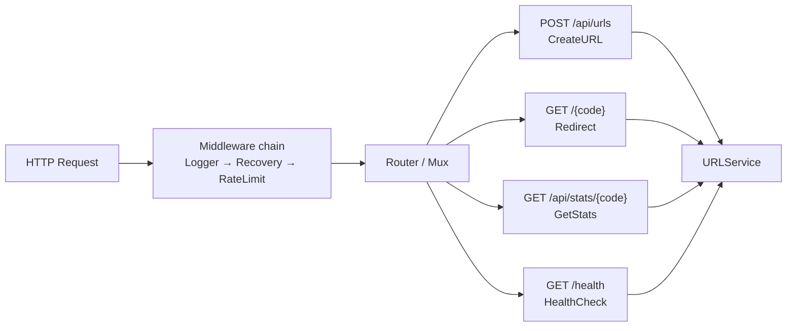

# HTTP слой: net/http и chi

---

## Архитектура HTTP слоя



**Интерфейс сервиса для хэндлеров**:

```go
// internal/handler/handler.go
package handler

import "context"

// URLService — интерфейс, который хэндлеры ожидают от сервисного слоя.
// Определён в пакете handler (потребитель), не в domain (производитель).
type URLService interface {
    CreateURL(ctx context.Context, originalURL string) (URLResult, error)
    Redirect(ctx context.Context, code string) (string, error)
    GetStats(ctx context.Context, code string) (StatsResult, error)
}

// URLResult — DTO для ответа хэндлера создания URL.
type URLResult struct {
    Code        string
    OriginalURL string
    ShortURL    string
}

// StatsResult — DTO для ответа хэндлера статистики.
type StatsResult struct {
    Code        string
    OriginalURL string
    ClickCount  int64
    CreatedAt   string // RFC3339 строка
}
```

---

## Часть 1: net/http (Go 1.22+)

### Хэндлеры

#### C# подход (Minimal API)

```csharp
// Program.cs
app.MapPost("/api/urls", async (CreateUrlRequest req, IUrlService svc, CancellationToken ct) =>
{
    try
    {
        var result = await svc.CreateAsync(req.Url, ct);
        return Results.Ok(new { code = result.Code, shortUrl = result.ShortUrl });
    }
    catch (InvalidUrlException ex)
    {
        return Results.BadRequest(new { error = ex.Message });
    }
});

app.MapGet("/{code}", async (string code, IUrlService svc, CancellationToken ct) =>
{
    try
    {
        var url = await svc.GetOriginalUrlAsync(code, ct);
        return Results.Redirect(url, permanent: false);
    }
    catch (UrlNotFoundException)
    {
        return Results.NotFound();
    }
});
```

#### Go подход (net/http хэндлеры)

```go
// internal/handler/url.go
package handler

import (
    "encoding/json"
    "errors"
    "log/slog"
    "net/http"

    "github.com/yourname/urlshortener/internal/domain"
)

// URLHandler содержит хэндлеры для работы с URL.
// Зависимости — явные поля, не глобальные переменные.
type URLHandler struct {
    service URLService
    baseURL string // например: "http://localhost:8080"
}

// NewURLHandler конструктор хэндлера.
func NewURLHandler(service URLService, baseURL string) *URLHandler {
    return &URLHandler{service: service, baseURL: baseURL}
}

// createURLRequest — входящий JSON для создания URL.
// json-теги задают имена полей в JSON (аналог [JsonPropertyName] в C#).
type createURLRequest struct {
    URL string `json:"url"`
}

// createURLResponse — исходящий JSON.
type createURLResponse struct {
    Code     string `json:"code"`
    ShortURL string `json:"short_url"`
}

// CreateURL обрабатывает POST /api/urls.
// Сигнатура http.HandlerFunc: func(ResponseWriter, *Request)
func (h *URLHandler) CreateURL(w http.ResponseWriter, r *http.Request) {
    // Декодируем JSON тело запроса
    var req createURLRequest
    if err := json.NewDecoder(r.Body).Decode(&req); err != nil {
        writeError(w, "невалидный JSON", http.StatusBadRequest)
        return
    }

    if req.URL == "" {
        writeError(w, "поле url обязательно", http.StatusBadRequest)
        return
    }

    // Вызываем сервис
    result, err := h.service.CreateURL(r.Context(), req.URL)
    if err != nil {
        if errors.Is(err, domain.ErrInvalidURL) {
            writeError(w, err.Error(), http.StatusBadRequest)
            return
        }
        slog.Error("CreateURL: ошибка сервиса", "err", err)
        writeError(w, "внутренняя ошибка", http.StatusInternalServerError)
        return
    }

    // Отправляем ответ 201 Created
    writeJSON(w, http.StatusCreated, createURLResponse{
        Code:     result.Code,
        ShortURL: h.baseURL + "/" + result.Code,
    })
}

// Redirect обрабатывает GET /{code} — перенаправляет на оригинальный URL.
func (h *URLHandler) Redirect(w http.ResponseWriter, r *http.Request) {
    // PathValue — новый метод Go 1.22 для получения path-параметра из ServeMux
    code := r.PathValue("code")
    if code == "" {
        writeError(w, "код не указан", http.StatusBadRequest)
        return
    }

    originalURL, err := h.service.Redirect(r.Context(), code)
    if err != nil {
        if errors.Is(err, domain.ErrNotFound) {
            writeError(w, "ссылка не найдена", http.StatusNotFound)
            return
        }
        slog.Error("Redirect: ошибка сервиса", "code", code, "err", err)
        writeError(w, "внутренняя ошибка", http.StatusInternalServerError)
        return
    }

    // 302 Found — временный редирект (браузер не кэширует)
    // 301 Moved Permanently — браузер кэширует, сложнее инвалидировать
    http.Redirect(w, r, originalURL, http.StatusFound)
}

// statsResponse — DTO статистики.
type statsResponse struct {
    Code        string `json:"code"`
    OriginalURL string `json:"original_url"`
    ClickCount  int64  `json:"click_count"`
    CreatedAt   string `json:"created_at"` // RFC3339
    ShortURL    string `json:"short_url"`
}

// GetStats обрабатывает GET /api/stats/{code}.
func (h *URLHandler) GetStats(w http.ResponseWriter, r *http.Request) {
    code := r.PathValue("code")
    if code == "" {
        writeError(w, "код не указан", http.StatusBadRequest)
        return
    }

    stats, err := h.service.GetStats(r.Context(), code)
    if err != nil {
        if errors.Is(err, domain.ErrNotFound) {
            writeError(w, "ссылка не найдена", http.StatusNotFound)
            return
        }
        slog.Error("GetStats: ошибка сервиса", "code", code, "err", err)
        writeError(w, "внутренняя ошибка", http.StatusInternalServerError)
        return
    }

    writeJSON(w, http.StatusOK, statsResponse{
        Code:        stats.Code,
        OriginalURL: stats.OriginalURL,
        ClickCount:  stats.ClickCount,
        CreatedAt:   stats.CreatedAt,
        ShortURL:    h.baseURL + "/" + stats.Code,
    })
}

// --- вспомогательные функции ---

// errorResponse — стандартный формат ошибки.
type errorResponse struct {
    Error string `json:"error"`
}

// writeJSON сериализует v в JSON и отправляет с заданным статусом.
func writeJSON(w http.ResponseWriter, status int, v any) {
    w.Header().Set("Content-Type", "application/json")
    w.WriteHeader(status)
    if err := json.NewEncoder(w).Encode(v); err != nil {
        slog.Error("writeJSON encode error", "err", err)
    }
}

// writeError отправляет JSON-ошибку.
func writeError(w http.ResponseWriter, msg string, status int) {
    writeJSON(w, status, errorResponse{Error: msg})
}
```

### Роутинг через ServeMux

**Go 1.22** значительно улучшил стандартный `http.ServeMux`: теперь он поддерживает
path-параметры (`{code}`) и метод-специфичные паттерны (`GET /path`).

```go
// internal/handler/router.go
package handler

import (
    "net/http"
    "time"

    "github.com/yourname/urlshortener/internal/domain"
    "golang.org/x/time/rate"
)

// Config — конфигурация роутера.
type Config struct {
    BaseURL     string
    RateLimit   float64 // запросов в секунду
    RateBurst   int     // максимальный burst
}

// NewRouter собирает http.Handler из хэндлеров и middleware.
func NewRouter(svc *domain.URLService, cfg Config) http.Handler {
    h := NewURLHandler(svc, cfg.BaseURL)

    mux := http.NewServeMux()

    // Go 1.22+: паттерны с методом и path-параметрами
    // Синтаксис: "METHOD /path/{param}"
    mux.HandleFunc("POST /api/urls", h.CreateURL)
    mux.HandleFunc("GET /api/stats/{code}", h.GetStats)
    mux.HandleFunc("GET /{code}", h.Redirect)  // catch-all для редиректов
    mux.HandleFunc("GET /health", healthCheck)

    // Применяем middleware (цепочка обёрток)
    // В Go middleware — это функция func(http.Handler) http.Handler
    limiter := rate.NewLimiter(rate.Limit(cfg.RateLimit), cfg.RateBurst)

    var handler http.Handler = mux
    handler = rateLimitMiddleware(handler, limiter)  // применяется последним (снаружи)
    handler = recoveryMiddleware(handler)
    handler = loggingMiddleware(handler)              // применяется первым (снаружи)

    return handler
}
```

> 💡 **Go 1.22 ServeMux**: До 1.22 ServeMux не поддерживал path-параметры и
> HTTP-методы в паттернах. Теперь `"GET /api/stats/{code}"` работает из коробки.
> Это сделало chi менее необходимым для простых случаев.

> ⚠️ **Порядок middleware**: При оборачивании `handler = middleware(handler)` первый
> применённый middleware будет последним в цепочке выполнения. В примере выше:
> `logging → recovery → rateLimit → mux`. Читай снизу вверх при анализе.

### Middleware

```go
// internal/handler/middleware.go
package handler

import (
    "log/slog"
    "net/http"
    "runtime/debug"
    "time"
)

// loggingMiddleware логирует метод, путь, статус и время выполнения запроса.
// Аналог ILogger middleware в ASP.NET Core.
func loggingMiddleware(next http.Handler) http.Handler {
    return http.HandlerFunc(func(w http.ResponseWriter, r *http.Request) {
        start := time.Now()

        // responseWriter обёртка для перехвата статус-кода
        // http.ResponseWriter не предоставляет доступ к записанному статусу
        rw := &responseWriter{ResponseWriter: w, status: http.StatusOK}

        next.ServeHTTP(rw, r)

        slog.Info("http request",
            "method", r.Method,
            "path", r.URL.Path,
            "status", rw.status,
            "duration_ms", time.Since(start).Milliseconds(),
            "remote_addr", r.RemoteAddr,
        )
    })
}

// responseWriter перехватывает статус-код записанный хэндлером.
type responseWriter struct {
    http.ResponseWriter
    status int
}

func (rw *responseWriter) WriteHeader(status int) {
    rw.status = status
    rw.ResponseWriter.WriteHeader(status)
}

// recoveryMiddleware восстанавливается после паники в хэндлере.
// Аналог UseExceptionHandler в ASP.NET Core.
func recoveryMiddleware(next http.Handler) http.Handler {
    return http.HandlerFunc(func(w http.ResponseWriter, r *http.Request) {
        defer func() {
            if rec := recover(); rec != nil {
                // Логируем stacktrace паники
                slog.Error("паника в хэндлере",
                    "panic", rec,
                    "stack", string(debug.Stack()),
                    "path", r.URL.Path,
                )
                http.Error(w, "внутренняя ошибка сервера", http.StatusInternalServerError)
            }
        }()
        next.ServeHTTP(w, r)
    })
}
```

### Rate limiting

Rate limiting через token bucket алгоритм — стандартный подход для защиты API.
В Go стандартная реализация в `golang.org/x/time/rate`.

```go
// internal/handler/ratelimit.go
package handler

import (
    "net/http"

    "golang.org/x/time/rate"
)

// rateLimitMiddleware ограничивает количество запросов.
// rate.Limiter — thread-safe token bucket.
// Аналог AspNetCoreRateLimit или custom middleware в C#.
func rateLimitMiddleware(next http.Handler, limiter *rate.Limiter) http.Handler {
    return http.HandlerFunc(func(w http.ResponseWriter, r *http.Request) {
        // Allow() не блокирует — сразу возвращает можно/нельзя
        // Альтернатива: limiter.Wait(ctx) — ждёт токен (блокирует до доступности)
        if !limiter.Allow() {
            w.Header().Set("Retry-After", "1")
            writeError(w, "слишком много запросов", http.StatusTooManyRequests)
            return
        }
        next.ServeHTTP(w, r)
    })
}
```

> 💡 **Token bucket**: Лимитер хранит токены (до `burst` штук). Каждый запрос
> потребляет токен. Токены пополняются со скоростью `rate` в секунду.
> При `rate.NewLimiter(rate.Limit(100), 10)`: 100 запросов/сек, burst до 10 запросов.

> ⚠️ **Ограничение**: Этот rate limiter глобальный — на весь сервер, не per-IP.
> Для per-IP нужен map[string]*rate.Limiter с mutex или готовые библиотеки.
> Для production лучше использовать Redis для распределённого rate limiting.

### Health check

```go
// internal/handler/health.go
package handler

import "net/http"

// healthCheck отвечает 200 OK — для load balancer и Docker healthcheck.
// Аналог IHealthCheck в ASP.NET Core.
func healthCheck(w http.ResponseWriter, r *http.Request) {
    writeJSON(w, http.StatusOK, map[string]string{
        "status": "ok",
    })
}
```

---

## Часть 2: Миграция на chi

### Почему chi

`net/http` в Go 1.22+ покрывает базовые потребности, но chi даёт:

| Возможность | net/http 1.22+ | chi |
|-------------|----------------|-----|
| Path параметры | `{name}` | `{name}` |
| Wildcards | Частично | `{name:regex}`, `*` |
| Middleware группы | Нет | `r.Group()`, `r.Route()` |
| Sub-router | Нет | `r.Mount()` |
| Именованные роуты | Нет | Да |
| Middleware per-route | Нет | Да |
| `chi.URLParam()` | `r.PathValue()` | `chi.URLParam(r, "name")` |

Для URL Shortener chi избыточен, но **показателен как следующий шаг** в реальных проектах.

### Изменения в роутере

**До (net/http)**:
```go
mux := http.NewServeMux()
mux.HandleFunc("POST /api/urls", h.CreateURL)
mux.HandleFunc("GET /api/stats/{code}", h.GetStats)
mux.HandleFunc("GET /{code}", h.Redirect)
mux.HandleFunc("GET /health", healthCheck)
```

**После (chi)**:
```go
// go get github.com/go-chi/chi/v5

import "github.com/go-chi/chi/v5"

r := chi.NewRouter()

// Middleware применяются через r.Use() — декларативнее
r.Use(chiMiddleware.Logger)    // встроенный logger chi
r.Use(chiMiddleware.Recoverer) // встроенный recoverer chi

// chi.NewLimiter — нет, используем свой (аналог net/http версии)
r.Use(rateLimitMiddlewareChi(limiter))

// Группы роутов — удобно для версионирования API
r.Route("/api", func(r chi.Router) {
    r.Post("/urls", h.CreateURL)
    r.Get("/stats/{code}", h.GetStats)
})

r.Get("/health", healthCheck)
r.Get("/{code}", h.Redirect) // catch-all последним
```

### Middleware в chi

```go
// internal/handler/router_chi.go
package handler

import (
    "net/http"

    "github.com/go-chi/chi/v5"
    chiMiddleware "github.com/go-chi/chi/v5/middleware"
    "golang.org/x/time/rate"
)

// NewChiRouter — альтернативный роутер на chi.
func NewChiRouter(h *URLHandler, limiter *rate.Limiter) http.Handler {
    r := chi.NewRouter()

    // Встроенные middleware chi
    r.Use(chiMiddleware.RequestID)  // добавляет X-Request-Id заголовок
    r.Use(chiMiddleware.RealIP)     // берёт IP из X-Forwarded-For
    r.Use(chiMiddleware.Logger)     // структурированное логирование
    r.Use(chiMiddleware.Recoverer)  // recovery от паник

    // Наш rate limiter (chi-совместимый middleware)
    r.Use(rateLimitMiddlewareChi(limiter))

    // API группа — общий префикс /api
    r.Route("/api", func(r chi.Router) {
        r.Post("/urls", h.CreateURL)
        r.Get("/stats/{code}", h.GetStats)
    })

    r.Get("/health", healthCheck)

    // Редирект — после всех специфичных роутов
    r.Get("/{code}", h.Redirect)

    return r
}

// rateLimitMiddlewareChi — middleware для chi (та же логика, chi-compatible сигнатура).
func rateLimitMiddlewareChi(limiter *rate.Limiter) func(http.Handler) http.Handler {
    return func(next http.Handler) http.Handler {
        return http.HandlerFunc(func(w http.ResponseWriter, r *http.Request) {
            if !limiter.Allow() {
                w.Header().Set("Retry-After", "1")
                writeError(w, "слишком много запросов", http.StatusTooManyRequests)
                return
            }
            next.ServeHTTP(w, r)
        })
    }
}
```

**Изменения в хэндлерах при переходе на chi**:

```go
// net/http: r.PathValue("code") — метод *http.Request (Go 1.22+)
code := r.PathValue("code")

// chi: chi.URLParam(r, "code") — функция из пакета chi
code := chi.URLParam(r, "code")
```

> 💡 **Совместимость**: `http.HandlerFunc(func(w http.ResponseWriter, r *http.Request))` —
> **одинаковая сигнатура** для net/http и chi. Хэндлеры не меняются при миграции.
> Меняется только роутер и способ получения path-параметров.

### Сравнение: C# Minimal API vs Go chi

**C# (Minimal API)**:
```csharp
// Program.cs
var app = builder.Build();

app.UseExceptionHandler();
app.UseRateLimiter();

app.MapPost("/api/urls", async (CreateUrlRequest req, IUrlService svc) => {
    var result = await svc.CreateAsync(req.Url);
    return Results.Created($"/{result.Code}", new { result.Code, result.ShortUrl });
});

app.MapGet("/{code}", async (string code, IUrlService svc) => {
    var url = await svc.GetOriginalUrlAsync(code);
    return Results.Redirect(url);
});

app.Run();
```

**Go (chi)**:
```go
// main.go + router.go
r := chi.NewRouter()
r.Use(chiMiddleware.Logger, chiMiddleware.Recoverer)
r.Use(rateLimitMiddleware(limiter))

r.Post("/api/urls", h.CreateURL)
r.Get("/{code}", h.Redirect)

http.ListenAndServe(cfg.Addr, r)
```

**Сравнение**:

| Аспект | C# Minimal API | Go chi |
|--------|---------------|--------|
| Роутер | Встроен в ASP.NET Core | Отдельная библиотека |
| Middleware | `app.Use...()` | `r.Use(...)` |
| DI в хэндлерах | Автоматически из контейнера | Явно через closure / struct |
| Async | `async Task<IResult>` | Нет — синхронный возврат |
| Path параметры | `{code}` в MapGet | `{code}` в router |
| Доступ к параметру | Аргумент метода | `chi.URLParam(r, "code")` |

---

## Сравнительная таблица

| Концепция | C# ASP.NET Core | Go net/http | Go chi |
|-----------|----------------|-------------|--------|
| Роутер | Встроен | `http.ServeMux` | `chi.Router` |
| Регистрация маршрута | `app.MapGet()` | `mux.HandleFunc()` | `r.Get()` |
| Path параметр | Аргумент метода | `r.PathValue()` | `chi.URLParam()` |
| Middleware | `app.Use()` | Оборачивание: `mw(handler)` | `r.Use()` |
| Группы маршрутов | `app.MapGroup()` | Нет | `r.Route()` |
| Sub-router | `app.MapGroup()` | Нет | `r.Mount()` |
| Redirect | `Results.Redirect()` | `http.Redirect()` | `http.Redirect()` |
| JSON ответ | `Results.Ok(obj)` | `json.NewEncoder(w).Encode(v)` | То же |
| Статус код | `Results.StatusCode()` | `w.WriteHeader(status)` | То же |
| DI в хэндлерах | Автоматически | Явно через struct поля | То же |

---
