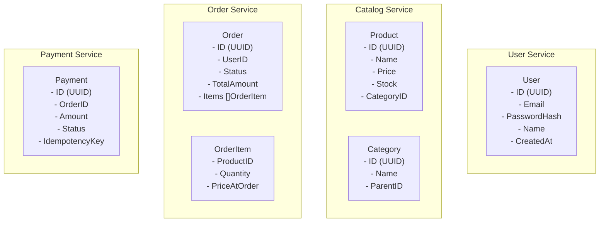

# Доменная модель и контракты

---

## Обзор доменов

В микросервисной архитектуре каждый сервис владеет своей доменной моделью. Нет общей "базы данных сущностей" как в монолите — каждый сервис хранит только то, что нужно ему.



> 💡 **Для C# разработчиков**: В монолите вы могли бы иметь один `AppDbContext` со всеми
> сущностями и навигационными свойствами. В микросервисах каждый сервис имеет свою БД
> и знает о других сервисах только через контракты (gRPC proto + Kafka events).

---

## Protobuf контракты

### Структура proto файлов

```
proto/
├── buf.yaml
├── buf.gen.yaml
├── user/v1/
│   └── user.proto
├── catalog/v1/
│   └── catalog.proto
├── order/v1/
│   └── order.proto
└── payment/v1/
    └── payment.proto
```

### buf.yaml

```yaml
version: v2
modules:
  - path: .
lint:
  use:
    - STANDARD
breaking:
  use:
    - FILE
```

### buf.gen.yaml

```yaml
version: v2
plugins:
  - remote: buf.build/protocolbuffers/go
    out: gen/go
    opt:
      - paths=source_relative
  - remote: buf.build/grpc/go
    out: gen/go
    opt:
      - paths=source_relative
      - require_unimplemented_servers=false
```

### user/v1/user.proto

```protobuf
syntax = "proto3";

package user.v1;

option go_package = "github.com/yourname/ecommerce/gen/go/user/v1;userv1";

import "google/protobuf/timestamp.proto";

// UserService — управление пользователями и аутентификация.
service UserService {
  rpc Register(RegisterRequest) returns (RegisterResponse);
  rpc Login(LoginRequest) returns (LoginResponse);
  rpc GetUser(GetUserRequest) returns (GetUserResponse);
  // ValidateToken используется API Gateway для верификации JWT.
  rpc ValidateToken(ValidateTokenRequest) returns (ValidateTokenResponse);
}

message RegisterRequest {
  string email    = 1;
  string password = 2;
  string name     = 3;
}

message RegisterResponse {
  string user_id = 1;
}

message LoginRequest {
  string email    = 1;
  string password = 2;
}

message LoginResponse {
  string access_token  = 1;
  string refresh_token = 2;
  int64  expires_in    = 3; // секунды
}

message GetUserRequest {
  string user_id = 1;
}

message GetUserResponse {
  string user_id                        = 1;
  string email                          = 2;
  string name                           = 3;
  google.protobuf.Timestamp created_at  = 4;
}

message ValidateTokenRequest {
  string token = 1;
}

message ValidateTokenResponse {
  string user_id = 1;
  string email   = 2;
  bool   valid   = 3;
}
```

### catalog/v1/catalog.proto

```protobuf
syntax = "proto3";

package catalog.v1;

option go_package = "github.com/yourname/ecommerce/gen/go/catalog/v1;catalogv1";

service CatalogService {
  rpc GetProduct(GetProductRequest) returns (GetProductResponse);
  rpc ListProducts(ListProductsRequest) returns (ListProductsResponse);
  // ReserveStock — атомарно резервирует товар под заказ.
  rpc ReserveStock(ReserveStockRequest) returns (ReserveStockResponse);
  // ReleaseStock — освобождает резерв при отмене заказа.
  rpc ReleaseStock(ReleaseStockRequest) returns (ReleaseStockResponse);
}

message Product {
  string product_id   = 1;
  string name         = 2;
  string description  = 3;
  int64  price_cents  = 4; // цена в копейках/центах — никогда float!
  int32  stock        = 5;
  string category_id  = 6;
}

message GetProductRequest {
  string product_id = 1;
}

message GetProductResponse {
  Product product = 1;
}

message ListProductsRequest {
  string category_id = 1; // опционально
  int32  page        = 2;
  int32  page_size   = 3;
}

message ListProductsResponse {
  repeated Product products = 1;
  int32            total    = 2;
}

message ReserveStockRequest {
  string order_id   = 1;
  string product_id = 2;
  int32  quantity   = 3;
}

message ReserveStockResponse {
  bool   success          = 1;
  string failure_reason   = 2; // если success = false
}

message ReleaseStockRequest {
  string order_id   = 1;
  string product_id = 2;
  int32  quantity   = 3;
}

message ReleaseStockResponse {}
```

### order/v1/order.proto

```protobuf
syntax = "proto3";

package order.v1;

option go_package = "github.com/yourname/ecommerce/gen/go/order/v1;orderv1";

import "google/protobuf/timestamp.proto";

service OrderService {
  rpc CreateOrder(CreateOrderRequest) returns (CreateOrderResponse);
  rpc GetOrder(GetOrderRequest) returns (GetOrderResponse);
  rpc ListUserOrders(ListUserOrdersRequest) returns (ListUserOrdersResponse);
}

enum OrderStatus {
  ORDER_STATUS_UNSPECIFIED = 0;
  ORDER_STATUS_PENDING     = 1; // создан, ждёт оплаты
  ORDER_STATUS_CONFIRMED   = 2; // оплата прошла
  ORDER_STATUS_CANCELLED   = 3; // отменён (оплата не прошла)
  ORDER_STATUS_SHIPPED     = 4;
  ORDER_STATUS_DELIVERED   = 5;
}

message OrderItem {
  string product_id     = 1;
  string product_name   = 2;
  int32  quantity       = 3;
  int64  price_cents    = 4; // цена на момент заказа
}

message Order {
  string                    order_id     = 1;
  string                    user_id      = 2;
  OrderStatus               status       = 3;
  repeated OrderItem        items        = 4;
  int64                     total_cents  = 5;
  google.protobuf.Timestamp created_at   = 6;
  google.protobuf.Timestamp updated_at   = 7;
}

message CreateOrderRequest {
  string user_id = 1;
  repeated OrderItemInput items = 2;
}

message OrderItemInput {
  string product_id = 1;
  int32  quantity   = 2;
}

message CreateOrderResponse {
  string      order_id = 1;
  OrderStatus status   = 2;
}

message GetOrderRequest {
  string order_id = 1;
}

message GetOrderResponse {
  Order order = 1;
}

message ListUserOrdersRequest {
  string user_id   = 1;
  int32  page      = 2;
  int32  page_size = 3;
}

message ListUserOrdersResponse {
  repeated Order orders = 1;
  int32          total  = 2;
}
```

### payment/v1/payment.proto

```protobuf
syntax = "proto3";

package payment.v1;

option go_package = "github.com/yourname/ecommerce/gen/go/payment/v1;paymentv1";

service PaymentService {
  // GetPaymentStatus — API Gateway может запросить статус оплаты.
  rpc GetPaymentStatus(GetPaymentStatusRequest) returns (GetPaymentStatusResponse);
}

enum PaymentStatus {
  PAYMENT_STATUS_UNSPECIFIED = 0;
  PAYMENT_STATUS_PENDING     = 1;
  PAYMENT_STATUS_COMPLETED   = 2;
  PAYMENT_STATUS_FAILED      = 3;
}

message GetPaymentStatusRequest {
  string order_id = 1;
}

message GetPaymentStatusResponse {
  string        payment_id = 1;
  PaymentStatus status     = 2;
  string        reason     = 3; // причина отказа
}
```

> ⚠️ **Важно**: Никогда не используйте `float` или `double` для денег!
> Всегда храните цену в минимальных единицах валюты (копейки, центы).
> В C# используют `decimal`, в Go — `int64` (копейки) или `github.com/shopspring/decimal`.

---

## Go доменные модели

Каждый сервис определяет свои доменные типы в пакете `internal/domain/`.
Proto-типы используются только на gRPC уровне — между ними и доменом стоит маппинг.

### User Service: internal/domain/user.go

```go
package domain

import (
    "errors"
    "time"
)

// User — доменная сущность пользователя.
// Намеренно не использует proto-типы: domain не должен зависеть от транспорта.
type User struct {
    ID           string
    Email        string
    PasswordHash string
    Name         string
    CreatedAt    time.Time
}

// Кастомные ошибки домена — используем sentinel errors.
// В C# аналог — кастомные Exception классы.
var (
    ErrUserNotFound      = errors.New("user not found")
    ErrEmailAlreadyTaken = errors.New("email already taken")
    ErrInvalidPassword   = errors.New("invalid password")
    ErrInvalidToken      = errors.New("invalid or expired token")
)

// UserRepository — интерфейс определяется со стороны потребителя (domain/service).
// Реализация живёт в internal/storage/postgres/.
type UserRepository interface {
    Create(ctx context.Context, user *User) error
    GetByID(ctx context.Context, id string) (*User, error)
    GetByEmail(ctx context.Context, email string) (*User, error)
}
```

### Catalog Service: internal/domain/product.go

```go
package domain

import (
    "context"
    "errors"
    "time"
)

// Product — доменная сущность товара.
type Product struct {
    ID          string
    Name        string
    Description string
    PriceCents  int64  // цена в копейках
    Stock       int32
    CategoryID  string
    CreatedAt   time.Time
    UpdatedAt   time.Time
}

// StockReservation — факт резервирования склада под конкретный заказ.
type StockReservation struct {
    OrderID   string
    ProductID string
    Quantity  int32
    CreatedAt time.Time
}

var (
    ErrProductNotFound    = errors.New("product not found")
    ErrInsufficientStock  = errors.New("insufficient stock")
    ErrReservationExists  = errors.New("stock reservation already exists")
)

type ProductRepository interface {
    GetByID(ctx context.Context, id string) (*Product, error)
    List(ctx context.Context, categoryID string, page, pageSize int) ([]*Product, int, error)
    // ReserveStock атомарно уменьшает stock и создаёт резервацию.
    ReserveStock(ctx context.Context, reservation *StockReservation) error
    // ReleaseStock возвращает stock и удаляет резервацию.
    ReleaseStock(ctx context.Context, orderID, productID string) error
}
```

### Order Service: internal/domain/order.go

```go
package domain

import (
    "context"
    "errors"
    "time"
)

// OrderStatus — явное перечисление состояний.
// В C# аналог — enum с [Flags] или просто enum.
type OrderStatus string

const (
    StatusPending   OrderStatus = "pending"
    StatusConfirmed OrderStatus = "confirmed"
    StatusCancelled OrderStatus = "cancelled"
    StatusShipped   OrderStatus = "shipped"
    StatusDelivered OrderStatus = "delivered"
)

// ValidTransitions — допустимые переходы состояний.
// Явное кодирование state machine в данных.
var ValidTransitions = map[OrderStatus][]OrderStatus{
    StatusPending:   {StatusConfirmed, StatusCancelled},
    StatusConfirmed: {StatusShipped},
    StatusShipped:   {StatusDelivered},
}

type OrderItem struct {
    ProductID    string
    ProductName  string
    Quantity     int32
    PriceCents   int64 // цена на момент заказа — исторические данные
}

type Order struct {
    ID          string
    UserID      string
    Status      OrderStatus
    Items       []OrderItem
    TotalCents  int64
    CreatedAt   time.Time
    UpdatedAt   time.Time
}

// CanTransitionTo проверяет допустимость перехода состояния.
func (o *Order) CanTransitionTo(next OrderStatus) bool {
    allowed, ok := ValidTransitions[o.Status]
    if !ok {
        return false
    }
    for _, s := range allowed {
        if s == next {
            return true
        }
    }
    return false
}

// TotalCentsFromItems пересчитывает итоговую сумму.
func (o *Order) TotalCentsFromItems() int64 {
    var total int64
    for _, item := range o.Items {
        total += item.PriceCents * int64(item.Quantity)
    }
    return total
}

var (
    ErrOrderNotFound       = errors.New("order not found")
    ErrInvalidStatusChange = errors.New("invalid order status transition")
)

type OrderRepository interface {
    Create(ctx context.Context, order *Order) error
    GetByID(ctx context.Context, id string) (*Order, error)
    UpdateStatus(ctx context.Context, id string, status OrderStatus) error
    ListByUserID(ctx context.Context, userID string, page, pageSize int) ([]*Order, int, error)
}
```

### Payment Service: internal/domain/payment.go

```go
package domain

import (
    "context"
    "errors"
    "time"
)

type PaymentStatus string

const (
    PaymentPending   PaymentStatus = "pending"
    PaymentCompleted PaymentStatus = "completed"
    PaymentFailed    PaymentStatus = "failed"
)

type Payment struct {
    ID              string
    OrderID         string
    Amount          int64  // в копейках
    Status          PaymentStatus
    IdempotencyKey  string // = OrderID для простоты
    FailureReason   string
    CreatedAt       time.Time
    UpdatedAt       time.Time
}

var (
    ErrPaymentNotFound   = errors.New("payment not found")
    ErrDuplicatePayment  = errors.New("payment already processed") // идемпотентность
)

type PaymentRepository interface {
    // Create использует idempotency_key как PRIMARY KEY.
    // При дублирующем вызове возвращает ErrDuplicatePayment.
    Create(ctx context.Context, payment *Payment) error
    GetByOrderID(ctx context.Context, orderID string) (*Payment, error)
    UpdateStatus(ctx context.Context, id string, status PaymentStatus, reason string) error
}
```

---

## Kafka события

Kafka события — контракты между сервисами для асинхронного взаимодействия.
Храним в `shared/events/` как Go-структуры с JSON-тегами.

### shared/events/order_events.go

```go
package events

import "time"

const (
    TopicOrderCreated   = "order.created"
    TopicOrderConfirmed = "order.confirmed"
    TopicOrderCancelled = "order.cancelled"
)

// OrderCreatedEvent публикует Order Service после успешного резервирования товара.
// Payment Service подписывается на этот топик.
type OrderCreatedEvent struct {
    EventID    string    `json:"event_id"`    // UUID для идемпотентности
    OrderID    string    `json:"order_id"`
    UserID     string    `json:"user_id"`
    TotalCents int64     `json:"total_cents"`
    Items      []OrderItem `json:"items"`
    CreatedAt  time.Time `json:"created_at"`
}

type OrderItem struct {
    ProductID  string `json:"product_id"`
    Quantity   int32  `json:"quantity"`
    PriceCents int64  `json:"price_cents"`
}

// OrderConfirmedEvent публикует Order Service после получения payment.completed.
// Notification Service подписывается на этот топик.
type OrderConfirmedEvent struct {
    EventID   string    `json:"event_id"`
    OrderID   string    `json:"order_id"`
    UserID    string    `json:"user_id"`
    UserEmail string    `json:"user_email"` // денормализация для Notification Service
    CreatedAt time.Time `json:"created_at"`
}

// OrderCancelledEvent публикует Order Service при отмене.
type OrderCancelledEvent struct {
    EventID   string    `json:"event_id"`
    OrderID   string    `json:"order_id"`
    UserID    string    `json:"user_id"`
    UserEmail string    `json:"user_email"`
    Reason    string    `json:"reason"`
    CreatedAt time.Time `json:"created_at"`
}
```

### shared/events/payment_events.go

```go
package events

import "time"

const (
    TopicPaymentCompleted = "payment.completed"
    TopicPaymentFailed    = "payment.failed"
)

// PaymentCompletedEvent публикует Payment Service при успешной оплате.
// Order Service подписывается и переводит заказ в confirmed.
type PaymentCompletedEvent struct {
    EventID    string    `json:"event_id"`
    PaymentID  string    `json:"payment_id"`
    OrderID    string    `json:"order_id"`
    Amount     int64     `json:"amount_cents"`
    CreatedAt  time.Time `json:"created_at"`
}

// PaymentFailedEvent публикует Payment Service при неудаче.
// Order Service подписывается и отменяет заказ + освобождает резерв.
type PaymentFailedEvent struct {
    EventID   string    `json:"event_id"`
    PaymentID string    `json:"payment_id"`
    OrderID   string    `json:"order_id"`
    Reason    string    `json:"reason"`
    CreatedAt time.Time `json:"created_at"`
}
```

> 💡 **Идиома Go**: События — обычные Go-структуры с JSON-сериализацией.
> Нет схемы-реестра как в Confluent Schema Registry (хотя его можно добавить позже).
> Для production стоит рассмотреть Protobuf или Avro для backward compatibility.

> ⚠️ **Vs C# MassTransit**: MassTransit автоматически генерирует имена топиков
> из имён классов и обеспечивает версионирование. В Go это ваша ответственность —
> именуйте топики явно и версионируйте (`order.created.v2` при изменении схемы).

---

## Shared пакеты

### shared/config/base.go

Базовые поля конфига, которые есть у каждого сервиса:

```go
package config

import (
    "fmt"
    "github.com/caarlos0/env/v11"
)

// BaseConfig — общие поля для всех микросервисов.
// Каждый сервис встраивает (embed) его в свой Config.
type BaseConfig struct {
    ServiceName string `env:"SERVICE_NAME,required"`
    Environment string `env:"ENVIRONMENT" envDefault:"development"`
    LogLevel    string `env:"LOG_LEVEL"   envDefault:"info"`

    // OpenTelemetry
    OTLPEndpoint string `env:"OTEL_EXPORTER_OTLP_ENDPOINT" envDefault:"http://otel-collector:4317"`

    // gRPC сервер
    GRPCPort int `env:"GRPC_PORT" envDefault:"9000"`
}

// DatabaseConfig — стандартная конфигурация PostgreSQL.
type DatabaseConfig struct {
    DSN             string `env:"DATABASE_URL,required"`
    MaxOpenConns    int    `env:"DB_MAX_OPEN_CONNS"   envDefault:"25"`
    MaxIdleConns    int    `env:"DB_MAX_IDLE_CONNS"   envDefault:"5"`
    ConnMaxLifetime int    `env:"DB_CONN_MAX_LIFETIME" envDefault:"300"` // секунды
}

// KafkaConfig — Kafka producer/consumer.
type KafkaConfig struct {
    Brokers       string `env:"KAFKA_BROKERS,required"`
    ConsumerGroup string `env:"KAFKA_CONSUMER_GROUP"`
}

// Brokers возвращает список брокеров как []string.
func (k KafkaConfig) BrokerList() []string {
    // "kafka:9092,kafka2:9092" → ["kafka:9092", "kafka2:9092"]
    if k.Brokers == "" {
        return nil
    }
    result := []string{}
    for _, b := range splitAndTrim(k.Brokers, ",") {
        if b != "" {
            result = append(result, b)
        }
    }
    return result
}

func splitAndTrim(s, sep string) []string {
    // простая реализация без внешних зависимостей
    var result []string
    start := 0
    for i := 0; i <= len(s); i++ {
        if i == len(s) || s[i:i+len(sep)] == sep {
            part := strings.TrimSpace(s[start:i])
            result = append(result, part)
            start = i + len(sep)
        }
    }
    return result
}
```

### shared/middleware/auth.go

JWT-парсинг, который используется в API Gateway:

```go
package middleware

import (
    "context"
    "strings"
)

// Claims — данные, извлечённые из JWT.
// API Gateway кладёт их в context после верификации через User Service.
type Claims struct {
    UserID string
    Email  string
}

type contextKey string

const claimsKey contextKey = "claims"

// WithClaims кладёт Claims в context.
func WithClaims(ctx context.Context, claims *Claims) context.Context {
    return context.WithValue(ctx, claimsKey, claims)
}

// ClaimsFromContext извлекает Claims из context.
// Возвращает nil, false если claims не установлены.
func ClaimsFromContext(ctx context.Context) (*Claims, bool) {
    claims, ok := ctx.Value(claimsKey).(*Claims)
    return claims, ok
}

// ExtractBearerToken извлекает токен из заголовка Authorization.
func ExtractBearerToken(authHeader string) (string, bool) {
    if !strings.HasPrefix(authHeader, "Bearer ") {
        return "", false
    }
    token := strings.TrimPrefix(authHeader, "Bearer ")
    if token == "" {
        return "", false
    }
    return token, true
}
```

---

## Сравнение с C#

### Денежные значения

**C#**:
```csharp
public decimal Price { get; set; } // System.Decimal — точная арифметика
```

**Go**:
```go
// Вариант 1: int64 (рекомендуется для простых случаев)
PriceCents int64 // 1990 = 19.90 руб.

// Вариант 2: библиотека для сложной логики
import "github.com/shopspring/decimal"
Price decimal.Decimal

// ❌ Никогда float64 для денег!
Price float64 // 0.1 + 0.2 = 0.30000000000000004
```

### Event-driven vs MassTransit

| Аспект | C# MassTransit | Go (вручную) |
|--------|---------------|-------------|
| Публикация события | `bus.Publish(new OrderCreated())` | `producer.WriteMessages(ctx, msg)` |
| Подписка | `Consumer<OrderCreated>` атрибут | явный `for`-цикл с `reader.ReadMessage()` |
| Идемпотентность | Встроенный Outbox | `INSERT ON CONFLICT DO NOTHING` вручную |
| Retry | Автоматический с политиками | явный `for`-цикл или библиотека |
| Dead Letter | Автоматический | явный `Nack` + отдельный топик |

> 💡 **Вывод**: MassTransit скрывает сложность за абстракциями.
> Go-подход требует больше кода, но каждая деталь явна и контролируема.
> Это типичная Go-философия: простота за счёт явности, а не магии.

---

## Генерация кода

```bash
# Сгенерировать gRPC код из proto
cd proto && buf generate

# Результат:
# gen/go/user/v1/user.pb.go      — сообщения
# gen/go/user/v1/user_grpc.pb.go — gRPC интерфейсы

# Посмотреть сгенерированный интерфейс сервера:
# type UserServiceServer interface {
#     Register(context.Context, *RegisterRequest) (*RegisterResponse, error)
#     Login(context.Context, *LoginRequest) (*LoginResponse, error)
#     GetUser(context.Context, *GetUserRequest) (*GetUserResponse, error)
#     ValidateToken(context.Context, *ValidateTokenRequest) (*ValidateTokenResponse, error)
#     mustEmbedUnimplementedUserServiceServer()
# }
```

---
