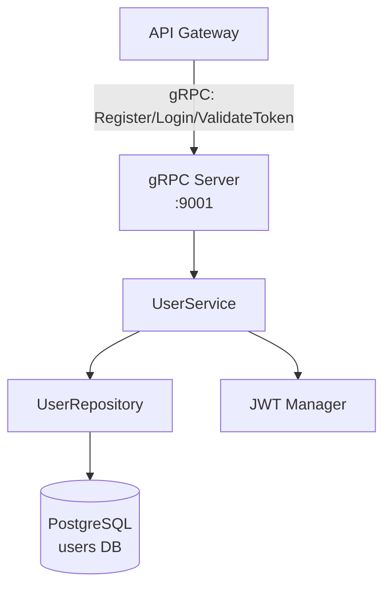

# 2. User Service

---

## Обзор сервиса

User Service отвечает за:
- Регистрацию пользователей (bcrypt хэширование паролей)
- Аутентификацию (login → JWT access + refresh токены)
- Верификацию токенов (вызывается API Gateway при каждом запросе)
- Получение профиля пользователя



### Структура пакетов

```
user-service/
├── cmd/server/
│   └── main.go
├── internal/
│   ├── domain/
│   │   └── user.go          # User entity, интерфейсы, ошибки
│   ├── service/
│   │   └── user_service.go  # Бизнес-логика
│   ├── jwt/
│   │   └── manager.go       # JWT генерация и верификация
│   ├── storage/
│   │   └── postgres/
│   │       └── user_repo.go # PostgreSQL реализация
│   └── grpc/
│       └── server.go        # gRPC хэндлеры + маппинг
├── migrations/
│   ├── 001_create_users.sql
│   └── 002_create_refresh_tokens.sql
├── Dockerfile
├── go.mod
└── go.sum
```

---

## Конфигурация

```go
// internal/config/config.go
package config

import "github.com/caarlos0/env/v11"

type Config struct {
    ServiceName string `env:"SERVICE_NAME" envDefault:"user-service"`
    Environment string `env:"ENVIRONMENT"  envDefault:"development"`
    LogLevel    string `env:"LOG_LEVEL"    envDefault:"info"`

    GRPCPort int `env:"GRPC_PORT" envDefault:"9001"`

    DatabaseURL     string `env:"DATABASE_URL,required"`
    DBMaxOpenConns  int    `env:"DB_MAX_OPEN_CONNS" envDefault:"25"`
    DBMaxIdleConns  int    `env:"DB_MAX_IDLE_CONNS" envDefault:"5"`

    // JWT настройки
    JWTSecret          string `env:"JWT_SECRET,required"`
    JWTAccessTokenTTL  int    `env:"JWT_ACCESS_TTL_SECONDS"  envDefault:"3600"`    // 1 час
    JWTRefreshTokenTTL int    `env:"JWT_REFRESH_TTL_SECONDS" envDefault:"2592000"` // 30 дней

    OTLPEndpoint string `env:"OTEL_EXPORTER_OTLP_ENDPOINT" envDefault:"http://otel-collector:4317"`
}

func Load() (*Config, error) {
    cfg := &Config{}
    if err := env.Parse(cfg); err != nil {
        return nil, err
    }
    return cfg, nil
}
```

---

## Доменный сервис

```go
// internal/service/user_service.go
package service

import (
    "context"
    "fmt"
    "time"

    "golang.org/x/crypto/bcrypt"

    "github.com/yourname/ecommerce/user-service/internal/domain"
    "github.com/yourname/ecommerce/user-service/internal/jwt"
)

// UserService — бизнес-логика. Не знает про gRPC или PostgreSQL.
// Зависимости инжектируются явно через конструктор.
type UserService struct {
    repo       domain.UserRepository
    jwtManager *jwt.Manager
}

func NewUserService(repo domain.UserRepository, jwtManager *jwt.Manager) *UserService {
    return &UserService{
        repo:       repo,
        jwtManager: jwtManager,
    }
}

// Register создаёт нового пользователя.
// Хэширует пароль с bcrypt, проверяет уникальность email.
func (s *UserService) Register(ctx context.Context, email, password, name string) (*domain.User, error) {
    // Валидация входных данных — в реальном проекте вынести в validator
    if email == "" || password == "" || name == "" {
        return nil, fmt.Errorf("email, password and name are required")
    }
    if len(password) < 8 {
        return nil, fmt.Errorf("password must be at least 8 characters")
    }

    // Проверяем, не занят ли email
    existing, err := s.repo.GetByEmail(ctx, email)
    if err != nil && err != domain.ErrUserNotFound {
        return nil, fmt.Errorf("check email: %w", err)
    }
    if existing != nil {
        return nil, domain.ErrEmailAlreadyTaken
    }

    // Хэшируем пароль с bcrypt cost=12
    // bcrypt — стандарт де-факто для хэширования паролей.
    // В C# аналог: PasswordHasher<T> из ASP.NET Core Identity.
    hash, err := bcrypt.GenerateFromPassword([]byte(password), 12)
    if err != nil {
        return nil, fmt.Errorf("hash password: %w", err)
    }

    user := &domain.User{
        ID:           newUUID(), // см. ниже
        Email:        email,
        PasswordHash: string(hash),
        Name:         name,
        CreatedAt:    time.Now().UTC(),
    }

    if err := s.repo.Create(ctx, user); err != nil {
        return nil, fmt.Errorf("create user: %w", err)
    }

    return user, nil
}

// Login проверяет учётные данные и выдаёт JWT токены.
func (s *UserService) Login(ctx context.Context, email, password string) (accessToken, refreshToken string, err error) {
    user, err := s.repo.GetByEmail(ctx, email)
    if err != nil {
        // Возвращаем одну и ту же ошибку для неверного email и неверного пароля
        // (timing attack mitigation — не раскрываем, что именно неверно)
        if err == domain.ErrUserNotFound {
            // Выполняем dummy hash чтобы нивелировать разницу во времени
            _ = bcrypt.CompareHashAndPassword([]byte("$2a$12$dummy"), []byte(password))
            return "", "", domain.ErrInvalidPassword
        }
        return "", "", fmt.Errorf("get user: %w", err)
    }

    // Проверяем пароль
    if err := bcrypt.CompareHashAndPassword([]byte(user.PasswordHash), []byte(password)); err != nil {
        return "", "", domain.ErrInvalidPassword
    }

    // Генерируем токены
    access, err := s.jwtManager.GenerateAccessToken(user.ID, user.Email)
    if err != nil {
        return "", "", fmt.Errorf("generate access token: %w", err)
    }

    refresh, err := s.jwtManager.GenerateRefreshToken(user.ID)
    if err != nil {
        return "", "", fmt.Errorf("generate refresh token: %w", err)
    }

    return access, refresh, nil
}

// GetUser возвращает профиль пользователя по ID.
func (s *UserService) GetUser(ctx context.Context, userID string) (*domain.User, error) {
    user, err := s.repo.GetByID(ctx, userID)
    if err != nil {
        return nil, err
    }
    return user, nil
}

// ValidateToken верифицирует JWT и возвращает claims.
// Вызывается API Gateway для каждого защищённого запроса.
func (s *UserService) ValidateToken(ctx context.Context, token string) (*jwt.Claims, error) {
    claims, err := s.jwtManager.ValidateAccessToken(token)
    if err != nil {
        return nil, domain.ErrInvalidToken
    }
    return claims, nil
}

// newUUID генерирует UUID v4.
// В Go 1.25+ есть встроенный crypto/rand.UUID.
func newUUID() string {
    // Go 1.25+: можно использовать криптографически безопасный UUID
    id, _ := rand.UUID()   // crypto/rand, Go 1.25+
    return id
    // Или внешняя библиотека: github.com/google/uuid
}
```

---

## JWT токены

```go
// internal/jwt/manager.go
package jwt

import (
    "fmt"
    "time"

    "github.com/golang-jwt/jwt/v5"
)

// Claims — данные внутри JWT токена.
type Claims struct {
    UserID string `json:"user_id"`
    Email  string `json:"email"`
    jwt.RegisteredClaims
}

// Manager управляет генерацией и верификацией JWT токенов.
type Manager struct {
    secret        []byte
    accessTTL     time.Duration
    refreshTTL    time.Duration
}

func NewManager(secret string, accessTTLSeconds, refreshTTLSeconds int) *Manager {
    return &Manager{
        secret:     []byte(secret),
        accessTTL:  time.Duration(accessTTLSeconds) * time.Second,
        refreshTTL: time.Duration(refreshTTLSeconds) * time.Second,
    }
}

// GenerateAccessToken создаёт подписанный JWT access token.
func (m *Manager) GenerateAccessToken(userID, email string) (string, error) {
    claims := &Claims{
        UserID: userID,
        Email:  email,
        RegisteredClaims: jwt.RegisteredClaims{
            ExpiresAt: jwt.NewNumericDate(time.Now().Add(m.accessTTL)),
            IssuedAt:  jwt.NewNumericDate(time.Now()),
            Issuer:    "user-service",
        },
    }

    token := jwt.NewWithClaims(jwt.SigningMethodHS256, claims)
    signed, err := token.SignedString(m.secret)
    if err != nil {
        return "", fmt.Errorf("sign token: %w", err)
    }
    return signed, nil
}

// GenerateRefreshToken создаёт refresh token (только userID, долгий TTL).
func (m *Manager) GenerateRefreshToken(userID string) (string, error) {
    claims := &Claims{
        UserID: userID,
        RegisteredClaims: jwt.RegisteredClaims{
            ExpiresAt: jwt.NewNumericDate(time.Now().Add(m.refreshTTL)),
            IssuedAt:  jwt.NewNumericDate(time.Now()),
            Issuer:    "user-service",
        },
    }

    token := jwt.NewWithClaims(jwt.SigningMethodHS256, claims)
    signed, err := token.SignedString(m.secret)
    if err != nil {
        return "", fmt.Errorf("sign refresh token: %w", err)
    }
    return signed, nil
}

// ValidateAccessToken парсит и проверяет JWT токен.
func (m *Manager) ValidateAccessToken(tokenStr string) (*Claims, error) {
    token, err := jwt.ParseWithClaims(tokenStr, &Claims{}, func(t *jwt.Token) (any, error) {
        // Проверяем алгоритм подписи — важная проверка безопасности!
        // ❌ Без этой проверки можно подать alg:"none" токен
        if _, ok := t.Method.(*jwt.SigningMethodHMAC); !ok {
            return nil, fmt.Errorf("unexpected signing method: %v", t.Header["alg"])
        }
        return m.secret, nil
    })
    if err != nil {
        return nil, fmt.Errorf("parse token: %w", err)
    }

    claims, ok := token.Claims.(*Claims)
    if !ok || !token.Valid {
        return nil, fmt.Errorf("invalid token claims")
    }

    return claims, nil
}
```

> ⚠️ **Проверка алгоритма обязательна!** Без проверки `t.Method` злоумышленник может
> подписать токен алгоритмом `none` и получить доступ без знания секрета.
> В C# `JwtSecurityTokenHandler` обычно защищён из коробки через `TokenValidationParameters`.

---

## PostgreSQL репозиторий

```go
// internal/storage/postgres/user_repo.go
package postgres

import (
    "context"
    "errors"
    "fmt"

    "github.com/jackc/pgx/v5"
    "github.com/jackc/pgx/v5/pgxpool"

    "github.com/yourname/ecommerce/user-service/internal/domain"
)

// UserRepo — PostgreSQL реализация domain.UserRepository.
type UserRepo struct {
    pool *pgxpool.Pool
}

func NewUserRepo(pool *pgxpool.Pool) *UserRepo {
    return &UserRepo{pool: pool}
}

func (r *UserRepo) Create(ctx context.Context, user *domain.User) error {
    _, err := r.pool.Exec(ctx, `
        INSERT INTO users (id, email, password_hash, name, created_at)
        VALUES ($1, $2, $3, $4, $5)
    `, user.ID, user.Email, user.PasswordHash, user.Name, user.CreatedAt)

    if err != nil {
        // pgx не возвращает typed errors — проверяем код ошибки PostgreSQL
        var pgErr *pgconn.PgError
        if errors.As(err, &pgErr) && pgErr.Code == "23505" {
            // unique_violation — email уже занят
            return domain.ErrEmailAlreadyTaken
        }
        return fmt.Errorf("insert user: %w", err)
    }
    return nil
}

func (r *UserRepo) GetByID(ctx context.Context, id string) (*domain.User, error) {
    user := &domain.User{}
    err := r.pool.QueryRow(ctx, `
        SELECT id, email, password_hash, name, created_at
        FROM users
        WHERE id = $1
    `, id).Scan(
        &user.ID,
        &user.Email,
        &user.PasswordHash,
        &user.Name,
        &user.CreatedAt,
    )
    if err != nil {
        if errors.Is(err, pgx.ErrNoRows) {
            return nil, domain.ErrUserNotFound
        }
        return nil, fmt.Errorf("get user by id: %w", err)
    }
    return user, nil
}

func (r *UserRepo) GetByEmail(ctx context.Context, email string) (*domain.User, error) {
    user := &domain.User{}
    err := r.pool.QueryRow(ctx, `
        SELECT id, email, password_hash, name, created_at
        FROM users
        WHERE email = $1
    `, email).Scan(
        &user.ID,
        &user.Email,
        &user.PasswordHash,
        &user.Name,
        &user.CreatedAt,
    )
    if err != nil {
        if errors.Is(err, pgx.ErrNoRows) {
            return nil, domain.ErrUserNotFound
        }
        return nil, fmt.Errorf("get user by email: %w", err)
    }
    return user, nil
}
```

---

## gRPC сервер

gRPC сервер — тонкий слой между транспортом (proto) и доменом.
Его задача: маппинг proto ↔ domain и трансляция ошибок в gRPC status codes.

```go
// internal/grpc/server.go
package grpc

import (
    "context"
    "errors"

    "google.golang.org/grpc/codes"
    "google.golang.org/grpc/status"
    "google.golang.org/protobuf/types/known/timestamppb"

    userv1 "github.com/yourname/ecommerce/gen/go/user/v1"
    "github.com/yourname/ecommerce/user-service/internal/domain"
    "github.com/yourname/ecommerce/user-service/internal/jwt"
    "github.com/yourname/ecommerce/user-service/internal/service"
)

// Server реализует сгенерированный gRPC интерфейс userv1.UserServiceServer.
type Server struct {
    userv1.UnimplementedUserServiceServer // обязательный embed для forward compatibility
    svc *service.UserService
}

func NewServer(svc *service.UserService) *Server {
    return &Server{svc: svc}
}

func (s *Server) Register(ctx context.Context, req *userv1.RegisterRequest) (*userv1.RegisterResponse, error) {
    user, err := s.svc.Register(ctx, req.Email, req.Password, req.Name)
    if err != nil {
        return nil, toGRPCError(err)
    }
    return &userv1.RegisterResponse{UserId: user.ID}, nil
}

func (s *Server) Login(ctx context.Context, req *userv1.LoginRequest) (*userv1.LoginResponse, error) {
    access, refresh, err := s.svc.Login(ctx, req.Email, req.Password)
    if err != nil {
        return nil, toGRPCError(err)
    }
    return &userv1.LoginResponse{
        AccessToken:  access,
        RefreshToken: refresh,
        ExpiresIn:    3600, // TODO: брать из конфига
    }, nil
}

func (s *Server) GetUser(ctx context.Context, req *userv1.GetUserRequest) (*userv1.GetUserResponse, error) {
    user, err := s.svc.GetUser(ctx, req.UserId)
    if err != nil {
        return nil, toGRPCError(err)
    }
    return &userv1.GetUserResponse{
        UserId:    user.ID,
        Email:     user.Email,
        Name:      user.Name,
        CreatedAt: timestamppb.New(user.CreatedAt),
    }, nil
}

func (s *Server) ValidateToken(ctx context.Context, req *userv1.ValidateTokenRequest) (*userv1.ValidateTokenResponse, error) {
    claims, err := s.svc.ValidateToken(ctx, req.Token)
    if err != nil {
        // ValidateToken возвращает false, не ошибку — API Gateway сам решит
        return &userv1.ValidateTokenResponse{Valid: false}, nil
    }
    return &userv1.ValidateTokenResponse{
        UserId: claims.UserID,
        Email:  claims.Email,
        Valid:  true,
    }, nil
}

// toGRPCError транслирует доменные ошибки в gRPC status codes.
// Это ключевая функция — она определяет API контракт для клиентов.
func toGRPCError(err error) error {
    switch {
    case errors.Is(err, domain.ErrUserNotFound):
        return status.Error(codes.NotFound, err.Error())
    case errors.Is(err, domain.ErrEmailAlreadyTaken):
        return status.Error(codes.AlreadyExists, err.Error())
    case errors.Is(err, domain.ErrInvalidPassword):
        // Unauthenticated, а не InvalidArgument — это ошибка аутентификации
        return status.Error(codes.Unauthenticated, "invalid credentials")
    case errors.Is(err, domain.ErrInvalidToken):
        return status.Error(codes.Unauthenticated, "invalid or expired token")
    default:
        // Внутренние ошибки — не раскрываем детали клиенту
        return status.Error(codes.Internal, "internal server error")
    }
}
```

> 💡 **Идиома Go**: `UnimplementedUserServiceServer` — обязательный embed.
> Он гарантирует, что если в proto добавятся новые методы, ваш сервер не сломается
> (вернёт `Unimplemented` вместо компилируемой ошибки). В C# аналог — `override`
> абстрактных методов, здесь же компилятор не заставляет реализовывать новые методы.

---

## Точка входа: main.go

```go
// cmd/server/main.go
package main

import (
    "context"
    "fmt"
    "log/slog"
    "net"
    "os"
    "os/signal"
    "syscall"

    "github.com/jackc/pgx/v5/pgxpool"
    "go.opentelemetry.io/contrib/instrumentation/google.golang.org/grpc/otelgrpc"
    "go.opentelemetry.io/otel"
    "google.golang.org/grpc"

    userv1 "github.com/yourname/ecommerce/gen/go/user/v1"
    "github.com/yourname/ecommerce/user-service/internal/config"
    grpcserver "github.com/yourname/ecommerce/user-service/internal/grpc"
    "github.com/yourname/ecommerce/user-service/internal/jwt"
    "github.com/yourname/ecommerce/user-service/internal/service"
    "github.com/yourname/ecommerce/user-service/internal/storage/postgres"
)

func main() {
    // 1. Конфиг — fail fast при отсутствии обязательных переменных
    cfg, err := config.Load()
    if err != nil {
        fmt.Fprintf(os.Stderr, "config: %v\n", err)
        os.Exit(1)
    }

    // 2. Логгер
    logger := slog.New(slog.NewJSONHandler(os.Stdout, &slog.HandlerOptions{
        Level: parseLogLevel(cfg.LogLevel),
    }))
    slog.SetDefault(logger)

    // 3. OpenTelemetry (упрощённая инициализация)
    shutdown, err := initTracer(cfg.OTLPEndpoint, cfg.ServiceName)
    if err != nil {
        slog.Error("init tracer", "err", err)
        os.Exit(1)
    }
    defer shutdown(context.Background())

    // 4. PostgreSQL пул
    poolCfg, err := pgxpool.ParseConfig(cfg.DatabaseURL)
    if err != nil {
        slog.Error("parse db url", "err", err)
        os.Exit(1)
    }
    poolCfg.MaxConns = int32(cfg.DBMaxOpenConns)

    pool, err := pgxpool.NewWithConfig(context.Background(), poolCfg)
    if err != nil {
        slog.Error("connect to db", "err", err)
        os.Exit(1)
    }
    defer pool.Close()

    // 5. Зависимости (явная инициализация — нет DI-контейнера)
    userRepo := postgres.NewUserRepo(pool)
    jwtManager := jwt.NewManager(cfg.JWTSecret, cfg.JWTAccessTokenTTL, cfg.JWTRefreshTokenTTL)
    userSvc := service.NewUserService(userRepo, jwtManager)
    grpcSrv := grpcserver.NewServer(userSvc)

    // 6. gRPC сервер с OpenTelemetry инструментацией
    srv := grpc.NewServer(
        grpc.StatsHandler(otelgrpc.NewServerHandler()),
        grpc.ChainUnaryInterceptor(
            loggingInterceptor(logger),
            recoveryInterceptor(),
        ),
    )
    userv1.RegisterUserServiceServer(srv, grpcSrv)

    // 7. Запуск с graceful shutdown
    lis, err := net.Listen("tcp", fmt.Sprintf(":%d", cfg.GRPCPort))
    if err != nil {
        slog.Error("listen", "err", err)
        os.Exit(1)
    }

    // Канал для сигналов ОС
    ctx, stop := signal.NotifyContext(context.Background(), syscall.SIGTERM, syscall.SIGINT)
    defer stop()

    go func() {
        slog.Info("starting gRPC server", "port", cfg.GRPCPort)
        if err := srv.Serve(lis); err != nil {
            slog.Error("gRPC serve", "err", err)
        }
    }()

    <-ctx.Done()
    slog.Info("shutting down gRPC server")
    srv.GracefulStop() // ждёт завершения in-flight запросов
    slog.Info("server stopped")
}

// loggingInterceptor логирует каждый gRPC вызов.
func loggingInterceptor(logger *slog.Logger) grpc.UnaryServerInterceptor {
    return func(ctx context.Context, req any, info *grpc.UnaryServerInfo, handler grpc.UnaryHandler) (any, error) {
        resp, err := handler(ctx, req)
        if err != nil {
            logger.ErrorContext(ctx, "gRPC call failed",
                "method", info.FullMethod,
                "err", err,
            )
        } else {
            logger.InfoContext(ctx, "gRPC call",
                "method", info.FullMethod,
            )
        }
        return resp, err
    }
}

// recoveryInterceptor перехватывает panic и возвращает gRPC Internal error.
func recoveryInterceptor() grpc.UnaryServerInterceptor {
    return func(ctx context.Context, req any, info *grpc.UnaryServerInfo, handler grpc.UnaryHandler) (resp any, err error) {
        defer func() {
            if r := recover(); r != nil {
                slog.ErrorContext(ctx, "panic in gRPC handler",
                    "method", info.FullMethod,
                    "panic", r,
                )
                err = status.Errorf(codes.Internal, "internal server error")
            }
        }()
        return handler(ctx, req)
    }
}

func parseLogLevel(level string) slog.Level {
    switch level {
    case "debug":
        return slog.LevelDebug
    case "warn":
        return slog.LevelWarn
    case "error":
        return slog.LevelError
    default:
        return slog.LevelInfo
    }
}
```

---

## Миграции

```sql
-- migrations/001_create_users.sql
CREATE EXTENSION IF NOT EXISTS "pgcrypto"; -- для gen_random_uuid()

CREATE TABLE IF NOT EXISTS users (
    id            UUID        PRIMARY KEY DEFAULT gen_random_uuid(),
    email         TEXT        NOT NULL UNIQUE,
    password_hash TEXT        NOT NULL,
    name          TEXT        NOT NULL,
    created_at    TIMESTAMPTZ NOT NULL DEFAULT NOW(),
    updated_at    TIMESTAMPTZ NOT NULL DEFAULT NOW()
);

CREATE INDEX idx_users_email ON users (email);

-- Триггер для автообновления updated_at
CREATE OR REPLACE FUNCTION set_updated_at()
RETURNS TRIGGER AS $$
BEGIN
    NEW.updated_at = NOW();
    RETURN NEW;
END;
$$ LANGUAGE plpgsql;

CREATE TRIGGER users_updated_at
    BEFORE UPDATE ON users
    FOR EACH ROW EXECUTE FUNCTION set_updated_at();
```

```sql
-- migrations/002_create_refresh_tokens.sql
-- Для инвалидации refresh токенов (logout, rotation)
CREATE TABLE IF NOT EXISTS refresh_tokens (
    id         UUID        PRIMARY KEY DEFAULT gen_random_uuid(),
    user_id    UUID        NOT NULL REFERENCES users(id) ON DELETE CASCADE,
    token_hash TEXT        NOT NULL UNIQUE, -- bcrypt хэш токена
    expires_at TIMESTAMPTZ NOT NULL,
    created_at TIMESTAMPTZ NOT NULL DEFAULT NOW(),
    revoked_at TIMESTAMPTZ -- NULL = активен
);

CREATE INDEX idx_refresh_tokens_user_id ON refresh_tokens (user_id);
CREATE INDEX idx_refresh_tokens_expires ON refresh_tokens (expires_at)
    WHERE revoked_at IS NULL;
```

---

## Тестирование

### Unit тест UserService

```go
// internal/service/user_service_test.go
package service_test

import (
    "context"
    "testing"
    "time"

    "github.com/stretchr/testify/assert"
    "github.com/stretchr/testify/require"

    "github.com/yourname/ecommerce/user-service/internal/domain"
    "github.com/yourname/ecommerce/user-service/internal/jwt"
    "github.com/yourname/ecommerce/user-service/internal/service"
)

// mockUserRepo — простой мок репозитория без сторонних библиотек.
// В Go предпочитают писать простые моки вручную, а не использовать mockgen.
type mockUserRepo struct {
    users map[string]*domain.User // по email
}

func newMockRepo() *mockUserRepo {
    return &mockUserRepo{users: make(map[string]*domain.User)}
}

func (m *mockUserRepo) Create(_ context.Context, user *domain.User) error {
    if _, exists := m.users[user.Email]; exists {
        return domain.ErrEmailAlreadyTaken
    }
    m.users[user.Email] = user
    return nil
}

func (m *mockUserRepo) GetByID(_ context.Context, id string) (*domain.User, error) {
    for _, u := range m.users {
        if u.ID == id {
            return u, nil
        }
    }
    return nil, domain.ErrUserNotFound
}

func (m *mockUserRepo) GetByEmail(_ context.Context, email string) (*domain.User, error) {
    u, ok := m.users[email]
    if !ok {
        return nil, domain.ErrUserNotFound
    }
    return u, nil
}

func TestUserService_Register(t *testing.T) {
    repo := newMockRepo()
    mgr := jwt.NewManager("test-secret-key-32chars-minimum!!", 3600, 2592000)
    svc := service.NewUserService(repo, mgr)

    t.Run("успешная регистрация", func(t *testing.T) {
        user, err := svc.Register(context.Background(), "test@example.com", "password123", "Ivan")
        require.NoError(t, err)
        assert.NotEmpty(t, user.ID)
        assert.Equal(t, "test@example.com", user.Email)
        assert.NotEqual(t, "password123", user.PasswordHash) // пароль захэширован
    })

    t.Run("дублирующийся email", func(t *testing.T) {
        _, err := svc.Register(context.Background(), "test@example.com", "password123", "Petr")
        assert.ErrorIs(t, err, domain.ErrEmailAlreadyTaken)
    })

    t.Run("слишком короткий пароль", func(t *testing.T) {
        _, err := svc.Register(context.Background(), "new@example.com", "short", "Anna")
        assert.Error(t, err)
    })
}

func TestUserService_Login(t *testing.T) {
    repo := newMockRepo()
    mgr := jwt.NewManager("test-secret-key-32chars-minimum!!", 3600, 2592000)
    svc := service.NewUserService(repo, mgr)

    // Регистрируем пользователя
    _, err := svc.Register(context.Background(), "login@example.com", "password123", "User")
    require.NoError(t, err)

    t.Run("успешный login", func(t *testing.T) {
        access, refresh, err := svc.Login(context.Background(), "login@example.com", "password123")
        require.NoError(t, err)
        assert.NotEmpty(t, access)
        assert.NotEmpty(t, refresh)

        // Проверяем, что access token валиден
        claims, err := mgr.ValidateAccessToken(access)
        require.NoError(t, err)
        assert.Equal(t, "login@example.com", claims.Email)
    })

    t.Run("неверный пароль", func(t *testing.T) {
        _, _, err := svc.Login(context.Background(), "login@example.com", "wrongpass")
        assert.ErrorIs(t, err, domain.ErrInvalidPassword)
    })

    t.Run("несуществующий email", func(t *testing.T) {
        _, _, err := svc.Login(context.Background(), "nobody@example.com", "password")
        assert.ErrorIs(t, err, domain.ErrInvalidPassword) // одна ошибка для обоих случаев
    })
}
```

### Интеграционный тест с testcontainers

```go
// internal/storage/postgres/user_repo_integration_test.go
//go:build integration

package postgres_test

import (
    "context"
    "testing"
    "time"

    "github.com/jackc/pgx/v5/pgxpool"
    "github.com/stretchr/testify/assert"
    "github.com/stretchr/testify/require"
    "github.com/testcontainers/testcontainers-go/modules/postgres"

    "github.com/yourname/ecommerce/user-service/internal/domain"
    storagepg "github.com/yourname/ecommerce/user-service/internal/storage/postgres"
)

func TestUserRepo_Integration(t *testing.T) {
    ctx := context.Background()

    // Поднимаем PostgreSQL в Docker
    pgContainer, err := postgres.Run(ctx,
        "postgres:17-alpine",
        postgres.WithDatabase("testdb"),
        postgres.WithUsername("test"),
        postgres.WithPassword("test"),
        postgres.WithInitScripts("../../migrations/001_create_users.sql"),
    )
    require.NoError(t, err)
    t.Cleanup(func() { pgContainer.Terminate(ctx) })

    dsn, err := pgContainer.ConnectionString(ctx, "sslmode=disable")
    require.NoError(t, err)

    pool, err := pgxpool.New(ctx, dsn)
    require.NoError(t, err)
    t.Cleanup(pool.Close)

    repo := storagepg.NewUserRepo(pool)

    t.Run("Create и GetByEmail", func(t *testing.T) {
        user := &domain.User{
            ID:           "test-uuid-1",
            Email:        "repo@test.com",
            PasswordHash: "$2a$12$hash",
            Name:         "Test User",
            CreatedAt:    time.Now().UTC().Truncate(time.Millisecond),
        }

        err := repo.Create(ctx, user)
        require.NoError(t, err)

        got, err := repo.GetByEmail(ctx, "repo@test.com")
        require.NoError(t, err)
        assert.Equal(t, user.ID, got.ID)
        assert.Equal(t, user.Email, got.Email)
    })

    t.Run("дублирующийся email → ErrEmailAlreadyTaken", func(t *testing.T) {
        user := &domain.User{
            ID:           "test-uuid-2",
            Email:        "repo@test.com", // уже существует
            PasswordHash: "$2a$12$hash",
            Name:         "Duplicate",
            CreatedAt:    time.Now().UTC(),
        }
        err := repo.Create(ctx, user)
        assert.ErrorIs(t, err, domain.ErrEmailAlreadyTaken)
    })

    t.Run("GetByID → ErrUserNotFound", func(t *testing.T) {
        _, err := repo.GetByID(ctx, "non-existent-id")
        assert.ErrorIs(t, err, domain.ErrUserNotFound)
    })
}
```

```bash
# Запуск unit тестов
go test ./...

# Запуск интеграционных тестов (требует Docker)
go test -tags=integration ./...
```

---

## Сравнение с C#

### DI контейнер vs явная инициализация

**C# (ASP.NET Core)**:
```csharp
// Program.cs — всё регистрируется в DI
builder.Services.AddScoped<IUserRepository, UserRepository>();
builder.Services.AddScoped<IUserService, UserService>();
builder.Services.AddAuthentication(JwtBearerDefaults.AuthenticationScheme)
    .AddJwtBearer(options => { /* настройки */ });
```

**Go (явная инициализация в main.go)**:
```go
// main.go — явная цепочка зависимостей, компилятор проверяет типы
userRepo := postgres.NewUserRepo(pool)
jwtManager := jwt.NewManager(cfg.JWTSecret, ...)
userSvc := service.NewUserService(userRepo, jwtManager)
grpcSrv := grpcserver.NewServer(userSvc)
```

Go-подход: никакой магии — вы видите весь граф зависимостей в `main()`.

### bcrypt в C# vs Go

**C#**:
```csharp
// ASP.NET Core Identity PasswordHasher
var hasher = new PasswordHasher<ApplicationUser>();
var hash = hasher.HashPassword(user, password);
var result = hasher.VerifyHashedPassword(user, hash, password);
```

**Go**:
```go
// golang.org/x/crypto/bcrypt
hash, err := bcrypt.GenerateFromPassword([]byte(password), 12)
err = bcrypt.CompareHashAndPassword(hash, []byte(password))
// bcrypt.ErrMismatchedHashAndPassword если неверно
```

### Ошибки vs Exceptions

**C#**:
```csharp
public async Task<User> GetByEmail(string email)
{
    var user = await _db.Users.FirstOrDefaultAsync(u => u.Email == email);
    if (user == null)
        throw new NotFoundException($"User with email {email} not found");
    return user;
}
// Перехват — try/catch во всём стеке
```

**Go**:
```go
func (r *UserRepo) GetByEmail(ctx context.Context, email string) (*domain.User, error) {
    // ...
    if errors.Is(err, pgx.ErrNoRows) {
        return nil, domain.ErrUserNotFound // sentinel error
    }
    return user, nil
}
// Проверка — errors.Is() на каждом уровне
if errors.Is(err, domain.ErrUserNotFound) { ... }
```

---
