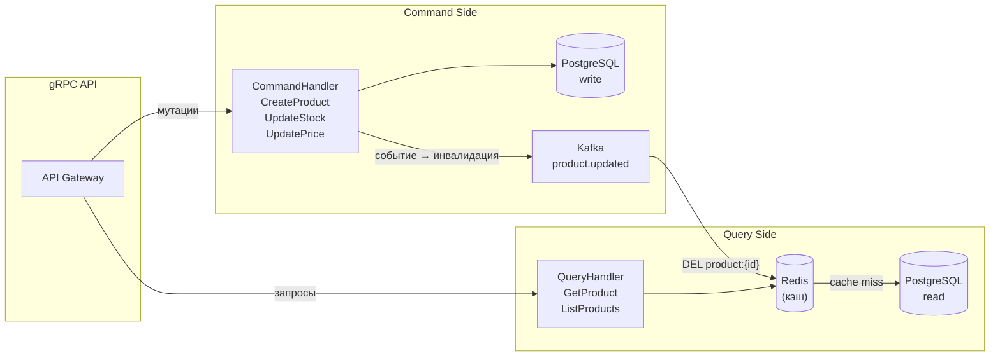

# Catalog Service (CQRS)

---

## Обзор и CQRS

Catalog Service управляет товарами и категориями. Ключевая особенность — применение
паттерна **CQRS** (Command Query Responsibility Segregation):

- **Write side (Commands)**: операции изменения данных → PostgreSQL (source of truth)
- **Read side (Queries)**: операции чтения → Redis (кэш) → PostgreSQL (fallback)



> 💡 **Для C# разработчиков**: В MediatR + CQRS паттерне вы разделяете
> `ICommand` / `IQuery` на уровне классов. В Go — это просто два разных
> пакета (`command/` и `query/`) с явными функциями. Нет магических пайплайнов,
> только явные вызовы.

### Структура пакетов

```
catalog-service/
├── cmd/server/main.go
├── internal/
│   ├── domain/
│   │   └── product.go          # Product, Category, StockReservation
│   ├── command/
│   │   ├── handler.go          # CommandHandler (write side)
│   │   └── commands.go         # Типы команд
│   ├── query/
│   │   ├── handler.go          # QueryHandler (read side)
│   │   └── queries.go          # Типы запросов
│   ├── storage/
│   │   ├── postgres/
│   │   │   └── product_repo.go
│   │   └── redis/
│   │       └── product_cache.go
│   ├── kafka/
│   │   └── producer.go         # Публикация событий об изменениях
│   └── grpc/
│       └── server.go
├── migrations/
│   ├── 001_create_products.sql
│   └── 002_create_stock_reservations.sql
├── Dockerfile
└── go.mod
```

---

## Доменная модель

```go
// internal/domain/product.go
package domain

import (
    "context"
    "errors"
    "time"
)

type Product struct {
    ID          string
    Name        string
    Description string
    PriceCents  int64  // цена в копейках
    Stock       int32  // доступный остаток
    CategoryID  string
    CreatedAt   time.Time
    UpdatedAt   time.Time
}

type Category struct {
    ID       string
    Name     string
    ParentID string // пустая строка = корневая категория
}

// StockReservation — резервирование остатка под конкретный заказ.
// Позволяет атомарно "заморозить" товар и откатить при отмене.
type StockReservation struct {
    ID        string
    OrderID   string
    ProductID string
    Quantity  int32
    CreatedAt time.Time
}

var (
    ErrProductNotFound   = errors.New("product not found")
    ErrInsufficientStock = errors.New("insufficient stock")
    ErrReservationExists = errors.New("stock reservation already exists for this order")
)

// ProductWriter — интерфейс для write side.
type ProductWriter interface {
    Create(ctx context.Context, p *Product) error
    UpdatePrice(ctx context.Context, id string, priceCents int64) error
    // ReserveStock атомарно уменьшает stock и создаёт резервацию.
    ReserveStock(ctx context.Context, r *StockReservation) error
    // ReleaseStock возвращает stock (компенсирующая транзакция Saga).
    ReleaseStock(ctx context.Context, orderID, productID string) error
}

// ProductReader — интерфейс для read side.
type ProductReader interface {
    GetByID(ctx context.Context, id string) (*Product, error)
    List(ctx context.Context, categoryID string, page, pageSize int) ([]*Product, int, error)
}
```

---

## Command Side (Write)

### Типы команд

```go
// internal/command/commands.go
package command

// CreateProductCmd — команда создания товара.
// В C# MediatR это был бы record CreateProductCommand : ICommand<Guid>
type CreateProductCmd struct {
    Name        string
    Description string
    PriceCents  int64
    Stock       int32
    CategoryID  string
}

type UpdatePriceCmd struct {
    ProductID  string
    PriceCents int64
}

type UpdateStockCmd struct {
    ProductID string
    Delta     int32 // +10 = добавить, -5 = убрать
}

type ReserveStockCmd struct {
    OrderID   string
    ProductID string
    Quantity  int32
}

type ReleaseStockCmd struct {
    OrderID   string
    ProductID string
}
```

### CommandHandler

```go
// internal/command/handler.go
package command

import (
    "context"
    "fmt"
    "time"

    "github.com/yourname/ecommerce/catalog-service/internal/domain"
    "github.com/yourname/ecommerce/catalog-service/internal/kafka"
)

// CommandHandler обрабатывает все write операции.
// После каждого изменения публикует событие в Kafka для инвалидации кэша.
type CommandHandler struct {
    writer   domain.ProductWriter
    producer *kafka.Producer
}

func NewCommandHandler(writer domain.ProductWriter, producer *kafka.Producer) *CommandHandler {
    return &CommandHandler{writer: writer, producer: producer}
}

// CreateProduct создаёт товар и публикует product.created.
func (h *CommandHandler) CreateProduct(ctx context.Context, cmd CreateProductCmd) (string, error) {
    if cmd.PriceCents <= 0 {
        return "", fmt.Errorf("price must be positive")
    }
    if cmd.Stock < 0 {
        return "", fmt.Errorf("stock cannot be negative")
    }

    product := &domain.Product{
        ID:          newUUID(),
        Name:        cmd.Name,
        Description: cmd.Description,
        PriceCents:  cmd.PriceCents,
        Stock:       cmd.Stock,
        CategoryID:  cmd.CategoryID,
        CreatedAt:   time.Now().UTC(),
        UpdatedAt:   time.Now().UTC(),
    }

    if err := h.writer.Create(ctx, product); err != nil {
        return "", fmt.Errorf("create product: %w", err)
    }

    // Публикуем событие — кэш инвалидируется через Kafka consumer
    h.producer.PublishProductUpdated(ctx, product.ID)

    return product.ID, nil
}

// UpdatePrice обновляет цену и инвалидирует кэш.
func (h *CommandHandler) UpdatePrice(ctx context.Context, cmd UpdatePriceCmd) error {
    if cmd.PriceCents <= 0 {
        return fmt.Errorf("price must be positive")
    }

    if err := h.writer.UpdatePrice(ctx, cmd.ProductID, cmd.PriceCents); err != nil {
        return fmt.Errorf("update price: %w", err)
    }

    h.producer.PublishProductUpdated(ctx, cmd.ProductID)
    return nil
}

// ReserveStock — вызывается Order Service через gRPC при создании заказа.
// Является частью Saga: если оплата не пройдёт, Order Service вызовет ReleaseStock.
func (h *CommandHandler) ReserveStock(ctx context.Context, cmd ReserveStockCmd) error {
    reservation := &domain.StockReservation{
        ID:        newUUID(),
        OrderID:   cmd.OrderID,
        ProductID: cmd.ProductID,
        Quantity:  cmd.Quantity,
        CreatedAt: time.Now().UTC(),
    }

    if err := h.writer.ReserveStock(ctx, reservation); err != nil {
        return fmt.Errorf("reserve stock: %w", err)
    }

    // Инвалидируем кэш — остаток изменился
    h.producer.PublishProductUpdated(ctx, cmd.ProductID)
    return nil
}

// ReleaseStock — компенсирующая транзакция Saga при отмене заказа.
func (h *CommandHandler) ReleaseStock(ctx context.Context, cmd ReleaseStockCmd) error {
    if err := h.writer.ReleaseStock(ctx, cmd.OrderID, cmd.ProductID); err != nil {
        return fmt.Errorf("release stock: %w", err)
    }

    h.producer.PublishProductUpdated(ctx, cmd.ProductID)
    return nil
}
```

---

## Query Side (Read)

```go
// internal/query/queries.go
package query

type GetProductQuery struct {
    ProductID string
}

type ListProductsQuery struct {
    CategoryID string // опционально
    Page       int
    PageSize   int
}
```

```go
// internal/query/handler.go
package query

import (
    "context"
    "encoding/json"
    "fmt"
    "time"

    "github.com/redis/go-redis/v9"

    "github.com/yourname/ecommerce/catalog-service/internal/domain"
)

// QueryHandler — read side: сначала Redis, при промахе — PostgreSQL.
type QueryHandler struct {
    reader domain.ProductReader
    cache  *redis.Client
    cacheTTL time.Duration
}

func NewQueryHandler(reader domain.ProductReader, cache *redis.Client) *QueryHandler {
    return &QueryHandler{
        reader:   reader,
        cache:    cache,
        cacheTTL: 5 * time.Minute,
    }
}

// GetProduct возвращает товар по ID.
// Порядок: Redis → PostgreSQL → заполнить Redis.
func (h *QueryHandler) GetProduct(ctx context.Context, q GetProductQuery) (*domain.Product, error) {
    cacheKey := fmt.Sprintf("product:%s", q.ProductID)

    // 1. Проверяем кэш
    data, err := h.cache.Get(ctx, cacheKey).Bytes()
    if err == nil {
        // Кэш-попадание — парсим JSON
        var product domain.Product
        if jsonErr := json.Unmarshal(data, &product); jsonErr == nil {
            return &product, nil
        }
        // Битый кэш — удаляем и идём в БД
        h.cache.Del(ctx, cacheKey)
    }

    // 2. Кэш-промах — идём в PostgreSQL
    product, err := h.reader.GetByID(ctx, q.ProductID)
    if err != nil {
        return nil, err
    }

    // 3. Заполняем кэш (fire-and-forget, ошибку не пробрасываем)
    if data, marshalErr := json.Marshal(product); marshalErr == nil {
        h.cache.Set(ctx, cacheKey, data, h.cacheTTL)
    }

    return product, nil
}

// ListProducts возвращает список товаров с пагинацией.
// Для списков кэш с коротким TTL — invalidation сложнее.
func (h *QueryHandler) ListProducts(ctx context.Context, q ListProductsQuery) ([]*domain.Product, int, error) {
    if q.Page <= 0 {
        q.Page = 1
    }
    if q.PageSize <= 0 || q.PageSize > 100 {
        q.PageSize = 20
    }

    // Списки кэшируем с коротким TTL (30 сек) — приоритет свежести
    cacheKey := fmt.Sprintf("products:list:%s:%d:%d", q.CategoryID, q.Page, q.PageSize)

    type cachedList struct {
        Products []*domain.Product `json:"products"`
        Total    int               `json:"total"`
    }

    data, err := h.cache.Get(ctx, cacheKey).Bytes()
    if err == nil {
        var cached cachedList
        if jsonErr := json.Unmarshal(data, &cached); jsonErr == nil {
            return cached.Products, cached.Total, nil
        }
    }

    products, total, err := h.reader.List(ctx, q.CategoryID, q.Page, q.PageSize)
    if err != nil {
        return nil, 0, err
    }

    // Кэшируем список на 30 секунд
    if data, marshalErr := json.Marshal(cachedList{products, total}); marshalErr == nil {
        h.cache.Set(ctx, cacheKey, data, 30*time.Second)
    }

    return products, total, nil
}
```

---

## Резервирование склада

Самая критичная операция — атомарное резервирование остатка в рамках Saga.

```go
// internal/storage/postgres/product_repo.go
package postgres

import (
    "context"
    "errors"
    "fmt"

    "github.com/jackc/pgx/v5"
    "github.com/jackc/pgx/v5/pgconn"
    "github.com/jackc/pgx/v5/pgxpool"

    "github.com/yourname/ecommerce/catalog-service/internal/domain"
)

type ProductRepo struct {
    pool *pgxpool.Pool
}

func NewProductRepo(pool *pgxpool.Pool) *ProductRepo {
    return &ProductRepo{pool: pool}
}

// ReserveStock — атомарная операция: проверить остаток + уменьшить + записать резервацию.
// Выполняется в одной транзакции с SELECT ... FOR UPDATE (пессимистичная блокировка).
func (r *ProductRepo) ReserveStock(ctx context.Context, res *domain.StockReservation) error {
    return r.pool.AcquireFunc(ctx, func(conn *pgxpool.Conn) error {
        tx, err := conn.Begin(ctx)
        if err != nil {
            return fmt.Errorf("begin tx: %w", err)
        }
        defer tx.Rollback(ctx) // no-op если Commit успешен

        // SELECT ... FOR UPDATE — блокируем строку товара на время транзакции.
        // Предотвращает race condition при параллельных заказах одного товара.
        var currentStock int32
        err = tx.QueryRow(ctx, `
            SELECT stock FROM products
            WHERE id = $1
            FOR UPDATE
        `, res.ProductID).Scan(&currentStock)
        if err != nil {
            if errors.Is(err, pgx.ErrNoRows) {
                return domain.ErrProductNotFound
            }
            return fmt.Errorf("lock product: %w", err)
        }

        // Проверяем достаточность остатка
        if currentStock < res.Quantity {
            return domain.ErrInsufficientStock
        }

        // Уменьшаем остаток
        _, err = tx.Exec(ctx, `
            UPDATE products
            SET stock = stock - $1, updated_at = NOW()
            WHERE id = $2
        `, res.Quantity, res.ProductID)
        if err != nil {
            return fmt.Errorf("update stock: %w", err)
        }

        // Записываем резервацию (idempotency key = order_id + product_id)
        _, err = tx.Exec(ctx, `
            INSERT INTO stock_reservations (id, order_id, product_id, quantity, created_at)
            VALUES ($1, $2, $3, $4, $5)
            ON CONFLICT (order_id, product_id) DO NOTHING
        `, res.ID, res.OrderID, res.ProductID, res.Quantity, res.CreatedAt)
        if err != nil {
            return fmt.Errorf("insert reservation: %w", err)
        }

        return tx.Commit(ctx)
    })
}

// ReleaseStock — компенсирующая транзакция: вернуть остаток + удалить резервацию.
func (r *ProductRepo) ReleaseStock(ctx context.Context, orderID, productID string) error {
    return r.pool.AcquireFunc(ctx, func(conn *pgxpool.Conn) error {
        tx, err := conn.Begin(ctx)
        if err != nil {
            return fmt.Errorf("begin tx: %w", err)
        }
        defer tx.Rollback(ctx)

        // Получаем количество из резервации
        var quantity int32
        err = tx.QueryRow(ctx, `
            DELETE FROM stock_reservations
            WHERE order_id = $1 AND product_id = $2
            RETURNING quantity
        `, orderID, productID).Scan(&quantity)
        if err != nil {
            if errors.Is(err, pgx.ErrNoRows) {
                // Резервации нет — возможно уже освобождена (идемпотентность)
                return nil
            }
            return fmt.Errorf("delete reservation: %w", err)
        }

        // Возвращаем остаток
        _, err = tx.Exec(ctx, `
            UPDATE products
            SET stock = stock + $1, updated_at = NOW()
            WHERE id = $2
        `, quantity, productID)
        if err != nil {
            return fmt.Errorf("restore stock: %w", err)
        }

        return tx.Commit(ctx)
    })
}

func (r *ProductRepo) GetByID(ctx context.Context, id string) (*domain.Product, error) {
    p := &domain.Product{}
    err := r.pool.QueryRow(ctx, `
        SELECT id, name, description, price_cents, stock, category_id, created_at, updated_at
        FROM products WHERE id = $1
    `, id).Scan(
        &p.ID, &p.Name, &p.Description,
        &p.PriceCents, &p.Stock, &p.CategoryID,
        &p.CreatedAt, &p.UpdatedAt,
    )
    if err != nil {
        if errors.Is(err, pgx.ErrNoRows) {
            return nil, domain.ErrProductNotFound
        }
        return nil, fmt.Errorf("get product: %w", err)
    }
    return p, nil
}

func (r *ProductRepo) List(ctx context.Context, categoryID string, page, pageSize int) ([]*domain.Product, int, error) {
    offset := (page - 1) * pageSize

    // Динамический WHERE в зависимости от наличия categoryID
    var rows pgx.Rows
    var err error

    if categoryID != "" {
        rows, err = r.pool.Query(ctx, `
            SELECT id, name, description, price_cents, stock, category_id, created_at, updated_at
            FROM products
            WHERE category_id = $1
            ORDER BY created_at DESC
            LIMIT $2 OFFSET $3
        `, categoryID, pageSize, offset)
    } else {
        rows, err = r.pool.Query(ctx, `
            SELECT id, name, description, price_cents, stock, category_id, created_at, updated_at
            FROM products
            ORDER BY created_at DESC
            LIMIT $1 OFFSET $2
        `, pageSize, offset)
    }
    if err != nil {
        return nil, 0, fmt.Errorf("list products: %w", err)
    }
    defer rows.Close()

    var products []*domain.Product
    for rows.Next() {
        p := &domain.Product{}
        if err := rows.Scan(
            &p.ID, &p.Name, &p.Description,
            &p.PriceCents, &p.Stock, &p.CategoryID,
            &p.CreatedAt, &p.UpdatedAt,
        ); err != nil {
            return nil, 0, fmt.Errorf("scan product: %w", err)
        }
        products = append(products, p)
    }

    // Подсчёт total для пагинации
    var total int
    countQuery := "SELECT COUNT(*) FROM products"
    if categoryID != "" {
        countQuery += " WHERE category_id = $1"
        r.pool.QueryRow(ctx, countQuery, categoryID).Scan(&total)
    } else {
        r.pool.QueryRow(ctx, countQuery).Scan(&total)
    }

    return products, total, nil
}

func (r *ProductRepo) Create(ctx context.Context, p *domain.Product) error {
    _, err := r.pool.Exec(ctx, `
        INSERT INTO products (id, name, description, price_cents, stock, category_id, created_at, updated_at)
        VALUES ($1, $2, $3, $4, $5, $6, $7, $8)
    `, p.ID, p.Name, p.Description, p.PriceCents, p.Stock, p.CategoryID, p.CreatedAt, p.UpdatedAt)
    if err != nil {
        return fmt.Errorf("create product: %w", err)
    }
    return nil
}

func (r *ProductRepo) UpdatePrice(ctx context.Context, id string, priceCents int64) error {
    tag, err := r.pool.Exec(ctx, `
        UPDATE products SET price_cents = $1, updated_at = NOW() WHERE id = $2
    `, priceCents, id)
    if err != nil {
        return fmt.Errorf("update price: %w", err)
    }
    if tag.RowsAffected() == 0 {
        return domain.ErrProductNotFound
    }
    return nil
}
```

---

## gRPC сервер

```go
// internal/grpc/server.go
package grpc

import (
    "context"
    "errors"

    "google.golang.org/grpc/codes"
    "google.golang.org/grpc/status"

    catalogv1 "github.com/yourname/ecommerce/gen/go/catalog/v1"
    "github.com/yourname/ecommerce/catalog-service/internal/command"
    "github.com/yourname/ecommerce/catalog-service/internal/domain"
    "github.com/yourname/ecommerce/catalog-service/internal/query"
)

type Server struct {
    catalogv1.UnimplementedCatalogServiceServer
    cmd *command.CommandHandler
    qry *query.QueryHandler
}

func NewServer(cmd *command.CommandHandler, qry *query.QueryHandler) *Server {
    return &Server{cmd: cmd, qry: qry}
}

func (s *Server) GetProduct(ctx context.Context, req *catalogv1.GetProductRequest) (*catalogv1.GetProductResponse, error) {
    product, err := s.qry.GetProduct(ctx, query.GetProductQuery{ProductID: req.ProductId})
    if err != nil {
        return nil, toGRPCError(err)
    }
    return &catalogv1.GetProductResponse{
        Product: toProtoProduct(product),
    }, nil
}

func (s *Server) ListProducts(ctx context.Context, req *catalogv1.ListProductsRequest) (*catalogv1.ListProductsResponse, error) {
    products, total, err := s.qry.ListProducts(ctx, query.ListProductsQuery{
        CategoryID: req.CategoryId,
        Page:       int(req.Page),
        PageSize:   int(req.PageSize),
    })
    if err != nil {
        return nil, toGRPCError(err)
    }

    protoProducts := make([]*catalogv1.Product, len(products))
    for i, p := range products {
        protoProducts[i] = toProtoProduct(p)
    }

    return &catalogv1.ListProductsResponse{
        Products: protoProducts,
        Total:    int32(total),
    }, nil
}

func (s *Server) ReserveStock(ctx context.Context, req *catalogv1.ReserveStockRequest) (*catalogv1.ReserveStockResponse, error) {
    err := s.cmd.ReserveStock(ctx, command.ReserveStockCmd{
        OrderID:   req.OrderId,
        ProductID: req.ProductId,
        Quantity:  req.Quantity,
    })
    if err != nil {
        if errors.Is(err, domain.ErrInsufficientStock) {
            return &catalogv1.ReserveStockResponse{
                Success:       false,
                FailureReason: "insufficient stock",
            }, nil
        }
        if errors.Is(err, domain.ErrProductNotFound) {
            return &catalogv1.ReserveStockResponse{
                Success:       false,
                FailureReason: "product not found",
            }, nil
        }
        return nil, status.Error(codes.Internal, "reserve stock failed")
    }
    return &catalogv1.ReserveStockResponse{Success: true}, nil
}

func (s *Server) ReleaseStock(ctx context.Context, req *catalogv1.ReleaseStockRequest) (*catalogv1.ReleaseStockResponse, error) {
    err := s.cmd.ReleaseStock(ctx, command.ReleaseStockCmd{
        OrderID:   req.OrderId,
        ProductID: req.ProductId,
    })
    if err != nil {
        return nil, status.Error(codes.Internal, "release stock failed")
    }
    return &catalogv1.ReleaseStockResponse{}, nil
}

// toProtoProduct маппит доменный Product в proto Product.
func toProtoProduct(p *domain.Product) *catalogv1.Product {
    return &catalogv1.Product{
        ProductId:   p.ID,
        Name:        p.Name,
        Description: p.Description,
        PriceCents:  p.PriceCents,
        Stock:       p.Stock,
        CategoryId:  p.CategoryID,
    }
}

func toGRPCError(err error) error {
    switch {
    case errors.Is(err, domain.ErrProductNotFound):
        return status.Error(codes.NotFound, err.Error())
    case errors.Is(err, domain.ErrInsufficientStock):
        return status.Error(codes.FailedPrecondition, err.Error())
    default:
        return status.Error(codes.Internal, "internal server error")
    }
}
```

---

## Kafka: инвалидация кэша

```go
// internal/kafka/producer.go
package kafka

import (
    "context"
    "encoding/json"
    "log/slog"
    "time"

    "github.com/segmentio/kafka-go"
)

const TopicProductUpdated = "catalog.product.updated"

type ProductUpdatedEvent struct {
    ProductID string    `json:"product_id"`
    Timestamp time.Time `json:"timestamp"`
}

type Producer struct {
    writer *kafka.Writer
}

func NewProducer(brokers []string) *Producer {
    return &Producer{
        writer: &kafka.Writer{
            Addr:                   kafka.TCP(brokers...),
            Topic:                  TopicProductUpdated,
            Balancer:               &kafka.LeastBytes{},
            WriteTimeout:           5 * time.Second,
            RequiredAcks:           kafka.RequireOne,
            AllowAutoTopicCreation: true,
        },
    }
}

// PublishProductUpdated публикует событие изменения товара.
// Notification Service (consumer) инвалидирует кэш Redis при получении.
func (p *Producer) PublishProductUpdated(ctx context.Context, productID string) {
    event := ProductUpdatedEvent{
        ProductID: productID,
        Timestamp: time.Now().UTC(),
    }
    data, err := json.Marshal(event)
    if err != nil {
        slog.ErrorContext(ctx, "marshal product event", "err", err)
        return
    }

    // Используем productID как ключ → все события одного товара в одну партицию
    err = p.writer.WriteMessages(ctx, kafka.Message{
        Key:   []byte(productID),
        Value: data,
    })
    if err != nil {
        // fire-and-forget: логируем, но не блокируем основной поток
        slog.ErrorContext(ctx, "publish product event", "product_id", productID, "err", err)
    }
}

func (p *Producer) Close() error {
    return p.writer.Close()
}
```

### Consumer для инвалидации кэша

Catalog Service сам подписывается на свои же события и инвалидирует Redis.
Это позволяет инвалидировать кэш на всех репликах сервиса через Kafka fan-out:

```go
// internal/kafka/cache_invalidator.go
package kafka

import (
    "context"
    "encoding/json"
    "fmt"
    "log/slog"
    "time"

    "github.com/redis/go-redis/v9"
    "github.com/segmentio/kafka-go"
)

// CacheInvalidator — Kafka consumer, инвалидирует Redis при изменении товара.
// Запускается как горутина в main.go.
type CacheInvalidator struct {
    reader *kafka.Reader
    cache  *redis.Client
}

func NewCacheInvalidator(brokers []string, groupID string, cache *redis.Client) *CacheInvalidator {
    return &CacheInvalidator{
        reader: kafka.NewReader(kafka.ReaderConfig{
            Brokers: brokers,
            GroupID: groupID, // например, "catalog-cache-invalidator"
            Topic:   TopicProductUpdated,
            MaxWait: 100 * time.Millisecond,
        }),
        cache: cache,
    }
}

// Run запускает бесконечный цикл обработки событий.
// Останавливается при отмене ctx.
func (c *CacheInvalidator) Run(ctx context.Context) error {
    slog.Info("cache invalidator started")
    for {
        msg, err := c.reader.ReadMessage(ctx)
        if err != nil {
            if ctx.Err() != nil {
                return nil // graceful shutdown
            }
            slog.Error("read kafka message", "err", err)
            continue
        }

        var event ProductUpdatedEvent
        if err := json.Unmarshal(msg.Value, &event); err != nil {
            slog.Error("unmarshal product event", "err", err)
            continue
        }

        // Удаляем кэш конкретного товара
        key := fmt.Sprintf("product:%s", event.ProductID)
        if err := c.cache.Del(ctx, key).Err(); err != nil {
            slog.Error("invalidate cache", "key", key, "err", err)
        } else {
            slog.Debug("cache invalidated", "product_id", event.ProductID)
        }
    }
}

func (c *CacheInvalidator) Close() error {
    return c.reader.Close()
}
```

---

## Миграции

```sql
-- migrations/001_create_products.sql
CREATE TABLE IF NOT EXISTS products (
    id           UUID         PRIMARY KEY DEFAULT gen_random_uuid(),
    name         TEXT         NOT NULL,
    description  TEXT         NOT NULL DEFAULT '',
    price_cents  BIGINT       NOT NULL CHECK (price_cents > 0),
    stock        INTEGER      NOT NULL DEFAULT 0 CHECK (stock >= 0),
    category_id  UUID,
    created_at   TIMESTAMPTZ  NOT NULL DEFAULT NOW(),
    updated_at   TIMESTAMPTZ  NOT NULL DEFAULT NOW()
);

-- Индексы для типичных запросов
CREATE INDEX idx_products_category ON products (category_id) WHERE category_id IS NOT NULL;
CREATE INDEX idx_products_created  ON products (created_at DESC);

-- Автообновление updated_at
CREATE TRIGGER products_updated_at
    BEFORE UPDATE ON products
    FOR EACH ROW EXECUTE FUNCTION set_updated_at();
```

```sql
-- migrations/002_create_stock_reservations.sql
CREATE TABLE IF NOT EXISTS stock_reservations (
    id          UUID         PRIMARY KEY DEFAULT gen_random_uuid(),
    order_id    UUID         NOT NULL,
    product_id  UUID         NOT NULL REFERENCES products(id),
    quantity    INTEGER      NOT NULL CHECK (quantity > 0),
    created_at  TIMESTAMPTZ  NOT NULL DEFAULT NOW(),

    -- Уникальность по (order_id, product_id) — идемпотентность резервирования
    CONSTRAINT uq_reservation UNIQUE (order_id, product_id)
);

CREATE INDEX idx_reservations_order   ON stock_reservations (order_id);
CREATE INDEX idx_reservations_product ON stock_reservations (product_id);
```

---

## Тестирование

### Unit тест CQRS хэндлеров

```go
// internal/command/handler_test.go
package command_test

import (
    "context"
    "testing"

    "github.com/stretchr/testify/assert"
    "github.com/stretchr/testify/require"

    "github.com/yourname/ecommerce/catalog-service/internal/command"
    "github.com/yourname/ecommerce/catalog-service/internal/domain"
)

// mockProductWriter — мок write side репозитория.
type mockProductWriter struct {
    products     map[string]*domain.Product
    reservations map[string]int32 // productID → зарезервированное количество
}

func newMockWriter() *mockProductWriter {
    return &mockProductWriter{
        products:     make(map[string]*domain.Product),
        reservations: make(map[string]int32),
    }
}

func (m *mockProductWriter) Create(_ context.Context, p *domain.Product) error {
    m.products[p.ID] = p
    return nil
}

func (m *mockProductWriter) UpdatePrice(_ context.Context, id string, priceCents int64) error {
    p, ok := m.products[id]
    if !ok {
        return domain.ErrProductNotFound
    }
    p.PriceCents = priceCents
    return nil
}

func (m *mockProductWriter) ReserveStock(_ context.Context, r *domain.StockReservation) error {
    p, ok := m.products[r.ProductID]
    if !ok {
        return domain.ErrProductNotFound
    }
    if p.Stock < r.Quantity {
        return domain.ErrInsufficientStock
    }
    p.Stock -= r.Quantity
    m.reservations[r.ProductID] += r.Quantity
    return nil
}

func (m *mockProductWriter) ReleaseStock(_ context.Context, orderID, productID string) error {
    p, ok := m.products[productID]
    if !ok {
        return nil // идемпотентно
    }
    reserved := m.reservations[productID]
    p.Stock += reserved
    delete(m.reservations, productID)
    return nil
}

// mockProducer — нулевой Kafka producer для тестов.
type mockProducer struct{ published []string }

func (m *mockProducer) PublishProductUpdated(_ context.Context, productID string) {
    m.published = append(m.published, productID)
}

func TestCommandHandler_ReserveStock(t *testing.T) {
    writer := newMockWriter()
    producer := &mockProducer{}

    // Создаём тестовый товар
    writer.products["prod-1"] = &domain.Product{
        ID:    "prod-1",
        Name:  "Test Product",
        Stock: 10,
    }

    handler := command.NewCommandHandler(writer, producer)

    t.Run("успешное резервирование", func(t *testing.T) {
        err := handler.ReserveStock(context.Background(), command.ReserveStockCmd{
            OrderID:   "order-1",
            ProductID: "prod-1",
            Quantity:  3,
        })
        require.NoError(t, err)
        assert.Equal(t, int32(7), writer.products["prod-1"].Stock) // 10 - 3
        assert.Contains(t, producer.published, "prod-1")           // событие опубликовано
    })

    t.Run("недостаточно остатка", func(t *testing.T) {
        err := handler.ReserveStock(context.Background(), command.ReserveStockCmd{
            OrderID:   "order-2",
            ProductID: "prod-1",
            Quantity:  100, // больше доступного
        })
        assert.ErrorIs(t, err, domain.ErrInsufficientStock)
    })
}
```

---

## Сравнение с C#

### CQRS: MediatR vs явный Go

**C# (MediatR)**:
```csharp
// Команда
public record CreateProductCommand(string Name, decimal Price) : ICommand<Guid>;

// Обработчик
public class CreateProductHandler : IRequestHandler<CreateProductCommand, Guid>
{
    public async Task<Guid> Handle(CreateProductCommand cmd, CancellationToken ct)
    { /* ... */ }
}

// Вызов (через DI)
var id = await _mediator.Send(new CreateProductCommand("Phone", 999.99m));
```

**Go (явный CQRS)**:
```go
// Команда — просто struct
type CreateProductCmd struct {
    Name       string
    PriceCents int64
}

// Обработчик — обычный метод
func (h *CommandHandler) CreateProduct(ctx context.Context, cmd CreateProductCmd) (string, error) {
    // ...
}

// Вызов — явный вызов метода
id, err := cmdHandler.CreateProduct(ctx, command.CreateProductCmd{Name: "Phone", PriceCents: 99999})
```

Go-подход: нет магических пайплайнов, поведение видно в коде, легко тестировать.

### Пессимистичные блокировки

| Аспект | C# EF Core | Go pgx |
|--------|-----------|--------|
| SELECT FOR UPDATE | `FromSqlRaw("... FOR UPDATE")` | `QueryRow(ctx, "... FOR UPDATE")` |
| Транзакция | `using var tx = await db.BeginTransactionAsync()` | `tx, err := pool.Begin(ctx)` |
| Откат | автоматически через `using` | `defer tx.Rollback(ctx)` |
| RETURNING | через `ExecuteSqlRaw` + reload | встроено в pgx |

---
