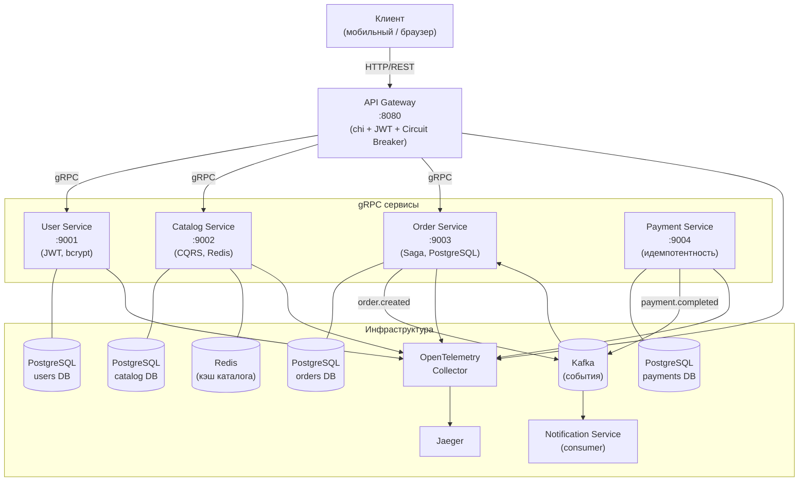
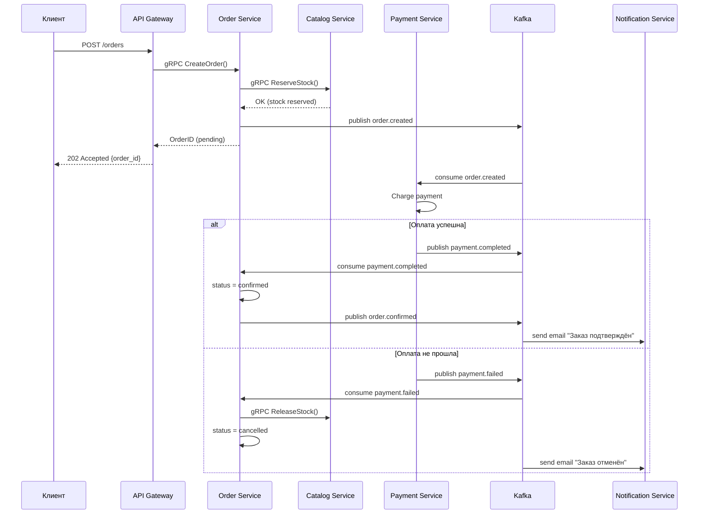
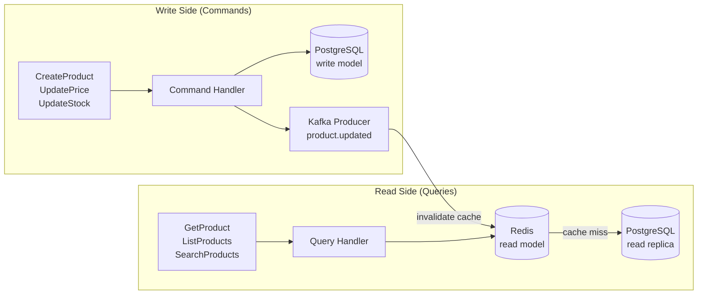

# Проект 2: E-commerce Platform

> Практический проект: микросервисная архитектура на Go.
> Сложность: **Intermediate**

## Содержание

<!-- START doctoc generated TOC please keep comment here to allow auto update -->
<!-- DON'T EDIT THIS SECTION, INSTEAD RE-RUN doctoc TO UPDATE -->

- [Что мы построим](#%D1%87%D1%82%D0%BE-%D0%BC%D1%8B-%D0%BF%D0%BE%D1%81%D1%82%D1%80%D0%BE%D0%B8%D0%BC)
- [Архитектура](#%D0%B0%D1%80%D1%85%D0%B8%D1%82%D0%B5%D0%BA%D1%82%D1%83%D1%80%D0%B0)
  - [Общая схема сервисов](#%D0%BE%D0%B1%D1%89%D0%B0%D1%8F-%D1%81%D1%85%D0%B5%D0%BC%D0%B0-%D1%81%D0%B5%D1%80%D0%B2%D0%B8%D1%81%D0%BE%D0%B2)
  - [Saga Pattern: оформление заказа](#saga-pattern-%D0%BE%D1%84%D0%BE%D1%80%D0%BC%D0%BB%D0%B5%D0%BD%D0%B8%D0%B5-%D0%B7%D0%B0%D0%BA%D0%B0%D0%B7%D0%B0)
  - [CQRS в Catalog Service](#cqrs-%D0%B2-catalog-service)
- [Технологии](#%D1%82%D0%B5%D1%85%D0%BD%D0%BE%D0%BB%D0%BE%D0%B3%D0%B8%D0%B8)
  - [go.mod (каждый сервис)](#gomod-%D0%BA%D0%B0%D0%B6%D0%B4%D1%8B%D0%B9-%D1%81%D0%B5%D1%80%D0%B2%D0%B8%D1%81)
- [Структура проекта](#%D1%81%D1%82%D1%80%D1%83%D0%BA%D1%82%D1%83%D1%80%D0%B0-%D0%BF%D1%80%D0%BE%D0%B5%D0%BA%D1%82%D0%B0)
- [Паттерны](#%D0%BF%D0%B0%D1%82%D1%82%D0%B5%D1%80%D0%BD%D1%8B)
  - [Saga Pattern (хореография)](#saga-pattern-%D1%85%D0%BE%D1%80%D0%B5%D0%BE%D0%B3%D1%80%D0%B0%D1%84%D0%B8%D1%8F)
  - [CQRS (Catalog Service)](#cqrs-catalog-service)
  - [Circuit Breaker (API Gateway)](#circuit-breaker-api-gateway)
  - [Идемпотентность (Payment Service)](#%D0%B8%D0%B4%D0%B5%D0%BC%D0%BF%D0%BE%D1%82%D0%B5%D0%BD%D1%82%D0%BD%D0%BE%D1%81%D1%82%D1%8C-payment-service)
- [Разделы гайда](#%D1%80%D0%B0%D0%B7%D0%B4%D0%B5%D0%BB%D1%8B-%D0%B3%D0%B0%D0%B9%D0%B4%D0%B0)
- [Требования](#%D1%82%D1%80%D0%B5%D0%B1%D0%BE%D0%B2%D0%B0%D0%BD%D0%B8%D1%8F)
- [Быстрый старт](#%D0%B1%D1%8B%D1%81%D1%82%D1%80%D1%8B%D0%B9-%D1%81%D1%82%D0%B0%D1%80%D1%82)
- [Что изучим](#%D1%87%D1%82%D0%BE-%D0%B8%D0%B7%D1%83%D1%87%D0%B8%D0%BC)

<!-- END doctoc generated TOC please keep comment here to allow auto update -->

---

## Что мы построим

Полноценная e-commerce платформа с микросервисной архитектурой:

- **API Gateway** — единая точка входа, JWT-проверка, routing, circuit breaker
- **User Service** — регистрация, login, JWT токены, профиль
- **Catalog Service** — каталог товаров, категории, поиск (CQRS)
- **Order Service** — создание заказов, управление состоянием (Saga)
- **Payment Service** — эмуляция оплаты, идемпотентность
- **Notification Service** — email/push уведомления через Kafka

> 💡 **Для C# разработчиков**: Аналог — набор ASP.NET Core Minimal API сервисов
> с MassTransit + RabbitMQ/Kafka. В Go всё делается явно: нет DI-контейнера,
> нет магии фреймворка — только явный код и чёткие интерфейсы.

---

## Архитектура

### Общая схема сервисов



### Saga Pattern: оформление заказа



### CQRS в Catalog Service



---

## Технологии

| Компонент | Go | C# аналог |
|-----------|-----|-----------|
| HTTP сервер (Gateway) | `net/http` + `chi` | ASP.NET Core |
| Межсервисный транспорт | `google.golang.org/grpc` | gRPC for .NET |
| Proto контракты | `buf` + `protoc-gen-go` | Grpc.Tools |
| Очереди сообщений | `segmentio/kafka-go` | MassTransit + Kafka |
| PostgreSQL | `pgx/v5` + `sqlc` | EF Core / Npgsql |
| Кэш | `go-redis/v9` | StackExchange.Redis |
| JWT | `golang-jwt/jwt/v5` | System.IdentityModel.Tokens.Jwt |
| Хэширование паролей | `golang.org/x/crypto/bcrypt` | ASP.NET Core Identity |
| Трейсинг | `go.opentelemetry.io/otel` | OpenTelemetry .NET |
| Circuit breaker | `sony/gobreaker` | Polly |
| Тесты | `testing` + `testify` | xUnit + Moq |
| Контейнеры для тестов | `testcontainers-go` | TestContainers.NET |
| Логирование | `log/slog` | Serilog |
| Конфигурация | `caarlos0/env` | Options pattern |
| Деплой | Docker Compose + Kubernetes | Docker / Helm |

### go.mod (каждый сервис)

```go
module github.com/yourname/ecommerce/user-service

go 1.26

require (
    google.golang.org/grpc v1.70.0
    google.golang.org/protobuf v1.36.5
    github.com/jackc/pgx/v5 v5.7.1
    github.com/golang-jwt/jwt/v5 v5.2.1
    golang.org/x/crypto v0.35.0
    github.com/caarlos0/env/v11 v11.3.1
    go.opentelemetry.io/otel v1.34.0
    go.opentelemetry.io/otel/trace v1.34.0
    github.com/stretchr/testify v1.10.0
    github.com/testcontainers/testcontainers-go v0.35.0
)
```

---

## Структура проекта

```
ecommerce/
├── proto/                           # Protobuf контракты (общие)
│   ├── buf.yaml
│   ├── user/v1/
│   │   └── user.proto
│   ├── catalog/v1/
│   │   └── catalog.proto
│   ├── order/v1/
│   │   └── order.proto
│   └── payment/v1/
│       └── payment.proto
│
├── shared/                          # Общий код
│   ├── events/                      # Kafka события (Go struct)
│   │   ├── order_events.go
│   │   └── payment_events.go
│   ├── middleware/                  # JWT parsing, trace propagation
│   └── config/                     # Базовая структура конфига
│
├── services/
│   ├── api-gateway/                 # HTTP → gRPC proxy
│   │   ├── cmd/gateway/main.go
│   │   ├── internal/
│   │   │   ├── handler/             # chi хэндлеры
│   │   │   ├── client/              # gRPC клиенты к сервисам
│   │   │   └── middleware/          # JWT verify, circuit breaker
│   │   ├── Dockerfile
│   │   └── go.mod
│   │
│   ├── user-service/                # JWT auth
│   │   ├── cmd/server/main.go
│   │   ├── internal/
│   │   │   ├── domain/              # User entity, errors
│   │   │   ├── service/             # UserService (бизнес-логика)
│   │   │   ├── storage/             # PostgreSQL repo
│   │   │   └── grpc/                # gRPC server implementation
│   │   ├── migrations/
│   │   ├── Dockerfile
│   │   └── go.mod
│   │
│   ├── catalog-service/             # CQRS: продукты и категории
│   │   ├── cmd/server/main.go
│   │   ├── internal/
│   │   │   ├── domain/
│   │   │   ├── command/             # Write side
│   │   │   ├── query/               # Read side (Redis + PG)
│   │   │   ├── storage/
│   │   │   └── grpc/
│   │   ├── migrations/
│   │   ├── Dockerfile
│   │   └── go.mod
│   │
│   ├── order-service/               # Saga orchestration
│   │   ├── cmd/server/main.go
│   │   ├── internal/
│   │   │   ├── domain/
│   │   │   ├── saga/                # Saga orchestrator
│   │   │   ├── storage/
│   │   │   ├── grpc/
│   │   │   └── kafka/               # Producer + Consumer
│   │   ├── migrations/
│   │   ├── Dockerfile
│   │   └── go.mod
│   │
│   ├── payment-service/             # Эмуляция оплаты
│   │   ├── cmd/server/main.go
│   │   ├── internal/
│   │   │   ├── domain/
│   │   │   ├── service/
│   │   │   ├── storage/
│   │   │   ├── grpc/
│   │   │   └── kafka/
│   │   ├── migrations/
│   │   ├── Dockerfile
│   │   └── go.mod
│   │
│   └── notification-service/        # Kafka consumer → email/push
│       ├── cmd/worker/main.go
│       ├── internal/
│       │   ├── consumer/
│       │   └── sender/
│       ├── Dockerfile
│       └── go.mod
│
├── docker-compose.yml               # Все сервисы + инфра
├── docker-compose.dev.yml           # Только инфра (для разработки)
├── Makefile                         # build, test, lint, proto
└── README.md
```

> 💡 **Для C# разработчиков**: В .NET обычно используется монорепозиторий через Solution
> с проектами-сборками. В Go каждый микросервис — отдельный `go.mod` модуль,
> что даёт явный контроль зависимостей. Общий код выносится в `shared/` пакет.

---

## Паттерны

### Saga Pattern (хореография)

Каждый сервис знает только о своих событиях. Оркестрации нет — только реакция на события:

```
order.created    → Payment Service обрабатывает оплату
payment.done     → Order Service подтверждает заказ
payment.failed   → Order Service отменяет, Catalog возвращает резерв
order.confirmed  → Notification Service отправляет email
```

> ⚠️ **Vs C# MassTransit**: MassTransit Saga — state machine с явной персистентностью.
> В Go Saga реализуется вручную: Kafka consumer + explicit state transitions + идемпотентность через INSERT ON CONFLICT.

### CQRS (Catalog Service)

```
Commands (Write): CreateProduct, UpdatePrice, UpdateStock
    → PostgreSQL (source of truth) + Kafka event (cache invalidation)

Queries (Read): GetProduct, ListProducts, SearchProducts
    → Redis (cache) → PostgreSQL read replica (cache miss)
```

### Circuit Breaker (API Gateway)

```
Каждый gRPC клиент обёрнут в sony/gobreaker.
Состояния: Closed → Open (5 ошибок за 10 сек) → Half-Open (1 пробный запрос)
```

### Идемпотентность (Payment Service)

```sql
CREATE TABLE payment_attempts (
    idempotency_key UUID PRIMARY KEY,
    order_id        UUID NOT NULL,
    status          TEXT NOT NULL,
    created_at      TIMESTAMPTZ DEFAULT NOW()
);
-- INSERT ON CONFLICT DO NOTHING → безопасный retry
```

---

<!-- AUTO: MATERIALS -->
## Материалы

### 1. [Доменная модель и контракты](./01_domain.md)

- Обзор доменов
- Protobuf контракты
- Go доменные модели
- Kafka события
- Shared пакеты
- Сравнение с C#
- Генерация кода

### 2. [User Service](./02_user_service.md)

- Обзор сервиса
- Конфигурация
- Доменный сервис
- JWT токены
- PostgreSQL репозиторий
- gRPC сервер
- Точка входа: main.go
- Миграции
- Тестирование
- Сравнение с C#

### 3. [Catalog Service (CQRS)](./03_catalog_service.md)

- Обзор и CQRS
- Доменная модель
- Command Side (Write)
- Query Side (Read)
- Резервирование склада
- gRPC сервер
- Kafka: инвалидация кэша
- Миграции
- Тестирование
- Сравнение с C#

### 4. [Order Service (Saga Pattern)](./04_order_service.md)

- Обзор и Saga Pattern
- State Machine заказа
- gRPC: создание заказа
- Kafka Consumer: обработка событий
- Kafka Producer: публикация событий
- PostgreSQL репозиторий
- gRPC сервер и клиент Catalog Service
- main.go — запуск сервиса
- Миграции
- Тестирование
- Сравнение с C#

### 5. [Payment Service и Notification Service](./05_payment_notification.md)

- Payment Service
- Notification Service
- Тестирование
- Сравнение с C#

### 6. [API Gateway](./06_api_gateway.md)

- Обзор
- Структура и routing
- JWT middleware
- gRPC клиенты с Circuit Breaker
- HTTP хэндлеры
- Rate limiting
- main.go
- Тестирование
- Сравнение с C#

### 7. [Деплой и наблюдаемость](./07_deployment.md)

- Docker Compose
- Dockerfiles
- Makefile
- OpenTelemetry
- Health Checks
- Kubernetes
- Итоги проекта
<!-- /AUTO: MATERIALS -->

---

## Требования

- Go 1.26+
- Docker + Docker Compose
- `buf` CLI (для генерации proto): `go install github.com/bufbuild/buf/cmd/buf@latest`
- `sqlc` (для генерации SQL): `go install github.com/sqlc-dev/sqlc/cmd/sqlc@latest`
- Знание материалов Частей 1-4 курса:
  - Горутины и каналы (2.1)
  - Обработка ошибок (2.5)
  - HTTP сервер и структура проекта (3.1-3.2)
  - PostgreSQL и кэширование (4.1-4.2)
  - Kafka (4.3)
  - gRPC (4.4)

---

## Быстрый старт

```bash
# 1. Поднять инфраструктуру
docker compose -f docker-compose.dev.yml up -d
# PostgreSQL (x4), Redis, Kafka, Zookeeper, Jaeger

# 2. Сгенерировать proto
cd proto && buf generate

# 3. Применить миграции
make migrate-all

# 4. Запустить все сервисы (для разработки)
make dev
# Запускает: api-gateway, user-service, catalog-service,
#            order-service, payment-service, notification-service

# 5. Тестируем
# Регистрация
curl -X POST http://localhost:8080/api/v1/auth/register \
  -H "Content-Type: application/json" \
  -d '{"email": "user@example.com", "password": "secret123", "name": "Ivan"}'

# Login → получаем JWT
curl -X POST http://localhost:8080/api/v1/auth/login \
  -H "Content-Type: application/json" \
  -d '{"email": "user@example.com", "password": "secret123"}'
# {"access_token": "eyJ...", "expires_in": 3600}

# Создаём заказ
curl -X POST http://localhost:8080/api/v1/orders \
  -H "Authorization: Bearer eyJ..." \
  -H "Content-Type: application/json" \
  -d '{"items": [{"product_id": "uuid", "quantity": 2}]}'
# {"order_id": "uuid", "status": "pending"}

# Jaeger UI для трейсинга
open http://localhost:16686
```

---

## Что изучим

После завершения проекта вы будете уметь:

- Проектировать **микросервисную архитектуру** на Go
- Писать **gRPC сервисы** с protobuf контрактами
- Реализовывать **Saga pattern** через Kafka events
- Применять **CQRS** для разделения read/write нагрузки
- Добавлять **Circuit Breaker** на уровне API Gateway
- Обеспечивать **идемпотентность** операций
- Настраивать **распределённый трейсинг** через OpenTelemetry
- Деплоить **многосервисное приложение** в Docker Compose и Kubernetes

---

<!-- AUTO: NAV -->
[← Назад к оглавлению](../README.md) | [Предыдущая часть: Проект 1: URL Shortener](../part5-project1-url-shortener/) | [Следующая часть: Часть 6: Best Practices Go →](../part6-best-practices/)
<!-- /AUTO: NAV -->
