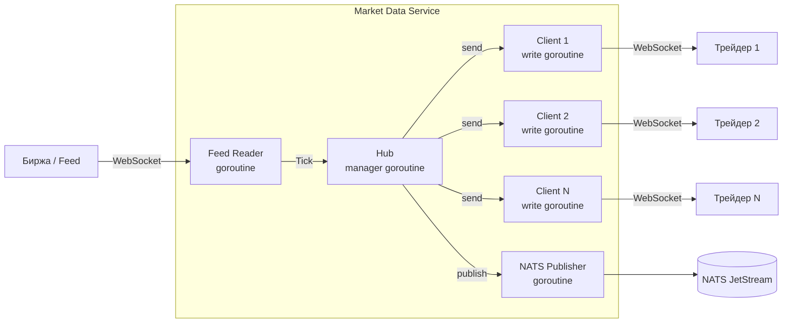

# Market Data Service: WebSocket Fan-Out

---

## Введение

Market Data Service — первый сервис, с которым взаимодействует трейдер. Он получает котировки от биржи (или симулятора), распределяет их по всем подключённым клиентам через WebSocket, и параллельно публикует события в NATS JetStream.

> **Для C# разработчиков**: SignalR автоматически управляет группами подключений и fan-out через `IHubContext<T>`. В Go мы реализуем то же самое явно через горутины и каналы — это ~100 строк кода с полным контролем над поведением под нагрузкой.

---

## Архитектура сервиса



Ключевые решения:
- **Один Hub** — единственный менеджер подключений, избегаем race conditions на map
- **Буферизованные каналы** — отправка клиенту не блокирует Hub
- **Drop при переполнении** — медленный клиент получает меньше тиков, но не тормозит остальных

---

## Hub: менеджер подключений

```go
// internal/hub/hub.go
package hub

import (
    "context"
    "log/slog"
    "sync/atomic"
    "time"
)

// ClientMessage — сообщение для отправки клиенту
type ClientMessage struct {
    Data []byte
}

// Client — подключённый WebSocket клиент
type Client struct {
    id   string
    send chan ClientMessage // буферизованный канал отправки
}

// Hub — центральный менеджер всех подключений
// Единственный читатель своих каналов → нет race conditions
type Hub struct {
    // Каналы для управления клиентами
    register   chan *Client
    unregister chan *Client
    broadcast  chan ClientMessage

    // Текущие клиенты (только Hub читает/пишет этот map)
    clients map[string]*Client

    // Метрики
    connCount atomic.Int64

    logger *slog.Logger
}

// NewHub — создание Hub
func NewHub(logger *slog.Logger) *Hub {
    return &Hub{
        register:   make(chan *Client, 64),
        unregister: make(chan *Client, 64),
        broadcast:  make(chan ClientMessage, 512), // буфер для котировок
        clients:    make(map[string]*Client),
        logger:     logger,
    }
}

// Run — основной цикл Hub. Запускается в отдельной горутине.
// Единственная горутина, которая читает/пишет map clients.
func (h *Hub) Run(ctx context.Context) {
    for {
        select {
        case <-ctx.Done():
            h.logger.Info("hub shutting down", "clients", len(h.clients))
            // Закрываем все клиентские каналы
            for _, client := range h.clients {
                close(client.send)
            }
            return

        case client := <-h.register:
            h.clients[client.id] = client
            h.connCount.Add(1)
            h.logger.Info("client connected",
                "id", client.id,
                "total", h.connCount.Load())

        case client := <-h.unregister:
            if _, ok := h.clients[client.id]; ok {
                delete(h.clients, client.id)
                close(client.send)
                h.connCount.Add(-1)
                h.logger.Info("client disconnected",
                    "id", client.id,
                    "total", h.connCount.Load())
            }

        case msg := <-h.broadcast:
            h.fanOut(msg)
        }
    }
}

// fanOut — раздача сообщения всем клиентам
// Неблокирующая запись: медленный клиент получит drop, но не заблокирует Hub
func (h *Hub) fanOut(msg ClientMessage) {
    dropped := 0
    for _, client := range h.clients {
        select {
        case client.send <- msg:
            // успешно поставлено в очередь
        default:
            // буфер клиента полон — drop этого тика
            dropped++
            h.logger.Warn("client slow, tick dropped", "client_id", client.id)
        }
    }
    if dropped > 0 {
        // В prod: инкрементировать метрику dropped_ticks_total
        _ = dropped
    }
}

// Broadcast — публикация сообщения всем клиентам
// Thread-safe: отправляем в канал, Hub обработает в своём цикле
func (h *Hub) Broadcast(msg ClientMessage) {
    select {
    case h.broadcast <- msg:
    default:
        // Hub перегружен — в prod логируем + метрика
        h.logger.Error("hub broadcast channel full, dropping tick")
    }
}

// Register — регистрация нового клиента
func (h *Hub) Register(client *Client) {
    h.register <- client
}

// Unregister — удаление клиента
func (h *Hub) Unregister(client *Client) {
    h.unregister <- client
}

// ConnCount — текущее число подключений (атомарно, без блокировки)
func (h *Hub) ConnCount() int64 {
    return h.connCount.Load()
}
```

---

## WebSocket Handler

```go
// internal/server/ws_handler.go
package server

import (
    "net/http"
    "time"

    "github.com/google/uuid"
    "github.com/gorilla/websocket"
    "log/slog"

    "trading/market-data/internal/hub"
)

const (
    writeWait      = 10 * time.Second  // таймаут записи в WebSocket
    pongWait       = 60 * time.Second  // ждём pong от клиента
    pingPeriod     = 54 * time.Second  // интервал отправки ping (< pongWait)
    maxMessageSize = 512               // максимальный размер входящего сообщения
    sendBufferSize = 256               // размер буфера канала отправки клиента
)

var upgrader = websocket.Upgrader{
    ReadBufferSize:  1024,
    WriteBufferSize: 4096,
    CheckOrigin: func(r *http.Request) bool {
        // В prod: проверять Origin header
        return true
    },
}

// WSHandler — HTTP handler для WebSocket подключений
type WSHandler struct {
    hub    *hub.Hub
    logger *slog.Logger
}

// ServeHTTP — апгрейд HTTP → WebSocket и запуск горутин клиента
func (h *WSHandler) ServeHTTP(w http.ResponseWriter, r *http.Request) {
    conn, err := upgrader.Upgrade(w, r, nil)
    if err != nil {
        h.logger.Error("websocket upgrade failed", "err", err)
        return
    }

    clientID := uuid.New().String()
    client := &hub.Client{
        ID:   clientID,
        Send: make(chan hub.ClientMessage, sendBufferSize),
    }

    h.hub.Register(client)

    // Каждый клиент = 2 горутины: читающая и пишущая
    // Это стандартный паттерн gorilla/websocket
    go h.writePump(conn, client)
    go h.readPump(conn, client)
}

// writePump — горутина записи: берёт из канала, пишет в WebSocket
// Одна горутина на клиента — gorilla/websocket не thread-safe для writes
func (h *WSHandler) writePump(conn *websocket.Conn, client *hub.Client) {
    ticker := time.NewTicker(pingPeriod)
    defer func() {
        ticker.Stop()
        conn.Close()
    }()

    for {
        select {
        case msg, ok := <-client.Send:
            conn.SetWriteDeadline(time.Now().Add(writeWait))
            if !ok {
                // Hub закрыл канал — клиент отключён
                conn.WriteMessage(websocket.CloseMessage, []byte{})
                return
            }

            w, err := conn.NextWriter(websocket.TextMessage)
            if err != nil {
                return
            }
            w.Write(msg.Data)

            // Батчинг: отправляем все накопившиеся сообщения за один write
            // Это существенно снижает syscall overhead при высоком throughput
            n := len(client.Send)
            for i := 0; i < n; i++ {
                w.Write([]byte{'\n'})
                m := <-client.Send
                w.Write(m.Data)
            }

            if err := w.Close(); err != nil {
                return
            }

        case <-ticker.C:
            // Периодический ping для проверки живости клиента
            conn.SetWriteDeadline(time.Now().Add(writeWait))
            if err := conn.WriteMessage(websocket.PingMessage, nil); err != nil {
                return
            }
        }
    }
}

// readPump — горутина чтения: обрабатывает входящие сообщения и pong
// Также обнаруживает дисконнект через ReadMessage
func (h *WSHandler) readPump(conn *websocket.Conn, client *hub.Client) {
    defer func() {
        h.hub.Unregister(client)
        conn.Close()
    }()

    conn.SetReadLimit(maxMessageSize)
    conn.SetReadDeadline(time.Now().Add(pongWait))
    conn.SetPongHandler(func(string) error {
        // Клиент жив — сдвигаем дедлайн
        conn.SetReadDeadline(time.Now().Add(pongWait))
        return nil
    })

    for {
        _, message, err := conn.ReadMessage()
        if err != nil {
            if websocket.IsUnexpectedCloseError(err,
                websocket.CloseGoingAway,
                websocket.CloseAbnormalClosure) {
                h.logger.Warn("websocket unexpected close",
                    "client_id", client.ID, "err", err)
            }
            return
        }

        // Трейдер может подписаться на конкретные символы
        // Для простоты здесь не реализовано — все получают всё
        _ = message
    }
}
```

---

## Feed Reader: приём котировок

```go
// internal/feed/reader.go
package feed

import (
    "context"
    "encoding/json"
    "fmt"
    "log/slog"
    "math/rand"
    "time"

    "github.com/shopspring/decimal"

    "trading/market-data/internal/domain"
)

// TickHandler — функция-обработчик нового тика
type TickHandler func(tick domain.Tick)

// SimulatedReader — симулятор рыночных данных (для разработки)
// В production заменяется на реальный WebSocket к бирже
type SimulatedReader struct {
    symbols  []domain.Symbol
    handlers []TickHandler
    logger   *slog.Logger
}

// NewSimulatedReader — создание симулятора
func NewSimulatedReader(symbols []domain.Symbol, logger *slog.Logger) *SimulatedReader {
    return &SimulatedReader{
        symbols: symbols,
        logger:  logger,
    }
}

// OnTick — регистрация обработчика тиков
func (r *SimulatedReader) OnTick(handler TickHandler) {
    r.handlers = append(r.handlers, handler)
}

// Run — запуск симулятора котировок
func (r *SimulatedReader) Run(ctx context.Context) error {
    // Начальные цены
    prices := map[domain.Symbol]float64{
        domain.SymbolBTCUSD: 65000.0,
        domain.SymbolETHUSD: 3500.0,
    }

    ticker := time.NewTicker(100 * time.Millisecond) // 10 тиков/сек на символ
    defer ticker.Stop()

    r.logger.Info("simulated feed started", "symbols", r.symbols)

    for {
        select {
        case <-ctx.Done():
            r.logger.Info("feed reader stopped")
            return nil
        case <-ticker.C:
            for _, symbol := range r.symbols {
                tick := r.generateTick(symbol, prices)
                prices[symbol], _ = tick.Price.Float64()
                r.dispatch(tick)
            }
        }
    }
}

// generateTick — генерация реалистичного тика (random walk)
func (r *SimulatedReader) generateTick(symbol domain.Symbol, prices map[domain.Symbol]float64) domain.Tick {
    current := prices[symbol]

    // Случайное движение ±0.1%
    change := current * (rand.Float64()*0.002 - 0.001)
    newPrice := current + change
    if newPrice <= 0 {
        newPrice = current
    }

    volume := rand.Float64() * 10 // 0-10 единиц

    return domain.Tick{
        Symbol:    symbol,
        Price:     decimal.NewFromFloat(newPrice).Round(2),
        Volume:    decimal.NewFromFloat(volume).Round(4),
        Timestamp: time.Now().UTC(),
    }
}

// dispatch — вызов всех обработчиков
func (r *SimulatedReader) dispatch(tick domain.Tick) {
    for _, h := range r.handlers {
        h(tick)
    }
}

// ExchangeReader — читатель реального WebSocket фида биржи
type ExchangeReader struct {
    url      string
    handlers []TickHandler
    logger   *slog.Logger
}

// NewExchangeReader — подключение к реальной бирже
func NewExchangeReader(url string, logger *slog.Logger) *ExchangeReader {
    return &ExchangeReader{url: url, logger: logger}
}

// OnTick — регистрация обработчика
func (r *ExchangeReader) OnTick(handler TickHandler) {
    r.handlers = append(r.handlers, handler)
}

// Run — подключение и чтение с переподключением при ошибках
func (r *ExchangeReader) Run(ctx context.Context) error {
    for {
        if err := r.connect(ctx); err != nil {
            if ctx.Err() != nil {
                return nil // контекст отменён — нормальное завершение
            }
            r.logger.Error("feed connection error, reconnecting",
                "err", err, "url", r.url)
            select {
            case <-ctx.Done():
                return nil
            case <-time.After(5 * time.Second):
                // retry
            }
        }
    }
}

// connect — одна попытка подключения и чтения
func (r *ExchangeReader) connect(ctx context.Context) error {
    // В реальности здесь gorilla/websocket.Dial + чтение JSON
    // Формат зависит от конкретной биржи (Binance, Kraken, etc.)
    return fmt.Errorf("not implemented: connect to %s", r.url)
}
```

---

## Publisher: отправка в NATS

```go
// internal/publisher/nats_publisher.go
package publisher

import (
    "context"
    "encoding/json"
    "fmt"
    "log/slog"
    "time"

    "github.com/nats-io/nats.go/jetstream"
    "github.com/shopspring/decimal"

    "trading/market-data/internal/domain"
)

// TickMessage — формат сообщения в NATS
type TickMessage struct {
    Symbol    string          `json:"symbol"`
    Price     decimal.Decimal `json:"price"`
    Volume    decimal.Decimal `json:"volume"`
    Timestamp time.Time       `json:"ts"`
}

// NATSPublisher — публикация тиков в NATS JetStream
type NATSPublisher struct {
    js     jetstream.JetStream
    logger *slog.Logger
}

// NewNATSPublisher — создание публикатора
func NewNATSPublisher(js jetstream.JetStream, logger *slog.Logger) *NATSPublisher {
    return &NATSPublisher{js: js, logger: logger}
}

// Publish — публикация тика в NATS
// Subject: market.tick.{SYMBOL}
func (p *NATSPublisher) Publish(ctx context.Context, tick domain.Tick) error {
    msg := TickMessage{
        Symbol:    string(tick.Symbol),
        Price:     tick.Price,
        Volume:    tick.Volume,
        Timestamp: tick.Timestamp,
    }

    data, err := json.Marshal(msg)
    if err != nil {
        return fmt.Errorf("marshal tick: %w", err)
    }

    subject := fmt.Sprintf("market.tick.%s", tick.Symbol)
    _, err = p.js.Publish(ctx, subject, data)
    if err != nil {
        return fmt.Errorf("nats publish %s: %w", subject, err)
    }

    return nil
}
```

---

## Сборка сервиса: main.go

```go
// cmd/server/main.go
package main

import (
    "context"
    "fmt"
    "log/slog"
    "net/http"
    "os"
    "os/signal"
    "syscall"
    "time"

    "github.com/nats-io/nats.go"
    "github.com/nats-io/nats.go/jetstream"

    "trading/market-data/internal/domain"
    "trading/market-data/internal/feed"
    "trading/market-data/internal/hub"
    "trading/market-data/internal/publisher"
    "trading/market-data/internal/server"
)

func main() {
    logger := slog.New(slog.NewJSONHandler(os.Stdout, nil))

    // Graceful shutdown
    ctx, stop := signal.NotifyContext(context.Background(),
        syscall.SIGTERM, syscall.SIGINT)
    defer stop()

    // NATS подключение
    nc, err := nats.Connect(envOrDefault("NATS_URL", "nats://localhost:4222"))
    if err != nil {
        logger.Error("nats connect", "err", err)
        os.Exit(1)
    }
    defer nc.Drain()

    js, err := jetstream.New(nc)
    if err != nil {
        logger.Error("jetstream init", "err", err)
        os.Exit(1)
    }

    // Создание NATS stream
    _, err = js.CreateOrUpdateStream(ctx, jetstream.StreamConfig{
        Name:     "MARKET",
        Subjects: []string{"market.tick.*"},
        MaxAge:   24 * time.Hour,
        Storage:  jetstream.FileStorage,
    })
    if err != nil {
        logger.Error("create stream", "err", err)
        os.Exit(1)
    }

    // Создание компонентов
    h := hub.NewHub(logger)
    natsPublisher := publisher.NewNATSPublisher(js, logger)

    symbols := []domain.Symbol{domain.SymbolBTCUSD, domain.SymbolETHUSD}
    feedReader := feed.NewSimulatedReader(symbols, logger)

    // Обработчик тиков: фанаут в Hub + NATS
    feedReader.OnTick(func(tick domain.Tick) {
        // Сериализация один раз — для всех клиентов
        data, _ := marshalTick(tick)
        h.Broadcast(hub.ClientMessage{Data: data})

        // Публикация в NATS (неблокирующий вызов с таймаутом)
        pubCtx, cancel := context.WithTimeout(ctx, 100*time.Millisecond)
        defer cancel()
        if err := natsPublisher.Publish(pubCtx, tick); err != nil {
            logger.Warn("nats publish failed", "err", err)
        }
    })

    // HTTP сервер
    mux := http.NewServeMux()
    wsHandler := server.NewWSHandler(h, logger)
    mux.Handle("/ws", wsHandler)
    mux.HandleFunc("/health", func(w http.ResponseWriter, r *http.Request) {
        fmt.Fprintf(w, `{"status":"ok","connections":%d}`, h.ConnCount())
    })

    httpServer := &http.Server{
        Addr:         envOrDefault("HTTP_ADDR", ":8080"),
        Handler:      mux,
        ReadTimeout:  10 * time.Second,
        WriteTimeout: 10 * time.Second,
        IdleTimeout:  120 * time.Second,
    }

    // Запуск всех компонентов
    go h.Run(ctx)
    go feedReader.Run(ctx)

    go func() {
        logger.Info("HTTP server starting", "addr", httpServer.Addr)
        if err := httpServer.ListenAndServe(); err != http.ErrServerClosed {
            logger.Error("http server error", "err", err)
        }
    }()

    // Ожидание завершения
    <-ctx.Done()
    logger.Info("shutting down market data service")

    shutdownCtx, cancel := context.WithTimeout(context.Background(), 15*time.Second)
    defer cancel()
    httpServer.Shutdown(shutdownCtx)
}

func marshalTick(tick domain.Tick) ([]byte, error) {
    // В prod: использовать пул байтовых буферов через sync.Pool
    // для снижения аллокаций при высоком throughput
    type tickJSON struct {
        Symbol string `json:"s"`
        Price  string `json:"p"` // строка для точности
        Volume string `json:"v"`
        Time   int64  `json:"t"` // unix milliseconds
    }
    t := tickJSON{
        Symbol: string(tick.Symbol),
        Price:  tick.Price.String(),
        Volume: tick.Volume.String(),
        Time:   tick.Timestamp.UnixMilli(),
    }
    return json.Marshal(t)
}

func envOrDefault(key, def string) string {
    if v := os.Getenv(key); v != "" {
        return v
    }
    return def
}
```

---

## Тестирование

### Тест Hub: fan-out и drop медленных клиентов

```go
// internal/hub/hub_test.go
package hub_test

import (
    "context"
    "log/slog"
    "os"
    "sync"
    "testing"
    "time"

    "trading/market-data/internal/hub"
)

func TestHub_FanOut(t *testing.T) {
    logger := slog.New(slog.NewTextHandler(os.Stderr, nil))
    h := hub.NewHub(logger)

    ctx, cancel := context.WithCancel(context.Background())
    defer cancel()

    go h.Run(ctx)

    // Подключаем 3 клиентов
    const numClients = 3
    clients := make([]*hub.Client, numClients)
    for i := range clients {
        clients[i] = &hub.Client{
            ID:   fmt.Sprintf("client-%d", i),
            Send: make(chan hub.ClientMessage, 10),
        }
        h.Register(clients[i])
    }
    time.Sleep(10 * time.Millisecond) // даём Hub зарегистрировать

    // Broadcast 5 сообщений
    const numMsgs = 5
    for i := 0; i < numMsgs; i++ {
        h.Broadcast(hub.ClientMessage{Data: []byte(`{"price":"100"}`)})
    }
    time.Sleep(10 * time.Millisecond)

    // Каждый клиент должен получить все сообщения
    for i, client := range clients {
        if got := len(client.Send); got != numMsgs {
            t.Errorf("client %d: got %d messages, want %d", i, got, numMsgs)
        }
    }
}

func TestHub_SlowClientDrop(t *testing.T) {
    logger := slog.New(slog.NewTextHandler(os.Stderr, nil))
    h := hub.NewHub(logger)

    ctx, cancel := context.WithCancel(context.Background())
    defer cancel()

    go h.Run(ctx)

    // Медленный клиент с буфером = 1
    slowClient := &hub.Client{
        ID:   "slow",
        Send: make(chan hub.ClientMessage, 1),
    }
    h.Register(slowClient)
    time.Sleep(10 * time.Millisecond)

    // Отправляем больше сообщений, чем буфер
    for i := 0; i < 10; i++ {
        h.Broadcast(hub.ClientMessage{Data: []byte(`{}`)})
    }
    time.Sleep(10 * time.Millisecond)

    // Клиент получил не более 1 сообщения (буфер = 1)
    if got := len(slowClient.Send); got > 1 {
        t.Errorf("slow client: got %d messages, expected at most 1 (drops should occur)", got)
    }
}
```

### Бенчмарк: throughput Hub

```go
// internal/hub/hub_bench_test.go
package hub_test

import (
    "context"
    "log/slog"
    "os"
    "testing"

    "trading/market-data/internal/hub"
)

// BenchmarkHub_Broadcast — измеряем throughput при 1000 клиентах
// go test -bench=BenchmarkHub_Broadcast -benchmem
func BenchmarkHub_Broadcast(b *testing.B) {
    logger := slog.New(slog.NewTextHandler(os.Stderr, &slog.HandlerOptions{Level: slog.LevelError}))
    h := hub.NewHub(logger)

    ctx, cancel := context.WithCancel(context.Background())
    defer cancel()
    go h.Run(ctx)

    // 1000 клиентов
    const numClients = 1000
    for i := 0; i < numClients; i++ {
        client := &hub.Client{
            ID:   fmt.Sprintf("c%d", i),
            Send: make(chan hub.ClientMessage, 512),
        }
        h.Register(client)
        // Дренируем каналы чтобы не переполнились
        go func() {
            for range client.Send {
            }
        }()
    }

    msg := hub.ClientMessage{Data: []byte(`{"s":"BTCUSD","p":"65000","v":"0.5","t":1234567890}`)}

    b.ResetTimer()
    b.ReportAllocs()

    for i := 0; i < b.N; i++ {
        h.Broadcast(msg)
    }
}

// Ожидаемый результат на современном железе:
// BenchmarkHub_Broadcast-8   500000   2100 ns/op   0 B/op   0 allocs/op
// 2.1µs на fan-out к 1000 клиентам = ~476K broadcasts/sec
```

---

## Мониторинг

```go
// internal/metrics/metrics.go
package metrics

import (
    "github.com/prometheus/client_golang/prometheus"
    "github.com/prometheus/client_golang/prometheus/promauto"
)

var (
    WebSocketConnections = promauto.NewGauge(prometheus.GaugeOpts{
        Name: "market_data_ws_connections_total",
        Help: "Current number of WebSocket connections",
    })

    TicksPublished = promauto.NewCounterVec(prometheus.CounterOpts{
        Name: "market_data_ticks_published_total",
        Help: "Total ticks published to clients",
    }, []string{"symbol"})

    TicksDropped = promauto.NewCounterVec(prometheus.CounterOpts{
        Name: "market_data_ticks_dropped_total",
        Help: "Ticks dropped due to slow clients",
    }, []string{"reason"})

    BroadcastLatency = promauto.NewHistogram(prometheus.HistogramOpts{
        Name:    "market_data_broadcast_duration_seconds",
        Help:    "Time to broadcast one tick to all clients",
        Buckets: []float64{0.0001, 0.0005, 0.001, 0.005, 0.01}, // 100µs - 10ms
    })
)
```

---

## Ключевые решения и их обоснование

| Решение | Альтернатива | Обоснование |
|---------|--------------|-------------|
| Один Hub goroutine | sync.RWMutex на map | Нет lock contention, детерминированный порядок |
| Буферизованные каналы клиентов | Sync send | Медленный клиент не тормозит Hub |
| Drop при переполнении | Блокировка отправителя | Trading: устаревшая котировка хуже пропущенной |
| Батчинг WebSocket writes | Один write на тик | Снижает syscall count при высоком throughput |
| JSON с int64 timestamp | time.Time в JSON | Уменьшает размер сообщений, быстрее парсинг |

---

## Следующий шаг

Переходим к самой сложной части системы: [Order Matching Engine](03_order_matching_engine.md) — lock-free order book с price-time priority матчингом.
