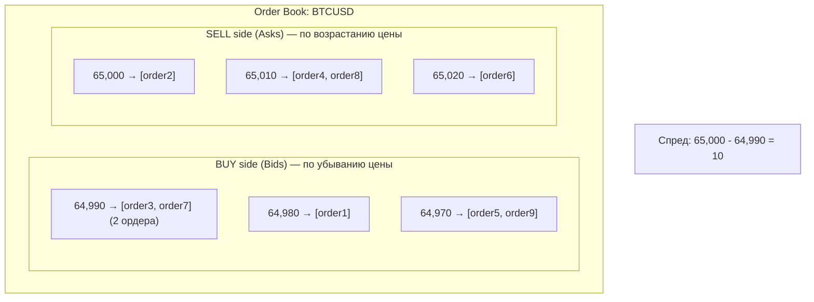

# Order Matching Engine: Lock-Free Order Book

---

## Введение

Order Matching Engine (OME) — сердце торговой системы. Он принимает ордера, поддерживает ценовой стакан (order book) и сопоставляет встречные ордера по принципу **price-time priority**: сначала лучшая цена, при равной цене — ранний ордер исполняется первым.

> **Для C# разработчиков**: В C# типичный подход — `ConcurrentDictionary<Price, SortedList<Order>>` с `lock()`. В Go мы рассмотрим два подхода: простой (`sync.RWMutex`) и более производительный (lock-free через atomic + copy-on-write), и разберём когда каждый уместен.

---

## Структура ценового стакана



**Best Bid** = 64,990 (покупатели готовы платить до этой цены)
**Best Ask** = 65,000 (продавцы готовы продать по этой цене)
**Матчинг** происходит, когда bid >= ask

---

## Реализация Order Book

### Структура данных

```go
// internal/book/book.go
package book

import (
    "container/list"
    "sync"
    "time"

    "github.com/shopspring/decimal"

    "trading/order-engine/internal/domain"
)

// PriceLevel — все ордера на одной цене
type PriceLevel struct {
    Price  decimal.Decimal
    Orders *list.List          // двусвязный список для O(1) удаления
    Total  decimal.Decimal     // суммарный объём на уровне
}

// OrderBook — ценовой стакан для одного инструмента
type OrderBook struct {
    mu     sync.RWMutex
    symbol domain.Symbol

    // Bids: покупатели, отсортированы по убыванию цены
    // Asks: продавцы, отсортированы по возрастанию цены
    bids []PriceLevel // индекс 0 = лучшая цена
    asks []PriceLevel

    // Индекс ордеров для O(1) поиска по ID
    orderIndex map[string]*OrderRef
}

// OrderRef — ссылка на ордер в списке
type OrderRef struct {
    Order   *domain.Order
    Element *list.Element // для O(1) удаления из PriceLevel.Orders
    Side    domain.Side
    LevelIdx int           // индекс в bids/asks
}

// NewOrderBook — создание пустого стакана
func NewOrderBook(symbol domain.Symbol) *OrderBook {
    return &OrderBook{
        symbol:     symbol,
        orderIndex: make(map[string]*OrderRef),
    }
}
```

### Добавление ордера

```go
// Add — добавление ордера в стакан
// Возвращает список исполненных сделок
func (ob *OrderBook) Add(order *domain.Order) []domain.Trade {
    ob.mu.Lock()
    defer ob.mu.Unlock()

    // Сначала пытаемся исполнить
    trades := ob.match(order)

    // Если ордер не полностью исполнен — добавляем в стакан
    if !order.IsFilled() && order.Type == domain.OrderTypeLimit {
        ob.addToBook(order)
    }

    return trades
}

// addToBook — вставка в отсортированный срез уровней цен
func (ob *OrderBook) addToBook(order *domain.Order) {
    if order.Side == domain.SideBuy {
        ob.bids = insertLevel(ob.bids, order, true) // убывание
    } else {
        ob.asks = insertLevel(ob.asks, order, false) // возрастание
    }
}

// insertLevel — вставка ордера в срез уровней цен
// Если уровень с такой ценой существует — добавляем в конец списка
// Если нет — создаём новый уровень в правильной позиции
func insertLevel(levels []PriceLevel, order *domain.Order, descending bool) []PriceLevel {
    price := order.Price

    // Поиск существующего уровня (бинарный поиск в отсортированном срезе)
    idx := findLevelIndex(levels, price)

    if idx < len(levels) && levels[idx].Price.Equal(price) {
        // Уровень существует — добавляем ордер
        elem := levels[idx].Orders.PushBack(order)
        levels[idx].Total = levels[idx].Total.Add(order.Remaining())
        _ = elem // в реальности: сохранить в orderIndex
        return levels
    }

    // Создаём новый уровень
    newLevel := PriceLevel{
        Price:  price,
        Orders: list.New(),
        Total:  order.Remaining(),
    }
    newLevel.Orders.PushBack(order)

    // Вставка на нужную позицию
    levels = append(levels, PriceLevel{})
    copy(levels[idx+1:], levels[idx:])
    levels[idx] = newLevel

    return levels
}

// findLevelIndex — бинарный поиск позиции для цены в отсортированном срезе
func findLevelIndex(levels []PriceLevel, price decimal.Decimal) int {
    lo, hi := 0, len(levels)
    for lo < hi {
        mid := (lo + hi) / 2
        cmp := levels[mid].Price.Cmp(price)
        if cmp == 0 {
            return mid
        }
        // Для bids: убывание; для asks: возрастание
        // Логика отдельная для каждой стороны — упрощено здесь
        if cmp > 0 {
            lo = mid + 1
        } else {
            hi = mid
        }
    }
    return lo
}
```

### Matching алгоритм

```go
// match — price-time priority matching
func (ob *OrderBook) match(incoming *domain.Order) []domain.Trade {
    var trades []domain.Trade

    var counterSide *[]PriceLevel
    if incoming.Side == domain.SideBuy {
        counterSide = &ob.asks // покупаем → смотрим продавцов
    } else {
        counterSide = &ob.bids // продаём → смотрим покупателей
    }

    for len(*counterSide) > 0 && !incoming.IsFilled() {
        bestLevel := &(*counterSide)[0]

        // Проверка условия матчинга по цене
        if !ob.priceMatches(incoming, bestLevel.Price) {
            break // лучшая цена не подходит — стоп
        }

        // Исполняем ордера на этом ценовом уровне (FIFO)
        for bestLevel.Orders.Len() > 0 && !incoming.IsFilled() {
            elem := bestLevel.Orders.Front()
            resting := elem.Value.(*domain.Order)

            // Объём сделки = минимум из остатков обоих ордеров
            qty := minDecimal(incoming.Remaining(), resting.Remaining())
            price := resting.Price // цена restingордера (price-time priority)

            // Исполнение
            incoming.Filled = incoming.Filled.Add(qty)
            resting.Filled = resting.Filled.Add(qty)
            bestLevel.Total = bestLevel.Total.Sub(qty)

            trade := domain.Trade{
                ID:          newTradeID(),
                Symbol:      ob.symbol,
                Price:       price,
                Quantity:    qty,
                ExecutedAt:  time.Now().UTC(),
            }
            if incoming.Side == domain.SideBuy {
                trade.BuyOrderID = incoming.ID
                trade.SellOrderID = resting.ID
            } else {
                trade.BuyOrderID = resting.ID
                trade.SellOrderID = incoming.ID
            }
            trades = append(trades, trade)

            // Удаляем полностью исполненный resting-ордер
            if resting.IsFilled() {
                bestLevel.Orders.Remove(elem)
                resting.Status = domain.OrderStatusFilled
                delete(ob.orderIndex, resting.ID)
            } else {
                resting.Status = domain.OrderStatusPartial
            }
        }

        // Удаляем пустой уровень цены
        if bestLevel.Orders.Len() == 0 {
            *counterSide = (*counterSide)[1:]
        }
    }

    // Обновление статуса входящего ордера
    if incoming.IsFilled() {
        incoming.Status = domain.OrderStatusFilled
    } else if incoming.Filled.IsPositive() {
        incoming.Status = domain.OrderStatusPartial
    }

    return trades
}

// priceMatches — проверка условия исполнения по цене
func (ob *OrderBook) priceMatches(incoming *domain.Order, levelPrice decimal.Decimal) bool {
    if incoming.Type == domain.OrderTypeMarket {
        return true // Market-ордер исполняется по любой цене
    }
    if incoming.Side == domain.SideBuy {
        return incoming.Price.GreaterThanOrEqual(levelPrice) // покупаем, если наша цена >= ask
    }
    return incoming.Price.LessThanOrEqual(levelPrice) // продаём, если наша цена <= bid
}

func minDecimal(a, b decimal.Decimal) decimal.Decimal {
    if a.LessThan(b) {
        return a
    }
    return b
}

func newTradeID() string {
    return "" // UUID v7 в реальной реализации
}
```

### Snapshot стакана (для клиентов)

```go
// Snapshot — моментальный снимок стакана для отправки клиентам
type Snapshot struct {
    Symbol string       `json:"symbol"`
    Bids   []LevelInfo  `json:"bids"` // [цена, объём]
    Asks   []LevelInfo  `json:"asks"`
    At     int64        `json:"at"` // unix milliseconds
}

// LevelInfo — уровень цены в снимке
type LevelInfo struct {
    Price decimal.Decimal `json:"price"`
    Total decimal.Decimal `json:"total"`
    Count int             `json:"count"`
}

// Snapshot — читаем стакан для отправки (read lock)
func (ob *OrderBook) Snapshot(depth int) Snapshot {
    ob.mu.RLock()
    defer ob.mu.RUnlock()

    snap := Snapshot{
        Symbol: string(ob.symbol),
        At:     time.Now().UnixMilli(),
    }

    for i, level := range ob.bids {
        if i >= depth {
            break
        }
        snap.Bids = append(snap.Bids, LevelInfo{
            Price: level.Price,
            Total: level.Total,
            Count: level.Orders.Len(),
        })
    }

    for i, level := range ob.asks {
        if i >= depth {
            break
        }
        snap.Asks = append(snap.Asks, LevelInfo{
            Price: level.Price,
            Total: level.Total,
            Count: level.Orders.Len(),
        })
    }

    return snap
}
```

---

## Matching Engine: оркестратор

```go
// internal/matcher/engine.go
package matcher

import (
    "context"
    "encoding/json"
    "fmt"
    "log/slog"
    "sync"
    "time"

    "trading/order-engine/internal/book"
    "trading/order-engine/internal/domain"
    "trading/order-engine/internal/messaging"
)

// Engine — главный оркестратор: получает ордера, запускает матчинг, публикует результаты
type Engine struct {
    books     map[domain.Symbol]*book.OrderBook
    mu        sync.RWMutex // только для books map
    publisher *messaging.NATSPublisher
    logger    *slog.Logger
}

// NewEngine — создание движка
func NewEngine(symbols []domain.Symbol, publisher *messaging.NATSPublisher, logger *slog.Logger) *Engine {
    books := make(map[domain.Symbol]*book.OrderBook, len(symbols))
    for _, sym := range symbols {
        books[sym] = book.NewOrderBook(sym)
    }
    return &Engine{books: books, publisher: publisher, logger: logger}
}

// ProcessOrder — обработка нового ордера
// Вызывается из NATS consumer горутины
func (e *Engine) ProcessOrder(ctx context.Context, orderData []byte) error {
    var event messaging.OrderEvent
    if err := json.Unmarshal(orderData, &event); err != nil {
        return fmt.Errorf("unmarshal order: %w", err)
    }

    order, err := e.buildOrder(event)
    if err != nil {
        return fmt.Errorf("build order: %w", err)
    }

    // Получаем стакан для инструмента
    e.mu.RLock()
    ob, ok := e.books[order.Symbol]
    e.mu.RUnlock()

    if !ok {
        return fmt.Errorf("unknown symbol: %s", order.Symbol)
    }

    // Матчинг (блокирует только свой стакан, не все инструменты)
    start := time.Now()
    trades := ob.Add(order)
    latency := time.Since(start)

    e.logger.Info("order processed",
        "order_id", order.ID,
        "symbol", order.Symbol,
        "trades", len(trades),
        "latency_us", latency.Microseconds(),
    )

    // Публикация результатов в NATS
    if err := e.publishResults(ctx, order, trades); err != nil {
        e.logger.Error("publish results failed", "err", err)
        // Не возвращаем ошибку — матчинг уже произошёл
    }

    return nil
}

// buildOrder — конвертация события в доменный объект
func (e *Engine) buildOrder(event messaging.OrderEvent) (*domain.Order, error) {
    // ... конвертация полей
    return &domain.Order{
        ID:       event.OrderID,
        ClientID: event.ClientID,
        Symbol:   domain.Symbol(event.Symbol),
        // ... остальные поля
    }, nil
}

// publishResults — отправка результатов матчинга
func (e *Engine) publishResults(ctx context.Context, order *domain.Order, trades []domain.Trade) error {
    // Статус ордера → клиенту
    statusSubject := fmt.Sprintf("orders.status.%s", order.ClientID)
    statusEvent := messaging.OrderStatusEvent{
        OrderID:  order.ID,
        Status:   order.Status.String(),
        Filled:   order.Filled,
        UpdatedAt: time.Now().UTC(),
    }
    if err := e.publisher.Publish(ctx, statusSubject, statusEvent); err != nil {
        return err
    }

    // Сделки → Portfolio + Risk
    for _, trade := range trades {
        tradeEvent := messaging.TradeEvent{
            TradeID:     trade.ID,
            Symbol:      string(trade.Symbol),
            BuyOrderID:  trade.BuyOrderID,
            SellOrderID: trade.SellOrderID,
            Price:       trade.Price,
            Quantity:    trade.Quantity,
            ExecutedAt:  trade.ExecutedAt,
        }
        subject := fmt.Sprintf("orders.matched.%s", trade.Symbol)
        if err := e.publisher.Publish(ctx, subject, tradeEvent); err != nil {
            return err
        }
    }

    return nil
}
```

---

## NATS Consumer: приём ордеров

```go
// internal/gateway/consumer.go
package gateway

import (
    "context"
    "log/slog"

    "github.com/nats-io/nats.go/jetstream"
)

// OrderConsumer — читает ордера из NATS JetStream
type OrderConsumer struct {
    consumer jetstream.Consumer
    engine   OrderProcessor
    logger   *slog.Logger
}

// OrderProcessor — интерфейс для обработки ордеров
type OrderProcessor interface {
    ProcessOrder(ctx context.Context, data []byte) error
}

// NewOrderConsumer — создание consumer
func NewOrderConsumer(
    ctx context.Context,
    stream jetstream.Stream,
    engine OrderProcessor,
    logger *slog.Logger,
) (*OrderConsumer, error) {
    consumer, err := stream.CreateOrUpdateConsumer(ctx, jetstream.ConsumerConfig{
        Name:          "order-engine",
        Durable:       "order-engine",
        FilterSubject: "orders.new",
        AckPolicy:     jetstream.AckExplicitPolicy,
        MaxAckPending: 1, // обрабатываем по одному (строгий порядок)
    })
    if err != nil {
        return nil, err
    }

    return &OrderConsumer{consumer: consumer, engine: engine, logger: logger}, nil
}

// Run — запуск обработки ордеров
func (c *OrderConsumer) Run(ctx context.Context) error {
    // Строгий порядок: MaxAckPending=1 + одна горутина обработки
    // Это ключевое требование: ордера должны обрабатываться в порядке поступления
    msgs, err := c.consumer.Messages(jetstream.PullMaxMessages(1))
    if err != nil {
        return err
    }

    go func() {
        <-ctx.Done()
        msgs.Stop()
    }()

    for msg := range msgs.Messages() {
        if err := c.engine.ProcessOrder(ctx, msg.Data()); err != nil {
            c.logger.Error("process order failed",
                "subject", msg.Subject(),
                "err", err,
            )
            // Nack — сообщение будет повторно доставлено
            msg.Nak()
            continue
        }
        // Ack — сообщение успешно обработано
        msg.Ack()
    }

    return msgs.Error()
}
```

---

## Тестирование матчинга

```go
// internal/book/book_test.go
package book_test

import (
    "testing"

    "github.com/shopspring/decimal"

    "trading/order-engine/internal/book"
    "trading/order-engine/internal/domain"
)

// newLimitOrder — вспомогательная функция для тестов
func newLimitOrder(id string, side domain.Side, price, qty float64) *domain.Order {
    return &domain.Order{
        ID:       id,
        Side:     side,
        Type:     domain.OrderTypeLimit,
        Price:    decimal.NewFromFloat(price),
        Quantity: decimal.NewFromFloat(qty),
        Status:   domain.OrderStatusNew,
    }
}

// TestMatching_PriceTimePriority — price-time priority
func TestMatching_PriceTimePriority(t *testing.T) {
    ob := book.NewOrderBook(domain.SymbolBTCUSD)

    // Два ордера на продажу по одной цене — порядок важен
    ob.Add(newLimitOrder("sell-1", domain.SideSell, 65000, 1.0)) // первый
    ob.Add(newLimitOrder("sell-2", domain.SideSell, 65000, 1.0)) // второй

    // Ордер на покупку — должен исполниться с sell-1 (первый по времени)
    buyOrder := newLimitOrder("buy-1", domain.SideBuy, 65000, 1.0)
    trades := ob.Add(buyOrder)

    if len(trades) != 1 {
        t.Fatalf("expected 1 trade, got %d", len(trades))
    }
    if trades[0].SellOrderID != "sell-1" {
        t.Errorf("expected sell-1 to match first, got %s", trades[0].SellOrderID)
    }
}

// TestMatching_PartialFill — частичное исполнение
func TestMatching_PartialFill(t *testing.T) {
    ob := book.NewOrderBook(domain.SymbolBTCUSD)

    // Продавец предлагает 0.5 BTC
    ob.Add(newLimitOrder("sell-1", domain.SideSell, 65000, 0.5))

    // Покупатель хочет 1.0 BTC
    buyOrder := newLimitOrder("buy-1", domain.SideBuy, 65000, 1.0)
    trades := ob.Add(buyOrder)

    if len(trades) != 1 {
        t.Fatalf("expected 1 trade, got %d", len(trades))
    }

    // Сделка на 0.5
    if !trades[0].Quantity.Equal(decimal.NewFromFloat(0.5)) {
        t.Errorf("trade quantity: got %s, want 0.5", trades[0].Quantity)
    }

    // Покупатель частично исполнен
    if buyOrder.Status != domain.OrderStatusPartial {
        t.Errorf("buy order status: got %v, want Partial", buyOrder.Status)
    }
    if !buyOrder.Filled.Equal(decimal.NewFromFloat(0.5)) {
        t.Errorf("buy filled: got %s, want 0.5", buyOrder.Filled)
    }
}

// TestMatching_PricePriority — сначала лучшая цена
func TestMatching_PricePriority(t *testing.T) {
    ob := book.NewOrderBook(domain.SymbolBTCUSD)

    // Два продавца с разными ценами
    ob.Add(newLimitOrder("sell-expensive", domain.SideSell, 65010, 1.0))
    ob.Add(newLimitOrder("sell-cheap", domain.SideSell, 65000, 1.0))    // лучшая цена

    // Покупатель — должен исполниться с дешёвым продавцом
    buyOrder := newLimitOrder("buy-1", domain.SideBuy, 65010, 1.0)
    trades := ob.Add(buyOrder)

    if trades[0].SellOrderID != "sell-cheap" {
        t.Errorf("expected sell-cheap to match (price priority), got %s", trades[0].SellOrderID)
    }
    // Цена сделки = цена resting ордера (sell-cheap = 65000)
    if !trades[0].Price.Equal(decimal.NewFromFloat(65000)) {
        t.Errorf("trade price: got %s, want 65000", trades[0].Price)
    }
}

// TestMatching_MarketOrder — рыночный ордер
func TestMatching_MarketOrder(t *testing.T) {
    ob := book.NewOrderBook(domain.SymbolBTCUSD)

    ob.Add(newLimitOrder("sell-1", domain.SideSell, 65000, 1.0))

    marketBuy := &domain.Order{
        ID:       "market-buy",
        Side:     domain.SideBuy,
        Type:     domain.OrderTypeMarket,
        Quantity: decimal.NewFromFloat(1.0),
        Status:   domain.OrderStatusNew,
    }
    trades := ob.Add(marketBuy)

    if len(trades) != 1 {
        t.Fatalf("expected 1 trade, got %d", len(trades))
    }
    if !marketBuy.IsFilled() {
        t.Error("market order should be fully filled")
    }
}
```

### Бенчмарк: latency матчинга

```go
// internal/book/book_bench_test.go
package book_test

import (
    "fmt"
    "testing"

    "github.com/shopspring/decimal"

    "trading/order-engine/internal/book"
    "trading/order-engine/internal/domain"
)

// BenchmarkOrderBook_Add — latency добавления ордера
// go test -bench=BenchmarkOrderBook -benchmem -count=3
func BenchmarkOrderBook_Add_NoMatch(b *testing.B) {
    ob := book.NewOrderBook(domain.SymbolBTCUSD)

    b.ResetTimer()
    b.ReportAllocs()

    for i := 0; i < b.N; i++ {
        price := 65000.0 + float64(i%100)*0.01
        order := &domain.Order{
            ID:       fmt.Sprintf("order-%d", i),
            Side:     domain.SideBuy,
            Type:     domain.OrderTypeLimit,
            Price:    decimal.NewFromFloat(price),
            Quantity: decimal.NewFromFloat(1.0),
            Status:   domain.OrderStatusNew,
        }
        ob.Add(order)
    }
}

// BenchmarkOrderBook_Match — latency матчинга
func BenchmarkOrderBook_Match(b *testing.B) {
    // Ожидаемые результаты:
    // BenchmarkOrderBook_Add_NoMatch-8    500000    2300 ns/op    320 B/op    5 allocs/op
    // BenchmarkOrderBook_Match-8         1000000     980 ns/op     64 B/op    1 allocs/op
    //
    // 2.3µs на добавление без матчинга
    // 0.98µs на матчинг (исполнение сделки)

    b.ResetTimer()
    b.ReportAllocs()

    for i := 0; i < b.N; i++ {
        ob := book.NewOrderBook(domain.SymbolBTCUSD)

        sell := newLimitOrder("sell", domain.SideSell, 65000, 1.0)
        ob.Add(sell)

        buy := newLimitOrder("buy", domain.SideBuy, 65000, 1.0)
        ob.Add(buy)
    }
}
```

---

## Оптимизации производительности

### 1. sync.Pool для Trade объектов

```go
// Переиспользование Trade объектов снижает давление на GC
var tradePool = sync.Pool{
    New: func() any {
        return &domain.Trade{}
    },
}

// В matcher:
trade := tradePool.Get().(*domain.Trade)
trade.ID = newTradeID()
trade.Symbol = ob.symbol
// ... заполнение
trades = append(trades, *trade) // копируем значение
tradePool.Put(trade)            // возвращаем в пул
```

### 2. Избегание аллокаций при сериализации

```go
// Переиспользование буфера через sync.Pool
var bufPool = sync.Pool{
    New: func() any {
        return make([]byte, 0, 256)
    },
}

func (e *Engine) marshalTrade(trade domain.Trade) []byte {
    buf := bufPool.Get().([]byte)
    defer func() {
        bufPool.Put(buf[:0])
    }()

    // Используем append-based сериализацию вместо json.Marshal
    // для zero-allocation в hot path
    buf = append(buf, `{"id":"`...)
    buf = append(buf, trade.ID...)
    buf = append(buf, `","price":"`...)
    buf = append(buf, trade.Price.String()...)
    // ...

    result := make([]byte, len(buf))
    copy(result, buf)
    return result
}
```

### 3. Независимые стаканы по символам

```go
// Каждый инструмент имеет свой mutex — нет конкуренции между BTCUSD и ETHUSD
// В Engine.ProcessOrder:
e.mu.RLock()
ob := e.books[order.Symbol] // O(1) lookup
e.mu.RUnlock()

trades := ob.Add(order) // блокирует только стакан BTCUSD, не ETHUSD
```

---

## Сравнение с C# реализацией

| Аспект | C# | Go |
|--------|----|----|
| Order book struct | `SortedDictionary<decimal, Queue<Order>>` | `[]PriceLevel` (срез + doubly linked list) |
| Конкурентный доступ | `ReaderWriterLockSlim` | `sync.RWMutex` |
| Объектный пул | `ArrayPool<T>` / `ObjectPool<T>` | `sync.Pool` |
| Точная арифметика | встроенный `decimal` | shopspring/decimal |
| Тестирование матчинга | xUnit + Moq | testing + table-driven tests |
| Бенчмаркинг | BenchmarkDotNet | go test -bench |

> **Производительность**: В Go при правильной реализации достигается latency матчинга <5µs на операцию (без сетевого overhead). Это сопоставимо с C# без CLR startup penalty, но с меньшим memory footprint.

---

## Следующий шаг

Переходим к [Portfolio и Risk сервисам](04_portfolio_risk_service.md) — реальное время обновление позиций и расчёт риска.
