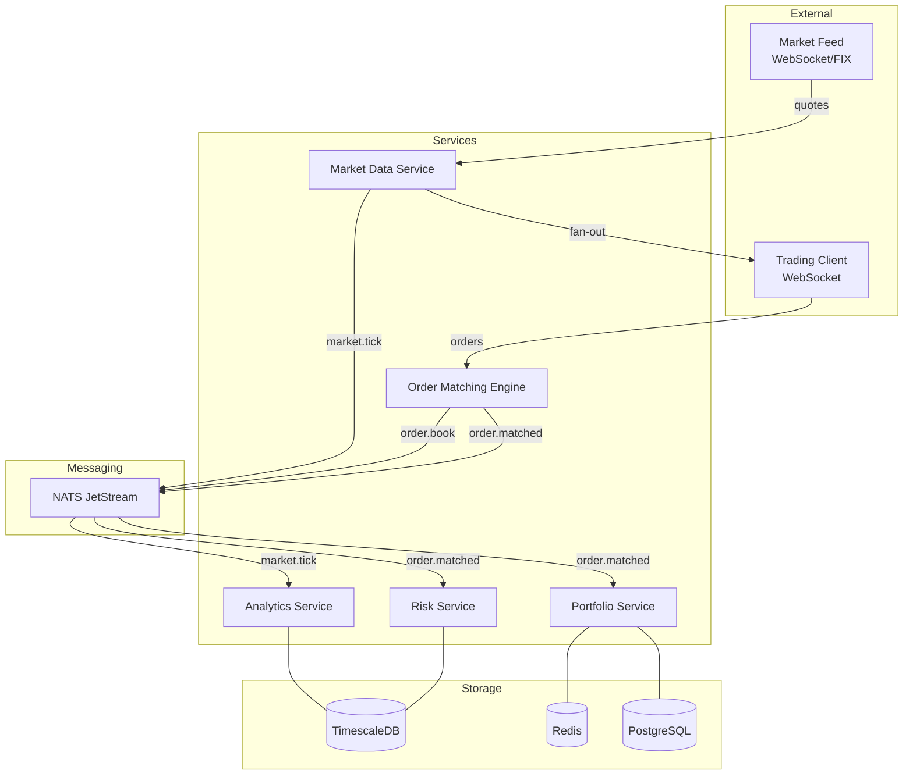

# Проект 3: Trading/Fintech Platform

> Уровень: **Advanced** | Время: ~4 недели

---

## Цель проекта

Построить **high-performance, real-time trading платформу** — систему, где каждая миллисекунда latency имеет значение. Это наиболее технически сложный проект курса: он охватывает WebSocket fan-out, lock-free структуры данных, TimescaleDB для time-series, NATS JetStream для low-latency messaging и тюнинг GC под production-нагрузку.

> **Для C# разработчиков**: Если в C# вы работали с SignalR, TPL Dataflow, MemoryMappedFiles или писали high-frequency алгоритмы — здесь вы найдёте Go-эквиваленты тех же подходов, но без CLR overhead.

---

## Компоненты системы

| Сервис | Ответственность | Ключевые технологии |
|--------|-----------------|---------------------|
| **Market Data Service** | Приём котировок, WebSocket fan-out | WebSocket, горутины, NATS JetStream |
| **Order Matching Engine** | Сопоставление ордеров по price-time priority | Lock-free order book, atomic ops |
| **Portfolio Service** | Учёт позиций, PnL в реальном времени | PostgreSQL, Redis |
| **Risk Service** | VaR, лимиты, margin calls | TimescaleDB, горутины |
| **Analytics Service** | OHLCV агрегация, исторические данные | TimescaleDB, continuous aggregates |

---

## Архитектура



---

## Чему вы научитесь

### Go-специфичные навыки

- **WebSocket fan-out** — раздача market data тысячам клиентов через горутины и каналы
- **Lock-free order book** — ценовой стакан без mutex через `atomic` и copy-on-write
- **Backpressure** — защита от медленных клиентов через небуферизованные / буферизованные каналы
- **NATS JetStream** — at-least-once и exactly-once delivery для финансовых событий
- **GC tuning** — настройка `GOGC`, `GOMEMLIMIT`, `runtime.GC()` для latency-sensitive кода
- **TimescaleDB** — time-series гипертаблицы, continuous aggregates, `time_bucket()`
- **Профилирование** — `pprof`, трассировка аллокаций, flame graphs

### Архитектурные паттерны

- **Event-driven** — сервисы общаются через события, не HTTP-запросы
- **CQRS** — разделение writes (OME) и reads (Analytics)
- **Fan-out/Fan-in** — горутинная раздача/сбор данных
- **Circuit breaker** — защита при деградации downstream сервисов

---

## Структура проекта

```
trading-platform/
├── market-data/
│   ├── cmd/server/main.go
│   ├── internal/
│   │   ├── feed/        # приём от биржи
│   │   ├── hub/         # WebSocket fan-out
│   │   └── publisher/   # NATS publisher
│   └── go.mod
├── order-engine/
│   ├── cmd/server/main.go
│   ├── internal/
│   │   ├── book/        # order book
│   │   ├── matcher/     # matching logic
│   │   └── gateway/     # NATS subscriber/publisher
│   └── go.mod
├── portfolio/
│   ├── cmd/server/main.go
│   ├── internal/
│   │   ├── position/    # position tracking
│   │   └── pnl/         # PnL calculation
│   └── go.mod
├── risk/
│   ├── cmd/server/main.go
│   ├── internal/
│   │   ├── var/         # Value at Risk
│   │   └── limits/      # trading limits
│   └── go.mod
├── analytics/
│   ├── cmd/server/main.go
│   ├── internal/
│   │   ├── ohlcv/       # candlestick aggregation
│   │   └── query/       # historical queries
│   └── go.mod
└── docker-compose.yml
```

---

## Технологический стек

| Компонент | Технология | Обоснование |
|-----------|------------|-------------|
| Messaging | **NATS JetStream** | Sub-millisecond latency, at-least-once, replay |
| Time-series DB | **TimescaleDB** | PostgreSQL-совместимая, continuous aggregates |
| Cache | **Redis** | In-memory позиции, pub/sub для алертов |
| Observability | **OpenTelemetry + Prometheus** | Traces + metrics |
| Deploy | **Kubernetes + HPA** | Auto-scaling по CPU и custom metrics |

> **Почему NATS, а не Kafka?**
> Kafka — excellent для durability и retention. NATS JetStream — better для low-latency: pub/sub latency порядка 100-300µs vs 1-5ms у Kafka. В trading каждые 100µs на счету.

---

## Разделы проекта

1. [Архитектура и доменная модель](01_architecture.md)
2. [Market Data Service: WebSocket fan-out](02_market_data_service.md)
3. [Order Matching Engine: lock-free order book](03_order_matching_engine.md)
4. [Portfolio и Risk сервисы](04_portfolio_risk_service.md)
5. [Analytics: TimescaleDB и агрегации](05_analytics_service.md)
6. [Производительность: GC tuning и профилирование](06_performance_tuning.md)
7. [Деплой: Kubernetes и HPA](07_deployment.md)

---

## Предварительные требования

Перед началом убедитесь, что проработали:
- [Горутины и каналы](../part2-advanced/01_goroutines_channels.md) — fan-out паттерн
- [Профилирование и оптимизация](../part2-advanced/08_profiling_optimization.md) — pprof
- [Очереди сообщений](../part4-infrastructure/03_message_queues.md) — NATS основы
- [Production PostgreSQL](../part4-infrastructure/01_production_postgresql.md) — connection pools
