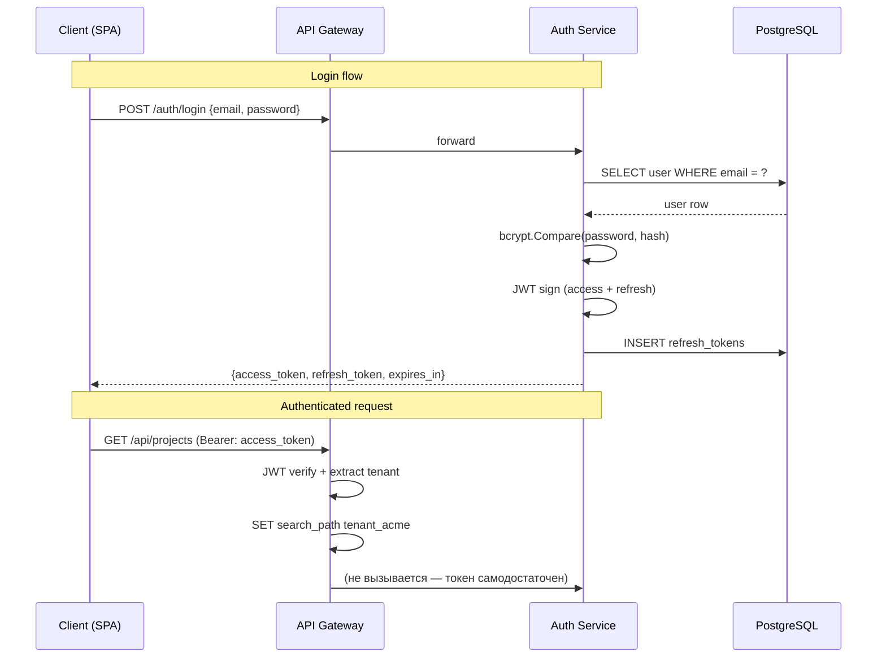
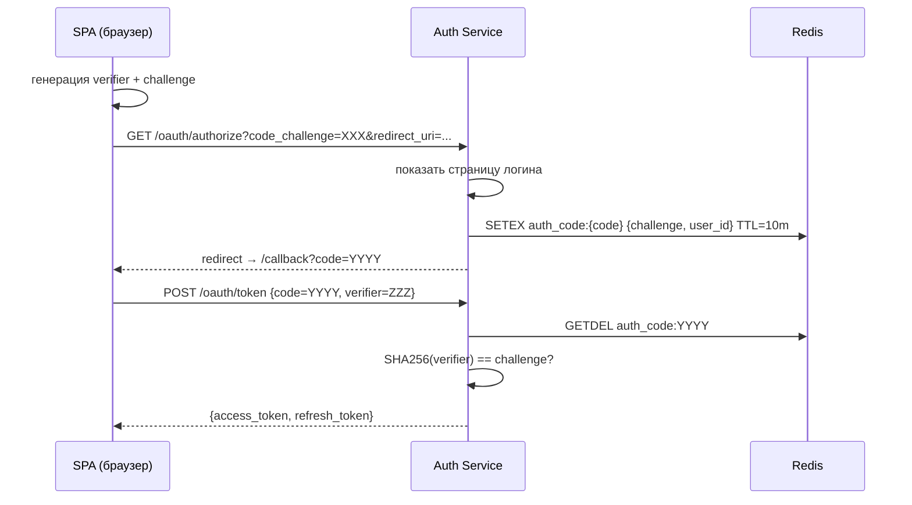

# Auth Service: OAuth2 и JWT

---

## Введение

> **Для C# разработчиков**: В ASP.NET Core аутентификация строится через `AddAuthentication().AddJwtBearer()` и `[Authorize]`-атрибуты. Identity Server / Azure AD B2C реализуют OAuth2 flow за вас. В Go нет встроенного OAuth2-сервера — мы строим его вручную, используя `golang-jwt/jwt` для токенов и `golang.org/x/oauth2` для внешних провайдеров. Это больше кода, но полный контроль над каждым байтом токена.

Auth Service отвечает за:
- Регистрацию и login пользователей
- Выдачу Access Token + Refresh Token
- OAuth2 PKCE flow для SPA/мобильных клиентов
- Валидацию токенов (используется другими сервисами)
- Встраивание tenant-контекста в JWT claims

---

## Архитектура Auth Service



---

## JWT Claims с tenant-контекстом

```go
package token

import (
    "time"

    "github.com/golang-jwt/jwt/v5"
    "github.com/google/uuid"
)

// Claims расширяет стандартные JWT-клеймы tenant-специфичными полями.
// Структура клеймов — контракт между Auth Service и остальными сервисами.
type Claims struct {
    jwt.RegisteredClaims
    TenantID   uuid.UUID `json:"tid"`  // tenant ID
    TenantSlug string    `json:"tsl"`  // tenant slug ("acme")
    Schema     string    `json:"tsc"`  // schema name ("tenant_acme")
    UserID     uuid.UUID `json:"uid"`
    Role       string    `json:"rol"`  // "owner", "admin", "member"
}

// Manager управляет выдачей и валидацией токенов.
type Manager struct {
    secret          []byte
    accessTokenTTL  time.Duration
    refreshTokenTTL time.Duration
}

func NewManager(secret string, accessTTL, refreshTTL time.Duration) *Manager {
    return &Manager{
        secret:          []byte(secret),
        accessTokenTTL:  accessTTL,
        refreshTokenTTL: refreshTTL,
    }
}

// IssueAccess выдаёт Access Token.
func (m *Manager) IssueAccess(tenantID uuid.UUID, slug, schema string, userID uuid.UUID, role string) (string, error) {
    claims := Claims{
        RegisteredClaims: jwt.RegisteredClaims{
            ExpiresAt: jwt.NewNumericDate(time.Now().Add(m.accessTokenTTL)),
            IssuedAt:  jwt.NewNumericDate(time.Now()),
            Subject:   userID.String(),
        },
        TenantID:   tenantID,
        TenantSlug: slug,
        Schema:     schema,
        UserID:     userID,
        Role:       role,
    }

    t := jwt.NewWithClaims(jwt.SigningMethodHS256, claims)
    return t.SignedString(m.secret)
}

// Verify валидирует токен и возвращает клеймы.
func (m *Manager) Verify(tokenStr string) (*Claims, error) {
    t, err := jwt.ParseWithClaims(tokenStr, &Claims{}, func(t *jwt.Token) (any, error) {
        if _, ok := t.Method.(*jwt.SigningMethodHMAC); !ok {
            return nil, fmt.Errorf("unexpected signing method: %v", t.Header["alg"])
        }
        return m.secret, nil
    })
    if err != nil {
        return nil, fmt.Errorf("parse token: %w", err)
    }

    claims, ok := t.Claims.(*Claims)
    if !ok || !t.Valid {
        return nil, fmt.Errorf("invalid token claims")
    }
    return claims, nil
}
```

---

## Refresh Token: хранение и ротация

Access Token живёт 15 минут (stateless). Refresh Token живёт 30 дней и хранится в БД — это позволяет отзывать сессии.

```go
package token

import (
    "context"
    "crypto/rand"
    "encoding/hex"
    "fmt"
    "time"

    "github.com/google/uuid"
    "github.com/jackc/pgx/v5/pgxpool"
)

// RefreshToken — запись в таблице refresh_tokens.
type RefreshToken struct {
    ID        uuid.UUID
    UserID    uuid.UUID
    TenantID  uuid.UUID
    Token     string    // случайный 32-байтный hex
    ExpiresAt time.Time
    Revoked   bool
}

// RefreshStore управляет refresh-токенами в PostgreSQL.
type RefreshStore struct {
    pool *pgxpool.Pool
}

// Issue создаёт новый refresh-токен и сохраняет в БД.
func (s *RefreshStore) Issue(ctx context.Context, userID, tenantID uuid.UUID, ttl time.Duration) (*RefreshToken, error) {
    raw := make([]byte, 32)
    if _, err := rand.Read(raw); err != nil {
        return nil, fmt.Errorf("generate token: %w", err)
    }

    rt := &RefreshToken{
        ID:        uuid.New(),
        UserID:    userID,
        TenantID:  tenantID,
        Token:     hex.EncodeToString(raw),
        ExpiresAt: time.Now().Add(ttl),
    }

    _, err := s.pool.Exec(ctx,
        `INSERT INTO public.refresh_tokens (id, user_id, tenant_id, token, expires_at)
         VALUES ($1, $2, $3, $4, $5)`,
        rt.ID, rt.UserID, rt.TenantID, rt.Token, rt.ExpiresAt,
    )
    return rt, err
}

// Rotate отзывает старый токен и выдаёт новый (refresh token rotation).
// Защита от replay: если токен уже был использован, отзываем все токены пользователя.
func (s *RefreshStore) Rotate(ctx context.Context, oldToken string, ttl time.Duration) (*RefreshToken, error) {
    tx, err := s.pool.Begin(ctx)
    if err != nil {
        return nil, err
    }
    defer tx.Rollback(ctx)

    var rt RefreshToken
    err = tx.QueryRow(ctx,
        `UPDATE public.refresh_tokens
         SET revoked = true
         WHERE token = $1 AND revoked = false AND expires_at > now()
         RETURNING id, user_id, tenant_id`,
        oldToken,
    ).Scan(&rt.ID, &rt.UserID, &rt.TenantID)
    if err != nil {
        // Если токен не найден или уже отозван — возможна атака повторного воспроизведения.
        // Отзываем все токены пользователя как меру безопасности.
        return nil, fmt.Errorf("token reuse detected or expired: %w", err)
    }

    // Выдаём новый токен в той же транзакции.
    newStore := &RefreshStore{pool: s.pool}
    newRT, err := newStore.issueWithTx(ctx, tx, rt.UserID, rt.TenantID, ttl)
    if err != nil {
        return nil, err
    }

    return newRT, tx.Commit(ctx)
}
```

---

## Handlers: Login и Refresh

```go
package handler

import (
    "encoding/json"
    "net/http"
    "time"

    "golang.org/x/crypto/bcrypt"
    "saas-platform/auth/internal/token"
    "saas-platform/auth/internal/user"
)

type AuthHandler struct {
    users        *user.Repository
    tokenManager *token.Manager
    refreshStore *token.RefreshStore
}

type loginRequest struct {
    Email    string `json:"email"`
    Password string `json:"password"`
}

type loginResponse struct {
    AccessToken  string    `json:"access_token"`
    RefreshToken string    `json:"refresh_token"`
    ExpiresIn    int       `json:"expires_in"` // секунды
    TokenType    string    `json:"token_type"`
}

func (h *AuthHandler) Login(w http.ResponseWriter, r *http.Request) {
    var req loginRequest
    if err := json.NewDecoder(r.Body).Decode(&req); err != nil {
        http.Error(w, "invalid request", http.StatusBadRequest)
        return
    }

    // Находим пользователя по email в public-схеме.
    // Login не требует tenant-контекста — ищем по email глобально.
    u, tenant, err := h.users.FindByEmail(r.Context(), req.Email)
    if err != nil {
        // Одинаковое сообщение для "не найден" и "неверный пароль" — защита от перебора.
        http.Error(w, "invalid credentials", http.StatusUnauthorized)
        return
    }

    if err := bcrypt.CompareHashAndPassword([]byte(u.PasswordHash), []byte(req.Password)); err != nil {
        http.Error(w, "invalid credentials", http.StatusUnauthorized)
        return
    }

    accessToken, err := h.tokenManager.IssueAccess(
        tenant.ID, tenant.Slug, tenant.Schema,
        u.ID, string(u.Role),
    )
    if err != nil {
        http.Error(w, "internal error", http.StatusInternalServerError)
        return
    }

    rt, err := h.refreshStore.Issue(r.Context(), u.ID, tenant.ID, 30*24*time.Hour)
    if err != nil {
        http.Error(w, "internal error", http.StatusInternalServerError)
        return
    }

    w.Header().Set("Content-Type", "application/json")
    json.NewEncoder(w).Encode(loginResponse{
        AccessToken:  accessToken,
        RefreshToken: rt.Token,
        ExpiresIn:    900, // 15 минут
        TokenType:    "Bearer",
    })
}

func (h *AuthHandler) Refresh(w http.ResponseWriter, r *http.Request) {
    var req struct {
        RefreshToken string `json:"refresh_token"`
    }
    if err := json.NewDecoder(r.Body).Decode(&req); err != nil {
        http.Error(w, "invalid request", http.StatusBadRequest)
        return
    }

    newRT, err := h.refreshStore.Rotate(r.Context(), req.RefreshToken, 30*24*time.Hour)
    if err != nil {
        http.Error(w, "invalid or expired refresh token", http.StatusUnauthorized)
        return
    }

    // Загружаем пользователя для нового access token.
    u, tenant, err := h.users.FindByID(r.Context(), newRT.UserID)
    if err != nil {
        http.Error(w, "internal error", http.StatusInternalServerError)
        return
    }

    accessToken, _ := h.tokenManager.IssueAccess(
        tenant.ID, tenant.Slug, tenant.Schema,
        u.ID, string(u.Role),
    )

    w.Header().Set("Content-Type", "application/json")
    json.NewEncoder(w).Encode(loginResponse{
        AccessToken:  accessToken,
        RefreshToken: newRT.Token,
        ExpiresIn:    900,
        TokenType:    "Bearer",
    })
}
```

---

## OAuth2 PKCE Flow

PKCE (Proof Key for Code Exchange) — расширение OAuth2 для публичных клиентов (SPA, мобильные). Решает проблему перехвата authorization code.

```go
package oauth

import (
    "crypto/rand"
    "crypto/sha256"
    "encoding/base64"
    "fmt"
)

// CodeVerifier — случайная строка, которую клиент генерирует и хранит локально.
type CodeVerifier string

// GenerateVerifier создаёт PKCE code verifier (RFC 7636).
func GenerateVerifier() (CodeVerifier, error) {
    raw := make([]byte, 32)
    if _, err := rand.Read(raw); err != nil {
        return "", err
    }
    // base64url без padding
    return CodeVerifier(base64.RawURLEncoding.EncodeToString(raw)), nil
}

// Challenge вычисляет code_challenge = BASE64URL(SHA256(verifier)).
func (v CodeVerifier) Challenge() string {
    h := sha256.Sum256([]byte(v))
    return base64.RawURLEncoding.EncodeToString(h[:])
}

// AuthorizationStore хранит authorization codes в Redis.
// Code живёт 10 минут — одноразовый.
type AuthorizationStore struct {
    redis *redis.Client
}

type AuthCode struct {
    Code          string
    UserID        string
    TenantID      string
    CodeChallenge string // храним challenge, не verifier
    RedirectURI   string
    ExpiresAt     time.Time
}

// Issue создаёт authorization code.
func (s *AuthorizationStore) Issue(ctx context.Context, code *AuthCode) error {
    data, _ := json.Marshal(code)
    return s.redis.SetEx(ctx,
        "auth_code:"+code.Code,
        data,
        10*time.Minute,
    ).Err()
}

// Exchange верифицирует code + verifier и возвращает данные.
func (s *AuthorizationStore) Exchange(ctx context.Context, code, verifier string) (*AuthCode, error) {
    key := "auth_code:" + code
    data, err := s.redis.GetDel(ctx, key).Bytes() // GetDel — атомарно забираем и удаляем
    if err != nil {
        return nil, fmt.Errorf("code not found or expired: %w", err)
    }

    var ac AuthCode
    if err := json.Unmarshal(data, &ac); err != nil {
        return nil, err
    }

    // Верифицируем: SHA256(verifier) должен совпадать с challenge.
    cv := CodeVerifier(verifier)
    if cv.Challenge() != ac.CodeChallenge {
        return nil, fmt.Errorf("pkce verification failed")
    }

    return &ac, nil
}
```

### Последовательность PKCE



---

## JWT Middleware для API Gateway

```go
package middleware

import (
    "context"
    "net/http"
    "strings"

    "saas-platform/auth/internal/token"
    "saas-platform/shared/tenantctx"
    "saas-platform/domain"
)

// JWTAuth создаёт middleware, который:
// 1. Извлекает Bearer-токен из заголовка
// 2. Валидирует подпись и срок действия
// 3. Кладёт tenant + user в context
func JWTAuth(tm *token.Manager) func(http.Handler) http.Handler {
    return func(next http.Handler) http.Handler {
        return http.HandlerFunc(func(w http.ResponseWriter, r *http.Request) {
            authHeader := r.Header.Get("Authorization")
            if authHeader == "" {
                http.Error(w, "missing authorization header", http.StatusUnauthorized)
                return
            }

            parts := strings.SplitN(authHeader, " ", 2)
            if len(parts) != 2 || parts[0] != "Bearer" {
                http.Error(w, "invalid authorization format", http.StatusUnauthorized)
                return
            }

            claims, err := tm.Verify(parts[1])
            if err != nil {
                http.Error(w, "invalid token", http.StatusUnauthorized)
                return
            }

            // Собираем tenant из клеймов — без похода в БД.
            // Все нужные данные уже в токене.
            tenant := &domain.Tenant{
                ID:     claims.TenantID,
                Slug:   claims.TenantSlug,
                Schema: claims.Schema,
            }

            ctx := tenantctx.WithTenant(r.Context(), tenant)
            ctx = tenantctx.WithUser(ctx, claims.UserID, claims.Role)

            next.ServeHTTP(w, r.WithContext(ctx))
        })
    }
}

// RequireRole создаёт middleware, проверяющий минимальную роль.
func RequireRole(minRole string) func(http.Handler) http.Handler {
    roleWeight := map[string]int{
        "member": 1,
        "admin":  2,
        "owner":  3,
    }

    return func(next http.Handler) http.Handler {
        return http.HandlerFunc(func(w http.ResponseWriter, r *http.Request) {
            role := tenantctx.RoleFromContext(r.Context())
            if roleWeight[role] < roleWeight[minRole] {
                http.Error(w, "forbidden", http.StatusForbidden)
                return
            }
            next.ServeHTTP(w, r)
        })
    }
}
```

---

## SQL-схема для Auth Service

```sql
-- Refresh tokens (в public-схеме, общая для всех тенантов)
CREATE TABLE public.refresh_tokens (
    id         UUID PRIMARY KEY DEFAULT gen_random_uuid(),
    user_id    UUID NOT NULL,
    tenant_id  UUID NOT NULL REFERENCES public.tenants(id) ON DELETE CASCADE,
    token      TEXT NOT NULL UNIQUE,
    expires_at TIMESTAMPTZ NOT NULL,
    revoked    BOOLEAN NOT NULL DEFAULT false,
    created_at TIMESTAMPTZ NOT NULL DEFAULT now()
);

CREATE INDEX ON public.refresh_tokens(token) WHERE NOT revoked;
CREATE INDEX ON public.refresh_tokens(user_id, revoked);

-- Автоматическая очистка истёкших токенов
CREATE INDEX ON public.refresh_tokens(expires_at) WHERE NOT revoked;
```

---

## Сравнение с C#

| Аспект | C# / ASP.NET Core | Go |
|--------|-------------------|----|
| JWT выдача | `JwtSecurityTokenHandler.CreateToken()` | `jwt.NewWithClaims().SignedString()` |
| JWT валидация | `AddJwtBearer()` в Program.cs | Middleware-функция с `jwt.ParseWithClaims()` |
| Password hashing | `IPasswordHasher<T>` (PBKDF2) | `golang.org/x/crypto/bcrypt` |
| Claims principal | `ClaimsPrincipal` / `HttpContext.User` | `context.Context` с custom key |
| Refresh rotation | Нет в ASP.NET Identity из коробки | Ручная реализация с GetDel в Redis/PG |
| PKCE | Встроен в Identity Server / Azure AD B2C | Ручная реализация (~50 строк) |

---

## Следующий шаг

Auth Service готов. Следующий раздел — [Tenant Service: онбординг и планы](03_tenant_service.md): как атомарно создавать PostgreSQL-схему, мигрировать её и управлять тарифными планами.
