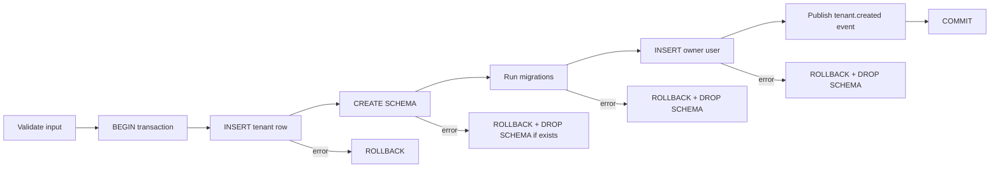

# Tenant Service: онбординг и планы

---

## Введение

> **Для C# разработчиков**: Онбординг тенанта в ASP.NET Core нередко реализуется через `IHostedService` или Hangfire-задачу: создать строку в БД, выполнить миграцию, отправить welcome-email. В Go нет встроенного планировщика, зато есть горутины — весь процесс онбординга выполняется в одной транзакции с компенсирующими шагами при ошибке. Паттерн похож на Saga без внешнего оркестратора.

Tenant Service отвечает за:
- Создание тенанта: запись в БД + создание PostgreSQL-схемы + первичные миграции
- Управление тарифными планами и переключение между ними
- Feature flags — включение/отключение функций для конкретных тенантов
- Мягкое удаление и приостановку (suspension) тенантов

---

## Онбординг: Saga без оркестратора

Создание тенанта — это последовательность операций, каждая из которых может упасть. При ошибке нужно откатить всё, что успело выполниться.



```go
package onboarding

import (
    "context"
    "fmt"
    "log/slog"

    "github.com/google/uuid"
    "github.com/jackc/pgx/v5"
    "github.com/jackc/pgx/v5/pgxpool"
    "golang.org/x/crypto/bcrypt"
    "saas-platform/domain"
    "saas-platform/shared/pgschema"
)

type Service struct {
    pool      *pgxpool.Pool
    migrator  *Migrator
    publisher EventPublisher
}

type CreateTenantInput struct {
    Slug          string
    Name          string
    OwnerEmail    string
    OwnerPassword string
    PlanID        uuid.UUID
}

// CreateTenant атомарно создаёт тенанта и его первого пользователя.
// При ошибке выполняет компенсирующие действия.
func (s *Service) CreateTenant(ctx context.Context, in CreateTenantInput) (*domain.Tenant, error) {
    // Валидация slug (безопасность: slug вставляется в SQL SET search_path)
    schemaName, err := pgschema.SchemaName(in.Slug)
    if err != nil {
        return nil, fmt.Errorf("invalid slug: %w", err)
    }

    // Хэшируем пароль до транзакции — bcrypt долгий, не держим conn занятым
    passwordHash, err := bcrypt.GenerateFromPassword([]byte(in.OwnerPassword), bcrypt.DefaultCost)
    if err != nil {
        return nil, fmt.Errorf("hash password: %w", err)
    }

    tx, err := s.pool.Begin(ctx)
    if err != nil {
        return nil, fmt.Errorf("begin transaction: %w", err)
    }
    defer func() {
        // При любой ошибке откатываем транзакцию.
        // PostgreSQL автоматически откатит CREATE SCHEMA в рамках транзакции.
        if err != nil {
            if rbErr := tx.Rollback(ctx); rbErr != nil {
                slog.Error("rollback failed", "err", rbErr)
            }
        }
    }()

    tenantID := uuid.New()

    // 1. Создаём запись тенанта
    tenant := &domain.Tenant{
        ID:     tenantID,
        Slug:   in.Slug,
        Name:   in.Name,
        Schema: schemaName,
        PlanID: in.PlanID,
        Status: domain.TenantStatusActive,
    }
    if err = insertTenant(ctx, tx, tenant); err != nil {
        return nil, fmt.Errorf("insert tenant: %w", err)
    }

    // 2. Создаём PostgreSQL-схему для тенанта
    // CREATE SCHEMA выполняется внутри транзакции — откатится при Rollback
    if _, err = tx.Exec(ctx, fmt.Sprintf("CREATE SCHEMA %s", schemaName)); err != nil {
        return nil, fmt.Errorf("create schema %s: %w", schemaName, err)
    }

    // 3. Применяем миграции к схеме тенанта
    if err = s.migrator.MigrateSchema(ctx, tx, schemaName); err != nil {
        return nil, fmt.Errorf("migrate schema %s: %w", schemaName, err)
    }

    // 4. Создаём первого пользователя (owner) в схеме тенанта
    if _, err = tx.Exec(ctx,
        fmt.Sprintf(`SET LOCAL search_path TO %s, public`, schemaName),
    ); err != nil {
        return nil, fmt.Errorf("set search_path: %w", err)
    }

    ownerID := uuid.New()
    if _, err = tx.Exec(ctx,
        `INSERT INTO users (id, tenant_id, email, password_hash, role)
         VALUES ($1, $2, $3, $4, 'owner')`,
        ownerID, tenantID, in.OwnerEmail, string(passwordHash),
    ); err != nil {
        return nil, fmt.Errorf("insert owner user: %w", err)
    }

    // 5. Публикуем событие через Outbox (внутри той же транзакции)
    if err = s.publisher.PublishTx(ctx, tx, "tenant.created", map[string]any{
        "tenant_id": tenantID,
        "slug":      in.Slug,
        "plan_id":   in.PlanID,
    }); err != nil {
        return nil, fmt.Errorf("publish event: %w", err)
    }

    if err = tx.Commit(ctx); err != nil {
        return nil, fmt.Errorf("commit: %w", err)
    }

    slog.Info("tenant created", "tenant_id", tenantID, "slug", in.Slug, "schema", schemaName)
    return tenant, nil
}

func insertTenant(ctx context.Context, tx pgx.Tx, t *domain.Tenant) error {
    _, err := tx.Exec(ctx,
        `INSERT INTO public.tenants (id, slug, name, schema_name, plan_id, status)
         VALUES ($1, $2, $3, $4, $5, $6)`,
        t.ID, t.Slug, t.Name, t.Schema, t.PlanID, t.Status,
    )
    return err
}
```

---

## Миграции схем тенантов

```go
package onboarding

import (
    "context"
    "fmt"

    "github.com/jackc/pgx/v5"
    "github.com/golang-migrate/migrate/v4"
    "github.com/golang-migrate/migrate/v4/database/pgx/v5"
    _ "github.com/golang-migrate/migrate/v4/source/file"
)

// Migrator применяет SQL-миграции к схеме тенанта.
// Файлы миграций лежат в migrations/tenant/*.sql
type Migrator struct {
    migrationsPath string // "file://migrations/tenant"
}

// MigrateSchema применяет все миграции к указанной схеме в рамках транзакции.
func (m *Migrator) MigrateSchema(ctx context.Context, tx pgx.Tx, schema string) error {
    // Устанавливаем search_path чтобы миграции создавали таблицы в нужной схеме
    if _, err := tx.Exec(ctx, fmt.Sprintf("SET LOCAL search_path TO %s", schema)); err != nil {
        return err
    }

    // Таблица версий миграций тоже создаётся в схеме тенанта
    _, err := tx.Exec(ctx, `
        CREATE TABLE IF NOT EXISTS schema_migrations (
            version    BIGINT PRIMARY KEY,
            dirty      BOOLEAN NOT NULL DEFAULT false,
            applied_at TIMESTAMPTZ NOT NULL DEFAULT now()
        )
    `)
    if err != nil {
        return fmt.Errorf("create migrations table: %w", err)
    }

    // Применяем миграции из SQL-файлов
    return m.applyMigrations(ctx, tx)
}

// Структура директории миграций:
// migrations/tenant/
//   001_create_users.up.sql
//   001_create_users.down.sql
//   002_create_projects.up.sql
//   002_create_projects.down.sql
```

### Пример файла миграции

```sql
-- migrations/tenant/001_create_users.up.sql

CREATE TABLE users (
    id            UUID PRIMARY KEY DEFAULT gen_random_uuid(),
    tenant_id     UUID NOT NULL,
    email         TEXT NOT NULL UNIQUE,
    password_hash TEXT NOT NULL,
    role          TEXT NOT NULL DEFAULT 'member'
                  CHECK (role IN ('owner', 'admin', 'member')),
    created_at    TIMESTAMPTZ NOT NULL DEFAULT now(),
    updated_at    TIMESTAMPTZ NOT NULL DEFAULT now()
);

CREATE TABLE audit_log (
    id         BIGSERIAL PRIMARY KEY,
    user_id    UUID NOT NULL REFERENCES users(id) ON DELETE SET NULL,
    action     TEXT NOT NULL,
    resource   TEXT NOT NULL,
    metadata   JSONB NOT NULL DEFAULT '{}',
    ip_address INET,
    created_at TIMESTAMPTZ NOT NULL DEFAULT now()
);

CREATE INDEX ON audit_log(user_id, created_at DESC);
CREATE INDEX ON audit_log(created_at DESC);
```

---

## Управление планами

### Структура планов

```go
package plan

import (
    "context"
    "encoding/json"
    "fmt"

    "github.com/google/uuid"
    "github.com/jackc/pgx/v5/pgxpool"
    "saas-platform/domain"
)

// Service управляет тарифными планами тенантов.
type Service struct {
    pool *pgxpool.Pool
}

// GetLimits возвращает лимиты текущего плана тенанта.
// Используется при каждом запросе для проверки квот.
func (s *Service) GetLimits(ctx context.Context, tenantID uuid.UUID) (*domain.PlanLimits, error) {
    var limitsJSON []byte
    err := s.pool.QueryRow(ctx, `
        SELECT p.limits
        FROM public.tenants t
        JOIN public.plans p ON p.id = t.plan_id
        WHERE t.id = $1 AND t.status = 'active'
    `, tenantID).Scan(&limitsJSON)
    if err != nil {
        return nil, fmt.Errorf("get plan limits for tenant %s: %w", tenantID, err)
    }

    var limits domain.PlanLimits
    if err := json.Unmarshal(limitsJSON, &limits); err != nil {
        return nil, fmt.Errorf("unmarshal limits: %w", err)
    }
    return &limits, nil
}

// Upgrade переводит тенанта на более дорогой план.
// Немедленно активирует новые лимиты.
func (s *Service) Upgrade(ctx context.Context, tenantID, newPlanID uuid.UUID) error {
    result, err := s.pool.Exec(ctx, `
        UPDATE public.tenants
        SET plan_id = $1, updated_at = now()
        WHERE id = $2 AND status = 'active'
    `, newPlanID, tenantID)
    if err != nil {
        return fmt.Errorf("upgrade plan: %w", err)
    }
    if result.RowsAffected() == 0 {
        return fmt.Errorf("tenant %s not found or not active", tenantID)
    }
    return nil
}

// Suspend приостанавливает тенанта за неоплату.
// API Gateway будет отклонять запросы с 402 Payment Required.
func (s *Service) Suspend(ctx context.Context, tenantID uuid.UUID, reason string) error {
    _, err := s.pool.Exec(ctx, `
        UPDATE public.tenants
        SET status = 'suspended', updated_at = now()
        WHERE id = $1
    `, tenantID)
    return err
}
```

---

## Feature Flags

Feature flags позволяют включать функции для отдельных тенантов — полезно для beta-доступа, enterprise-функций и A/B тестирования.

```go
package feature

import (
    "context"
    "sync"
    "time"

    "github.com/google/uuid"
    "github.com/jackc/pgx/v5/pgxpool"
)

// Flag — название функции-флага.
type Flag string

const (
    FlagAdvancedAnalytics Flag = "advanced_analytics"
    FlagCustomDomain      Flag = "custom_domain"
    FlagSSO               Flag = "sso"
    FlagAPIAccess         Flag = "api_access"
    FlagAuditLog          Flag = "audit_log"
)

// Store хранит feature flags с кэшированием.
// Флаги меняются редко — кэш на 5 минут снижает нагрузку на БД.
type Store struct {
    pool  *pgxpool.Pool
    mu    sync.RWMutex
    cache map[uuid.UUID]map[Flag]bool
    ttl   map[uuid.UUID]time.Time
}

func NewStore(pool *pgxpool.Pool) *Store {
    return &Store{
        pool:  pool,
        cache: make(map[uuid.UUID]map[Flag]bool),
        ttl:   make(map[uuid.UUID]time.Time),
    }
}

// IsEnabled проверяет, включён ли флаг для тенанта.
func (s *Store) IsEnabled(ctx context.Context, tenantID uuid.UUID, flag Flag) (bool, error) {
    flags, err := s.getFlags(ctx, tenantID)
    if err != nil {
        return false, err
    }
    return flags[flag], nil
}

func (s *Store) getFlags(ctx context.Context, tenantID uuid.UUID) (map[Flag]bool, error) {
    s.mu.RLock()
    if flags, ok := s.cache[tenantID]; ok && time.Now().Before(s.ttl[tenantID]) {
        s.mu.RUnlock()
        return flags, nil
    }
    s.mu.RUnlock()

    // Загружаем флаги из БД.
    // Флаги определяются планом + индивидуальными override для тенанта.
    rows, err := s.pool.Query(ctx, `
        SELECT ff.flag_name, COALESCE(tf.enabled, pf.enabled, false) AS enabled
        FROM public.feature_flags ff
        LEFT JOIN public.plan_features pf
            ON pf.flag_name = ff.flag_name
            AND pf.plan_id = (SELECT plan_id FROM public.tenants WHERE id = $1)
        LEFT JOIN public.tenant_features tf
            ON tf.flag_name = ff.flag_name
            AND tf.tenant_id = $1
    `, tenantID)
    if err != nil {
        return nil, err
    }
    defer rows.Close()

    flags := make(map[Flag]bool)
    for rows.Next() {
        var name string
        var enabled bool
        if err := rows.Scan(&name, &enabled); err != nil {
            return nil, err
        }
        flags[Flag(name)] = enabled
    }

    s.mu.Lock()
    s.cache[tenantID] = flags
    s.ttl[tenantID] = time.Now().Add(5 * time.Minute)
    s.mu.Unlock()

    return flags, nil
}
```

### Использование в handler

```go
func (h *ProjectHandler) Create(w http.ResponseWriter, r *http.Request) {
    tenant := tenantctx.TenantFromContext(r.Context())

    // Проверяем лимиты плана перед созданием
    limits, err := h.planService.GetLimits(r.Context(), tenant.ID)
    if err != nil {
        http.Error(w, "internal error", http.StatusInternalServerError)
        return
    }

    count, _ := h.projectRepo.Count(r.Context())
    if count >= limits.MaxProjects {
        http.Error(w, "project limit reached for your plan", http.StatusPaymentRequired)
        return
    }

    // Проверяем feature flag для premium-функций
    if r.URL.Query().Get("template") != "" {
        enabled, _ := h.features.IsEnabled(r.Context(), tenant.ID, feature.FlagAdvancedAnalytics)
        if !enabled {
            http.Error(w, "advanced templates require Pro plan", http.StatusPaymentRequired)
            return
        }
    }

    // ... создаём проект
}
```

---

## SQL-схема Tenant Service

```sql
-- Тарифные планы
CREATE TABLE public.plans (
    id                  UUID PRIMARY KEY DEFAULT gen_random_uuid(),
    name                TEXT NOT NULL UNIQUE,
    price_monthly_cents BIGINT NOT NULL DEFAULT 0,
    limits              JSONB NOT NULL DEFAULT '{}',
    stripe_price_id     TEXT,  -- Stripe Price ID для billing
    is_active           BOOLEAN NOT NULL DEFAULT true,
    created_at          TIMESTAMPTZ NOT NULL DEFAULT now()
);

-- Предустановленные планы
INSERT INTO public.plans (name, price_monthly_cents, limits, stripe_price_id) VALUES
('Starter', 0, '{"max_users": 3, "max_projects": 5, "api_requests_day": 1000, "storage_gb": 1}', NULL),
('Pro',      4900, '{"max_users": 25, "max_projects": 50, "api_requests_day": 50000, "storage_gb": 50}', 'price_pro_monthly'),
('Enterprise', 19900, '{"max_users": -1, "max_projects": -1, "api_requests_day": -1, "storage_gb": 500}', 'price_enterprise_monthly');
-- max_users = -1 означает "без ограничений"

-- Feature flags реестр
CREATE TABLE public.feature_flags (
    flag_name   TEXT PRIMARY KEY,
    description TEXT NOT NULL,
    created_at  TIMESTAMPTZ NOT NULL DEFAULT now()
);

-- Флаги по плану (defaults)
CREATE TABLE public.plan_features (
    plan_id    UUID NOT NULL REFERENCES public.plans(id) ON DELETE CASCADE,
    flag_name  TEXT NOT NULL REFERENCES public.feature_flags(flag_name),
    enabled    BOOLEAN NOT NULL DEFAULT false,
    PRIMARY KEY (plan_id, flag_name)
);

-- Индивидуальные override для тенанта
CREATE TABLE public.tenant_features (
    tenant_id UUID NOT NULL REFERENCES public.tenants(id) ON DELETE CASCADE,
    flag_name TEXT NOT NULL REFERENCES public.feature_flags(flag_name),
    enabled   BOOLEAN NOT NULL DEFAULT false,
    PRIMARY KEY (tenant_id, flag_name)
);

-- Outbox для событий тенанта (Outbox Pattern)
CREATE TABLE public.outbox_events (
    id         UUID PRIMARY KEY DEFAULT gen_random_uuid(),
    topic      TEXT NOT NULL,
    payload    JSONB NOT NULL,
    processed  BOOLEAN NOT NULL DEFAULT false,
    created_at TIMESTAMPTZ NOT NULL DEFAULT now()
);

CREATE INDEX ON public.outbox_events(processed, created_at) WHERE NOT processed;
```

---

## HTTP Handler: онбординг

```go
package handler

import (
    "encoding/json"
    "net/http"

    "saas-platform/tenant/internal/onboarding"
)

type TenantHandler struct {
    onboarding *onboarding.Service
}

type createTenantRequest struct {
    Slug          string `json:"slug"`
    Name          string `json:"name"`
    OwnerEmail    string `json:"owner_email"`
    OwnerPassword string `json:"owner_password"`
    PlanID        string `json:"plan_id"`
}

func (h *TenantHandler) Create(w http.ResponseWriter, r *http.Request) {
    var req createTenantRequest
    if err := json.NewDecoder(r.Body).Decode(&req); err != nil {
        http.Error(w, "invalid request body", http.StatusBadRequest)
        return
    }

    if req.Slug == "" || req.Name == "" || req.OwnerEmail == "" || req.OwnerPassword == "" {
        http.Error(w, "slug, name, owner_email and owner_password are required", http.StatusBadRequest)
        return
    }

    planID, err := uuid.Parse(req.PlanID)
    if err != nil {
        // Если plan_id не указан — используем Starter
        planID = starterPlanID
    }

    tenant, err := h.onboarding.CreateTenant(r.Context(), onboarding.CreateTenantInput{
        Slug:          req.Slug,
        Name:          req.Name,
        OwnerEmail:    req.OwnerEmail,
        OwnerPassword: req.OwnerPassword,
        PlanID:        planID,
    })
    if err != nil {
        // Проверяем тип ошибки для правильного HTTP-статуса
        switch {
        case isUniqueViolation(err):
            http.Error(w, "tenant with this slug already exists", http.StatusConflict)
        default:
            http.Error(w, "failed to create tenant", http.StatusInternalServerError)
        }
        return
    }

    w.Header().Set("Content-Type", "application/json")
    w.WriteHeader(http.StatusCreated)
    json.NewEncoder(w).Encode(map[string]any{
        "tenant_id": tenant.ID,
        "slug":      tenant.Slug,
        "schema":    tenant.Schema,
    })
}
```

---

## Сравнение с C#

| Аспект | C# / ASP.NET Core | Go |
|--------|-------------------|----|
| Транзакционный онбординг | `IUnitOfWork` + Hangfire saga | Явная `pgx.Tx` с defer rollback |
| Создание схемы БД | EF Core Migrations / SQL скрипт | `CREATE SCHEMA` в транзакции |
| Feature flags | LaunchDarkly SDK / custom `IFeatureManager` | Кастомный Store с sync.RWMutex кэшем |
| Мягкое удаление | `IsDeleted` + `HasQueryFilter` | `status = 'deleted'` + явные WHERE |
| Планы и лимиты | Enum + конфиг | JSONB в PostgreSQL |
| Suspend за неоплату | `IUserLockoutService` | UPDATE status = 'suspended' |
