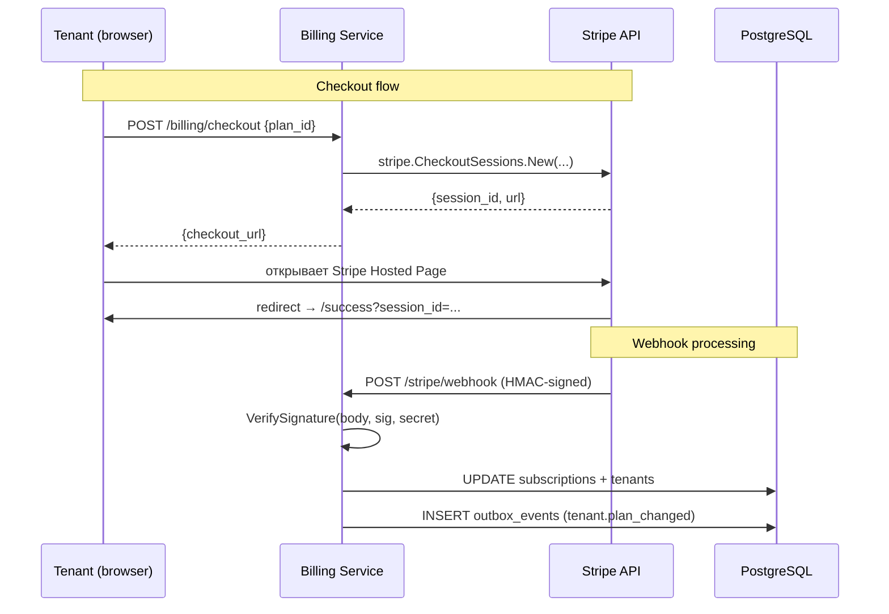

# Billing Service: подписки и Stripe

---

## Введение

> **Для C# разработчиков**: В .NET экосистеме для billing используют `Stripe.net` SDK. Логика та же: создать Customer, подписать на Price, обработать webhook-события. В Go официальный `stripe-go` SDK повторяет структуру API. Главное отличие — верификация входящих webhook Stripe: нужно вычитать `stripe-signature` заголовок и проверить HMAC-SHA256 подпись *до* парсинга JSON тела.

Billing Service отвечает за:
- Создание Stripe Customer при онбординге тенанта
- Управление подписками (checkout, upgrade, downgrade, cancel)
- Обработку входящих webhook-событий от Stripe
- Usage metering — подсчёт потреблённых ресурсов
- Принудительное применение лимитов при просрочке оплаты

---

## Архитектура Billing Service



---

## Stripe интеграция

### Инициализация клиента

```go
package stripe

import (
    "github.com/stripe/stripe-go/v76"
    "github.com/stripe/stripe-go/v76/client"
)

// Client обёртка над Stripe SDK с конфигурацией.
type Client struct {
    sc            *client.API
    webhookSecret string
}

func NewClient(apiKey, webhookSecret string) *Client {
    sc := &client.API{}
    sc.Init(apiKey, nil)
    return &Client{sc: sc, webhookSecret: webhookSecret}
}
```

### Создание подписки через Checkout

```go
package billing

import (
    "context"
    "fmt"

    "github.com/google/uuid"
    stripego "github.com/stripe/stripe-go/v76"
    "github.com/stripe/stripe-go/v76/checkout/session"
    "saas-platform/billing/internal/stripe"
    "saas-platform/domain"
)

type Service struct {
    stripe   *stripe.Client
    repo     *Repository
    planRepo *PlanRepository
}

// CreateCheckoutSession создаёт Stripe Checkout сессию для подписки.
func (s *Service) CreateCheckoutSession(ctx context.Context, tenant *domain.Tenant, planID uuid.UUID) (string, error) {
    plan, err := s.planRepo.GetByID(ctx, planID)
    if err != nil {
        return "", fmt.Errorf("get plan: %w", err)
    }

    if plan.StripePriceID == "" {
        return "", fmt.Errorf("plan %s has no stripe price", plan.Name)
    }

    // Получаем или создаём Stripe Customer для тенанта
    customerID, err := s.ensureStripeCustomer(ctx, tenant)
    if err != nil {
        return "", fmt.Errorf("ensure customer: %w", err)
    }

    params := &stripego.CheckoutSessionParams{
        Customer: stripego.String(customerID),
        Mode:     stripego.String(string(stripego.CheckoutSessionModeSubscription)),
        LineItems: []*stripego.CheckoutSessionLineItemParams{
            {
                Price:    stripego.String(plan.StripePriceID),
                Quantity: stripego.Int64(1),
            },
        },
        // После оплаты Stripe перенаправит на наш success URL
        SuccessURL: stripego.String("https://app.example.com/billing/success?session_id={CHECKOUT_SESSION_ID}"),
        CancelURL:  stripego.String("https://app.example.com/billing/cancel"),
        // Метаданные для сопоставления с нашим тенантом в webhook
        Metadata: map[string]string{
            "tenant_id": tenant.ID.String(),
            "plan_id":   planID.String(),
        },
        SubscriptionData: &stripego.CheckoutSessionSubscriptionDataParams{
            Metadata: map[string]string{
                "tenant_id": tenant.ID.String(),
            },
        },
    }

    sess, err := session.New(params)
    if err != nil {
        return "", fmt.Errorf("create stripe session: %w", err)
    }

    return sess.URL, nil
}

// ensureStripeCustomer возвращает Stripe Customer ID тенанта,
// создавая нового Customer если его ещё нет.
func (s *Service) ensureStripeCustomer(ctx context.Context, tenant *domain.Tenant) (string, error) {
    // Проверяем в нашей БД
    sub, err := s.repo.GetSubscription(ctx, tenant.ID)
    if err == nil && sub.StripeCustomerID != "" {
        return sub.StripeCustomerID, nil
    }

    // Создаём нового Customer в Stripe
    params := &stripego.CustomerParams{
        Name:  stripego.String(tenant.Name),
        Email: stripego.String("owner@" + tenant.Slug + ".example.com"),
        Metadata: map[string]string{
            "tenant_id":   tenant.ID.String(),
            "tenant_slug": tenant.Slug,
        },
    }
    // Используем клиент напрямую через sc.Customers
    // (обёртка для тестирования)
    customer, err := s.stripe.CreateCustomer(params)
    if err != nil {
        return "", fmt.Errorf("create stripe customer: %w", err)
    }

    // Сохраняем Stripe Customer ID
    if err := s.repo.SaveCustomerID(ctx, tenant.ID, customer.ID); err != nil {
        return "", fmt.Errorf("save customer id: %w", err)
    }

    return customer.ID, nil
}
```

---

## Обработка Stripe Webhook

Stripe отправляет события при оплате, просрочке, отмене. Верификация подписи обязательна — без неё любой может отправить поддельное событие.

```go
package handler

import (
    "encoding/json"
    "io"
    "log/slog"
    "net/http"

    stripego "github.com/stripe/stripe-go/v76"
    "github.com/stripe/stripe-go/v76/webhook"
    "saas-platform/billing/internal/billing"
)

type WebhookHandler struct {
    service       *billing.Service
    webhookSecret string
}

func (h *WebhookHandler) HandleStripe(w http.ResponseWriter, r *http.Request) {
    // Stripe требует читать тело полностью для верификации подписи
    const maxBodySize = 65536 // 64 KB
    body, err := io.ReadAll(io.LimitReader(r.Body, maxBodySize))
    if err != nil {
        http.Error(w, "read body", http.StatusBadRequest)
        return
    }

    // Верификация HMAC-SHA256 подписи — ОБЯЗАТЕЛЬНО перед парсингом
    sig := r.Header.Get("Stripe-Signature")
    event, err := webhook.ConstructEvent(body, sig, h.webhookSecret)
    if err != nil {
        slog.Warn("stripe webhook signature verification failed", "err", err)
        http.Error(w, "invalid signature", http.StatusBadRequest)
        return
    }

    // Маршрутизируем по типу события
    switch event.Type {
    case "checkout.session.completed":
        h.handleCheckoutCompleted(r.Context(), event)
    case "customer.subscription.updated":
        h.handleSubscriptionUpdated(r.Context(), event)
    case "customer.subscription.deleted":
        h.handleSubscriptionDeleted(r.Context(), event)
    case "invoice.payment_failed":
        h.handlePaymentFailed(r.Context(), event)
    case "invoice.payment_succeeded":
        h.handlePaymentSucceeded(r.Context(), event)
    default:
        slog.Debug("unhandled stripe event", "type", event.Type)
    }

    // Всегда отвечаем 200 — Stripe повторит доставку при не-2xx
    w.WriteHeader(http.StatusOK)
}

func (h *WebhookHandler) handleCheckoutCompleted(ctx context.Context, event stripego.Event) {
    var sess stripego.CheckoutSession
    if err := json.Unmarshal(event.Data.Raw, &sess); err != nil {
        slog.Error("unmarshal checkout session", "err", err)
        return
    }

    tenantIDStr := sess.Metadata["tenant_id"]
    planIDStr := sess.Metadata["plan_id"]

    if err := h.service.ActivateSubscription(ctx, tenantIDStr, planIDStr, sess.Subscription.ID); err != nil {
        slog.Error("activate subscription", "tenant_id", tenantIDStr, "err", err)
        // Не возвращаем ошибку в HTTP — Stripe будет повторять
        // Вместо этого логируем и алертим
    }
}

func (h *WebhookHandler) handlePaymentFailed(ctx context.Context, event stripego.Event) {
    var invoice stripego.Invoice
    if err := json.Unmarshal(event.Data.Raw, &invoice); err != nil {
        return
    }

    tenantID := invoice.Subscription.Metadata["tenant_id"]

    // После 3 неудачных попыток Stripe сам отменит подписку.
    // Мы лишь логируем и отправляем reminder email через Outbox.
    slog.Warn("payment failed", "tenant_id", tenantID, "invoice", invoice.ID)

    if err := h.service.RecordPaymentFailure(ctx, tenantID, invoice.ID); err != nil {
        slog.Error("record payment failure", "err", err)
    }
}
```

---

## Usage Metering

Usage metering считает, сколько ресурсов потребил каждый тенант. Это нужно для:
1. Enforcement: блокировать API при превышении лимита плана
2. Analytics: показывать тенанту статистику потребления
3. Billing: тарифицировать по факту для pay-as-you-go планов

```go
package metering

import (
    "context"
    "fmt"
    "time"

    "github.com/google/uuid"
    "github.com/redis/go-redis/v9"
)

// Counter атомарно считает использование ресурсов в Redis.
// Ключи устроены так: "usage:{tenant_id}:{metric}:{YYYY-MM-DD}"
// TTL 32 дня — покрывает месячный расчётный период с запасом.
type Counter struct {
    rdb *redis.Client
}

type Metric string

const (
    MetricAPIRequests Metric = "api_requests"
    MetricStorageGB   Metric = "storage_gb"
    MetricEmailsSent  Metric = "emails_sent"
)

// Increment атомарно увеличивает счётчик метрики.
func (c *Counter) Increment(ctx context.Context, tenantID uuid.UUID, metric Metric, delta int64) error {
    key := fmt.Sprintf("usage:%s:%s:%s", tenantID, metric, time.Now().UTC().Format("2006-01-02"))
    pipe := c.rdb.Pipeline()
    pipe.IncrBy(ctx, key, delta)
    pipe.Expire(ctx, key, 32*24*time.Hour)
    _, err := pipe.Exec(ctx)
    return err
}

// GetDaily возвращает дневное потребление метрики.
func (c *Counter) GetDaily(ctx context.Context, tenantID uuid.UUID, metric Metric, date time.Time) (int64, error) {
    key := fmt.Sprintf("usage:%s:%s:%s", tenantID, metric, date.UTC().Format("2006-01-02"))
    val, err := c.rdb.Get(ctx, key).Int64()
    if err == redis.Nil {
        return 0, nil
    }
    return val, err
}

// CheckQuota проверяет, не превышена ли дневная квота.
// Возвращает true если лимит достигнут.
func (c *Counter) CheckQuota(ctx context.Context, tenantID uuid.UUID, metric Metric, limit int64) (bool, error) {
    if limit < 0 {
        // limit = -1 означает безлимитный план
        return false, nil
    }

    current, err := c.GetDaily(ctx, tenantID, metric, time.Now())
    if err != nil {
        return false, err
    }
    return current >= limit, nil
}
```

### Middleware для enforcement API-лимитов

```go
package middleware

import (
    "net/http"

    "saas-platform/billing/internal/metering"
    "saas-platform/billing/internal/plan"
    "saas-platform/shared/tenantctx"
)

// APIQuota проверяет дневной лимит API-запросов перед обработкой.
func APIQuota(counter *metering.Counter, plans *plan.Service) func(http.Handler) http.Handler {
    return func(next http.Handler) http.Handler {
        return http.HandlerFunc(func(w http.ResponseWriter, r *http.Request) {
            tenant := tenantctx.TenantFromContext(r.Context())

            limits, err := plans.GetLimits(r.Context(), tenant.ID)
            if err != nil {
                // При ошибке пропускаем запрос — лучше degraded чем отказ
                next.ServeHTTP(w, r)
                return
            }

            exceeded, err := counter.CheckQuota(r.Context(), tenant.ID, metering.MetricAPIRequests, int64(limits.APIRequestsDay))
            if err != nil || !exceeded {
                // Считаем запрос асинхронно, не блокируем ответ
                go counter.Increment(context.Background(), tenant.ID, metering.MetricAPIRequests, 1)
                next.ServeHTTP(w, r)
                return
            }

            w.Header().Set("X-RateLimit-Limit", fmt.Sprint(limits.APIRequestsDay))
            w.Header().Set("X-RateLimit-Reset", tomorrow())
            http.Error(w, "daily API quota exceeded, upgrade your plan", http.StatusPaymentRequired)
        })
    }
}
```

---

## SQL-схема Billing Service

```sql
-- Подписки тенантов
CREATE TABLE public.subscriptions (
    id                   UUID PRIMARY KEY DEFAULT gen_random_uuid(),
    tenant_id            UUID NOT NULL UNIQUE REFERENCES public.tenants(id) ON DELETE CASCADE,
    plan_id              UUID NOT NULL REFERENCES public.plans(id),
    stripe_customer_id   TEXT NOT NULL,
    stripe_subscription_id TEXT,
    status               TEXT NOT NULL DEFAULT 'trialing'
                         CHECK (status IN ('trialing', 'active', 'past_due', 'canceled', 'unpaid')),
    current_period_start TIMESTAMPTZ,
    current_period_end   TIMESTAMPTZ,
    cancel_at_period_end BOOLEAN NOT NULL DEFAULT false,
    created_at           TIMESTAMPTZ NOT NULL DEFAULT now(),
    updated_at           TIMESTAMPTZ NOT NULL DEFAULT now()
);

CREATE INDEX ON public.subscriptions(stripe_customer_id);
CREATE INDEX ON public.subscriptions(status);

-- История платежей
CREATE TABLE public.invoices (
    id                UUID PRIMARY KEY DEFAULT gen_random_uuid(),
    tenant_id         UUID NOT NULL REFERENCES public.tenants(id),
    stripe_invoice_id TEXT NOT NULL UNIQUE,
    amount_cents      BIGINT NOT NULL,
    currency          TEXT NOT NULL DEFAULT 'usd',
    status            TEXT NOT NULL,  -- 'paid', 'open', 'void', 'uncollectible'
    paid_at           TIMESTAMPTZ,
    period_start      TIMESTAMPTZ,
    period_end        TIMESTAMPTZ,
    created_at        TIMESTAMPTZ NOT NULL DEFAULT now()
);

CREATE INDEX ON public.invoices(tenant_id, created_at DESC);

-- Идемпотентность webhook обработки
-- Stripe гарантирует at-least-once — нам нужно игнорировать дубли
CREATE TABLE public.processed_stripe_events (
    stripe_event_id TEXT PRIMARY KEY,
    processed_at    TIMESTAMPTZ NOT NULL DEFAULT now()
);
```

---

## Идемпотентность webhook обработки

Stripe доставляет webhook at-least-once. При сетевом сбое одно событие может прийти дважды. Без защиты — двойное списание или двойная активация.

```go
func (s *Service) ActivateSubscription(ctx context.Context, tenantIDStr, planIDStr, stripeSubID, stripeEventID string) error {
    tx, err := s.pool.Begin(ctx)
    if err != nil {
        return err
    }
    defer tx.Rollback(ctx)

    // Проверяем, не обработали ли уже это событие
    var exists bool
    err = tx.QueryRow(ctx,
        `SELECT EXISTS(SELECT 1 FROM public.processed_stripe_events WHERE stripe_event_id = $1)`,
        stripeEventID,
    ).Scan(&exists)
    if err != nil {
        return err
    }
    if exists {
        // Дубликат — молча игнорируем
        return nil
    }

    tenantID, _ := uuid.Parse(tenantIDStr)
    planID, _ := uuid.Parse(planIDStr)

    // Обновляем подписку и план тенанта
    _, err = tx.Exec(ctx, `
        INSERT INTO public.subscriptions (tenant_id, plan_id, stripe_subscription_id, status)
        VALUES ($1, $2, $3, 'active')
        ON CONFLICT (tenant_id) DO UPDATE
        SET plan_id = $2, stripe_subscription_id = $3, status = 'active', updated_at = now()
    `, tenantID, planID, stripeSubID)
    if err != nil {
        return err
    }

    _, err = tx.Exec(ctx,
        `UPDATE public.tenants SET plan_id = $1, status = 'active' WHERE id = $2`,
        planID, tenantID,
    )
    if err != nil {
        return err
    }

    // Помечаем событие как обработанное
    _, err = tx.Exec(ctx,
        `INSERT INTO public.processed_stripe_events (stripe_event_id) VALUES ($1)`,
        stripeEventID,
    )
    if err != nil {
        return err
    }

    return tx.Commit(ctx)
}
```

---

## Сравнение с C#

| Аспект | C# / Stripe.net | Go / stripe-go |
|--------|-----------------|----------------|
| Инициализация | `StripeClient client = new(apiKey)` | `sc.Init(apiKey, nil)` |
| Checkout session | `SessionService.CreateAsync(options)` | `session.New(params)` |
| Webhook verify | `EventUtility.ConstructEvent(...)` | `webhook.ConstructEvent(...)` |
| Идемпотентность | Кастомная таблица / Idempotency Key | Кастомная таблица `processed_stripe_events` |
| Usage metering | Azure Billing Meters / кастомно | Redis INCR + EXPIRE |
| Quota enforcement | ASP.NET Middleware / Policy | `func(http.Handler) http.Handler` |
