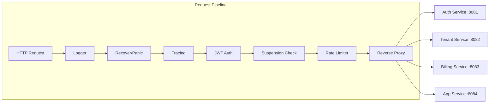

# API Gateway: rate limiting и middleware

---

## Введение

> **Для C# разработчиков**: В ASP.NET Core middleware строится через `IApplicationBuilder.Use()` — цепочка делегатов. В Go паттерн идентичен: `func(http.Handler) http.Handler` — это замыкание, оборачивающее следующий handler. Разница в деталях: нет встроенного DI, нет магических атрибутов `[Authorize]` — каждый слой подключается явно. Rate limiting в ASP.NET Core 7+ встроен (`AddRateLimiter`), в Go — строим вручную через Redis Lua-скрипт.

API Gateway отвечает за:
- Аутентификацию: проверку JWT и извлечение tenant-контекста
- Rate limiting: ограничение частоты запросов per-tenant/per-IP
- Маршрутизацию к upstream-сервисам
- Логирование и трассировку запросов
- Suspension check: отклонение запросов приостановленных тенантов

---

## Архитектура Gateway



---

## Middleware Chain с chi

```go
package main

import (
    "net/http"
    "net/http/httputil"
    "net/url"
    "os"

    "github.com/go-chi/chi/v5"
    "github.com/go-chi/chi/v5/middleware"
    "github.com/redis/go-redis/v9"
    "saas-platform/gateway/internal/mw"
    "saas-platform/auth/internal/token"
)

func main() {
    rdb := redis.NewClient(&redis.Options{Addr: os.Getenv("REDIS_ADDR")})
    tokenManager := token.NewManager(os.Getenv("JWT_SECRET"), 15*time.Minute, 30*24*time.Hour)
    rateLimiter := mw.NewRateLimiter(rdb)

    r := chi.NewRouter()

    // Глобальные middleware — применяются ко всем маршрутам
    r.Use(middleware.RequestID)     // X-Request-ID в каждый запрос
    r.Use(middleware.RealIP)        // берёт реальный IP из X-Forwarded-For
    r.Use(mw.StructuredLogger)      // JSON-логи с tenant_id, request_id, latency
    r.Use(middleware.Recoverer)     // перехват паник — не роняем весь сервер
    r.Use(mw.OpenTelemetry)         // distributed tracing

    // Публичные маршруты — без аутентификации
    r.Group(func(r chi.Router) {
        r.Use(mw.IPRateLimit(rateLimiter, 100, time.Minute)) // 100 req/min per IP
        r.Mount("/auth", proxy("AUTH_SERVICE_URL"))
        r.Post("/tenants", proxy("TENANT_SERVICE_URL").ServeHTTP)
    })

    // Защищённые маршруты — с JWT + tenant-контекстом
    r.Group(func(r chi.Router) {
        r.Use(mw.JWTAuth(tokenManager))
        r.Use(mw.SuspensionCheck)
        r.Use(mw.TenantRateLimit(rateLimiter))

        r.Mount("/api/tenants", proxy("TENANT_SERVICE_URL"))
        r.Mount("/api/billing", proxy("BILLING_SERVICE_URL"))
        r.Mount("/api", proxy("APP_SERVICE_URL"))
    })

    // Stripe webhook — отдельный маршрут без JWT, со своей верификацией
    r.Post("/stripe/webhook", proxy("BILLING_SERVICE_URL").ServeHTTP)

    http.ListenAndServe(":8080", r)
}

func proxy(envKey string) http.Handler {
    target, _ := url.Parse(os.Getenv(envKey))
    return httputil.NewSingleHostReverseProxy(target)
}
```

---

## Rate Limiting: Redis Sliding Window

Sliding window точнее fixed window: запрос не может "скопиться" в конце одного окна и начале следующего.

### Алгоритм Sliding Window

```
Окно = 60 секунд, лимит = 100 запросов

Запрос в T=1:30:05.100:
  1. Удаляем все записи старше T - 60s = 1:29:05.100
  2. Считаем оставшиеся записи
  3. Если count >= 100 → 429 Too Many Requests
  4. Иначе: добавляем запись с timestamp T, EXPIRE ключ через 60s
```

### Lua-скрипт (атомарное выполнение в Redis)

```go
package mw

import (
    "context"
    "fmt"
    "strconv"
    "time"

    "github.com/redis/go-redis/v9"
)

// slidingWindowScript атомарно проверяет и обновляет sliding window.
// Возвращает [allowed (0/1), current_count, limit].
// Lua-скрипт выполняется атомарно — нет гонок между ZCOUNT и ZADD.
var slidingWindowScript = redis.NewScript(`
local key = KEYS[1]
local now = tonumber(ARGV[1])         -- текущее время в ms
local window = tonumber(ARGV[2])      -- размер окна в ms
local limit = tonumber(ARGV[3])       -- максимум запросов
local req_id = ARGV[4]                -- уникальный ID запроса (для member в sorted set)

local window_start = now - window

-- Удаляем устаревшие записи
redis.call('ZREMRANGEBYSCORE', key, '-inf', window_start)

-- Считаем текущее количество
local count = redis.call('ZCARD', key)

if count >= limit then
    return {0, count, limit}
end

-- Добавляем текущий запрос
redis.call('ZADD', key, now, req_id)
redis.call('PEXPIRE', key, window)

return {1, count + 1, limit}
`)

// RateLimiter управляет rate limiting через Redis.
type RateLimiter struct {
    rdb *redis.Client
}

func NewRateLimiter(rdb *redis.Client) *RateLimiter {
    return &RateLimiter{rdb: rdb}
}

type LimitResult struct {
    Allowed bool
    Current int64
    Limit   int64
}

// Check проверяет rate limit для ключа.
// key: "rl:tenant:{uuid}" или "rl:ip:{ip}"
func (r *RateLimiter) Check(ctx context.Context, key string, limit int64, window time.Duration) (LimitResult, error) {
    now := time.Now().UnixMilli()
    windowMs := window.Milliseconds()
    reqID := fmt.Sprintf("%d-%d", now, randInt())

    result, err := slidingWindowScript.Run(ctx, r.rdb,
        []string{key},
        now, windowMs, limit, reqID,
    ).Int64Slice()
    if err != nil {
        // При ошибке Redis — пропускаем запрос (fail open)
        return LimitResult{Allowed: true}, fmt.Errorf("rate limit check: %w", err)
    }

    return LimitResult{
        Allowed: result[0] == 1,
        Current: result[1],
        Limit:   result[2],
    }, nil
}
```

### Middleware: rate limiting per-tenant

```go
// TenantRateLimit ограничивает запросы от тенанта согласно его плану.
func TenantRateLimit(rl *RateLimiter) func(http.Handler) http.Handler {
    return func(next http.Handler) http.Handler {
        return http.HandlerFunc(func(w http.ResponseWriter, r *http.Request) {
            tenant := tenantctx.TenantFromContext(r.Context())

            // Лимит из plan limits — читаем из context (установлен SuspensionCheck)
            limits := tenantctx.LimitsFromContext(r.Context())
            rateLimit := int64(limits.APIRequestsDay)
            if rateLimit < 0 {
                // Безлимитный план
                next.ServeHTTP(w, r)
                return
            }

            // Дневное окно — сбрасывается в полночь UTC
            key := fmt.Sprintf("rl:tenant:%s:%s", tenant.ID, time.Now().UTC().Format("2006-01-02"))

            res, err := rl.Check(r.Context(), key, rateLimit, 24*time.Hour)
            if err != nil {
                // Fail open при недоступности Redis
                next.ServeHTTP(w, r)
                return
            }

            // Заголовки совместимы с RFC 6585 и GitHub API
            w.Header().Set("X-RateLimit-Limit", strconv.FormatInt(res.Limit, 10))
            w.Header().Set("X-RateLimit-Remaining", strconv.FormatInt(max(0, res.Limit-res.Current), 10))
            w.Header().Set("X-RateLimit-Reset", strconv.FormatInt(tomorrowMidnightUTC(), 10))

            if !res.Allowed {
                w.Header().Set("Retry-After", "3600")
                http.Error(w, "rate limit exceeded", http.StatusTooManyRequests)
                return
            }

            next.ServeHTTP(w, r)
        })
    }
}

// IPRateLimit ограничивает запросы с IP — защита публичных эндпоинтов.
func IPRateLimit(rl *RateLimiter, limit int64, window time.Duration) func(http.Handler) http.Handler {
    return func(next http.Handler) http.Handler {
        return http.HandlerFunc(func(w http.ResponseWriter, r *http.Request) {
            ip := r.RemoteAddr // chi.RealIP уже обработал X-Forwarded-For
            key := fmt.Sprintf("rl:ip:%s", ip)

            res, _ := rl.Check(r.Context(), key, limit, window)
            if !res.Allowed {
                http.Error(w, "too many requests", http.StatusTooManyRequests)
                return
            }
            next.ServeHTTP(w, r)
        })
    }
}
```

---

## Middleware: SuspensionCheck

```go
// SuspensionCheck отклоняет запросы приостановленных тенантов.
// Статус тенанта кэшируется в Redis на 60 секунд.
func SuspensionCheck(next http.Handler) http.Handler {
    return http.HandlerFunc(func(w http.ResponseWriter, r *http.Request) {
        tenant := tenantctx.TenantFromContext(r.Context())

        // Статус берём из JWT-клеймов (не из БД) — токен живёт 15 минут,
        // при suspension пользователь будет заблокирован максимум через 15 минут.
        // Для немедленного эффекта нужен token blacklist или introspection.
        if tenant.Status == domain.TenantStatusSuspended {
            w.Header().Set("Content-Type", "application/json")
            w.WriteHeader(http.StatusPaymentRequired)
            json.NewEncoder(w).Encode(map[string]string{
                "error": "account suspended due to payment failure",
                "link":  "https://app.example.com/billing",
            })
            return
        }

        next.ServeHTTP(w, r)
    })
}
```

---

## Structured Logger Middleware

```go
// StructuredLogger логирует каждый запрос в JSON-формате.
// Совместим с OpenTelemetry: добавляет trace_id в лог.
func StructuredLogger(next http.Handler) http.Handler {
    return http.HandlerFunc(func(w http.ResponseWriter, r *http.Request) {
        start := time.Now()

        // Оборачиваем ResponseWriter для захвата статус-кода
        ww := middleware.NewWrapResponseWriter(w, r.ProtoMajor)

        next.ServeHTTP(ww, r)

        // Формируем атрибуты лога
        attrs := []slog.Attr{
            slog.String("method", r.Method),
            slog.String("path", r.URL.Path),
            slog.Int("status", ww.Status()),
            slog.Duration("latency", time.Since(start)),
            slog.String("request_id", middleware.GetReqID(r.Context())),
            slog.Int("bytes", ww.BytesWritten()),
        }

        // Добавляем tenant_id если есть (только для аутентифицированных запросов)
        if tenant, ok := tenantctx.TryTenantFromContext(r.Context()); ok {
            attrs = append(attrs, slog.String("tenant_id", tenant.ID.String()))
        }

        // Добавляем trace_id из OpenTelemetry
        if spanCtx := trace.SpanFromContext(r.Context()).SpanContext(); spanCtx.IsValid() {
            attrs = append(attrs, slog.String("trace_id", spanCtx.TraceID().String()))
        }

        level := slog.LevelInfo
        if ww.Status() >= 500 {
            level = slog.LevelError
        }

        slog.LogAttrs(r.Context(), level, "http request", attrs...)
    })
}
```

---

## API Versioning

```go
// Версионирование через URL-префикс — наиболее явный подход.
// Альтернативы: Accept header (сложнее), query param (не REST-идиоматично).
r.Route("/api/v1", func(r chi.Router) {
    r.Use(mw.JWTAuth(tokenManager))
    r.Use(mw.SuspensionCheck)
    r.Use(mw.TenantRateLimit(rateLimiter))

    r.Mount("/projects", proxy("APP_SERVICE_URL"))
    r.Mount("/users", proxy("APP_SERVICE_URL"))
})

r.Route("/api/v2", func(r chi.Router) {
    r.Use(mw.JWTAuth(tokenManager))
    r.Use(mw.SuspensionCheck)
    r.Use(mw.TenantRateLimit(rateLimiter))

    // v2 добавляет новые поля — старые клиенты на /v1 не ломаются
    r.Mount("/projects", proxy("APP_SERVICE_V2_URL"))
    r.Mount("/users", proxy("APP_SERVICE_URL"))    // users не изменились
})
```

---

## Сравнение с C#

| Аспект | C# / ASP.NET Core | Go / chi |
|--------|-------------------|----|
| Middleware | `IMiddleware` + `Use()` / `app.UseXxx()` | `func(http.Handler) http.Handler` |
| Rate limiting | Встроен в .NET 7+ (`AddRateLimiter`) | Redis + Lua-скрипт |
| Routing | Attribute routing + minimal API | chi `r.Route`, `r.Group`, `r.Mount` |
| Request ID | Автоматически в .NET 8 | `middleware.RequestID` (chi) |
| Reverse proxy | YARP | `net/http/httputil.ReverseProxy` |
| Structured logging | `ILogger<T>` + Serilog | `log/slog` (stdlib с Go 1.21) |

---

## Следующий шаг

API Gateway с rate limiting и middleware-цепочкой готов. Следующий раздел — [Webhooks и фоновые воркеры](06_webhooks_workers.md): надёжная доставка исходящих webhook-уведомлений с retry/backoff и пул горутин для фоновых задач.
