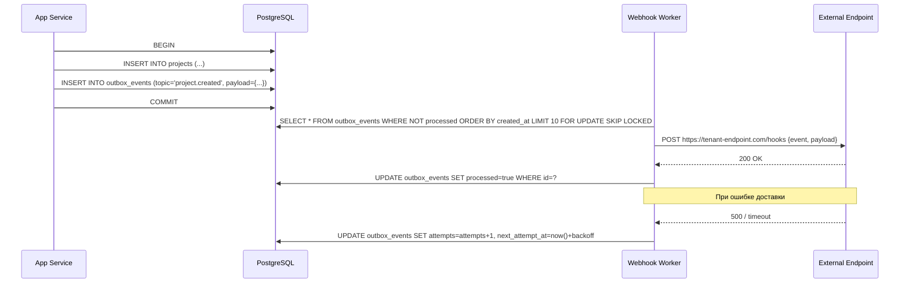

# Webhooks и фоновые воркеры

---

## Введение

> **Для C# разработчиков**: В .NET фоновые задачи реализуются через `IHostedService`, `BackgroundService`, или Hangfire. В Go — через горутины с явным управлением жизненным циклом: `sync.WaitGroup`, каналы для сигналов и `context.Context` для graceful shutdown. Нет магии `[DisableConcurrentExecution]` — конкурентность управляется через пул горутин и семафоры. Паттерн Outbox для webhook-доставки универсален и не зависит от языка.

Этот раздел охватывает:
- **Outbox Pattern** — надёжная доставка webhook-событий без двухфазного коммита
- **Webhook Worker** — пул горутин с retry/backoff и dead letter queue
- **Background Worker** — очередь задач через Redis Streams
- **Graceful Shutdown** — корректное завершение при SIGTERM

---

## Outbox Pattern

Проблема: нужно атомарно сохранить бизнес-данные и отправить webhook-уведомление. Если сначала сохранить, потом отправить — при падении webhook не уйдёт. Если сначала отправить — при падении данные не сохранятся.

Решение: записываем событие в таблицу `outbox_events` в той же транзакции, что и бизнес-данные. Отдельный воркер читает события из таблицы и доставляет их.



---

## SQL-схема Outbox

```sql
-- Outbox events — записываются транзакционно с бизнес-данными
CREATE TABLE public.outbox_events (
    id              UUID PRIMARY KEY DEFAULT gen_random_uuid(),
    tenant_id       UUID NOT NULL REFERENCES public.tenants(id) ON DELETE CASCADE,
    topic           TEXT NOT NULL,    -- "project.created", "user.invited", etc.
    payload         JSONB NOT NULL,
    processed       BOOLEAN NOT NULL DEFAULT false,
    attempts        INT NOT NULL DEFAULT 0,
    last_error      TEXT,
    next_attempt_at TIMESTAMPTZ NOT NULL DEFAULT now(),
    created_at      TIMESTAMPTZ NOT NULL DEFAULT now()
);

-- Индексы для polling воркера
CREATE INDEX ON public.outbox_events(processed, next_attempt_at)
    WHERE NOT processed;

-- Реестр webhook-подписок тенантов
CREATE TABLE public.webhook_endpoints (
    id          UUID PRIMARY KEY DEFAULT gen_random_uuid(),
    tenant_id   UUID NOT NULL REFERENCES public.tenants(id) ON DELETE CASCADE,
    url         TEXT NOT NULL,
    secret      TEXT NOT NULL,  -- HMAC-SHA256 для верификации на стороне получателя
    topics      TEXT[] NOT NULL DEFAULT '{}',  -- пустой = все топики
    is_active   BOOLEAN NOT NULL DEFAULT true,
    created_at  TIMESTAMPTZ NOT NULL DEFAULT now()
);

CREATE INDEX ON public.webhook_endpoints(tenant_id) WHERE is_active;

-- История доставок для дебага
CREATE TABLE public.webhook_deliveries (
    id              UUID PRIMARY KEY DEFAULT gen_random_uuid(),
    outbox_event_id UUID NOT NULL REFERENCES public.outbox_events(id),
    endpoint_id     UUID NOT NULL REFERENCES public.webhook_endpoints(id),
    attempt         INT NOT NULL,
    status_code     INT,
    response_body   TEXT,
    duration_ms     INT,
    delivered_at    TIMESTAMPTZ NOT NULL DEFAULT now()
);
```

---

## Webhook Worker

```go
package webhook

import (
    "bytes"
    "context"
    "crypto/hmac"
    "crypto/sha256"
    "encoding/hex"
    "encoding/json"
    "fmt"
    "log/slog"
    "math"
    "net/http"
    "time"

    "github.com/google/uuid"
    "github.com/jackc/pgx/v5/pgxpool"
)

// Worker опрашивает outbox_events и доставляет webhook-уведомления.
type Worker struct {
    pool       *pgxpool.Pool
    httpClient *http.Client
    concurrency int
}

func NewWorker(pool *pgxpool.Pool, concurrency int) *Worker {
    return &Worker{
        pool: pool,
        httpClient: &http.Client{
            Timeout: 10 * time.Second,
        },
        concurrency: concurrency,
    }
}

// Run запускает воркер и блокирует до отмены контекста.
func (w *Worker) Run(ctx context.Context) error {
    // Семафор — ограничивает конкурентность доставки
    sem := make(chan struct{}, w.concurrency)

    ticker := time.NewTicker(5 * time.Second)
    defer ticker.Stop()

    slog.Info("webhook worker started", "concurrency", w.concurrency)

    for {
        select {
        case <-ctx.Done():
            // Ждём завершения текущих доставок
            for i := 0; i < w.concurrency; i++ {
                sem <- struct{}{}
            }
            slog.Info("webhook worker stopped")
            return ctx.Err()

        case <-ticker.C:
            events, err := w.fetchPending(ctx)
            if err != nil {
                slog.Error("fetch pending events", "err", err)
                continue
            }

            for _, event := range events {
                event := event // захват переменной цикла
                sem <- struct{}{}
                go func() {
                    defer func() { <-sem }()
                    w.deliver(ctx, event)
                }()
            }
        }
    }
}

// fetchPending забирает до 100 необработанных событий с блокировкой.
// FOR UPDATE SKIP LOCKED предотвращает дублирование при нескольких воркерах.
func (w *Worker) fetchPending(ctx context.Context) ([]OutboxEvent, error) {
    rows, err := w.pool.Query(ctx, `
        SELECT id, tenant_id, topic, payload, attempts
        FROM public.outbox_events
        WHERE NOT processed
          AND next_attempt_at <= now()
        ORDER BY next_attempt_at
        LIMIT 100
        FOR UPDATE SKIP LOCKED
    `)
    if err != nil {
        return nil, err
    }
    defer rows.Close()

    var events []OutboxEvent
    for rows.Next() {
        var e OutboxEvent
        if err := rows.Scan(&e.ID, &e.TenantID, &e.Topic, &e.Payload, &e.Attempts); err != nil {
            return nil, err
        }
        events = append(events, e)
    }
    return events, rows.Err()
}

// deliver доставляет одно событие всем подходящим endpoints тенанта.
func (w *Worker) deliver(ctx context.Context, event OutboxEvent) {
    endpoints, err := w.getEndpoints(ctx, event.TenantID, event.Topic)
    if err != nil {
        slog.Error("get endpoints", "event_id", event.ID, "err", err)
        return
    }

    if len(endpoints) == 0 {
        // У тенанта нет активных webhook — помечаем как обработанное
        w.markProcessed(ctx, event.ID)
        return
    }

    allDelivered := true
    for _, ep := range endpoints {
        if err := w.deliverToEndpoint(ctx, event, ep); err != nil {
            allDelivered = false
            slog.Warn("delivery failed", "event_id", event.ID, "endpoint", ep.URL, "err", err)
        }
    }

    if allDelivered {
        w.markProcessed(ctx, event.ID)
    } else {
        w.scheduleRetry(ctx, event)
    }
}

// deliverToEndpoint отправляет HTTP POST с подписанным payload.
func (w *Worker) deliverToEndpoint(ctx context.Context, event OutboxEvent, ep WebhookEndpoint) error {
    body, err := json.Marshal(map[string]any{
        "id":         event.ID,
        "topic":      event.Topic,
        "tenant_id":  event.TenantID,
        "payload":    event.Payload,
        "created_at": event.CreatedAt,
    })
    if err != nil {
        return err
    }

    req, err := http.NewRequestWithContext(ctx, http.MethodPost, ep.URL, bytes.NewReader(body))
    if err != nil {
        return err
    }

    // HMAC-SHA256 подпись — получатель может верифицировать подлинность
    sig := signPayload(body, ep.Secret)
    req.Header.Set("Content-Type", "application/json")
    req.Header.Set("X-Webhook-Signature", "sha256="+sig)
    req.Header.Set("X-Webhook-Topic", event.Topic)
    req.Header.Set("X-Webhook-ID", event.ID.String())

    start := time.Now()
    resp, err := w.httpClient.Do(req)
    duration := time.Since(start)

    var statusCode int
    if resp != nil {
        statusCode = resp.StatusCode
        resp.Body.Close()
    }

    // Логируем попытку доставки
    w.recordDelivery(ctx, event.ID, ep.ID, event.Attempts+1, statusCode, duration)

    if err != nil {
        return fmt.Errorf("http post: %w", err)
    }
    if statusCode < 200 || statusCode >= 300 {
        return fmt.Errorf("endpoint returned %d", statusCode)
    }
    return nil
}

// signPayload вычисляет HMAC-SHA256 подпись payload.
func signPayload(payload []byte, secret string) string {
    mac := hmac.New(sha256.New, []byte(secret))
    mac.Write(payload)
    return hex.EncodeToString(mac.Sum(nil))
}

// scheduleRetry планирует следующую попытку с экспоненциальным backoff.
// Попытки: 0→1m, 1→2m, 2→4m, 3→8m, ..., max 24h
// После 10 попыток — Dead Letter Queue.
func (w *Worker) scheduleRetry(ctx context.Context, event OutboxEvent) {
    const maxAttempts = 10

    if event.Attempts >= maxAttempts {
        // Переносим в DLQ — больше не пытаемся доставить
        w.moveToDLQ(ctx, event)
        return
    }

    // Экспоненциальный backoff: 2^attempts минут, max 24 часа
    backoff := time.Duration(math.Pow(2, float64(event.Attempts))) * time.Minute
    if backoff > 24*time.Hour {
        backoff = 24 * time.Hour
    }

    _, err := w.pool.Exec(ctx, `
        UPDATE public.outbox_events
        SET attempts = attempts + 1,
            next_attempt_at = now() + $1::interval,
            last_error = $2
        WHERE id = $3
    `, backoff.String(), "delivery failed", event.ID)
    if err != nil {
        slog.Error("schedule retry", "event_id", event.ID, "err", err)
    }
}
```

---

## Background Worker: Redis Streams

Redis Streams — персистентная очередь с consumer groups. Лучше простого LPUSH/RPOP: сообщения не теряются при падении воркера, поддерживает multiple consumers.

```go
package tasks

import (
    "context"
    "encoding/json"
    "fmt"
    "log/slog"

    "github.com/redis/go-redis/v9"
)

// TaskType — тип фоновой задачи.
type TaskType string

const (
    TaskSendWelcomeEmail  TaskType = "email.welcome"
    TaskGenerateReport    TaskType = "report.generate"
    TaskCleanupExpiredData TaskType = "cleanup.expired"
    TaskExportTenantData  TaskType = "export.tenant_data"
)

const (
    streamKey    = "tasks"
    consumerGroup = "workers"
)

// Producer публикует задачи в Redis Stream.
type Producer struct {
    rdb *redis.Client
}

func NewProducer(rdb *redis.Client) *Producer {
    return &Producer{rdb: rdb}
}

// Enqueue добавляет задачу в очередь.
func (p *Producer) Enqueue(ctx context.Context, taskType TaskType, payload any) error {
    data, err := json.Marshal(payload)
    if err != nil {
        return err
    }

    return p.rdb.XAdd(ctx, &redis.XAddArgs{
        Stream: streamKey,
        MaxLen: 10000, // ограничиваем размер стрима
        Values: map[string]any{
            "type":    string(taskType),
            "payload": string(data),
        },
    }).Err()
}

// Consumer читает задачи из Redis Stream.
type Consumer struct {
    rdb      *redis.Client
    handlers map[TaskType]HandlerFunc
    name     string // имя этого consumer instance
}

type HandlerFunc func(ctx context.Context, payload json.RawMessage) error

func NewConsumer(rdb *redis.Client, name string) *Consumer {
    return &Consumer{
        rdb:      rdb,
        handlers: make(map[TaskType]HandlerFunc),
        name:     name,
    }
}

// Register регистрирует обработчик для типа задачи.
func (c *Consumer) Register(taskType TaskType, h HandlerFunc) {
    c.handlers[taskType] = h
}

// Run запускает чтение из Redis Stream.
// При старте создаёт consumer group если не существует.
func (c *Consumer) Run(ctx context.Context) error {
    // Создаём consumer group (идемпотентно)
    err := c.rdb.XGroupCreateMkStream(ctx, streamKey, consumerGroup, "0").Err()
    if err != nil && err.Error() != "BUSYGROUP Consumer Group name already exists" {
        return fmt.Errorf("create consumer group: %w", err)
    }

    slog.Info("background worker started", "consumer", c.name)

    for {
        if ctx.Err() != nil {
            return ctx.Err()
        }

        // Читаем до 10 сообщений, ждём до 5 секунд
        streams, err := c.rdb.XReadGroup(ctx, &redis.XReadGroupArgs{
            Group:    consumerGroup,
            Consumer: c.name,
            Streams:  []string{streamKey, ">"},
            Count:    10,
            Block:    5000, // ms
        }).Result()
        if err == redis.Nil {
            continue // timeout — нет новых сообщений
        }
        if err != nil {
            if ctx.Err() != nil {
                return ctx.Err()
            }
            slog.Error("xreadgroup", "err", err)
            continue
        }

        for _, stream := range streams {
            for _, msg := range stream.Messages {
                c.process(ctx, msg)
            }
        }
    }
}

func (c *Consumer) process(ctx context.Context, msg redis.XMessage) {
    taskTypeStr, _ := msg.Values["type"].(string)
    payloadStr, _ := msg.Values["payload"].(string)

    handler, ok := c.handlers[TaskType(taskTypeStr)]
    if !ok {
        slog.Warn("no handler for task type", "type", taskTypeStr)
        c.ack(ctx, msg.ID)
        return
    }

    if err := handler(ctx, json.RawMessage(payloadStr)); err != nil {
        slog.Error("task handler failed", "type", taskTypeStr, "msg_id", msg.ID, "err", err)
        // Не ACK — Streams повторно доставят через XAUTOCLAIM
        return
    }

    c.ack(ctx, msg.ID)
}

func (c *Consumer) ack(ctx context.Context, msgID string) {
    if err := c.rdb.XAck(ctx, streamKey, consumerGroup, msgID).Err(); err != nil {
        slog.Error("xack failed", "msg_id", msgID, "err", err)
    }
}
```

---

## Обработчики задач

```go
package tasks

import (
    "context"
    "encoding/json"
    "fmt"
    "log/slog"
    "net/smtp"
)

// WelcomeEmailPayload — payload задачи отправки welcome-письма.
type WelcomeEmailPayload struct {
    TenantID   string `json:"tenant_id"`
    TenantName string `json:"tenant_name"`
    UserEmail  string `json:"user_email"`
    UserName   string `json:"user_name"`
}

// HandleWelcomeEmail отправляет welcome-письмо новому пользователю.
func HandleWelcomeEmail(emailSender EmailSender) HandlerFunc {
    return func(ctx context.Context, payload json.RawMessage) error {
        var p WelcomeEmailPayload
        if err := json.Unmarshal(payload, &p); err != nil {
            return fmt.Errorf("unmarshal payload: %w", err)
        }

        if err := emailSender.Send(ctx, Email{
            To:      p.UserEmail,
            Subject: fmt.Sprintf("Добро пожаловать в %s!", p.TenantName),
            Body:    renderWelcomeTemplate(p),
        }); err != nil {
            return fmt.Errorf("send email to %s: %w", p.UserEmail, err)
        }

        slog.Info("welcome email sent", "tenant_id", p.TenantID, "to", p.UserEmail)
        return nil
    }
}

// CleanupExpiredData удаляет устаревшие данные тенанта.
func HandleCleanupExpired(pool *pgxpool.Pool) HandlerFunc {
    return func(ctx context.Context, payload json.RawMessage) error {
        var p struct {
            TenantID string `json:"tenant_id"`
            Schema   string `json:"schema"`
        }
        if err := json.Unmarshal(payload, &p); err != nil {
            return err
        }

        // Удаляем audit_log старше 90 дней
        _, err := pool.Exec(ctx, fmt.Sprintf(`
            SET search_path TO %s;
            DELETE FROM audit_log WHERE created_at < now() - interval '90 days'
        `, p.Schema))
        if err != nil {
            return fmt.Errorf("cleanup audit_log for %s: %w", p.TenantID, err)
        }

        return nil
    }
}
```

---

## Graceful Shutdown

```go
package main

import (
    "context"
    "log/slog"
    "os"
    "os/signal"
    "sync"
    "syscall"
    "time"
)

func main() {
    ctx, stop := signal.NotifyContext(context.Background(), os.Interrupt, syscall.SIGTERM)
    defer stop()

    // Инициализация воркеров
    webhookWorker := webhook.NewWorker(pool, 10)
    taskConsumer := tasks.NewConsumer(rdb, "worker-1")
    taskConsumer.Register(tasks.TaskSendWelcomeEmail, tasks.HandleWelcomeEmail(emailSender))
    taskConsumer.Register(tasks.TaskCleanupExpiredData, tasks.HandleCleanupExpired(pool))

    var wg sync.WaitGroup

    // Запуск webhook worker
    wg.Add(1)
    go func() {
        defer wg.Done()
        if err := webhookWorker.Run(ctx); err != nil && err != context.Canceled {
            slog.Error("webhook worker", "err", err)
        }
    }()

    // Запуск background task consumer
    wg.Add(1)
    go func() {
        defer wg.Done()
        if err := taskConsumer.Run(ctx); err != nil && err != context.Canceled {
            slog.Error("task consumer", "err", err)
        }
    }()

    // Ждём сигнала завершения
    <-ctx.Done()
    slog.Info("shutdown signal received, waiting for workers...")

    // Даём воркерам до 30 секунд на завершение текущих задач
    done := make(chan struct{})
    go func() {
        wg.Wait()
        close(done)
    }()

    select {
    case <-done:
        slog.Info("workers stopped gracefully")
    case <-time.After(30 * time.Second):
        slog.Warn("forced shutdown after timeout")
    }
}
```

---

## Верификация Webhook на стороне получателя

Документация для клиентов — как верифицировать входящие webhook:

```go
// Пример для клиента — верификация HMAC-SHA256 подписи.
// Секрет получают при регистрации webhook endpoint.
func VerifyWebhookSignature(body []byte, signatureHeader, secret string) bool {
    // Заголовок: "sha256=abc123..."
    parts := strings.SplitN(signatureHeader, "=", 2)
    if len(parts) != 2 || parts[0] != "sha256" {
        return false
    }

    expected, err := hex.DecodeString(parts[1])
    if err != nil {
        return false
    }

    mac := hmac.New(sha256.New, []byte(secret))
    mac.Write(body)
    actual := mac.Sum(nil)

    // Constant-time сравнение — защита от timing attacks
    return hmac.Equal(expected, actual)
}
```

---

## Сравнение с C#

| Аспект | C# / .NET | Go |
|--------|-----------|-----|
| Фоновые задачи | `BackgroundService`, `IHostedService` | Горутины + `context.Context` |
| Job queue | Hangfire, MassTransit | Redis Streams + consumer groups |
| Retry policy | Polly `WaitAndRetryAsync` | Ручной backoff + `pgx` update |
| Graceful shutdown | `IHostApplicationLifetime` | `signal.NotifyContext` + `sync.WaitGroup` |
| HMAC верификация | `HMACSHA256.ComputeHash()` | `crypto/hmac` + `crypto/sha256` |
| Dead Letter Queue | Hangfire DLQ / Azure Service Bus DLQ | Кастомная таблица `outbox_dlq` |

---

## Следующий шаг

Webhooks и фоновые воркеры готовы. Последний раздел — [Деплой: Kubernetes и observability](07_deployment.md): Helm-чарты, HPA, Prometheus метрики и distributed tracing для SaaS-платформы.
