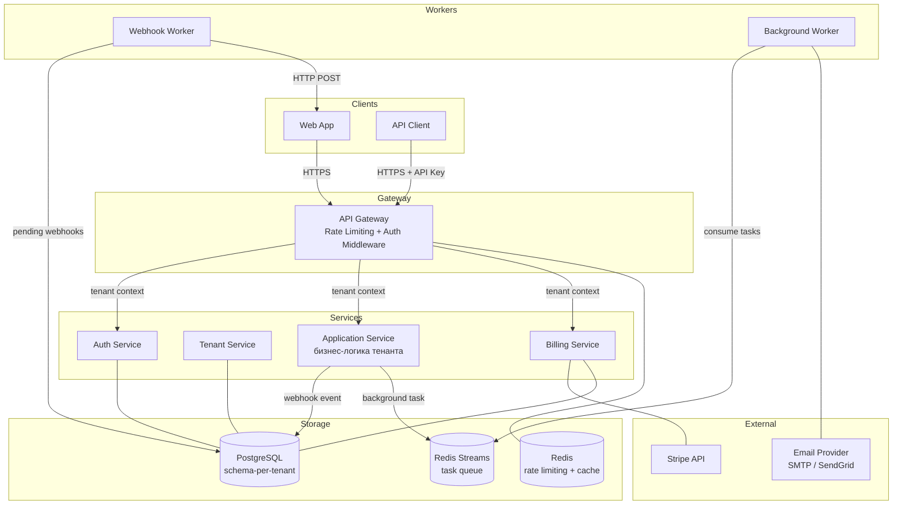

# Проект 4: SaaS Platform

> Уровень: **Advanced** | Время: ~4 недели

---

## Цель проекта

Построить **многопользовательскую SaaS-платформу** — систему, где сотни организаций (тенантов) работают в одном приложении с полной изоляцией данных, управлением подписками и ограничением ресурсов. Это ключевой архитектурный паттерн современного B2B-бизнеса: от Slack и GitHub до Jira и Stripe.

Проект охватывает multi-tenancy, OAuth2/JWT-аутентификацию, billing через Stripe, rate limiting на Redis, надёжную доставку webhook-событий и фоновые воркеры.

> **Для C# разработчиков**: Если вы работали с ASP.NET Core + Azure AD B2C, StripeAPI .NET SDK, Hangfire или BackgroundService — здесь вы найдёте Go-эквиваленты тех же решений. Go заставляет быть явным: tenant context передаётся через `context.Context`, middleware пишется как функция, а не атрибут, очереди реализуются через горутины и каналы.

---

## Компоненты системы

| Сервис | Ответственность | Ключевые технологии |
|--------|-----------------|---------------------|
| **Auth Service** | Регистрация, login, OAuth2 PKCE, JWT | golang-jwt, PostgreSQL |
| **Tenant Service** | Онбординг, планы, feature flags | PostgreSQL, schema-per-tenant |
| **Billing Service** | Подписки, Stripe, usage metering | Stripe Go SDK, PostgreSQL |
| **API Gateway** | Rate limiting, маршрутизация, middleware | Redis, chi/net/http |
| **Webhook Worker** | Исходящие webhook-уведомления с retry | PostgreSQL, горутины |
| **Background Worker** | Фоновые задачи: email, отчёты, очистка | Redis Streams, горутины |

---

## Архитектура



---

## Чему вы научитесь

### Go-специфичные навыки

- **Context propagation** — передача tenant ID через `context.Context` без глобального состояния
- **Middleware chain** — построение цепочки middleware через замыкания и `http.Handler`
- **Schema-per-tenant** — динамическое переключение PostgreSQL-схемы через `search_path`
- **Redis sliding window** — rate limiting без гонок через Lua-скрипты в Redis
- **Outbox pattern** — надёжная доставка событий без двухфазного коммита
- **Worker pool** — пул горутин с graceful shutdown для фоновых задач
- **Stripe webhook verification** — верификация подписи HMAC-SHA256 входящих webhook

### Архитектурные паттерны

- **Multi-tenancy** — shared database, separate schema: баланс изоляции и стоимости
- **Outbox Pattern** — атомарная запись события вместе с бизнес-данными
- **Saga (упрощённая)** — онбординг тенанта через последовательность компенсируемых шагов
- **Token Bucket / Sliding Window** — алгоритмы ограничения частоты запросов
- **Dead Letter Queue** — обработка необратимо сбойных webhook-доставок

---

## Структура проекта

```
saas-platform/
├── auth/
│   ├── cmd/server/main.go
│   ├── internal/
│   │   ├── token/       # JWT: выдача и валидация
│   │   ├── oauth/       # OAuth2 PKCE flow
│   │   └── handler/     # HTTP handlers
│   └── go.mod
├── tenant/
│   ├── cmd/server/main.go
│   ├── internal/
│   │   ├── onboarding/  # создание тенанта + схемы
│   │   ├── plan/        # тарифные планы
│   │   └── feature/     # feature flags
│   └── go.mod
├── billing/
│   ├── cmd/server/main.go
│   ├── internal/
│   │   ├── subscription/ # подписки и планы
│   │   ├── metering/     # usage counters
│   │   └── stripe/       # Stripe интеграция
│   └── go.mod
├── gateway/
│   ├── cmd/server/main.go
│   ├── internal/
│   │   ├── middleware/   # auth, tenant, rate limit
│   │   └── proxy/       # reverse proxy
│   └── go.mod
├── worker/
│   ├── cmd/webhook/main.go
│   ├── cmd/background/main.go
│   ├── internal/
│   │   ├── webhook/      # outbound доставка
│   │   └── tasks/       # email, отчёты, cleanup
│   └── go.mod
├── shared/
│   ├── tenantctx/       # context helpers
│   ├── pgschema/        # schema switching
│   └── go.mod
└── docker-compose.yml
```

---

## Технологический стек

| Компонент | Технология | Обоснование |
|-----------|------------|-------------|
| HTTP router | **chi** | Легковесный, middleware-friendly, совместим с `net/http` |
| Auth | **golang-jwt/jwt/v5** | Стандарт де-факто для JWT в Go |
| DB driver | **pgx/v5** | Нативный PostgreSQL driver, лучшая производительность |
| Migrations | **golang-migrate** | SQL-миграции, поддержка schema-per-tenant |
| Billing | **stripe-go/v76** | Официальный Stripe SDK |
| Rate limiting | **Redis + Lua** | Атомарный sliding window без гонок |
| Task queue | **Redis Streams** | Персистентная очередь, consumer groups |
| Config | **envconfig** | 12-factor: конфигурация из окружения |
| Observability | **OpenTelemetry + Prometheus** | Traces + metrics |
| Deploy | **Kubernetes + Helm** | Horizontal Pod Autoscaler |

> **Почему chi, а не Gin/Echo?**
> chi строит поверх стандартного `net/http`, возвращает `http.Handler` — все middleware переносимы в любой роутер. Gin и Echo используют собственный `Context`, создавая vendor lock-in. Для SaaS-платформы с несколькими командами переносимость важнее convenience.
