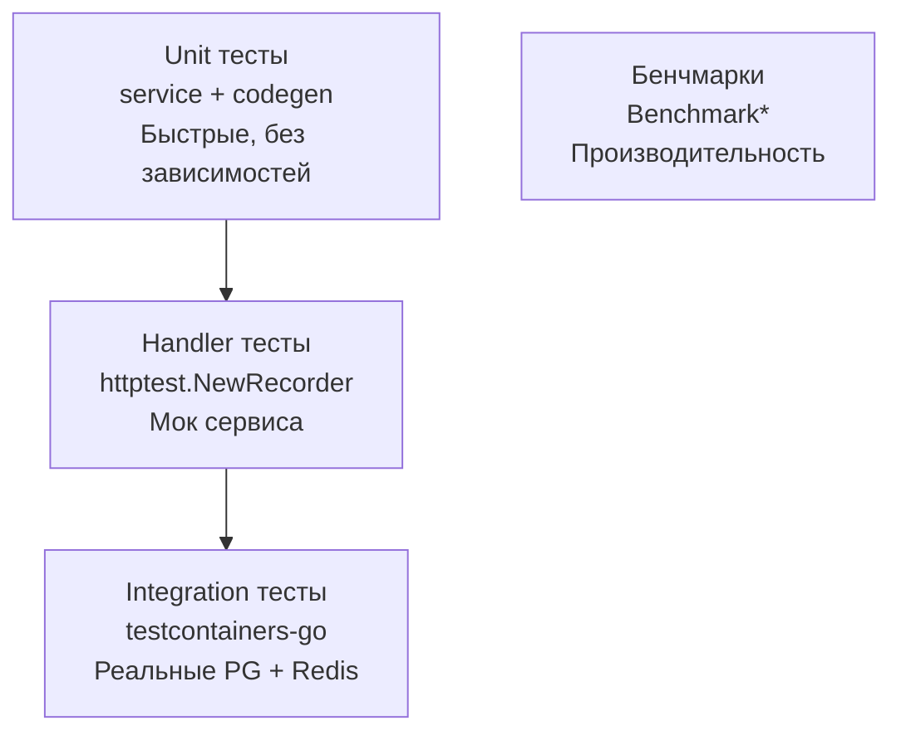

# 4. Тестирование и бенчмарки

## Содержание

- [Стратегия тестирования](#стратегия-тестирования)
- [Unit тесты сервисного слоя](#unit-тесты-сервисного-слоя)
- [Тесты HTTP хэндлеров](#тесты-http-хэндлеров)
- [Integration тесты с testcontainers-go](#integration-тесты-с-testcontainers-go)
- [Бенчмарки](#бенчмарки)
- [Покрытие кода](#покрытие-кода)
- [Сравнительная таблица](#сравнительная-таблица)
- [Чек-лист](#чек-лист)

---

## Стратегия тестирования



| Тип | Инструмент | Что тестирует | Скорость |
|-----|-----------|--------------|---------|
| Unit | `testing` + `testify` | Бизнес-логика, алгоритмы | < 1мс |
| Handler | `net/http/httptest` | HTTP слой с моком | < 5мс |
| Integration | `testcontainers-go` | Полный стек | 5-30с (холодный старт) |
| Benchmark | `testing.B` | Производительность | По необходимости |

> 💡 **Для C# разработчиков**: `testing` + `testify` ≈ xUnit + FluentAssertions.
> `testcontainers-go` ≈ TestContainers.NET. Мок-объекты через интерфейсы — без Moq.

---

## Unit тесты сервисного слоя

В Go не нужны mock-библиотеки как Moq. Мок — это просто struct, реализующий интерфейс.

### Мок репозитория

**C# (Moq)**:
```csharp
var mockRepo = new Mock<IUrlRepository>();
mockRepo.Setup(r => r.GetByCodeAsync("abc123", It.IsAny<CancellationToken>()))
        .ReturnsAsync(new Url { Code = "abc123", OriginalUrl = "https://go.dev" });
```

**Go (вручную)**:
```go
// internal/domain/service_test.go
package domain_test

import (
    "context"
    "testing"

    "github.com/stretchr/testify/assert"
    "github.com/stretchr/testify/require"
    "github.com/yourname/urlshortener/internal/domain"
)

// mockURLRepo — мок репозитория. Реализует domain.URLRepository.
// Никаких библиотек — просто struct с полями-функциями для гибкости.
type mockURLRepo struct {
    getByCodeFn         func(ctx context.Context, code string) (domain.URL, error)
    createFn            func(ctx context.Context, url domain.URL) (domain.URL, error)
    incrementClickCountFn func(ctx context.Context, code string) error
}

func (m *mockURLRepo) GetByCode(ctx context.Context, code string) (domain.URL, error) {
    if m.getByCodeFn != nil {
        return m.getByCodeFn(ctx, code)
    }
    return domain.URL{}, domain.ErrNotFound
}

func (m *mockURLRepo) Create(ctx context.Context, url domain.URL) (domain.URL, error) {
    if m.createFn != nil {
        return m.createFn(ctx, url)
    }
    return url, nil
}

func (m *mockURLRepo) IncrementClickCount(ctx context.Context, code string) error {
    if m.incrementClickCountFn != nil {
        return m.incrementClickCountFn(ctx, code)
    }
    return nil
}

// mockCache — мок кэша.
type mockCache struct {
    getFn    func(ctx context.Context, code string) (string, error)
    setFn    func(ctx context.Context, code, url string) error
    deleteFn func(ctx context.Context, code string) error
}

func (m *mockCache) Get(ctx context.Context, code string) (string, error) {
    if m.getFn != nil {
        return m.getFn(ctx, code)
    }
    return "", domain.ErrNotFound
}

func (m *mockCache) Set(ctx context.Context, code, url string) error {
    if m.setFn != nil {
        return m.setFn(ctx, code, url)
    }
    return nil
}

func (m *mockCache) Delete(ctx context.Context, code string) error {
    if m.deleteFn != nil {
        return m.deleteFn(ctx, code)
    }
    return nil
}
```

### Тесты CreateURL

```go
func TestURLService_CreateURL(t *testing.T) {
    // Табличные тесты — идиоматичный Go подход
    // Аналог [Theory] + [InlineData] в xUnit
    tests := []struct {
        name        string
        originalURL string
        wantErr     bool
        errIs       error
    }{
        {
            name:        "валидный http URL",
            originalURL: "http://example.com/very/long/path",
            wantErr:     false,
        },
        {
            name:        "валидный https URL",
            originalURL: "https://go.dev/doc",
            wantErr:     false,
        },
        {
            name:        "невалидный URL без схемы",
            originalURL: "example.com",
            wantErr:     true,
            errIs:       domain.ErrInvalidURL,
        },
        {
            name:        "пустой URL",
            originalURL: "",
            wantErr:     true,
            errIs:       domain.ErrInvalidURL,
        },
        {
            name:        "ftp схема не поддерживается",
            originalURL: "ftp://files.example.com",
            wantErr:     true,
            errIs:       domain.ErrInvalidURL,
        },
    }

    for _, tt := range tests {
        t.Run(tt.name, func(t *testing.T) {
            // Arrange: создаём сервис с моками
            repo := &mockURLRepo{
                // Мок: код всегда свободен (GetByCode возвращает ErrNotFound)
                getByCodeFn: func(_ context.Context, _ string) (domain.URL, error) {
                    return domain.URL{}, domain.ErrNotFound
                },
                createFn: func(_ context.Context, url domain.URL) (domain.URL, error) {
                    url.ID = 1
                    return url, nil
                },
            }
            cache := &mockCache{}
            svc := domain.NewURLService(repo, cache)

            // Act
            result, err := svc.CreateURL(context.Background(), tt.originalURL)

            // Assert
            if tt.wantErr {
                require.Error(t, err)
                if tt.errIs != nil {
                    assert.ErrorIs(t, err, tt.errIs)
                }
                return
            }

            require.NoError(t, err)
            assert.Equal(t, tt.originalURL, result.OriginalURL)
            assert.NotEmpty(t, result.Code)
            assert.Len(t, result.Code, 6)
        })
    }
}
```

### Тест Redirect (cache-aside)

```go
func TestURLService_Redirect(t *testing.T) {
    t.Run("кэш-попадание — не обращается к БД", func(t *testing.T) {
        dbCalled := false

        repo := &mockURLRepo{
            getByCodeFn: func(_ context.Context, _ string) (domain.URL, error) {
                dbCalled = true // помечаем что БД была вызвана
                return domain.URL{}, nil
            },
        }
        cache := &mockCache{
            getFn: func(_ context.Context, code string) (string, error) {
                // Кэш-попадание
                return "https://go.dev", nil
            },
        }
        svc := domain.NewURLService(repo, cache)

        url, err := svc.Redirect(context.Background(), "abc123")

        require.NoError(t, err)
        assert.Equal(t, "https://go.dev", url)

        // Даём горутинам время на выполнение (запись клика асинхронна)
        // В production тестах используют sync-примитивы или faketime
        time.Sleep(10 * time.Millisecond)
        assert.False(t, dbCalled, "при кэш-попадании не должны ходить в БД")
    })

    t.Run("кэш-промах — обращается к БД и заполняет кэш", func(t *testing.T) {
        setCalled := false

        repo := &mockURLRepo{
            getByCodeFn: func(_ context.Context, code string) (domain.URL, error) {
                return domain.URL{Code: code, OriginalURL: "https://go.dev"}, nil
            },
        }
        cache := &mockCache{
            getFn: func(_ context.Context, _ string) (string, error) {
                return "", domain.ErrNotFound // кэш-промах
            },
            setFn: func(_ context.Context, _, _ string) error {
                setCalled = true
                return nil
            },
        }
        svc := domain.NewURLService(repo, cache)

        url, err := svc.Redirect(context.Background(), "abc123")

        require.NoError(t, err)
        assert.Equal(t, "https://go.dev", url)

        time.Sleep(10 * time.Millisecond)
        assert.True(t, setCalled, "при промахе должны заполнить кэш")
    })

    t.Run("URL не найден — ErrNotFound", func(t *testing.T) {
        repo := &mockURLRepo{
            getByCodeFn: func(_ context.Context, code string) (domain.URL, error) {
                return domain.URL{}, domain.NewNotFoundError(code)
            },
        }
        svc := domain.NewURLService(repo, &mockCache{})

        _, err := svc.Redirect(context.Background(), "unknown")

        require.Error(t, err)
        assert.ErrorIs(t, err, domain.ErrNotFound)
    })
}
```

### Тест генерации кода

```go
// internal/domain/codegen_test.go
package domain_test

import (
    "strings"
    "testing"

    "github.com/stretchr/testify/assert"
    "github.com/stretchr/testify/require"
)

func TestGenerateCode(t *testing.T) {
    t.Run("длина кода 6 символов", func(t *testing.T) {
        code, err := domain.GenerateCode()
        require.NoError(t, err)
        assert.Len(t, code, 6)
    })

    t.Run("только Base62 символы", func(t *testing.T) {
        const validChars = "0123456789abcdefghijklmnopqrstuvwxyzABCDEFGHIJKLMNOPQRSTUVWXYZ"
        for range 100 {
            code, err := domain.GenerateCode()
            require.NoError(t, err)
            for _, ch := range code {
                assert.True(t, strings.ContainsRune(validChars, ch),
                    "символ %q не из Base62 алфавита", ch)
            }
        }
    })

    t.Run("коды уникальны (статистически)", func(t *testing.T) {
        const n = 1000
        codes := make(map[string]struct{}, n)
        for range n {
            code, err := domain.GenerateCode()
            require.NoError(t, err)
            codes[code] = struct{}{}
        }
        // При 1000 генерациях вероятность коллизии крайне мала
        assert.Greater(t, len(codes), 990,
            "слишком много коллизий: %d уникальных из %d", len(codes), n)
    })
}
```

---

## Тесты HTTP хэндлеров

`httptest` — стандартный пакет для тестирования HTTP без запуска реального сервера.

```go
// internal/handler/url_test.go
package handler_test

import (
    "bytes"
    "context"
    "encoding/json"
    "errors"
    "net/http"
    "net/http/httptest"
    "testing"

    "github.com/stretchr/testify/assert"
    "github.com/stretchr/testify/require"
    "github.com/yourname/urlshortener/internal/domain"
    "github.com/yourname/urlshortener/internal/handler"
)

// mockURLService — мок сервиса для тестов хэндлеров.
type mockURLService struct {
    createFn   func(ctx context.Context, url string) (handler.URLResult, error)
    redirectFn func(ctx context.Context, code string) (string, error)
    getStatsFn func(ctx context.Context, code string) (handler.StatsResult, error)
}

func (m *mockURLService) CreateURL(ctx context.Context, url string) (handler.URLResult, error) {
    return m.createFn(ctx, url)
}
func (m *mockURLService) Redirect(ctx context.Context, code string) (string, error) {
    return m.redirectFn(ctx, code)
}
func (m *mockURLService) GetStats(ctx context.Context, code string) (handler.StatsResult, error) {
    return m.getStatsFn(ctx, code)
}

func TestURLHandler_CreateURL(t *testing.T) {
    t.Run("успешное создание — 201 Created", func(t *testing.T) {
        svc := &mockURLService{
            createFn: func(_ context.Context, url string) (handler.URLResult, error) {
                return handler.URLResult{Code: "abc123", OriginalURL: url}, nil
            },
        }
        h := handler.NewURLHandler(svc, "http://localhost:8080")

        // Создаём тестовый запрос
        body := bytes.NewBufferString(`{"url": "https://go.dev"}`)
        req := httptest.NewRequest(http.MethodPost, "/api/urls", body)
        req.Header.Set("Content-Type", "application/json")

        // Recorder записывает ответ хэндлера
        rec := httptest.NewRecorder()

        h.CreateURL(rec, req)

        assert.Equal(t, http.StatusCreated, rec.Code)

        var resp map[string]string
        require.NoError(t, json.NewDecoder(rec.Body).Decode(&resp))
        assert.Equal(t, "abc123", resp["code"])
        assert.Equal(t, "http://localhost:8080/abc123", resp["short_url"])
    })

    t.Run("невалидный URL — 400 Bad Request", func(t *testing.T) {
        svc := &mockURLService{
            createFn: func(_ context.Context, url string) (handler.URLResult, error) {
                return handler.URLResult{}, fmt.Errorf("%w: no https", domain.ErrInvalidURL)
            },
        }
        h := handler.NewURLHandler(svc, "http://localhost:8080")

        body := bytes.NewBufferString(`{"url": "not-a-url"}`)
        req := httptest.NewRequest(http.MethodPost, "/api/urls", body)
        rec := httptest.NewRecorder()

        h.CreateURL(rec, req)

        assert.Equal(t, http.StatusBadRequest, rec.Code)
    })

    t.Run("невалидный JSON — 400 Bad Request", func(t *testing.T) {
        svc := &mockURLService{}
        h := handler.NewURLHandler(svc, "http://localhost:8080")

        body := bytes.NewBufferString(`{invalid json`)
        req := httptest.NewRequest(http.MethodPost, "/api/urls", body)
        rec := httptest.NewRecorder()

        h.CreateURL(rec, req)

        assert.Equal(t, http.StatusBadRequest, rec.Code)
    })
}

func TestURLHandler_Redirect(t *testing.T) {
    t.Run("редирект на оригинальный URL", func(t *testing.T) {
        svc := &mockURLService{
            redirectFn: func(_ context.Context, code string) (string, error) {
                return "https://go.dev", nil
            },
        }
        h := handler.NewURLHandler(svc, "http://localhost:8080")

        // Для path-параметров в net/http тестах используем SetPathValue (Go 1.22+)
        req := httptest.NewRequest(http.MethodGet, "/abc123", nil)
        req.SetPathValue("code", "abc123")
        rec := httptest.NewRecorder()

        h.Redirect(rec, req)

        assert.Equal(t, http.StatusFound, rec.Code)
        assert.Equal(t, "https://go.dev", rec.Header().Get("Location"))
    })

    t.Run("код не найден — 404", func(t *testing.T) {
        svc := &mockURLService{
            redirectFn: func(_ context.Context, code string) (string, error) {
                return "", domain.NewNotFoundError(code)
            },
        }
        h := handler.NewURLHandler(svc, "http://localhost:8080")

        req := httptest.NewRequest(http.MethodGet, "/unknown", nil)
        req.SetPathValue("code", "unknown")
        rec := httptest.NewRecorder()

        h.Redirect(rec, req)

        assert.Equal(t, http.StatusNotFound, rec.Code)
    })
}
```

---

## Integration тесты с testcontainers-go

Integration тесты запускают реальные PostgreSQL и Redis в Docker-контейнерах.

```go
// internal/storage/postgres/url_repo_integration_test.go
package postgres_test

import (
    "context"
    "testing"

    "github.com/stretchr/testify/assert"
    "github.com/stretchr/testify/require"
    "github.com/testcontainers/testcontainers-go"
    "github.com/testcontainers/testcontainers-go/modules/postgres"
    "github.com/yourname/urlshortener/internal/domain"
    postgresRepo "github.com/yourname/urlshortener/internal/storage/postgres"
)

// TestMain запускается перед всеми тестами пакета.
// Здесь можно настроить общий контейнер для всего пакета.
func setupPostgres(t *testing.T) *pgxpool.Pool {
    t.Helper()

    ctx := context.Background()

    // Запускаем PostgreSQL контейнер
    pgContainer, err := postgres.RunContainer(ctx,
        testcontainers.WithImage("postgres:16-alpine"),
        postgres.WithDatabase("testdb"),
        postgres.WithUsername("test"),
        postgres.WithPassword("test"),
        testcontainers.WithWaitStrategy(
            wait.ForLog("database system is ready to accept connections").
                WithOccurrence(2).
                WithStartupTimeout(30*time.Second),
        ),
    )
    require.NoError(t, err)

    // Cleanup: останавливаем контейнер после теста
    t.Cleanup(func() {
        require.NoError(t, pgContainer.Terminate(ctx))
    })

    // Получаем строку подключения
    connStr, err := pgContainer.ConnectionString(ctx, "sslmode=disable")
    require.NoError(t, err)

    // Создаём пул
    pool, err := postgresRepo.NewPool(connStr)
    require.NoError(t, err)
    t.Cleanup(pool.Close)

    // Применяем миграции
    applyMigrations(t, pool)

    return pool
}

func applyMigrations(t *testing.T, pool *pgxpool.Pool) {
    t.Helper()
    ctx := context.Background()

    migrations := []string{
        `CREATE TABLE IF NOT EXISTS urls (
            id BIGSERIAL PRIMARY KEY,
            code VARCHAR(10) NOT NULL UNIQUE,
            original_url TEXT NOT NULL,
            created_at TIMESTAMPTZ NOT NULL DEFAULT NOW()
        )`,
        `CREATE TABLE IF NOT EXISTS url_clicks (
            code VARCHAR(10) NOT NULL REFERENCES urls(code) ON DELETE CASCADE,
            click_count BIGINT NOT NULL DEFAULT 0,
            PRIMARY KEY (code)
        )`,
        `CREATE OR REPLACE FUNCTION increment_click(p_code VARCHAR)
         RETURNS VOID AS $$
         BEGIN
             INSERT INTO url_clicks(code, click_count) VALUES (p_code, 1)
             ON CONFLICT (code) DO UPDATE SET click_count = url_clicks.click_count + 1;
         END;
         $$ LANGUAGE plpgsql`,
    }

    for _, m := range migrations {
        _, err := pool.Exec(ctx, m)
        require.NoError(t, err)
    }
}

func TestURLRepository_Integration(t *testing.T) {
    // testcontainers требует Docker; пропускаем в CI без Docker
    if testing.Short() {
        t.Skip("пропускаем integration тесты в -short режиме")
    }

    pool := setupPostgres(t)
    repo := postgresRepo.NewURLRepository(pool)
    ctx := context.Background()

    t.Run("Create и GetByCode", func(t *testing.T) {
        // Arrange
        toCreate := domain.URL{
            Code:        "test01",
            OriginalURL: "https://go.dev/doc",
        }

        // Act: Create
        created, err := repo.Create(ctx, toCreate)
        require.NoError(t, err)
        assert.NotZero(t, created.ID)
        assert.Equal(t, "test01", created.Code)

        // Act: GetByCode
        found, err := repo.GetByCode(ctx, "test01")
        require.NoError(t, err)
        assert.Equal(t, created.ID, found.ID)
        assert.Equal(t, "https://go.dev/doc", found.OriginalURL)
    })

    t.Run("GetByCode — несуществующий код — ErrNotFound", func(t *testing.T) {
        _, err := repo.GetByCode(ctx, "zzzzzz")
        require.Error(t, err)
        assert.ErrorIs(t, err, domain.ErrNotFound)
    })

    t.Run("IncrementClickCount — атомарный счётчик", func(t *testing.T) {
        // Создаём URL
        _, err := repo.Create(ctx, domain.URL{Code: "clktest", OriginalURL: "https://example.com"})
        require.NoError(t, err)

        // Инкрементируем 3 раза
        for range 3 {
            require.NoError(t, repo.IncrementClickCount(ctx, "clktest"))
        }

        found, err := repo.GetByCode(ctx, "clktest")
        require.NoError(t, err)
        assert.Equal(t, int64(3), found.ClickCount)
    })
}
```

> 💡 **`testing.Short()`**: Флаг `-short` позволяет пропустить медленные тесты.
> Запуск без Docker: `go test -short ./...`
> Запуск всех тестов: `go test ./...`
> В C# аналог — `[Trait("Category", "Integration")]` + фильтры в `dotnet test`.

---

## Бенчмарки

```go
// internal/domain/codegen_bench_test.go
package domain_test

import "testing"

// BenchmarkGenerateCode измеряет скорость генерации кода.
// Запуск: go test -bench=BenchmarkGenerateCode -benchmem ./internal/domain/
func BenchmarkGenerateCode(b *testing.B) {
    // b.N — число итераций, автоматически подбирается фреймворком
    for b.Loop() { // Go 1.24+: b.Loop() вместо range b.N
        _, _ = GenerateCode()
    }
}

// BenchmarkGenerateCode_Parallel — параллельный бенчмарк.
// Показывает производительность при конкурентных вызовах.
func BenchmarkGenerateCode_Parallel(b *testing.B) {
    b.RunParallel(func(pb *testing.PB) {
        for pb.Next() {
            _, _ = GenerateCode()
        }
    })
}
```

```go
// internal/handler/handler_bench_test.go
package handler_test

// BenchmarkCreateURLHandler измеряет throughput хэндлера.
func BenchmarkCreateURLHandler(b *testing.B) {
    svc := &mockURLService{
        createFn: func(_ context.Context, url string) (URLResult, error) {
            return URLResult{Code: "abc123", OriginalURL: url}, nil
        },
    }
    h := NewURLHandler(svc, "http://localhost:8080")

    // Готовим запрос один раз — он будет переиспользоваться
    bodyBytes := []byte(`{"url": "https://go.dev"}`)

    b.ResetTimer() // не считаем время подготовки
    for b.Loop() {
        body := bytes.NewBuffer(bodyBytes)
        req := httptest.NewRequest(http.MethodPost, "/api/urls", body)
        req.Header.Set("Content-Type", "application/json")
        rec := httptest.NewRecorder()
        h.CreateURL(rec, req)
    }
}
```

**Пример вывода бенчмарков**:

```
goos: linux
goarch: amd64
BenchmarkGenerateCode-8              2000000    650 ns/op    48 B/op    2 allocs/op
BenchmarkGenerateCode_Parallel-8     8000000    180 ns/op    48 B/op    2 allocs/op
BenchmarkCreateURLHandler-8           500000   2800 ns/op   1024 B/op    8 allocs/op
```

Интерпретация:
- `650 ns/op` — 650 наносекунд на одну операцию (~1.5 млн/сек)
- `48 B/op` — 48 байт аллокаций на операцию
- `2 allocs/op` — 2 аллокации в heap на операцию

> 💡 **Аналог в C#**: `BenchmarkDotNet` — стандартный инструмент для бенчмарков.
> В Go бенчмарки встроены в `testing` — не нужны внешние библиотеки.

---

## Покрытие кода

```bash
# Запустить тесты с покрытием
go test -cover ./...

# Подробный отчёт в браузере
go test -coverprofile=coverage.out ./...
go tool cover -html=coverage.out

# Только unit тесты (без integration)
go test -short -cover ./...
```

**Целевые показатели**:

| Пакет | Цель покрытия |
|-------|--------------|
| `internal/domain` | > 90% |
| `internal/handler` | > 80% |
| `internal/storage/postgres` | > 70% (integration) |
| `internal/storage/redis` | > 70% (integration) |

> ⚠️ **100% покрытие — не цель**: тестируйте критичную бизнес-логику и граничные
> случаи, а не геттеры и логи. Аналогично принципу в C# — coverage metric не самоцель.

---

## Сравнительная таблица

| Аспект | C# | Go |
|--------|----|----|
| Тестовый фреймворк | xUnit / NUnit | `testing` (stdlib) |
| Assertions | FluentAssertions | `testify/assert` |
| Мок-объекты | Moq / NSubstitute | Ручные struct-и |
| HTTP тесты | `WebApplicationFactory` | `httptest.NewRecorder` |
| Integration тесты | TestContainers.NET | `testcontainers-go` |
| Бенчмарки | BenchmarkDotNet | `testing.B` (stdlib) |
| Покрытие | `dotnet test --collect:"Code Coverage"` | `go test -cover` |
| Параллельные тесты | `[Fact(Parallel)]` | `t.Parallel()` |
| Пропуск тестов | `Skip()` | `t.Skip()` |
| Short режим | Категории трейтов | `-short` флаг |
| Подтесты | `[Theory]` / `[InlineData]` | `t.Run("name", func)` |
| Setup/Teardown | `IClassFixture` | `TestMain` / `t.Cleanup` |

---

## Чек-лист

После изучения этого раздела вы должны понимать:

- [ ] Как писать табличные тесты (`tests := []struct{...}`)
- [ ] Как создавать мок-объекты через struct без библиотек
- [ ] Как использовать `testify/assert` и `testify/require`
- [ ] Как тестировать HTTP хэндлеры через `httptest.NewRecorder`
- [ ] Как устанавливать path-параметры в тестовых запросах (`req.SetPathValue`)
- [ ] Как запускать PostgreSQL/Redis в Docker для integration тестов
- [ ] Как использовать `t.Cleanup()` для освобождения ресурсов
- [ ] Как пропускать медленные тесты через `testing.Short()`
- [ ] Как писать бенчмарки и читать их вывод (ns/op, B/op, allocs/op)
- [ ] Как анализировать покрытие кода через `go test -cover`

---

[← HTTP слой](./03_http.md) | [Деплой →](./05_deployment.md)
