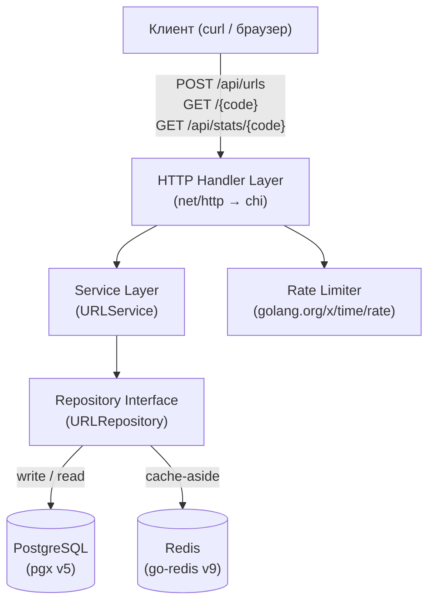
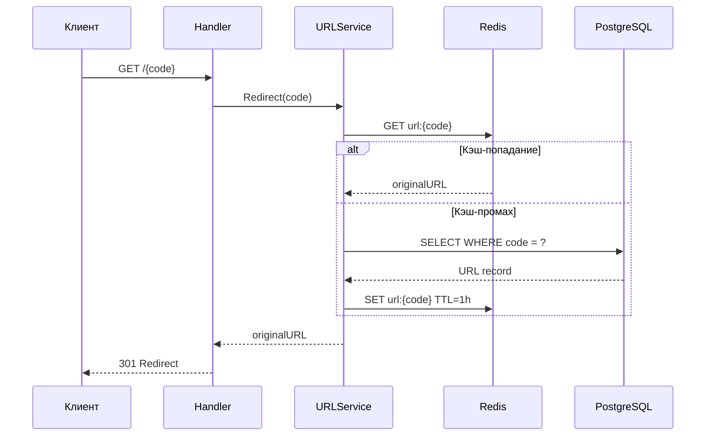

# Проект 1: URL Shortener

> Практический проект для C# разработчиков, осваивающих Go.
> Сложность: **Beginner → Intermediate**

## Содержание

- [Что мы построим](#что-мы-построим)
- [Архитектура](#архитектура)
- [Технологии](#технологии)
- [Структура проекта](#структура-проекта)
- [Разделы гайда](#разделы-гайда)
- [Требования](#требования)
- [Запуск](#запуск)

---

## Что мы построим

Полноценный сервис сокращения URL с:

- **API для создания коротких ссылок** (`POST /api/urls`)
- **Редиректом по коду** (`GET /{code}`) с 301/302 ответом
- **Статистикой переходов** (`GET /api/stats/{code}`)
- **Rate limiting** на основе token bucket
- **Health check** endpoint
- **Кэшированием** в Redis (паттерн cache-aside)
- **Хранением** в PostgreSQL

Проект реализуется дважды: сначала на стандартной библиотеке **net/http** (Go 1.22+),
затем мигрируем на **chi** — показывая разницу и мотивацию.

> 💡 **Для C# разработчиков**: Аналог — ASP.NET Core Minimal API + EF Core + IDistributedCache.
> В Go мы получаем ту же функциональность, но с другими идиомами и без heavy DI-контейнера.

---

## Архитектура





---

## Технологии

| Компонент | Go | C# аналог |
|-----------|-----|-----------|
| HTTP сервер | `net/http` + `chi` | ASP.NET Core |
| PostgreSQL | `pgx/v5` | EF Core / Npgsql |
| Redis | `go-redis/v9` | StackExchange.Redis |
| Rate limiting | `golang.org/x/time/rate` | AspNetCoreRateLimit |
| Тесты | `testing` + `testify` | xUnit + Moq |
| Контейнеры для тестов | `testcontainers-go` | TestContainers.NET |
| Логирование | `log/slog` (stdlib) | Serilog / NLog |
| Конфигурация | `os.Getenv` / env-файл | `appsettings.json` |

### go.mod

```go
module github.com/yourname/urlshortener

go 1.26

require (
    github.com/go-chi/chi/v5 v5.1.0
    github.com/jackc/pgx/v5 v5.7.1
    github.com/redis/go-redis/v9 v9.7.0
    github.com/stretchr/testify v1.10.0
    github.com/testcontainers/testcontainers-go v0.35.0
    golang.org/x/time v0.9.0
)
```

---

## Структура проекта

```
urlshortener/
├── cmd/
│   └── server/
│       └── main.go          # Точка входа: инициализация, запуск
├── internal/
│   ├── domain/
│   │   ├── url.go           # Доменная модель + кастомные ошибки
│   │   └── service.go       # URLService — бизнес-логика
│   ├── storage/
│   │   ├── postgres/
│   │   │   └── url_repo.go  # PostgreSQL реализация репозитория
│   │   └── redis/
│   │       └── cache.go     # Redis кэш
│   └── handler/
│       ├── url.go           # HTTP хэндлеры
│       └── middleware.go    # Logging, recovery, rate limiting
├── migrations/
│   ├── 001_create_urls.sql
│   └── 002_create_stats.sql
├── docker-compose.yml
├── Dockerfile
├── .env.example
└── go.mod
```

> 💡 **Идиома Go**: Код в `internal/` не доступен снаружи модуля — это встроенная
> инкапсуляция без модификаторов доступа. В C# аналог — `internal` классы в отдельном assembly.

### Сравнение структур проектов

**C# (ASP.NET Core Web API)**:
```
MyUrlShortener/
├── Controllers/
│   └── UrlController.cs
├── Models/
│   └── Url.cs
├── Services/
│   ├── IUrlService.cs
│   └── UrlService.cs
├── Repositories/
│   ├── IUrlRepository.cs
│   └── UrlRepository.cs
├── Data/
│   └── AppDbContext.cs
├── Program.cs
└── appsettings.json
```

**Go (идиоматично)**:
```
urlshortener/
├── cmd/server/main.go       # ≈ Program.cs
├── internal/
│   ├── domain/              # ≈ Models/ + Services/ + Repositories/ (интерфейсы)
│   └── storage/             # ≈ Repositories/ (реализации) + Data/
└── internal/handler/        # ≈ Controllers/
```

**Ключевые отличия**:
- Нет DI-контейнера — зависимости передаются явно через конструкторы (struct fields)
- Нет ORM — SQL пишется руками, pgx даёт прямой контроль
- `internal/` = встроенная защита от случайного импорта
- Конфигурация через переменные окружения, не XML/JSON файл

---

## Разделы гайда

| # | Файл | Содержание |
|---|------|-----------|
| 1 | [Доменная модель](./01_domain.md) | Модели, интерфейсы, сервис, генерация кодов, ошибки |
| 2 | [Хранилище](./02_storage.md) | PostgreSQL (pgx), Redis, cache-aside |
| 3 | [HTTP слой](./03_http.md) | net/http → chi, middleware, rate limiting |
| 4 | [Тестирование](./04_testing.md) | Unit, integration, benchmarks |
| 5 | [Деплой](./05_deployment.md) | Docker Compose, Dockerfile, production |

---

## Требования

- Go 1.22+
- Docker + Docker Compose (для PostgreSQL и Redis)
- Знание основ Go из Частей 1-4 курса

---

## Запуск

```bash
# Поднять зависимости
docker compose up -d postgres redis

# Применить миграции (см. 05_deployment.md)
psql $DATABASE_URL < migrations/001_create_urls.sql
psql $DATABASE_URL < migrations/002_create_stats.sql

# Запустить сервер
go run ./cmd/server

# Тестируем
curl -X POST http://localhost:8080/api/urls \
  -H "Content-Type: application/json" \
  -d '{"url": "https://go.dev/doc/effective_go"}'
# {"code": "aB3xY9", "short_url": "http://localhost:8080/aB3xY9"}

curl -L http://localhost:8080/aB3xY9
# 301 → https://go.dev/doc/effective_go
```

---

[← Назад: Часть 5 — Проекты](../README.md) | [Доменная модель →](./01_domain.md)
