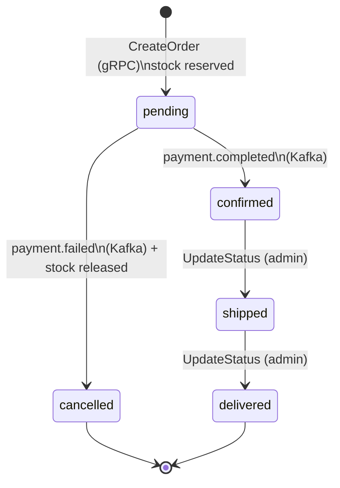

# 4. Order Service (Saga Pattern)

## Содержание

<!-- START doctoc generated TOC please keep comment here to allow auto update -->
<!-- DON'T EDIT THIS SECTION, INSTEAD RE-RUN doctoc TO UPDATE -->

- [Обзор и Saga Pattern](#%D0%BE%D0%B1%D0%B7%D0%BE%D1%80-%D0%B8-saga-pattern)
  - [Структура пакетов](#%D1%81%D1%82%D1%80%D1%83%D0%BA%D1%82%D1%83%D1%80%D0%B0-%D0%BF%D0%B0%D0%BA%D0%B5%D1%82%D0%BE%D0%B2)
- [State Machine заказа](#state-machine-%D0%B7%D0%B0%D0%BA%D0%B0%D0%B7%D0%B0)
- [gRPC: создание заказа](#grpc-%D1%81%D0%BE%D0%B7%D0%B4%D0%B0%D0%BD%D0%B8%D0%B5-%D0%B7%D0%B0%D0%BA%D0%B0%D0%B7%D0%B0)
- [Kafka Consumer: обработка событий](#kafka-consumer-%D0%BE%D0%B1%D1%80%D0%B0%D0%B1%D0%BE%D1%82%D0%BA%D0%B0-%D1%81%D0%BE%D0%B1%D1%8B%D1%82%D0%B8%D0%B9)
- [Kafka Producer: публикация событий](#kafka-producer-%D0%BF%D1%83%D0%B1%D0%BB%D0%B8%D0%BA%D0%B0%D1%86%D0%B8%D1%8F-%D1%81%D0%BE%D0%B1%D1%8B%D1%82%D0%B8%D0%B9)
- [PostgreSQL репозиторий](#postgresql-%D1%80%D0%B5%D0%BF%D0%BE%D0%B7%D0%B8%D1%82%D0%BE%D1%80%D0%B8%D0%B9)
- [gRPC сервер и клиент Catalog Service](#grpc-%D1%81%D0%B5%D1%80%D0%B2%D0%B5%D1%80-%D0%B8-%D0%BA%D0%BB%D0%B8%D0%B5%D0%BD%D1%82-catalog-service)
- [main.go — запуск сервиса](#maingo--%D0%B7%D0%B0%D0%BF%D1%83%D1%81%D0%BA-%D1%81%D0%B5%D1%80%D0%B2%D0%B8%D1%81%D0%B0)
- [Миграции](#%D0%BC%D0%B8%D0%B3%D1%80%D0%B0%D1%86%D0%B8%D0%B8)
- [Тестирование](#%D1%82%D0%B5%D1%81%D1%82%D0%B8%D1%80%D0%BE%D0%B2%D0%B0%D0%BD%D0%B8%D0%B5)
  - [Тест state machine](#%D1%82%D0%B5%D1%81%D1%82-state-machine)
  - [Тест Saga (с моками)](#%D1%82%D0%B5%D1%81%D1%82-saga-%D1%81-%D0%BC%D0%BE%D0%BA%D0%B0%D0%BC%D0%B8)
- [Сравнение с C#](#%D1%81%D1%80%D0%B0%D0%B2%D0%BD%D0%B5%D0%BD%D0%B8%D0%B5-%D1%81-c)
  - [Saga: MassTransit vs хореография вручную](#saga-masstransit-vs-%D1%85%D0%BE%D1%80%D0%B5%D0%BE%D0%B3%D1%80%D0%B0%D1%84%D0%B8%D1%8F-%D0%B2%D1%80%D1%83%D1%87%D0%BD%D1%83%D1%8E)
  - [Ключевые отличия](#%D0%BA%D0%BB%D1%8E%D1%87%D0%B5%D0%B2%D1%8B%D0%B5-%D0%BE%D1%82%D0%BB%D0%B8%D1%87%D0%B8%D1%8F)

<!-- END doctoc generated TOC please keep comment here to allow auto update -->

---

## Обзор и Saga Pattern

Order Service — оркестратор бизнес-процесса оформления заказа.
Он управляет Saga через хореографию: публикует и потребляет Kafka события.



### Структура пакетов

```
order-service/
├── cmd/server/main.go
├── internal/
│   ├── domain/
│   │   └── order.go          # Order entity, state machine
│   ├── service/
│   │   └── order_service.go  # Бизнес-логика создания заказа
│   ├── storage/
│   │   └── postgres/
│   │       └── order_repo.go
│   ├── grpc/
│   │   ├── server.go         # gRPC хэндлеры
│   │   └── catalog_client.go # gRPC клиент → Catalog Service
│   └── kafka/
│       ├── producer.go       # Публикация order.created / order.confirmed
│       └── consumer.go       # Подписка на payment.completed / payment.failed
├── migrations/
│   └── 001_create_orders.sql
├── Dockerfile
└── go.mod
```

---

## State Machine заказа

Переходы состояний закодированы явно в доменной модели:

```go
// internal/domain/order.go
package domain

import (
    "context"
    "errors"
    "time"
)

type OrderStatus string

const (
    StatusPending   OrderStatus = "pending"
    StatusConfirmed OrderStatus = "confirmed"
    StatusCancelled OrderStatus = "cancelled"
    StatusShipped   OrderStatus = "shipped"
    StatusDelivered OrderStatus = "delivered"
)

// ValidTransitions — матрица допустимых переходов состояний.
// Явное кодирование state machine в данных, а не через switch.
var ValidTransitions = map[OrderStatus][]OrderStatus{
    StatusPending:   {StatusConfirmed, StatusCancelled},
    StatusConfirmed: {StatusShipped},
    StatusShipped:   {StatusDelivered},
    // StatusCancelled и StatusDelivered — терминальные, переходов нет
}

type OrderItem struct {
    ProductID   string
    ProductName string
    Quantity    int32
    PriceCents  int64 // цена зафиксирована на момент заказа
}

type Order struct {
    ID         string
    UserID     string
    Status     OrderStatus
    Items      []OrderItem
    TotalCents int64
    CreatedAt  time.Time
    UpdatedAt  time.Time
}

// CanTransitionTo проверяет допустимость перехода.
func (o *Order) CanTransitionTo(next OrderStatus) bool {
    allowed, ok := ValidTransitions[o.Status]
    if !ok {
        return false
    }
    for _, s := range allowed {
        if s == next {
            return true
        }
    }
    return false
}

// CalcTotal пересчитывает итоговую сумму из позиций.
func (o *Order) CalcTotal() int64 {
    var total int64
    for _, item := range o.Items {
        total += item.PriceCents * int64(item.Quantity)
    }
    return total
}

var (
    ErrOrderNotFound       = errors.New("order not found")
    ErrInvalidTransition   = errors.New("invalid order status transition")
    ErrOrderAccessDenied   = errors.New("access to this order is denied")
)

type OrderRepository interface {
    Create(ctx context.Context, order *Order) error
    GetByID(ctx context.Context, id string) (*Order, error)
    UpdateStatus(ctx context.Context, id string, status OrderStatus) error
    ListByUserID(ctx context.Context, userID string, page, pageSize int) ([]*Order, int, error)
}
```

---

## gRPC: создание заказа

```go
// internal/service/order_service.go
package service

import (
    "context"
    "errors"
    "fmt"
    "time"

    "github.com/yourname/ecommerce/order-service/internal/domain"
    "github.com/yourname/ecommerce/order-service/internal/kafka"
    catalogv1 "github.com/yourname/ecommerce/gen/go/catalog/v1"
)

// CatalogClient — интерфейс для gRPC клиента Catalog Service.
// Определяем интерфейс у потребителя (consumer-side interface).
type CatalogClient interface {
    GetProduct(ctx context.Context, productID string) (*catalogv1.Product, error)
    ReserveStock(ctx context.Context, orderID, productID string, qty int32) (bool, string, error)
}

type OrderService struct {
    repo     domain.OrderRepository
    catalog  CatalogClient
    producer *kafka.OrderProducer
}

func NewOrderService(repo domain.OrderRepository, catalog CatalogClient, producer *kafka.OrderProducer) *OrderService {
    return &OrderService{repo: repo, catalog: catalog, producer: producer}
}

// CreateOrderInput — входные данные для создания заказа.
type CreateOrderInput struct {
    UserID string
    Items  []OrderItemInput
}

type OrderItemInput struct {
    ProductID string
    Quantity  int32
}

// CreateOrder — многошаговый процесс с частичным откатом при ошибке.
// Это начало Saga хореографии.
func (s *OrderService) CreateOrder(ctx context.Context, input CreateOrderInput) (*domain.Order, error) {
    if len(input.Items) == 0 {
        return nil, fmt.Errorf("order must have at least one item")
    }

    // 1. Обогащаем позиции данными из Catalog Service (цена, название)
    orderItems := make([]domain.OrderItem, 0, len(input.Items))
    for _, item := range input.Items {
        product, err := s.catalog.GetProduct(ctx, item.ProductID)
        if err != nil {
            return nil, fmt.Errorf("get product %s: %w", item.ProductID, err)
        }
        orderItems = append(orderItems, domain.OrderItem{
            ProductID:   product.ProductId,
            ProductName: product.Name,
            Quantity:    item.Quantity,
            PriceCents:  product.PriceCents, // фиксируем цену на момент заказа
        })
    }

    // 2. Создаём заказ в БД со статусом pending
    order := &domain.Order{
        ID:        newUUID(),
        UserID:    input.UserID,
        Status:    domain.StatusPending,
        Items:     orderItems,
        CreatedAt: time.Now().UTC(),
        UpdatedAt: time.Now().UTC(),
    }
    order.TotalCents = order.CalcTotal()

    if err := s.repo.Create(ctx, order); err != nil {
        return nil, fmt.Errorf("create order: %w", err)
    }

    // 3. Резервируем склад в Catalog Service (синхронный gRPC вызов)
    // При ошибке — откатываем заказ в cancelled
    for _, item := range input.Items {
        success, reason, err := s.catalog.ReserveStock(ctx, order.ID, item.ProductID, item.Quantity)
        if err != nil {
            s.cancelOrder(ctx, order, "catalog service unavailable")
            return nil, fmt.Errorf("reserve stock: %w", err)
        }
        if !success {
            s.cancelOrder(ctx, order, reason)
            return nil, fmt.Errorf("stock reservation failed: %s", reason)
        }
    }

    // 4. Публикуем order.created → Payment Service подхватит и обработает оплату
    s.producer.PublishOrderCreated(ctx, order)

    return order, nil
}

// cancelOrder — вспомогательный метод для отмены заказа при ошибке создания.
func (s *OrderService) cancelOrder(ctx context.Context, order *domain.Order, reason string) {
    if err := s.repo.UpdateStatus(ctx, order.ID, domain.StatusCancelled); err != nil {
        // Логируем, но не возвращаем ошибку — основная ошибка важнее
        // В production здесь должен быть retry или dead-letter processing
        fmt.Printf("WARN: failed to cancel order %s: %v\n", order.ID, err)
    }
}

// ConfirmOrder — вызывается при получении payment.completed из Kafka.
func (s *OrderService) ConfirmOrder(ctx context.Context, orderID string) error {
    order, err := s.repo.GetByID(ctx, orderID)
    if err != nil {
        return fmt.Errorf("get order: %w", err)
    }

    if !order.CanTransitionTo(domain.StatusConfirmed) {
        // Возможно уже подтверждён (идемпотентность) — не ошибка
        if order.Status == domain.StatusConfirmed {
            return nil
        }
        return domain.ErrInvalidTransition
    }

    if err := s.repo.UpdateStatus(ctx, orderID, domain.StatusConfirmed); err != nil {
        return fmt.Errorf("update status: %w", err)
    }

    // Публикуем order.confirmed → Notification Service отправит email
    s.producer.PublishOrderConfirmed(ctx, order)

    return nil
}

// CancelOrder — вызывается при получении payment.failed из Kafka.
func (s *OrderService) CancelOrder(ctx context.Context, orderID, reason string) error {
    order, err := s.repo.GetByID(ctx, orderID)
    if err != nil {
        if errors.Is(err, domain.ErrOrderNotFound) {
            return nil // идемпотентно
        }
        return fmt.Errorf("get order: %w", err)
    }

    if !order.CanTransitionTo(domain.StatusCancelled) {
        if order.Status == domain.StatusCancelled {
            return nil // уже отменён
        }
        return domain.ErrInvalidTransition
    }

    if err := s.repo.UpdateStatus(ctx, orderID, domain.StatusCancelled); err != nil {
        return fmt.Errorf("update status: %w", err)
    }

    // Публикуем order.cancelled → Notification Service отправит email
    s.producer.PublishOrderCancelled(ctx, order, reason)

    return nil
}

func (s *OrderService) GetOrder(ctx context.Context, orderID, userID string) (*domain.Order, error) {
    order, err := s.repo.GetByID(ctx, orderID)
    if err != nil {
        return nil, err
    }
    // Проверяем, что пользователь запрашивает свой заказ
    if order.UserID != userID {
        return nil, domain.ErrOrderAccessDenied
    }
    return order, nil
}
```

---

## Kafka Consumer: обработка событий

```go
// internal/kafka/consumer.go
package kafka

import (
    "context"
    "encoding/json"
    "log/slog"
    "time"

    "github.com/segmentio/kafka-go"

    "github.com/yourname/ecommerce/shared/events"
)

// PaymentEventHandler — интерфейс для обработки платёжных событий.
// Реализуется OrderService.
type PaymentEventHandler interface {
    ConfirmOrder(ctx context.Context, orderID string) error
    CancelOrder(ctx context.Context, orderID, reason string) error
}

// PaymentConsumer подписывается на payment.completed и payment.failed.
type PaymentConsumer struct {
    completedReader *kafka.Reader
    failedReader    *kafka.Reader
    handler         PaymentEventHandler
}

func NewPaymentConsumer(brokers []string, groupID string, handler PaymentEventHandler) *PaymentConsumer {
    return &PaymentConsumer{
        completedReader: kafka.NewReader(kafka.ReaderConfig{
            Brokers:        brokers,
            GroupID:        groupID,
            Topic:          events.TopicPaymentCompleted,
            MaxWait:        100 * time.Millisecond,
            CommitInterval: time.Second,
        }),
        failedReader: kafka.NewReader(kafka.ReaderConfig{
            Brokers:        brokers,
            GroupID:        groupID,
            Topic:          events.TopicPaymentFailed,
            MaxWait:        100 * time.Millisecond,
            CommitInterval: time.Second,
        }),
        handler: handler,
    }
}

// RunCompleted обрабатывает payment.completed.
// Запускается в отдельной горутине.
func (c *PaymentConsumer) RunCompleted(ctx context.Context) error {
    slog.Info("payment completed consumer started")
    for {
        msg, err := c.completedReader.ReadMessage(ctx)
        if err != nil {
            if ctx.Err() != nil {
                return nil
            }
            slog.Error("read payment.completed", "err", err)
            continue
        }

        var event events.PaymentCompletedEvent
        if err := json.Unmarshal(msg.Value, &event); err != nil {
            slog.Error("unmarshal payment.completed", "err", err, "offset", msg.Offset)
            continue
        }

        slog.Info("payment completed", "order_id", event.OrderID, "payment_id", event.PaymentID)

        // Retry при временных ошибках — не теряем сообщение
        if err := c.handler.ConfirmOrder(ctx, event.OrderID); err != nil {
            slog.Error("confirm order", "order_id", event.OrderID, "err", err)
            // В production: retry с backoff или отправка в DLT
            // Для простоты — продолжаем (at-least-once обработка через GroupID+commit)
        }
    }
}

// RunFailed обрабатывает payment.failed.
func (c *PaymentConsumer) RunFailed(ctx context.Context) error {
    slog.Info("payment failed consumer started")
    for {
        msg, err := c.failedReader.ReadMessage(ctx)
        if err != nil {
            if ctx.Err() != nil {
                return nil
            }
            slog.Error("read payment.failed", "err", err)
            continue
        }

        var event events.PaymentFailedEvent
        if err := json.Unmarshal(msg.Value, &event); err != nil {
            slog.Error("unmarshal payment.failed", "err", err, "offset", msg.Offset)
            continue
        }

        slog.Info("payment failed", "order_id", event.OrderID, "reason", event.Reason)

        if err := c.handler.CancelOrder(ctx, event.OrderID, event.Reason); err != nil {
            slog.Error("cancel order", "order_id", event.OrderID, "err", err)
        }
    }
}

func (c *PaymentConsumer) Close() {
    c.completedReader.Close()
    c.failedReader.Close()
}
```

---

## Kafka Producer: публикация событий

```go
// internal/kafka/producer.go
package kafka

import (
    "context"
    "encoding/json"
    "log/slog"
    "time"

    "github.com/segmentio/kafka-go"

    "github.com/yourname/ecommerce/order-service/internal/domain"
    "github.com/yourname/ecommerce/shared/events"
)

// OrderProducer публикует события жизненного цикла заказа.
type OrderProducer struct {
    writer *kafka.Writer
}

func NewOrderProducer(brokers []string) *OrderProducer {
    return &OrderProducer{
        writer: &kafka.Writer{
            Addr:                   kafka.TCP(brokers...),
            Balancer:               &kafka.Hash{}, // по ключу → одна партиция для одного OrderID
            WriteTimeout:           5 * time.Second,
            RequiredAcks:           kafka.RequireOne,
            AllowAutoTopicCreation: true,
        },
    }
}

// PublishOrderCreated публикует событие в topic order.created.
// Payment Service подписывается и начинает обработку оплаты.
func (p *OrderProducer) PublishOrderCreated(ctx context.Context, order *domain.Order) {
    items := make([]events.OrderItem, len(order.Items))
    for i, item := range order.Items {
        items[i] = events.OrderItem{
            ProductID:  item.ProductID,
            Quantity:   item.Quantity,
            PriceCents: item.PriceCents,
        }
    }

    event := events.OrderCreatedEvent{
        EventID:    newUUID(),
        OrderID:    order.ID,
        UserID:     order.UserID,
        TotalCents: order.TotalCents,
        Items:      items,
        CreatedAt:  time.Now().UTC(),
    }

    p.publish(ctx, events.TopicOrderCreated, order.ID, event)
}

// PublishOrderConfirmed публикует событие в topic order.confirmed.
// Notification Service подписывается и отправляет email "Заказ подтверждён".
func (p *OrderProducer) PublishOrderConfirmed(ctx context.Context, order *domain.Order) {
    event := events.OrderConfirmedEvent{
        EventID:   newUUID(),
        OrderID:   order.ID,
        UserID:    order.UserID,
        CreatedAt: time.Now().UTC(),
        // UserEmail получаем из User Service (или денормализуем в заказе)
        // Для простоты — Notification Service сам запросит email по UserID
    }
    p.publish(ctx, events.TopicOrderConfirmed, order.ID, event)
}

// PublishOrderCancelled публикует событие в topic order.cancelled.
func (p *OrderProducer) PublishOrderCancelled(ctx context.Context, order *domain.Order, reason string) {
    event := events.OrderCancelledEvent{
        EventID:   newUUID(),
        OrderID:   order.ID,
        UserID:    order.UserID,
        Reason:    reason,
        CreatedAt: time.Now().UTC(),
    }
    p.publish(ctx, events.TopicOrderCancelled, order.ID, event)
}

// publish — вспомогательный метод для публикации с логированием.
func (p *OrderProducer) publish(ctx context.Context, topic, key string, event any) {
    data, err := json.Marshal(event)
    if err != nil {
        slog.ErrorContext(ctx, "marshal event", "topic", topic, "err", err)
        return
    }

    err = p.writer.WriteMessages(ctx, kafka.Message{
        Topic: topic,
        Key:   []byte(key),
        Value: data,
    })
    if err != nil {
        slog.ErrorContext(ctx, "publish event", "topic", topic, "key", key, "err", err)
    }
}

func (p *OrderProducer) Close() error {
    return p.writer.Close()
}
```

---

## PostgreSQL репозиторий

```go
// internal/storage/postgres/order_repo.go
package postgres

import (
    "context"
    "errors"
    "fmt"

    "github.com/jackc/pgx/v5"
    "github.com/jackc/pgx/v5/pgxpool"

    "github.com/yourname/ecommerce/order-service/internal/domain"
)

type OrderRepo struct {
    pool *pgxpool.Pool
}

func NewOrderRepo(pool *pgxpool.Pool) *OrderRepo {
    return &OrderRepo{pool: pool}
}

// Create сохраняет новый заказ с позициями в транзакции.
func (r *OrderRepo) Create(ctx context.Context, order *domain.Order) error {
    tx, err := r.pool.Begin(ctx)
    if err != nil {
        return fmt.Errorf("begin tx: %w", err)
    }
    defer tx.Rollback(ctx)

    _, err = tx.Exec(ctx, `
        INSERT INTO orders (id, user_id, status, total_cents, created_at, updated_at)
        VALUES ($1, $2, $3, $4, $5, $6)
    `, order.ID, order.UserID, order.Status, order.TotalCents, order.CreatedAt, order.UpdatedAt)
    if err != nil {
        return fmt.Errorf("insert order: %w", err)
    }

    // Позиции заказа вставляем батчем
    for _, item := range order.Items {
        _, err = tx.Exec(ctx, `
            INSERT INTO order_items (order_id, product_id, product_name, quantity, price_cents)
            VALUES ($1, $2, $3, $4, $5)
        `, order.ID, item.ProductID, item.ProductName, item.Quantity, item.PriceCents)
        if err != nil {
            return fmt.Errorf("insert order item: %w", err)
        }
    }

    return tx.Commit(ctx)
}

// GetByID загружает заказ с позициями через JOIN.
func (r *OrderRepo) GetByID(ctx context.Context, id string) (*domain.Order, error) {
    // Загружаем заказ
    order := &domain.Order{}
    err := r.pool.QueryRow(ctx, `
        SELECT id, user_id, status, total_cents, created_at, updated_at
        FROM orders WHERE id = $1
    `, id).Scan(
        &order.ID, &order.UserID, &order.Status,
        &order.TotalCents, &order.CreatedAt, &order.UpdatedAt,
    )
    if err != nil {
        if errors.Is(err, pgx.ErrNoRows) {
            return nil, domain.ErrOrderNotFound
        }
        return nil, fmt.Errorf("get order: %w", err)
    }

    // Загружаем позиции
    rows, err := r.pool.Query(ctx, `
        SELECT product_id, product_name, quantity, price_cents
        FROM order_items WHERE order_id = $1
        ORDER BY product_id
    `, id)
    if err != nil {
        return nil, fmt.Errorf("get order items: %w", err)
    }
    defer rows.Close()

    for rows.Next() {
        var item domain.OrderItem
        if err := rows.Scan(&item.ProductID, &item.ProductName, &item.Quantity, &item.PriceCents); err != nil {
            return nil, fmt.Errorf("scan order item: %w", err)
        }
        order.Items = append(order.Items, item)
    }

    return order, nil
}

// UpdateStatus обновляет статус заказа с проверкой допустимости перехода на уровне SQL.
func (r *OrderRepo) UpdateStatus(ctx context.Context, id string, status domain.OrderStatus) error {
    tag, err := r.pool.Exec(ctx, `
        UPDATE orders
        SET status = $1, updated_at = NOW()
        WHERE id = $2
    `, status, id)
    if err != nil {
        return fmt.Errorf("update order status: %w", err)
    }
    if tag.RowsAffected() == 0 {
        return domain.ErrOrderNotFound
    }
    return nil
}

func (r *OrderRepo) ListByUserID(ctx context.Context, userID string, page, pageSize int) ([]*domain.Order, int, error) {
    offset := (page - 1) * pageSize

    rows, err := r.pool.Query(ctx, `
        SELECT id, user_id, status, total_cents, created_at, updated_at
        FROM orders
        WHERE user_id = $1
        ORDER BY created_at DESC
        LIMIT $2 OFFSET $3
    `, userID, pageSize, offset)
    if err != nil {
        return nil, 0, fmt.Errorf("list orders: %w", err)
    }
    defer rows.Close()

    var orders []*domain.Order
    for rows.Next() {
        o := &domain.Order{}
        if err := rows.Scan(&o.ID, &o.UserID, &o.Status, &o.TotalCents, &o.CreatedAt, &o.UpdatedAt); err != nil {
            return nil, 0, fmt.Errorf("scan order: %w", err)
        }
        orders = append(orders, o)
    }

    var total int
    r.pool.QueryRow(ctx, "SELECT COUNT(*) FROM orders WHERE user_id = $1", userID).Scan(&total)

    return orders, total, nil
}
```

---

## gRPC сервер и клиент Catalog Service

```go
// internal/grpc/catalog_client.go
package grpc

import (
    "context"
    "fmt"

    "google.golang.org/grpc"
    "google.golang.org/grpc/codes"
    "google.golang.org/grpc/status"

    catalogv1 "github.com/yourname/ecommerce/gen/go/catalog/v1"
)

// CatalogGRPCClient — реализация интерфейса service.CatalogClient через gRPC.
type CatalogGRPCClient struct {
    client catalogv1.CatalogServiceClient
}

func NewCatalogClient(conn *grpc.ClientConn) *CatalogGRPCClient {
    return &CatalogGRPCClient{
        client: catalogv1.NewCatalogServiceClient(conn),
    }
}

func (c *CatalogGRPCClient) GetProduct(ctx context.Context, productID string) (*catalogv1.Product, error) {
    resp, err := c.client.GetProduct(ctx, &catalogv1.GetProductRequest{ProductId: productID})
    if err != nil {
        return nil, fmt.Errorf("catalog.GetProduct: %w", err)
    }
    return resp.Product, nil
}

func (c *CatalogGRPCClient) ReserveStock(ctx context.Context, orderID, productID string, qty int32) (bool, string, error) {
    resp, err := c.client.ReserveStock(ctx, &catalogv1.ReserveStockRequest{
        OrderId:   orderID,
        ProductId: productID,
        Quantity:  qty,
    })
    if err != nil {
        // Если Catalog Service недоступен — это временная ошибка
        if st, ok := status.FromError(err); ok && st.Code() == codes.Unavailable {
            return false, "catalog service unavailable", nil
        }
        return false, "", fmt.Errorf("catalog.ReserveStock: %w", err)
    }
    return resp.Success, resp.FailureReason, nil
}
```

```go
// internal/grpc/server.go
package grpc

import (
    "context"
    "errors"

    "google.golang.org/grpc/codes"
    "google.golang.org/grpc/status"
    "google.golang.org/protobuf/types/known/timestamppb"

    orderv1 "github.com/yourname/ecommerce/gen/go/order/v1"
    "github.com/yourname/ecommerce/order-service/internal/domain"
    "github.com/yourname/ecommerce/order-service/internal/service"
)

type Server struct {
    orderv1.UnimplementedOrderServiceServer
    svc *service.OrderService
}

func NewServer(svc *service.OrderService) *Server {
    return &Server{svc: svc}
}

func (s *Server) CreateOrder(ctx context.Context, req *orderv1.CreateOrderRequest) (*orderv1.CreateOrderResponse, error) {
    items := make([]service.OrderItemInput, len(req.Items))
    for i, item := range req.Items {
        items[i] = service.OrderItemInput{
            ProductID: item.ProductId,
            Quantity:  item.Quantity,
        }
    }

    order, err := s.svc.CreateOrder(ctx, service.CreateOrderInput{
        UserID: req.UserId,
        Items:  items,
    })
    if err != nil {
        return nil, toGRPCError(err)
    }

    return &orderv1.CreateOrderResponse{
        OrderId: order.ID,
        Status:  toProtoStatus(order.Status),
    }, nil
}

func (s *Server) GetOrder(ctx context.Context, req *orderv1.GetOrderRequest) (*orderv1.GetOrderResponse, error) {
    // userID берём из gRPC metadata (API Gateway добавляет его после JWT верификации)
    userID := userIDFromContext(ctx)

    order, err := s.svc.GetOrder(ctx, req.OrderId, userID)
    if err != nil {
        return nil, toGRPCError(err)
    }

    return &orderv1.GetOrderResponse{Order: toProtoOrder(order)}, nil
}

// toProtoStatus маппит доменный статус в proto enum.
func toProtoStatus(s domain.OrderStatus) orderv1.OrderStatus {
    switch s {
    case domain.StatusPending:
        return orderv1.OrderStatus_ORDER_STATUS_PENDING
    case domain.StatusConfirmed:
        return orderv1.OrderStatus_ORDER_STATUS_CONFIRMED
    case domain.StatusCancelled:
        return orderv1.OrderStatus_ORDER_STATUS_CANCELLED
    case domain.StatusShipped:
        return orderv1.OrderStatus_ORDER_STATUS_SHIPPED
    case domain.StatusDelivered:
        return orderv1.OrderStatus_ORDER_STATUS_DELIVERED
    default:
        return orderv1.OrderStatus_ORDER_STATUS_UNSPECIFIED
    }
}

func toProtoOrder(o *domain.Order) *orderv1.Order {
    items := make([]*orderv1.OrderItem, len(o.Items))
    for i, item := range o.Items {
        items[i] = &orderv1.OrderItem{
            ProductId:   item.ProductID,
            ProductName: item.ProductName,
            Quantity:    item.Quantity,
            PriceCents:  item.PriceCents,
        }
    }
    return &orderv1.Order{
        OrderId:    o.ID,
        UserId:     o.UserID,
        Status:     toProtoStatus(o.Status),
        Items:      items,
        TotalCents: o.TotalCents,
        CreatedAt:  timestamppb.New(o.CreatedAt),
        UpdatedAt:  timestamppb.New(o.UpdatedAt),
    }
}

func toGRPCError(err error) error {
    switch {
    case errors.Is(err, domain.ErrOrderNotFound):
        return status.Error(codes.NotFound, err.Error())
    case errors.Is(err, domain.ErrOrderAccessDenied):
        return status.Error(codes.PermissionDenied, err.Error())
    case errors.Is(err, domain.ErrInvalidTransition):
        return status.Error(codes.FailedPrecondition, err.Error())
    default:
        return status.Error(codes.Internal, "internal server error")
    }
}
```

---

## main.go — запуск сервиса

```go
// cmd/server/main.go
package main

import (
    "context"
    "fmt"
    "log/slog"
    "net"
    "os"
    "os/signal"
    "syscall"

    "github.com/jackc/pgx/v5/pgxpool"
    "google.golang.org/grpc"
    "go.opentelemetry.io/contrib/instrumentation/google.golang.org/grpc/otelgrpc"

    orderv1 "github.com/yourname/ecommerce/gen/go/order/v1"
    "github.com/yourname/ecommerce/order-service/internal/kafka"
    grpcserver "github.com/yourname/ecommerce/order-service/internal/grpc"
    "github.com/yourname/ecommerce/order-service/internal/service"
    "github.com/yourname/ecommerce/order-service/internal/storage/postgres"
    "github.com/yourname/ecommerce/order-service/internal/config"
)

func main() {
    cfg, err := config.Load()
    if err != nil {
        fmt.Fprintln(os.Stderr, "config:", err)
        os.Exit(1)
    }

    logger := slog.New(slog.NewJSONHandler(os.Stdout, nil))
    slog.SetDefault(logger)

    ctx, stop := signal.NotifyContext(context.Background(), syscall.SIGTERM, syscall.SIGINT)
    defer stop()

    // PostgreSQL
    pool, err := pgxpool.New(ctx, cfg.DatabaseURL)
    if err != nil {
        slog.Error("connect db", "err", err)
        os.Exit(1)
    }
    defer pool.Close()

    // gRPC клиент → Catalog Service
    catalogConn, err := grpc.NewClient(cfg.CatalogAddr,
        grpc.WithStatsHandler(otelgrpc.NewClientHandler()),
    )
    if err != nil {
        slog.Error("connect catalog", "err", err)
        os.Exit(1)
    }
    defer catalogConn.Close()

    // Зависимости
    orderRepo := postgres.NewOrderRepo(pool)
    catalogClient := grpcserver.NewCatalogClient(catalogConn)
    producer := kafka.NewOrderProducer(cfg.KafkaBrokers())

    orderSvc := service.NewOrderService(orderRepo, catalogClient, producer)

    // Kafka consumer
    consumer := kafka.NewPaymentConsumer(cfg.KafkaBrokers(), cfg.KafkaGroupID, orderSvc)

    // Запускаем consumers в горутинах
    go func() {
        if err := consumer.RunCompleted(ctx); err != nil {
            slog.Error("completed consumer", "err", err)
        }
    }()
    go func() {
        if err := consumer.RunFailed(ctx); err != nil {
            slog.Error("failed consumer", "err", err)
        }
    }()

    // gRPC сервер
    srv := grpc.NewServer(grpc.StatsHandler(otelgrpc.NewServerHandler()))
    orderv1.RegisterOrderServiceServer(srv, grpcserver.NewServer(orderSvc))

    lis, err := net.Listen("tcp", fmt.Sprintf(":%d", cfg.GRPCPort))
    if err != nil {
        slog.Error("listen", "err", err)
        os.Exit(1)
    }

    go func() {
        slog.Info("order service started", "port", cfg.GRPCPort)
        if err := srv.Serve(lis); err != nil {
            slog.Error("serve", "err", err)
        }
    }()

    <-ctx.Done()
    slog.Info("shutting down order service")
    srv.GracefulStop()
    consumer.Close()
    slog.Info("order service stopped")
}
```

---

## Миграции

```sql
-- migrations/001_create_orders.sql
CREATE TABLE IF NOT EXISTS orders (
    id          UUID         PRIMARY KEY DEFAULT gen_random_uuid(),
    user_id     UUID         NOT NULL,
    status      TEXT         NOT NULL DEFAULT 'pending'
                             CHECK (status IN ('pending','confirmed','cancelled','shipped','delivered')),
    total_cents BIGINT       NOT NULL CHECK (total_cents > 0),
    created_at  TIMESTAMPTZ  NOT NULL DEFAULT NOW(),
    updated_at  TIMESTAMPTZ  NOT NULL DEFAULT NOW()
);

CREATE INDEX idx_orders_user_id   ON orders (user_id);
CREATE INDEX idx_orders_status    ON orders (status);
CREATE INDEX idx_orders_created   ON orders (created_at DESC);

CREATE TABLE IF NOT EXISTS order_items (
    order_id      UUID    NOT NULL REFERENCES orders(id) ON DELETE CASCADE,
    product_id    UUID    NOT NULL,
    product_name  TEXT    NOT NULL,
    quantity      INTEGER NOT NULL CHECK (quantity > 0),
    price_cents   BIGINT  NOT NULL CHECK (price_cents > 0),
    PRIMARY KEY (order_id, product_id)
);

CREATE INDEX idx_order_items_order ON order_items (order_id);
```

---

## Тестирование

### Тест state machine

```go
// internal/domain/order_test.go
package domain_test

import (
    "testing"

    "github.com/stretchr/testify/assert"

    "github.com/yourname/ecommerce/order-service/internal/domain"
)

func TestOrder_CanTransitionTo(t *testing.T) {
    tests := []struct {
        name     string
        from     domain.OrderStatus
        to       domain.OrderStatus
        expected bool
    }{
        {"pending → confirmed OK",      domain.StatusPending,   domain.StatusConfirmed,  true},
        {"pending → cancelled OK",      domain.StatusPending,   domain.StatusCancelled,  true},
        {"confirmed → shipped OK",      domain.StatusConfirmed, domain.StatusShipped,    true},
        {"confirmed → cancelled NG",    domain.StatusConfirmed, domain.StatusCancelled,  false},
        {"delivered → anything NG",     domain.StatusDelivered, domain.StatusPending,    false},
        {"cancelled → confirmed NG",    domain.StatusCancelled, domain.StatusConfirmed,  false},
    }

    for _, tt := range tests {
        t.Run(tt.name, func(t *testing.T) {
            order := &domain.Order{Status: tt.from}
            assert.Equal(t, tt.expected, order.CanTransitionTo(tt.to))
        })
    }
}
```

### Тест Saga (с моками)

```go
// internal/service/order_service_test.go
package service_test

import (
    "context"
    "testing"

    "github.com/stretchr/testify/assert"
    "github.com/stretchr/testify/require"

    catalogv1 "github.com/yourname/ecommerce/gen/go/catalog/v1"
    "github.com/yourname/ecommerce/order-service/internal/domain"
    "github.com/yourname/ecommerce/order-service/internal/kafka"
    "github.com/yourname/ecommerce/order-service/internal/service"
)

type mockCatalog struct {
    products map[string]*catalogv1.Product
    failOn   string // productID для симуляции отказа резервирования
}

func (m *mockCatalog) GetProduct(_ context.Context, id string) (*catalogv1.Product, error) {
    p, ok := m.products[id]
    if !ok {
        return nil, domain.ErrOrderNotFound
    }
    return p, nil
}

func (m *mockCatalog) ReserveStock(_ context.Context, _, productID string, _ int32) (bool, string, error) {
    if productID == m.failOn {
        return false, "insufficient stock", nil
    }
    return true, "", nil
}

type mockOrderRepo struct {
    orders map[string]*domain.Order
}

func newMockOrderRepo() *mockOrderRepo {
    return &mockOrderRepo{orders: make(map[string]*domain.Order)}
}

func (m *mockOrderRepo) Create(_ context.Context, o *domain.Order) error {
    m.orders[o.ID] = o
    return nil
}

func (m *mockOrderRepo) GetByID(_ context.Context, id string) (*domain.Order, error) {
    o, ok := m.orders[id]
    if !ok {
        return nil, domain.ErrOrderNotFound
    }
    return o, nil
}

func (m *mockOrderRepo) UpdateStatus(_ context.Context, id string, s domain.OrderStatus) error {
    o, ok := m.orders[id]
    if !ok {
        return domain.ErrOrderNotFound
    }
    o.Status = s
    return nil
}

func (m *mockOrderRepo) ListByUserID(_ context.Context, _ string, _, _ int) ([]*domain.Order, int, error) {
    return nil, 0, nil
}

// mockProducer записывает опубликованные события.
type mockProducer struct{ created, confirmed, cancelled int }

func (m *mockProducer) PublishOrderCreated(_ context.Context, _ *domain.Order)           { m.created++ }
func (m *mockProducer) PublishOrderConfirmed(_ context.Context, _ *domain.Order)         { m.confirmed++ }
func (m *mockProducer) PublishOrderCancelled(_ context.Context, _ *domain.Order, _ string) { m.cancelled++ }

func TestOrderService_CreateOrder(t *testing.T) {
    catalog := &mockCatalog{
        products: map[string]*catalogv1.Product{
            "prod-1": {ProductId: "prod-1", Name: "Phone", PriceCents: 99900},
        },
    }
    repo := newMockOrderRepo()
    producer := &mockProducer{}
    svc := service.NewOrderService(repo, catalog, producer)

    t.Run("успешное создание заказа", func(t *testing.T) {
        order, err := svc.CreateOrder(context.Background(), service.CreateOrderInput{
            UserID: "user-1",
            Items:  []service.OrderItemInput{{ProductID: "prod-1", Quantity: 2}},
        })
        require.NoError(t, err)
        assert.Equal(t, domain.StatusPending, order.Status)
        assert.Equal(t, int64(99900*2), order.TotalCents)
        assert.Equal(t, 1, producer.created) // событие опубликовано
    })

    t.Run("резервирование не удалось → заказ отменён", func(t *testing.T) {
        catalog.failOn = "prod-1"
        _, err := svc.CreateOrder(context.Background(), service.CreateOrderInput{
            UserID: "user-2",
            Items:  []service.OrderItemInput{{ProductID: "prod-1", Quantity: 1}},
        })
        assert.Error(t, err)
        // Заказ создан, но помечен как cancelled
        for _, o := range repo.orders {
            if o.UserID == "user-2" {
                assert.Equal(t, domain.StatusCancelled, o.Status)
            }
        }
    })
}
```

---

## Сравнение с C#

### Saga: MassTransit vs хореография вручную

**C# (MassTransit Saga)**:
```csharp
// Saga state machine — явный граф переходов с персистентностью
public class OrderStateMachine : MassTransitStateMachine<OrderState>
{
    public State Pending { get; private set; }
    public State Confirmed { get; private set; }

    public Event<OrderCreated> OrderCreated { get; private set; }
    public Event<PaymentCompleted> PaymentCompleted { get; private set; }

    public OrderStateMachine()
    {
        Initially(
            When(OrderCreated)
                .TransitionTo(Pending)
        );
        During(Pending,
            When(PaymentCompleted)
                .TransitionTo(Confirmed)
                .Publish(ctx => new OrderConfirmed())
        );
    }
}
```

**Go (хореография через Kafka)**:
```go
// Нет state machine класса — просто явные методы и Kafka consumers

// Создание заказа → публикация order.created
func (s *OrderService) CreateOrder(ctx context.Context, ...) (*domain.Order, error) {
    // ... создаём заказ ...
    s.producer.PublishOrderCreated(ctx, order)
    return order, nil
}

// Kafka consumer слушает payment.completed
func (c *PaymentConsumer) RunCompleted(ctx context.Context) error {
    for {
        msg, _ := c.reader.ReadMessage(ctx)
        // ... десериализуем ...
        s.handler.ConfirmOrder(ctx, event.OrderID) // явный вызов
    }
}
```

### Ключевые отличия

| Аспект | MassTransit | Go хореография |
|--------|-------------|---------------|
| Персистентность состояния | Встроенная (InMemory, EF Core, Redis) | Вручную (PostgreSQL статус) |
| Граф переходов | DSL (`During`, `When`) | `ValidTransitions` map + CanTransitionTo() |
| Идемпотентность | Встроенная | `if order.Status == StatusConfirmed { return nil }` |
| Retry | Встроенный с политиками | Вручную (или внешние библиотеки) |
| Отладка | Сложнее (много магии) | Проще (явные вызовы в логах) |

---

[← Catalog Service](./03_catalog_service.md) | [Payment & Notification →](./05_payment_notification.md)
