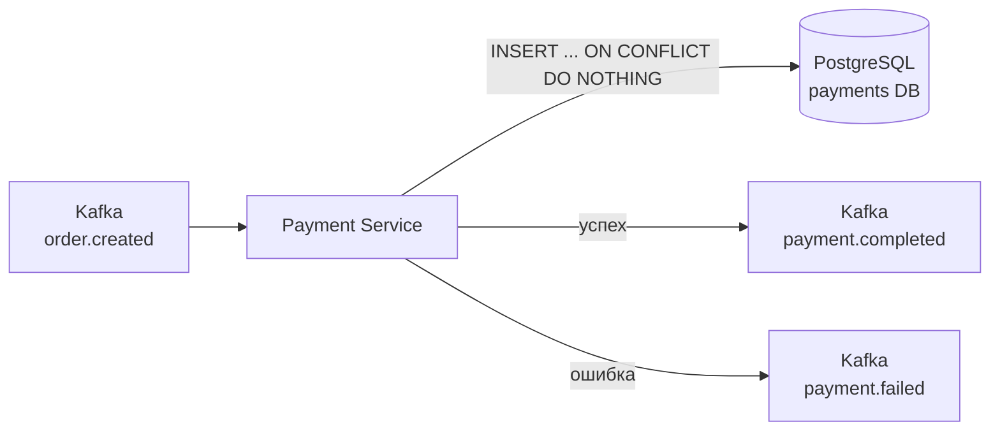
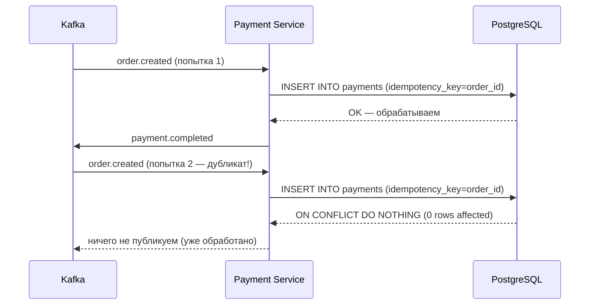
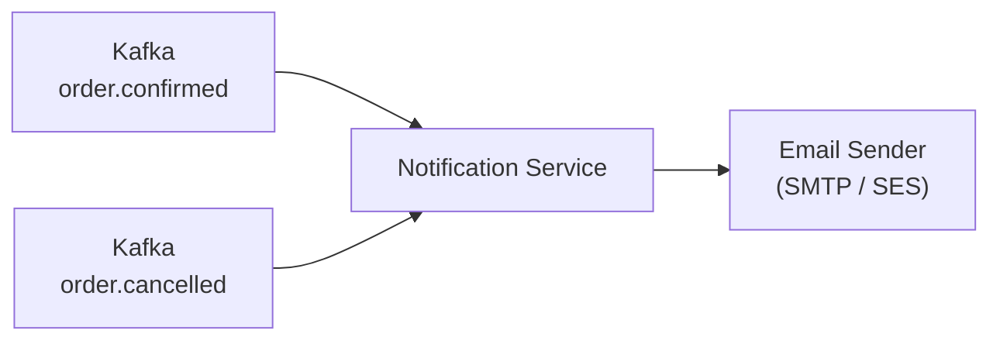

# 5. Payment Service и Notification Service

## Содержание

- [Payment Service](#payment-service)
  - [Идемпотентность](#идемпотентность)
  - [Kafka Consumer: order.created](#kafka-consumer-ordercreated)
  - [Kafka Producer: payment events](#kafka-producer-payment-events)
  - [Симуляция оплаты](#симуляция-оплаты)
  - [PostgreSQL репозиторий](#postgresql-репозиторий)
  - [gRPC сервер](#grpc-сервер)
  - [Миграции](#миграции)
- [Notification Service](#notification-service)
  - [Kafka Consumer](#kafka-consumer)
  - [Email отправка](#email-отправка)
  - [Тестирование](#тестирование)
- [Сравнение с C#](#сравнение-с-c)

---

## Payment Service

Payment Service — конечный потребитель в Saga. Получает `order.created` через Kafka,
эмулирует оплату и публикует `payment.completed` или `payment.failed`.



### Структура пакетов

```
payment-service/
├── cmd/server/main.go
├── internal/
│   ├── domain/
│   │   └── payment.go
│   ├── service/
│   │   └── payment_service.go
│   ├── storage/
│   │   └── postgres/
│   │       └── payment_repo.go
│   ├── grpc/
│   │   └── server.go          # GetPaymentStatus
│   └── kafka/
│       ├── consumer.go        # order.created
│       └── producer.go        # payment.completed / payment.failed
├── migrations/
│   └── 001_create_payments.sql
├── Dockerfile
└── go.mod
```

---

### Идемпотентность

Ключевая особенность Payment Service — **идемпотентная обработка**.
Kafka гарантирует at-least-once delivery: одно сообщение может прийти дважды.
Без идемпотентности пользователь заплатит два раза.



---

### Kafka Consumer: order.created

```go
// internal/kafka/consumer.go
package kafka

import (
    "context"
    "encoding/json"
    "log/slog"
    "time"

    "github.com/segmentio/kafka-go"

    "github.com/yourname/ecommerce/shared/events"
)

// OrderEventHandler — интерфейс для обработки заказов.
type OrderEventHandler interface {
    ProcessPayment(ctx context.Context, orderID, userID string, amountCents int64) error
}

// OrderConsumer подписывается на order.created.
type OrderConsumer struct {
    reader  *kafka.Reader
    handler OrderEventHandler
}

func NewOrderConsumer(brokers []string, groupID string, handler OrderEventHandler) *OrderConsumer {
    return &OrderConsumer{
        reader: kafka.NewReader(kafka.ReaderConfig{
            Brokers:        brokers,
            GroupID:        groupID,
            Topic:          events.TopicOrderCreated,
            MaxWait:        100 * time.Millisecond,
            CommitInterval: time.Second,
            // StartOffset: Начинаем с последнего при первом запуске.
            // В production: FirstOffset для надёжности.
        }),
        handler: handler,
    }
}

// Run — основной цикл обработки.
func (c *OrderConsumer) Run(ctx context.Context) error {
    slog.Info("payment order consumer started")
    for {
        msg, err := c.reader.ReadMessage(ctx)
        if err != nil {
            if ctx.Err() != nil {
                return nil // graceful shutdown
            }
            slog.Error("read order.created", "err", err)
            // Небольшая пауза перед ретраем при ошибке чтения
            time.Sleep(time.Second)
            continue
        }

        var event events.OrderCreatedEvent
        if err := json.Unmarshal(msg.Value, &event); err != nil {
            slog.Error("unmarshal order.created",
                "err", err,
                "offset", msg.Offset,
                "key", string(msg.Key),
            )
            // Poison pill — не можем распарсить, продолжаем (в production → DLT)
            continue
        }

        slog.Info("processing payment",
            "order_id", event.OrderID,
            "amount_cents", event.TotalCents,
        )

        // Идемпотентная обработка — повторный вызов безопасен
        if err := c.handler.ProcessPayment(ctx, event.OrderID, event.UserID, event.TotalCents); err != nil {
            slog.Error("process payment",
                "order_id", event.OrderID,
                "err", err,
            )
            // В production: retry с backoff или отправка в DLT
        }
    }
}

func (c *OrderConsumer) Close() error {
    return c.reader.Close()
}
```

---

### Kafka Producer: payment events

```go
// internal/kafka/producer.go
package kafka

import (
    "context"
    "encoding/json"
    "log/slog"
    "time"

    "github.com/segmentio/kafka-go"

    "github.com/yourname/ecommerce/shared/events"
)

// PaymentProducer публикует результат обработки оплаты.
type PaymentProducer struct {
    writer *kafka.Writer
}

func NewPaymentProducer(brokers []string) *PaymentProducer {
    return &PaymentProducer{
        writer: &kafka.Writer{
            Addr:                   kafka.TCP(brokers...),
            Balancer:               &kafka.Hash{},
            WriteTimeout:           5 * time.Second,
            RequiredAcks:           kafka.RequireAll, // Acks от всех реплик — важные события
            AllowAutoTopicCreation: true,
        },
    }
}

func (p *PaymentProducer) PublishCompleted(ctx context.Context, paymentID, orderID string, amount int64) {
    event := events.PaymentCompletedEvent{
        EventID:   newUUID(),
        PaymentID: paymentID,
        OrderID:   orderID,
        Amount:    amount,
        CreatedAt: time.Now().UTC(),
    }
    p.publish(ctx, events.TopicPaymentCompleted, orderID, event)
}

func (p *PaymentProducer) PublishFailed(ctx context.Context, paymentID, orderID, reason string) {
    event := events.PaymentFailedEvent{
        EventID:   newUUID(),
        PaymentID: paymentID,
        OrderID:   orderID,
        Reason:    reason,
        CreatedAt: time.Now().UTC(),
    }
    p.publish(ctx, events.TopicPaymentFailed, orderID, event)
}

func (p *PaymentProducer) publish(ctx context.Context, topic, key string, event any) {
    data, err := json.Marshal(event)
    if err != nil {
        slog.ErrorContext(ctx, "marshal payment event", "topic", topic, "err", err)
        return
    }
    if err := p.writer.WriteMessages(ctx, kafka.Message{
        Topic: topic,
        Key:   []byte(key),
        Value: data,
    }); err != nil {
        slog.ErrorContext(ctx, "publish payment event",
            "topic", topic,
            "order_id", key,
            "err", err,
        )
    }
}

func (p *PaymentProducer) Close() error {
    return p.writer.Close()
}
```

---

### Симуляция оплаты

```go
// internal/service/payment_service.go
package service

import (
    "context"
    "errors"
    "fmt"
    "math/rand/v2" // Go 1.22+: новый, более удобный API
    "time"

    "github.com/yourname/ecommerce/payment-service/internal/domain"
    "github.com/yourname/ecommerce/payment-service/internal/kafka"
)

// PaymentService обрабатывает оплату заказов.
type PaymentService struct {
    repo     domain.PaymentRepository
    producer *kafka.PaymentProducer
}

func NewPaymentService(repo domain.PaymentRepository, producer *kafka.PaymentProducer) *PaymentService {
    return &PaymentService{repo: repo, producer: producer}
}

// ProcessPayment — идемпотентная обработка оплаты.
// Вызывается Kafka consumer при получении order.created.
func (s *PaymentService) ProcessPayment(ctx context.Context, orderID, userID string, amountCents int64) error {
    payment := &domain.Payment{
        ID:             newUUID(),
        OrderID:        orderID,
        UserID:         userID,
        AmountCents:    amountCents,
        Status:         domain.PaymentPending,
        IdempotencyKey: orderID, // orderID как ключ идемпотентности
        CreatedAt:      time.Now().UTC(),
    }

    // Попытка создать запись. Если ORDER_ID уже существует — вернёт ErrDuplicatePayment.
    if err := s.repo.Create(ctx, payment); err != nil {
        if errors.Is(err, domain.ErrDuplicatePayment) {
            // Дублирующийся вызов — уже обработали, игнорируем
            return nil
        }
        return fmt.Errorf("create payment record: %w", err)
    }

    // Симуляция внешнего платёжного шлюза (в реальном проекте — Stripe, YooKassa и т.д.)
    // 80% успех, 20% отказ — для демонстрации обоих путей Saga
    if s.simulatePaymentGateway(amountCents) {
        if err := s.repo.UpdateStatus(ctx, payment.ID, domain.PaymentCompleted, ""); err != nil {
            return fmt.Errorf("update payment status: %w", err)
        }
        s.producer.PublishCompleted(ctx, payment.ID, orderID, amountCents)
    } else {
        reason := "payment declined by gateway"
        if err := s.repo.UpdateStatus(ctx, payment.ID, domain.PaymentFailed, reason); err != nil {
            return fmt.Errorf("update payment status: %w", err)
        }
        s.producer.PublishFailed(ctx, payment.ID, orderID, reason)
    }

    return nil
}

// simulatePaymentGateway эмулирует внешний платёжный сервис.
// В реальном проекте: вызов Stripe API, YooKassa, SberPay и т.д.
func (s *PaymentService) simulatePaymentGateway(amountCents int64) bool {
    // Добавляем небольшую задержку для реалистичности
    time.Sleep(time.Duration(50+rand.N(100)) * time.Millisecond)

    // 80% успех
    return rand.N(100) < 80
}

func (s *PaymentService) GetPaymentByOrderID(ctx context.Context, orderID string) (*domain.Payment, error) {
    return s.repo.GetByOrderID(ctx, orderID)
}
```

---

### PostgreSQL репозиторий

```go
// internal/storage/postgres/payment_repo.go
package postgres

import (
    "context"
    "errors"
    "fmt"

    "github.com/jackc/pgx/v5"
    "github.com/jackc/pgx/v5/pgconn"
    "github.com/jackc/pgx/v5/pgxpool"

    "github.com/yourname/ecommerce/payment-service/internal/domain"
)

type PaymentRepo struct {
    pool *pgxpool.Pool
}

func NewPaymentRepo(pool *pgxpool.Pool) *PaymentRepo {
    return &PaymentRepo{pool: pool}
}

// Create создаёт запись об оплате.
// idempotency_key = order_id имеет UNIQUE ограничение.
// Повторный вызов вернёт ErrDuplicatePayment (идемпотентность).
func (r *PaymentRepo) Create(ctx context.Context, p *domain.Payment) error {
    tag, err := r.pool.Exec(ctx, `
        INSERT INTO payments (id, order_id, user_id, amount_cents, status, idempotency_key, created_at)
        VALUES ($1, $2, $3, $4, $5, $6, $7)
        ON CONFLICT (idempotency_key) DO NOTHING
    `, p.ID, p.OrderID, p.UserID, p.AmountCents, p.Status, p.IdempotencyKey, p.CreatedAt)

    if err != nil {
        var pgErr *pgconn.PgError
        if errors.As(err, &pgErr) && pgErr.Code == "23505" {
            return domain.ErrDuplicatePayment
        }
        return fmt.Errorf("insert payment: %w", err)
    }

    // ON CONFLICT DO NOTHING → 0 rows → уже существует
    if tag.RowsAffected() == 0 {
        return domain.ErrDuplicatePayment
    }

    return nil
}

func (r *PaymentRepo) UpdateStatus(ctx context.Context, id string, status domain.PaymentStatus, reason string) error {
    _, err := r.pool.Exec(ctx, `
        UPDATE payments
        SET status = $1, failure_reason = $2, updated_at = NOW()
        WHERE id = $3
    `, status, reason, id)
    if err != nil {
        return fmt.Errorf("update payment status: %w", err)
    }
    return nil
}

func (r *PaymentRepo) GetByOrderID(ctx context.Context, orderID string) (*domain.Payment, error) {
    p := &domain.Payment{}
    err := r.pool.QueryRow(ctx, `
        SELECT id, order_id, user_id, amount_cents, status, idempotency_key, failure_reason, created_at
        FROM payments WHERE order_id = $1
    `, orderID).Scan(
        &p.ID, &p.OrderID, &p.UserID, &p.AmountCents,
        &p.Status, &p.IdempotencyKey, &p.FailureReason, &p.CreatedAt,
    )
    if err != nil {
        if errors.Is(err, pgx.ErrNoRows) {
            return nil, domain.ErrPaymentNotFound
        }
        return nil, fmt.Errorf("get payment: %w", err)
    }
    return p, nil
}
```

---

### gRPC сервер

```go
// internal/grpc/server.go
package grpc

import (
    "context"
    "errors"

    "google.golang.org/grpc/codes"
    "google.golang.org/grpc/status"

    paymentv1 "github.com/yourname/ecommerce/gen/go/payment/v1"
    "github.com/yourname/ecommerce/payment-service/internal/domain"
    "github.com/yourname/ecommerce/payment-service/internal/service"
)

type Server struct {
    paymentv1.UnimplementedPaymentServiceServer
    svc *service.PaymentService
}

func NewServer(svc *service.PaymentService) *Server {
    return &Server{svc: svc}
}

// GetPaymentStatus — API Gateway может запросить статус оплаты по order_id.
func (s *Server) GetPaymentStatus(ctx context.Context, req *paymentv1.GetPaymentStatusRequest) (*paymentv1.GetPaymentStatusResponse, error) {
    p, err := s.svc.GetPaymentByOrderID(ctx, req.OrderId)
    if err != nil {
        if errors.Is(err, domain.ErrPaymentNotFound) {
            return nil, status.Error(codes.NotFound, "payment not found")
        }
        return nil, status.Error(codes.Internal, "internal error")
    }

    return &paymentv1.GetPaymentStatusResponse{
        PaymentId: p.ID,
        Status:    toProtoStatus(p.Status),
        Reason:    p.FailureReason,
    }, nil
}

func toProtoStatus(s domain.PaymentStatus) paymentv1.PaymentStatus {
    switch s {
    case domain.PaymentPending:
        return paymentv1.PaymentStatus_PAYMENT_STATUS_PENDING
    case domain.PaymentCompleted:
        return paymentv1.PaymentStatus_PAYMENT_STATUS_COMPLETED
    case domain.PaymentFailed:
        return paymentv1.PaymentStatus_PAYMENT_STATUS_FAILED
    default:
        return paymentv1.PaymentStatus_PAYMENT_STATUS_UNSPECIFIED
    }
}
```

---

### Миграции

```sql
-- migrations/001_create_payments.sql
CREATE TABLE IF NOT EXISTS payments (
    id               UUID         PRIMARY KEY DEFAULT gen_random_uuid(),
    order_id         UUID         NOT NULL,
    user_id          UUID         NOT NULL,
    amount_cents     BIGINT       NOT NULL CHECK (amount_cents > 0),
    status           TEXT         NOT NULL DEFAULT 'pending'
                                  CHECK (status IN ('pending', 'completed', 'failed')),
    idempotency_key  TEXT         NOT NULL UNIQUE, -- = order_id
    failure_reason   TEXT         NOT NULL DEFAULT '',
    created_at       TIMESTAMPTZ  NOT NULL DEFAULT NOW(),
    updated_at       TIMESTAMPTZ  NOT NULL DEFAULT NOW()
);

-- Поиск по order_id для GetPaymentStatus
CREATE INDEX idx_payments_order_id ON payments (order_id);
CREATE INDEX idx_payments_status   ON payments (status);

CREATE TRIGGER payments_updated_at
    BEFORE UPDATE ON payments
    FOR EACH ROW EXECUTE FUNCTION set_updated_at();
```

---

## Notification Service

Notification Service — чистый Kafka consumer. Нет gRPC сервера, нет HTTP.
Только горутины, потребляющие события и отправляющие уведомления.



### Структура пакетов

```
notification-service/
├── cmd/worker/main.go           # нет gRPC/HTTP — только worker
├── internal/
│   ├── consumer/
│   │   └── order_consumer.go    # Kafka consumers
│   ├── sender/
│   │   ├── sender.go            # интерфейс Sender
│   │   ├── smtp.go              # SMTP реализация
│   │   └── log.go               # Лог-реализация для разработки
│   └── config/
│       └── config.go
├── Dockerfile
└── go.mod
```

---

### Kafka Consumer

```go
// internal/consumer/order_consumer.go
package consumer

import (
    "context"
    "encoding/json"
    "log/slog"
    "time"

    "github.com/segmentio/kafka-go"

    "github.com/yourname/ecommerce/notification-service/internal/sender"
    "github.com/yourname/ecommerce/shared/events"
)

// OrderConsumer подписывается на события заказов и отправляет уведомления.
type OrderConsumer struct {
    confirmedReader *kafka.Reader
    cancelledReader *kafka.Reader
    sender          sender.Sender
    // Для получения email пользователя нужен User Service gRPC клиент
    // Для простоты — email хранится в событии (денормализация)
}

func NewOrderConsumer(brokers []string, groupID string, s sender.Sender) *OrderConsumer {
    makeReader := func(topic string) *kafka.Reader {
        return kafka.NewReader(kafka.ReaderConfig{
            Brokers:        brokers,
            GroupID:        groupID,
            Topic:          topic,
            MaxWait:        100 * time.Millisecond,
            CommitInterval: time.Second,
        })
    }

    return &OrderConsumer{
        confirmedReader: makeReader(events.TopicOrderConfirmed),
        cancelledReader: makeReader(events.TopicOrderCancelled),
        sender:          s,
    }
}

// RunConfirmed обрабатывает order.confirmed → шлёт "Заказ подтверждён".
func (c *OrderConsumer) RunConfirmed(ctx context.Context) error {
    slog.Info("notification consumer started", "topic", events.TopicOrderConfirmed)
    for {
        msg, err := c.confirmedReader.ReadMessage(ctx)
        if err != nil {
            if ctx.Err() != nil {
                return nil
            }
            slog.Error("read confirmed", "err", err)
            continue
        }

        var event events.OrderConfirmedEvent
        if err := json.Unmarshal(msg.Value, &event); err != nil {
            slog.Error("unmarshal confirmed", "err", err)
            continue
        }

        slog.Info("sending order confirmed notification", "order_id", event.OrderID)
        if err := c.sender.SendOrderConfirmed(ctx, sender.OrderConfirmedParams{
            OrderID: event.OrderID,
            UserID:  event.UserID,
            // В реальном проекте: запрашиваем email из User Service
            // или денормализуем его в событие
        }); err != nil {
            slog.Error("send confirmed notification", "order_id", event.OrderID, "err", err)
        }
    }
}

// RunCancelled обрабатывает order.cancelled → шлёт "Заказ отменён".
func (c *OrderConsumer) RunCancelled(ctx context.Context) error {
    slog.Info("notification consumer started", "topic", events.TopicOrderCancelled)
    for {
        msg, err := c.cancelledReader.ReadMessage(ctx)
        if err != nil {
            if ctx.Err() != nil {
                return nil
            }
            slog.Error("read cancelled", "err", err)
            continue
        }

        var event events.OrderCancelledEvent
        if err := json.Unmarshal(msg.Value, &event); err != nil {
            slog.Error("unmarshal cancelled", "err", err)
            continue
        }

        slog.Info("sending order cancelled notification",
            "order_id", event.OrderID,
            "reason", event.Reason,
        )
        if err := c.sender.SendOrderCancelled(ctx, sender.OrderCancelledParams{
            OrderID: event.OrderID,
            UserID:  event.UserID,
            Reason:  event.Reason,
        }); err != nil {
            slog.Error("send cancelled notification", "order_id", event.OrderID, "err", err)
        }
    }
}

func (c *OrderConsumer) Close() {
    c.confirmedReader.Close()
    c.cancelledReader.Close()
}
```

---

### Email отправка

```go
// internal/sender/sender.go
package sender

import "context"

type OrderConfirmedParams struct {
    OrderID string
    UserID  string
    Email   string // если доступен
}

type OrderCancelledParams struct {
    OrderID string
    UserID  string
    Email   string
    Reason  string
}

// Sender — интерфейс отправителя уведомлений.
// Consumer-side interface: определён здесь, реализации в smtp.go / log.go
type Sender interface {
    SendOrderConfirmed(ctx context.Context, p OrderConfirmedParams) error
    SendOrderCancelled(ctx context.Context, p OrderCancelledParams) error
}
```

```go
// internal/sender/log.go
// LogSender — реализация для разработки/тестирования: логирует вместо отправки.
package sender

import (
    "context"
    "log/slog"
)

type LogSender struct{}

func NewLogSender() *LogSender { return &LogSender{} }

func (s *LogSender) SendOrderConfirmed(ctx context.Context, p OrderConfirmedParams) error {
    slog.InfoContext(ctx, "[EMAIL] Order confirmed",
        "order_id", p.OrderID,
        "user_id", p.UserID,
        "subject", "Ваш заказ подтверждён!",
    )
    return nil
}

func (s *LogSender) SendOrderCancelled(ctx context.Context, p OrderCancelledParams) error {
    slog.InfoContext(ctx, "[EMAIL] Order cancelled",
        "order_id", p.OrderID,
        "user_id", p.UserID,
        "reason", p.Reason,
        "subject", "Ваш заказ отменён",
    )
    return nil
}
```

```go
// internal/sender/smtp.go
// SMTPSender — реализация через стандартную библиотеку net/smtp.
package sender

import (
    "bytes"
    "context"
    "fmt"
    "net/smtp"
    "text/template"
)

type SMTPConfig struct {
    Host     string
    Port     int
    Username string
    Password string
    From     string
}

type SMTPSender struct {
    cfg  SMTPConfig
    auth smtp.Auth
}

func NewSMTPSender(cfg SMTPConfig) *SMTPSender {
    return &SMTPSender{
        cfg:  cfg,
        auth: smtp.PlainAuth("", cfg.Username, cfg.Password, cfg.Host),
    }
}

var confirmedTmpl = template.Must(template.New("confirmed").Parse(`
Здравствуйте!

Ваш заказ {{ .OrderID }} успешно подтверждён и будет передан в доставку.

С уважением,
E-commerce Platform
`))

var cancelledTmpl = template.Must(template.New("cancelled").Parse(`
Здравствуйте!

К сожалению, ваш заказ {{ .OrderID }} был отменён.
Причина: {{ .Reason }}

Если у вас есть вопросы, обратитесь в поддержку.

С уважением,
E-commerce Platform
`))

func (s *SMTPSender) SendOrderConfirmed(ctx context.Context, p OrderConfirmedParams) error {
    if p.Email == "" {
        return nil // нет email — пропускаем
    }

    var body bytes.Buffer
    if err := confirmedTmpl.Execute(&body, p); err != nil {
        return fmt.Errorf("render template: %w", err)
    }

    return s.send(p.Email, "Ваш заказ подтверждён!", body.String())
}

func (s *SMTPSender) SendOrderCancelled(ctx context.Context, p OrderCancelledParams) error {
    if p.Email == "" {
        return nil
    }

    var body bytes.Buffer
    if err := cancelledTmpl.Execute(&body, p); err != nil {
        return fmt.Errorf("render template: %w", err)
    }

    return s.send(p.Email, "Ваш заказ отменён", body.String())
}

func (s *SMTPSender) send(to, subject, body string) error {
    addr := fmt.Sprintf("%s:%d", s.cfg.Host, s.cfg.Port)
    msg := []byte(fmt.Sprintf(
        "From: %s\r\nTo: %s\r\nSubject: %s\r\n\r\n%s",
        s.cfg.From, to, subject, body,
    ))
    return smtp.SendMail(addr, s.auth, s.cfg.From, []string{to}, msg)
}
```

### main.go (worker)

```go
// cmd/worker/main.go
package main

import (
    "context"
    "fmt"
    "log/slog"
    "os"
    "os/signal"
    "syscall"

    "github.com/yourname/ecommerce/notification-service/internal/consumer"
    "github.com/yourname/ecommerce/notification-service/internal/sender"
    "github.com/yourname/ecommerce/notification-service/internal/config"
)

func main() {
    cfg, err := config.Load()
    if err != nil {
        fmt.Fprintln(os.Stderr, "config:", err)
        os.Exit(1)
    }

    slog.SetDefault(slog.New(slog.NewJSONHandler(os.Stdout, nil)))

    ctx, stop := signal.NotifyContext(context.Background(), syscall.SIGTERM, syscall.SIGINT)
    defer stop()

    // Выбираем отправитель в зависимости от конфигурации
    var s sender.Sender
    if cfg.SMTPHost != "" {
        s = sender.NewSMTPSender(sender.SMTPConfig{
            Host:     cfg.SMTPHost,
            Port:     cfg.SMTPPort,
            Username: cfg.SMTPUser,
            Password: cfg.SMTPPass,
            From:     cfg.SMTPFrom,
        })
        slog.Info("using SMTP sender", "host", cfg.SMTPHost)
    } else {
        s = sender.NewLogSender()
        slog.Info("using log sender (development mode)")
    }

    orderConsumer := consumer.NewOrderConsumer(cfg.KafkaBrokers(), cfg.KafkaGroupID, s)
    defer orderConsumer.Close()

    slog.Info("notification worker started")

    // Запускаем два consumer в горутинах
    go func() {
        if err := orderConsumer.RunConfirmed(ctx); err != nil {
            slog.Error("confirmed consumer", "err", err)
        }
    }()
    go func() {
        if err := orderConsumer.RunCancelled(ctx); err != nil {
            slog.Error("cancelled consumer", "err", err)
        }
    }()

    <-ctx.Done()
    slog.Info("notification worker stopped")
}
```

---

## Тестирование

```go
// internal/service/payment_service_test.go
package service_test

import (
    "context"
    "testing"
    "time"

    "github.com/stretchr/testify/assert"
    "github.com/stretchr/testify/require"

    "github.com/yourname/ecommerce/payment-service/internal/domain"
    "github.com/yourname/ecommerce/payment-service/internal/service"
)

type mockPaymentRepo struct {
    payments map[string]*domain.Payment // по idempotency_key
}

func newMockPaymentRepo() *mockPaymentRepo {
    return &mockPaymentRepo{payments: make(map[string]*domain.Payment)}
}

func (m *mockPaymentRepo) Create(_ context.Context, p *domain.Payment) error {
    if _, exists := m.payments[p.IdempotencyKey]; exists {
        return domain.ErrDuplicatePayment
    }
    m.payments[p.IdempotencyKey] = p
    return nil
}

func (m *mockPaymentRepo) UpdateStatus(_ context.Context, id string, status domain.PaymentStatus, reason string) error {
    for _, p := range m.payments {
        if p.ID == id {
            p.Status = status
            p.FailureReason = reason
            return nil
        }
    }
    return domain.ErrPaymentNotFound
}

func (m *mockPaymentRepo) GetByOrderID(_ context.Context, orderID string) (*domain.Payment, error) {
    p, ok := m.payments[orderID]
    if !ok {
        return nil, domain.ErrPaymentNotFound
    }
    return p, nil
}

type mockPaymentProducer struct {
    completed int
    failed    int
}

func (m *mockPaymentProducer) PublishCompleted(_ context.Context, _, _ string, _ int64) { m.completed++ }
func (m *mockPaymentProducer) PublishFailed(_ context.Context, _, _, _ string)          { m.failed++ }

func TestPaymentService_Idempotency(t *testing.T) {
    repo := newMockPaymentRepo()
    producer := &mockPaymentProducer{}
    svc := service.NewPaymentService(repo, producer)

    ctx := context.Background()
    orderID := "order-idempotency-test"

    // Первый вызов — должен обработаться
    err := svc.ProcessPayment(ctx, orderID, "user-1", 9900)
    require.NoError(t, err)

    totalPublished := producer.completed + producer.failed
    assert.Equal(t, 1, totalPublished, "должно быть опубликовано ровно 1 событие")

    // Второй вызов с тем же orderID — дубликат, должен быть проигнорирован
    err = svc.ProcessPayment(ctx, orderID, "user-1", 9900)
    require.NoError(t, err) // не ошибка, просто no-op

    totalPublished2 := producer.completed + producer.failed
    assert.Equal(t, totalPublished, totalPublished2, "повторный вызов не должен публиковать новые события")
}
```

---

## Сравнение с C#

### Идемпотентность: MassTransit Outbox vs Go

**C# (MassTransit Outbox)**:
```csharp
// MassTransit автоматически обеспечивает идемпотентность через Outbox паттерн
// + встроенный InboxId для дедупликации входящих сообщений
services.AddMassTransit(x =>
{
    x.AddEntityFrameworkOutbox<AppDbContext>(o =>
    {
        o.UsePostgres();
        o.UseBusOutbox();
    });
});
```

**Go (явная идемпотентность)**:
```go
// Вручную: UNIQUE ограничение + ON CONFLICT DO NOTHING
_, err = tx.Exec(ctx, `
    INSERT INTO payments (idempotency_key, ...)
    VALUES ($1, ...)
    ON CONFLICT (idempotency_key) DO NOTHING
`, orderID, ...)

// 0 affected rows → уже обработали → возвращаем ErrDuplicatePayment → caller игнорирует
```

### Worker vs WebAPI

| Аспект | C# Worker Service | Go worker |
|--------|------------------|-----------|
| Хостинг | `IHostedService` / `BackgroundService` | горутины + `signal.NotifyContext` |
| DI | `IServiceProvider` | явные параметры конструктора |
| Graceful shutdown | `StopAsync(CancellationToken)` | `ctx.Done()` + `defer Close()` |
| Логирование | `ILogger<T>` | `log/slog` |

**C#**:
```csharp
public class OrderConsumer : BackgroundService
{
    protected override async Task ExecuteAsync(CancellationToken stoppingToken)
    {
        while (!stoppingToken.IsCancellationRequested)
        {
            var message = await _consumer.ConsumeAsync(stoppingToken);
            await _handler.HandleAsync(message, stoppingToken);
        }
    }
}
```

**Go**:
```go
func (c *OrderConsumer) Run(ctx context.Context) error {
    for {
        msg, err := c.reader.ReadMessage(ctx)
        if err != nil {
            if ctx.Err() != nil {
                return nil // graceful shutdown
            }
            // временная ошибка — продолжаем
            continue
        }
        c.handler.Handle(ctx, msg)
    }
}
```

---

[← Order Service](./04_order_service.md) | [API Gateway →](./06_api_gateway.md)
