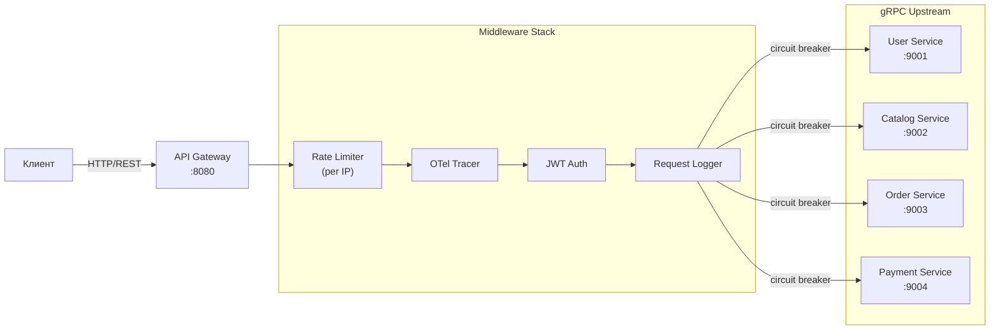

# 6. API Gateway

## Содержание

<!-- START doctoc generated TOC please keep comment here to allow auto update -->
<!-- DON'T EDIT THIS SECTION, INSTEAD RE-RUN doctoc TO UPDATE -->

- [Обзор](#%D0%BE%D0%B1%D0%B7%D0%BE%D1%80)
  - [Структура пакетов](#%D1%81%D1%82%D1%80%D1%83%D0%BA%D1%82%D1%83%D1%80%D0%B0-%D0%BF%D0%B0%D0%BA%D0%B5%D1%82%D0%BE%D0%B2)
- [Структура и routing](#%D1%81%D1%82%D1%80%D1%83%D0%BA%D1%82%D1%83%D1%80%D0%B0-%D0%B8-routing)
- [JWT middleware](#jwt-middleware)
- [gRPC клиенты с Circuit Breaker](#grpc-%D0%BA%D0%BB%D0%B8%D0%B5%D0%BD%D1%82%D1%8B-%D1%81-circuit-breaker)
- [HTTP хэндлеры](#http-%D1%85%D1%8D%D0%BD%D0%B4%D0%BB%D0%B5%D1%80%D1%8B)
- [Rate limiting](#rate-limiting)
- [main.go](#maingo)
- [Тестирование](#%D1%82%D0%B5%D1%81%D1%82%D0%B8%D1%80%D0%BE%D0%B2%D0%B0%D0%BD%D0%B8%D0%B5)
- [Сравнение с C#](#%D1%81%D1%80%D0%B0%D0%B2%D0%BD%D0%B5%D0%BD%D0%B8%D0%B5-%D1%81-c)
  - [API Gateway: YARP vs chi + gobreaker](#api-gateway-yarp-vs-chi--gobreaker)
  - [Circuit Breaker: Polly vs gobreaker](#circuit-breaker-polly-vs-gobreaker)
  - [gRPC → HTTP маппинг](#grpc-%E2%86%92-http-%D0%BC%D0%B0%D0%BF%D0%BF%D0%B8%D0%BD%D0%B3)

<!-- END doctoc generated TOC please keep comment here to allow auto update -->

---

## Обзор

API Gateway — единая точка входа для клиентов. Отвечает за:

1. **JWT верификацию** — проверяет токен через User Service (gRPC)
2. **Routing** — направляет HTTP запросы к нужным gRPC сервисам
3. **Circuit Breaker** — защищает от каскадных сбоев
4. **Rate limiting** — ограничивает частоту запросов
5. **Трейсинг** — пробрасывает trace context во все upstream запросы



### Структура пакетов

```
api-gateway/
├── cmd/gateway/main.go
├── internal/
│   ├── config/config.go
│   ├── handler/
│   │   ├── auth.go          # POST /auth/register, /auth/login
│   │   ├── catalog.go       # GET /products, /products/{id}
│   │   ├── orders.go        # POST /orders, GET /orders/{id}
│   │   └── health.go        # GET /health
│   ├── middleware/
│   │   ├── auth.go          # JWT верификация
│   │   ├── ratelimit.go     # Rate limiting per IP
│   │   └── logging.go       # Request/response логирование
│   └── client/
│       ├── user.go          # gRPC клиент → User Service + CB
│       ├── catalog.go       # gRPC клиент → Catalog Service + CB
│       ├── order.go         # gRPC клиент → Order Service + CB
│       └── payment.go       # gRPC клиент → Payment Service + CB
├── Dockerfile
└── go.mod
```

---

## Структура и routing

```go
// cmd/gateway/main.go (роутинг)
// Полный main.go — в разделе ниже
r := chi.NewRouter()

// Глобальные middleware (применяются ко всем маршрутам)
r.Use(middleware.RequestID)       // chi: добавляет X-Request-ID
r.Use(middleware.RealIP)          // chi: X-Forwarded-For
r.Use(otelhttp.NewMiddleware("api-gateway")) // OTel трейсинг
r.Use(gatewayMiddleware.Logger)             // кастомный slog logger
r.Use(gatewayMiddleware.RateLimiter(100))  // 100 req/sec per IP
r.Use(middleware.Recoverer)       // chi: panic recovery

// Публичные маршруты (без JWT)
r.Route("/api/v1", func(r chi.Router) {
    r.Post("/auth/register", authHandler.Register)
    r.Post("/auth/login", authHandler.Login)

    r.Get("/products", catalogHandler.ListProducts)
    r.Get("/products/{id}", catalogHandler.GetProduct)

    r.Get("/health", healthHandler.Health)
    r.Get("/ready", healthHandler.Ready)
})

// Защищённые маршруты (требуют JWT)
r.Route("/api/v1", func(r chi.Router) {
    r.Use(gatewayMiddleware.JWTAuth(userClient))

    r.Post("/orders", orderHandler.CreateOrder)
    r.Get("/orders/{id}", orderHandler.GetOrder)
    r.Get("/orders/{id}/payment", paymentHandler.GetStatus)
    r.Get("/users/me", authHandler.GetProfile)
})
```

---

## JWT middleware

```go
// internal/middleware/auth.go
package middleware

import (
    "net/http"
    "strings"

    "github.com/yourname/ecommerce/api-gateway/internal/client"
    "github.com/yourname/ecommerce/shared/middleware"
)

// UserClient — интерфейс для JWT верификации через User Service.
type UserClient interface {
    ValidateToken(r *http.Request, token string) (userID, email string, ok bool)
}

// JWTAuth проверяет JWT токен через User Service.
// При успехе добавляет userID и email в context.
func JWTAuth(uc *client.UserClient) func(http.Handler) http.Handler {
    return func(next http.Handler) http.Handler {
        return http.HandlerFunc(func(w http.ResponseWriter, r *http.Request) {
            authHeader := r.Header.Get("Authorization")
            if authHeader == "" {
                http.Error(w, `{"error":"authorization required"}`, http.StatusUnauthorized)
                return
            }

            if !strings.HasPrefix(authHeader, "Bearer ") {
                http.Error(w, `{"error":"invalid authorization format"}`, http.StatusUnauthorized)
                return
            }
            token := strings.TrimPrefix(authHeader, "Bearer ")

            // Верифицируем через User Service (gRPC)
            resp, err := uc.ValidateToken(r.Context(), token)
            if err != nil || !resp.Valid {
                http.Error(w, `{"error":"invalid or expired token"}`, http.StatusUnauthorized)
                return
            }

            // Добавляем claims в context для downstream хэндлеров
            ctx := middleware.WithClaims(r.Context(), &middleware.Claims{
                UserID: resp.UserId,
                Email:  resp.Email,
            })
            next.ServeHTTP(w, r.WithContext(ctx))
        })
    }
}
```

---

## gRPC клиенты с Circuit Breaker

Circuit Breaker защищает API Gateway от ситуации, когда upstream сервис не отвечает.
Без него — все запросы будут висеть в ожидании, исчерпывая пул горутин.

```go
// internal/client/user.go
package client

import (
    "context"
    "fmt"
    "time"

    "github.com/sony/gobreaker/v2"
    "google.golang.org/grpc"
    "go.opentelemetry.io/contrib/instrumentation/google.golang.org/grpc/otelgrpc"

    userv1 "github.com/yourname/ecommerce/gen/go/user/v1"
)

// UserClient — gRPC клиент → User Service с circuit breaker.
type UserClient struct {
    client  userv1.UserServiceClient
    breaker *gobreaker.CircuitBreaker[any]
}

func NewUserClient(addr string) (*UserClient, error) {
    conn, err := grpc.NewClient(addr,
        grpc.WithInsecure(), // в production → TLS
        grpc.WithStatsHandler(otelgrpc.NewClientHandler()),
        grpc.WithDefaultCallOptions(grpc.WaitForReady(false)),
    )
    if err != nil {
        return nil, fmt.Errorf("connect user service: %w", err)
    }

    // Circuit Breaker настройки
    cb := gobreaker.NewCircuitBreaker[any](gobreaker.Settings{
        Name:        "user-service",
        MaxRequests: 1,                // Half-Open: 1 пробный запрос
        Interval:    10 * time.Second, // сброс счётчика ошибок
        Timeout:     30 * time.Second, // время в Open состоянии
        ReadyToTrip: func(counts gobreaker.Counts) bool {
            // Открываем при 5 ошибках подряд или 50% failure rate
            return counts.ConsecutiveFailures >= 5 ||
                (counts.Requests >= 10 && counts.TotalFailures*2 >= counts.Requests)
        },
        OnStateChange: func(name string, from, to gobreaker.State) {
            // Логируем изменение состояния CB
            fmt.Printf("circuit breaker %s: %s → %s\n", name, from, to)
        },
    })

    return &UserClient{
        client:  userv1.NewUserServiceClient(conn),
        breaker: cb,
    }, nil
}

// Register создаёт нового пользователя.
func (c *UserClient) Register(ctx context.Context, email, password, name string) (string, error) {
    result, err := c.breaker.Execute(func() (any, error) {
        return c.client.Register(ctx, &userv1.RegisterRequest{
            Email:    email,
            Password: password,
            Name:     name,
        })
    })
    if err != nil {
        if err == gobreaker.ErrOpenState {
            return "", fmt.Errorf("user service temporarily unavailable")
        }
        return "", err
    }
    resp := result.(*userv1.RegisterResponse)
    return resp.UserId, nil
}

// Login аутентифицирует пользователя.
func (c *UserClient) Login(ctx context.Context, email, password string) (accessToken, refreshToken string, err error) {
    result, cbErr := c.breaker.Execute(func() (any, error) {
        return c.client.Login(ctx, &userv1.LoginRequest{
            Email:    email,
            Password: password,
        })
    })
    if cbErr != nil {
        if cbErr == gobreaker.ErrOpenState {
            return "", "", fmt.Errorf("user service temporarily unavailable")
        }
        return "", "", cbErr
    }
    resp := result.(*userv1.LoginResponse)
    return resp.AccessToken, resp.RefreshToken, nil
}

// ValidateToken верифицирует JWT. Вызывается из JWT middleware.
func (c *UserClient) ValidateToken(ctx context.Context, token string) (*userv1.ValidateTokenResponse, error) {
    result, err := c.breaker.Execute(func() (any, error) {
        return c.client.ValidateToken(ctx, &userv1.ValidateTokenRequest{Token: token})
    })
    if err != nil {
        return nil, err
    }
    return result.(*userv1.ValidateTokenResponse), nil
}
```

```go
// internal/client/order.go
package client

import (
    "context"
    "fmt"
    "time"

    "github.com/sony/gobreaker/v2"
    "google.golang.org/grpc"
    "go.opentelemetry.io/contrib/instrumentation/google.golang.org/grpc/otelgrpc"

    orderv1 "github.com/yourname/ecommerce/gen/go/order/v1"
)

type OrderClient struct {
    client  orderv1.OrderServiceClient
    breaker *gobreaker.CircuitBreaker[any]
}

func NewOrderClient(addr string) (*OrderClient, error) {
    conn, err := grpc.NewClient(addr,
        grpc.WithInsecure(),
        grpc.WithStatsHandler(otelgrpc.NewClientHandler()),
    )
    if err != nil {
        return nil, fmt.Errorf("connect order service: %w", err)
    }

    cb := newCircuitBreaker("order-service")
    return &OrderClient{client: orderv1.NewOrderServiceClient(conn), breaker: cb}, nil
}

func (c *OrderClient) CreateOrder(ctx context.Context, userID string, items []*orderv1.OrderItemInput) (*orderv1.CreateOrderResponse, error) {
    result, err := c.breaker.Execute(func() (any, error) {
        return c.client.CreateOrder(ctx, &orderv1.CreateOrderRequest{
            UserId: userID,
            Items:  items,
        })
    })
    if err != nil {
        if err == gobreaker.ErrOpenState {
            return nil, fmt.Errorf("order service temporarily unavailable")
        }
        return nil, err
    }
    return result.(*orderv1.CreateOrderResponse), nil
}

func (c *OrderClient) GetOrder(ctx context.Context, orderID string) (*orderv1.GetOrderResponse, error) {
    result, err := c.breaker.Execute(func() (any, error) {
        return c.client.GetOrder(ctx, &orderv1.GetOrderRequest{OrderId: orderID})
    })
    if err != nil {
        return nil, err
    }
    return result.(*orderv1.GetOrderResponse), nil
}

// newCircuitBreaker — фабрика CB с общими настройками.
func newCircuitBreaker(name string) *gobreaker.CircuitBreaker[any] {
    return gobreaker.NewCircuitBreaker[any](gobreaker.Settings{
        Name:        name,
        MaxRequests: 1,
        Interval:    10 * time.Second,
        Timeout:     30 * time.Second,
        ReadyToTrip: func(counts gobreaker.Counts) bool {
            return counts.ConsecutiveFailures >= 5
        },
    })
}
```

---

## HTTP хэндлеры

```go
// internal/handler/auth.go
package handler

import (
    "encoding/json"
    "net/http"

    "google.golang.org/grpc/codes"
    "google.golang.org/grpc/status"

    "github.com/yourname/ecommerce/api-gateway/internal/client"
    sharedMiddleware "github.com/yourname/ecommerce/shared/middleware"
)

type AuthHandler struct {
    users *client.UserClient
}

func NewAuthHandler(users *client.UserClient) *AuthHandler {
    return &AuthHandler{users: users}
}

type registerRequest struct {
    Email    string `json:"email"`
    Password string `json:"password"`
    Name     string `json:"name"`
}

type registerResponse struct {
    UserID string `json:"user_id"`
}

func (h *AuthHandler) Register(w http.ResponseWriter, r *http.Request) {
    var req registerRequest
    if err := json.NewDecoder(r.Body).Decode(&req); err != nil {
        writeError(w, http.StatusBadRequest, "invalid request body")
        return
    }

    userID, err := h.users.Register(r.Context(), req.Email, req.Password, req.Name)
    if err != nil {
        // Транслируем gRPC ошибки в HTTP статусы
        writeGRPCError(w, err)
        return
    }

    writeJSON(w, http.StatusCreated, registerResponse{UserID: userID})
}

type loginRequest struct {
    Email    string `json:"email"`
    Password string `json:"password"`
}

type loginResponse struct {
    AccessToken  string `json:"access_token"`
    RefreshToken string `json:"refresh_token"`
    ExpiresIn    int64  `json:"expires_in"`
}

func (h *AuthHandler) Login(w http.ResponseWriter, r *http.Request) {
    var req loginRequest
    if err := json.NewDecoder(r.Body).Decode(&req); err != nil {
        writeError(w, http.StatusBadRequest, "invalid request body")
        return
    }

    access, refresh, err := h.users.Login(r.Context(), req.Email, req.Password)
    if err != nil {
        writeGRPCError(w, err)
        return
    }

    writeJSON(w, http.StatusOK, loginResponse{
        AccessToken:  access,
        RefreshToken: refresh,
        ExpiresIn:    3600,
    })
}

func (h *AuthHandler) GetProfile(w http.ResponseWriter, r *http.Request) {
    claims, ok := sharedMiddleware.ClaimsFromContext(r.Context())
    if !ok {
        writeError(w, http.StatusUnauthorized, "unauthorized")
        return
    }
    writeJSON(w, http.StatusOK, map[string]string{
        "user_id": claims.UserID,
        "email":   claims.Email,
    })
}
```

```go
// internal/handler/orders.go
package handler

import (
    "encoding/json"
    "net/http"

    "github.com/go-chi/chi/v5"

    orderv1 "github.com/yourname/ecommerce/gen/go/order/v1"
    "github.com/yourname/ecommerce/api-gateway/internal/client"
    sharedMiddleware "github.com/yourname/ecommerce/shared/middleware"
)

type OrderHandler struct {
    orders *client.OrderClient
}

func NewOrderHandler(orders *client.OrderClient) *OrderHandler {
    return &OrderHandler{orders: orders}
}

type createOrderRequest struct {
    Items []struct {
        ProductID string `json:"product_id"`
        Quantity  int32  `json:"quantity"`
    } `json:"items"`
}

type createOrderResponse struct {
    OrderID string `json:"order_id"`
    Status  string `json:"status"`
}

func (h *OrderHandler) CreateOrder(w http.ResponseWriter, r *http.Request) {
    claims, ok := sharedMiddleware.ClaimsFromContext(r.Context())
    if !ok {
        writeError(w, http.StatusUnauthorized, "unauthorized")
        return
    }

    var req createOrderRequest
    if err := json.NewDecoder(r.Body).Decode(&req); err != nil {
        writeError(w, http.StatusBadRequest, "invalid request body")
        return
    }

    if len(req.Items) == 0 {
        writeError(w, http.StatusBadRequest, "order must have at least one item")
        return
    }

    items := make([]*orderv1.OrderItemInput, len(req.Items))
    for i, item := range req.Items {
        items[i] = &orderv1.OrderItemInput{
            ProductId: item.ProductID,
            Quantity:  item.Quantity,
        }
    }

    resp, err := h.orders.CreateOrder(r.Context(), claims.UserID, items)
    if err != nil {
        writeGRPCError(w, err)
        return
    }

    // 202 Accepted — заказ создан, оплата асинхронна
    writeJSON(w, http.StatusAccepted, createOrderResponse{
        OrderID: resp.OrderId,
        Status:  resp.Status.String(),
    })
}

func (h *OrderHandler) GetOrder(w http.ResponseWriter, r *http.Request) {
    orderID := chi.URLParam(r, "id")
    if orderID == "" {
        writeError(w, http.StatusBadRequest, "order id required")
        return
    }

    resp, err := h.orders.GetOrder(r.Context(), orderID)
    if err != nil {
        writeGRPCError(w, err)
        return
    }

    writeJSON(w, http.StatusOK, resp.Order)
}
```

```go
// internal/handler/helpers.go
package handler

import (
    "encoding/json"
    "net/http"

    "google.golang.org/grpc/codes"
    "google.golang.org/grpc/status"
)

type errorResponse struct {
    Error string `json:"error"`
}

func writeJSON(w http.ResponseWriter, code int, v any) {
    w.Header().Set("Content-Type", "application/json")
    w.WriteHeader(code)
    json.NewEncoder(w).Encode(v)
}

func writeError(w http.ResponseWriter, code int, msg string) {
    writeJSON(w, code, errorResponse{Error: msg})
}

// writeGRPCError транслирует gRPC статус в HTTP статус.
// Это ключевая функция — определяет HTTP API контракт.
func writeGRPCError(w http.ResponseWriter, err error) {
    st, ok := status.FromError(err)
    if !ok {
        writeError(w, http.StatusInternalServerError, "internal server error")
        return
    }

    switch st.Code() {
    case codes.NotFound:
        writeError(w, http.StatusNotFound, st.Message())
    case codes.AlreadyExists:
        writeError(w, http.StatusConflict, st.Message())
    case codes.InvalidArgument:
        writeError(w, http.StatusBadRequest, st.Message())
    case codes.Unauthenticated:
        writeError(w, http.StatusUnauthorized, st.Message())
    case codes.PermissionDenied:
        writeError(w, http.StatusForbidden, st.Message())
    case codes.FailedPrecondition:
        writeError(w, http.StatusUnprocessableEntity, st.Message())
    case codes.Unavailable:
        writeError(w, http.StatusServiceUnavailable, "service temporarily unavailable")
    default:
        writeError(w, http.StatusInternalServerError, "internal server error")
    }
}
```

---

## Rate limiting

```go
// internal/middleware/ratelimit.go
package middleware

import (
    "net"
    "net/http"
    "sync"
    "time"

    "golang.org/x/time/rate"
)

// RateLimiter возвращает middleware с ограничением rps запросов в секунду per IP.
// Использует token bucket алгоритм из golang.org/x/time/rate.
func RateLimiter(rps float64) func(http.Handler) http.Handler {
    limiters := &sync.Map{} // IP → *rate.Limiter

    // Периодически очищаем старые лимитеры (в production использовать LRU cache)
    go func() {
        for range time.Tick(5 * time.Minute) {
            limiters.Range(func(key, value any) bool {
                lim := value.(*rate.Limiter)
                // Если лимитер не использовался — удаляем
                if lim.Tokens() == lim.Burst() {
                    limiters.Delete(key)
                }
                return true
            })
        }
    }()

    return func(next http.Handler) http.Handler {
        return http.HandlerFunc(func(w http.ResponseWriter, r *http.Request) {
            ip := extractIP(r)

            // Получаем или создаём лимитер для IP
            val, _ := limiters.LoadOrStore(ip, rate.NewLimiter(rate.Limit(rps), int(rps*2)))
            lim := val.(*rate.Limiter)

            if !lim.Allow() {
                w.Header().Set("Retry-After", "1")
                http.Error(w, `{"error":"rate limit exceeded"}`, http.StatusTooManyRequests)
                return
            }

            next.ServeHTTP(w, r)
        })
    }
}

func extractIP(r *http.Request) string {
    // Доверяем X-Real-IP если установлен (nginx / load balancer)
    if ip := r.Header.Get("X-Real-IP"); ip != "" {
        return ip
    }
    host, _, err := net.SplitHostPort(r.RemoteAddr)
    if err != nil {
        return r.RemoteAddr
    }
    return host
}
```

```go
// internal/middleware/logging.go
package middleware

import (
    "log/slog"
    "net/http"
    "time"

    "github.com/go-chi/chi/v5/middleware"
)

// Logger — slog-based request logger.
func Logger(next http.Handler) http.Handler {
    return http.HandlerFunc(func(w http.ResponseWriter, r *http.Request) {
        ww := middleware.NewWrapResponseWriter(w, r.ProtoMajor)
        start := time.Now()

        next.ServeHTTP(ww, r)

        slog.InfoContext(r.Context(), "http request",
            "method", r.Method,
            "path", r.URL.Path,
            "status", ww.Status(),
            "bytes", ww.BytesWritten(),
            "duration_ms", time.Since(start).Milliseconds(),
            "request_id", middleware.GetReqID(r.Context()),
        )
    })
}
```

---

## main.go

```go
// cmd/gateway/main.go
package main

import (
    "context"
    "fmt"
    "log/slog"
    "net/http"
    "os"
    "os/signal"
    "syscall"
    "time"

    "github.com/go-chi/chi/v5"
    chiMiddleware "github.com/go-chi/chi/v5/middleware"
    "go.opentelemetry.io/contrib/instrumentation/net/http/otelhttp"

    "github.com/yourname/ecommerce/api-gateway/internal/client"
    "github.com/yourname/ecommerce/api-gateway/internal/config"
    "github.com/yourname/ecommerce/api-gateway/internal/handler"
    gatewayMiddleware "github.com/yourname/ecommerce/api-gateway/internal/middleware"
)

func main() {
    cfg, err := config.Load()
    if err != nil {
        fmt.Fprintln(os.Stderr, "config:", err)
        os.Exit(1)
    }

    slog.SetDefault(slog.New(slog.NewJSONHandler(os.Stdout, nil)))

    // OpenTelemetry
    shutdown, err := initTracer(cfg.OTLPEndpoint, "api-gateway")
    if err != nil {
        slog.Error("init tracer", "err", err)
        os.Exit(1)
    }
    defer shutdown(context.Background())

    // gRPC клиенты к сервисам
    userClient, err := client.NewUserClient(cfg.UserServiceAddr)
    if err != nil {
        slog.Error("connect user service", "err", err)
        os.Exit(1)
    }

    catalogClient, err := client.NewCatalogClient(cfg.CatalogServiceAddr)
    if err != nil {
        slog.Error("connect catalog service", "err", err)
        os.Exit(1)
    }

    orderClient, err := client.NewOrderClient(cfg.OrderServiceAddr)
    if err != nil {
        slog.Error("connect order service", "err", err)
        os.Exit(1)
    }

    paymentClient, err := client.NewPaymentClient(cfg.PaymentServiceAddr)
    if err != nil {
        slog.Error("connect payment service", "err", err)
        os.Exit(1)
    }

    // Хэндлеры
    authHandler := handler.NewAuthHandler(userClient)
    catalogHandler := handler.NewCatalogHandler(catalogClient)
    orderHandler := handler.NewOrderHandler(orderClient)
    paymentHandler := handler.NewPaymentHandler(paymentClient)
    healthHandler := handler.NewHealthHandler(map[string]string{
        "user-service":    cfg.UserServiceAddr,
        "catalog-service": cfg.CatalogServiceAddr,
        "order-service":   cfg.OrderServiceAddr,
    })

    // Роутер
    r := chi.NewRouter()

    // Глобальные middleware
    r.Use(chiMiddleware.RequestID)
    r.Use(chiMiddleware.RealIP)
    r.Use(otelhttp.NewMiddleware("api-gateway"))
    r.Use(gatewayMiddleware.Logger)
    r.Use(gatewayMiddleware.RateLimiter(float64(cfg.RateLimitRPS)))
    r.Use(chiMiddleware.Recoverer)

    // Публичные маршруты
    r.Post("/api/v1/auth/register", authHandler.Register)
    r.Post("/api/v1/auth/login", authHandler.Login)
    r.Get("/api/v1/products", catalogHandler.ListProducts)
    r.Get("/api/v1/products/{id}", catalogHandler.GetProduct)
    r.Get("/health", healthHandler.Health)
    r.Get("/ready", healthHandler.Ready)

    // Защищённые маршруты
    r.Group(func(r chi.Router) {
        r.Use(gatewayMiddleware.JWTAuth(userClient))
        r.Get("/api/v1/users/me", authHandler.GetProfile)
        r.Post("/api/v1/orders", orderHandler.CreateOrder)
        r.Get("/api/v1/orders/{id}", orderHandler.GetOrder)
        r.Get("/api/v1/orders/{id}/payment", paymentHandler.GetStatus)
    })

    // HTTP сервер с таймаутами
    srv := &http.Server{
        Addr:         fmt.Sprintf(":%d", cfg.HTTPPort),
        Handler:      r,
        ReadTimeout:  15 * time.Second,
        WriteTimeout: 30 * time.Second,
        IdleTimeout:  60 * time.Second,
    }

    ctx, stop := signal.NotifyContext(context.Background(), syscall.SIGTERM, syscall.SIGINT)
    defer stop()

    go func() {
        slog.Info("api gateway started", "port", cfg.HTTPPort)
        if err := srv.ListenAndServe(); err != nil && err != http.ErrServerClosed {
            slog.Error("listen", "err", err)
        }
    }()

    <-ctx.Done()
    slog.Info("shutting down api gateway")

    shutdownCtx, cancel := context.WithTimeout(context.Background(), 30*time.Second)
    defer cancel()
    if err := srv.Shutdown(shutdownCtx); err != nil {
        slog.Error("shutdown", "err", err)
    }
    slog.Info("api gateway stopped")
}
```

---

## Тестирование

```go
// internal/handler/auth_test.go
package handler_test

import (
    "bytes"
    "context"
    "encoding/json"
    "net/http"
    "net/http/httptest"
    "testing"

    "github.com/stretchr/testify/assert"
    "github.com/stretchr/testify/require"

    userv1 "github.com/yourname/ecommerce/gen/go/user/v1"
    "github.com/yourname/ecommerce/api-gateway/internal/handler"
)

// mockUserClient — stub для тестирования хэндлеров без реального gRPC.
type mockUserClient struct {
    registerFn func(ctx context.Context, email, password, name string) (string, error)
    loginFn    func(ctx context.Context, email, password string) (string, string, error)
}

func (m *mockUserClient) Register(ctx context.Context, email, password, name string) (string, error) {
    return m.registerFn(ctx, email, password, name)
}

func (m *mockUserClient) Login(ctx context.Context, email, password string) (string, string, error) {
    return m.loginFn(ctx, email, password)
}

func (m *mockUserClient) ValidateToken(ctx context.Context, token string) (*userv1.ValidateTokenResponse, error) {
    return &userv1.ValidateTokenResponse{Valid: true, UserId: "user-1"}, nil
}

func TestAuthHandler_Register(t *testing.T) {
    mockClient := &mockUserClient{
        registerFn: func(_ context.Context, email, _, _ string) (string, error) {
            return "new-user-id", nil
        },
    }

    h := handler.NewAuthHandler(mockClient)

    body := `{"email":"test@example.com","password":"password123","name":"Test"}`
    req := httptest.NewRequest(http.MethodPost, "/api/v1/auth/register", bytes.NewBufferString(body))
    req.Header.Set("Content-Type", "application/json")
    rr := httptest.NewRecorder()

    h.Register(rr, req)

    assert.Equal(t, http.StatusCreated, rr.Code)

    var resp map[string]string
    require.NoError(t, json.NewDecoder(rr.Body).Decode(&resp))
    assert.Equal(t, "new-user-id", resp["user_id"])
}

func TestAuthHandler_Login_Success(t *testing.T) {
    mockClient := &mockUserClient{
        loginFn: func(_ context.Context, _, _ string) (string, string, error) {
            return "access-token", "refresh-token", nil
        },
    }

    h := handler.NewAuthHandler(mockClient)

    body := `{"email":"test@example.com","password":"password123"}`
    req := httptest.NewRequest(http.MethodPost, "/api/v1/auth/login", bytes.NewBufferString(body))
    req.Header.Set("Content-Type", "application/json")
    rr := httptest.NewRecorder()

    h.Login(rr, req)

    assert.Equal(t, http.StatusOK, rr.Code)

    var resp map[string]any
    require.NoError(t, json.NewDecoder(rr.Body).Decode(&resp))
    assert.Equal(t, "access-token", resp["access_token"])
}
```

---

## Сравнение с C#

### API Gateway: YARP vs chi + gobreaker

**C# (YARP — Microsoft Reverse Proxy)**:
```csharp
// program.cs — декларативная конфигурация
builder.Services.AddReverseProxy()
    .LoadFromConfig(builder.Configuration.GetSection("ReverseProxy"));
// appsettings.json содержит routing rules

// Middleware
app.UseAuthentication();
app.UseAuthorization();
app.MapReverseProxy();
```

**Go (chi + явные клиенты)**:
```go
// main.go — явный код для каждого маршрута
r.Post("/api/v1/auth/login", authHandler.Login)
// authHandler.Login явно вызывает userClient.Login(ctx, ...)
// userClient обёрнут в CircuitBreaker
```

Go-подход: больше кода, но полный контроль над каждым маршрутом.

### Circuit Breaker: Polly vs gobreaker

| Аспект | C# Polly | Go gobreaker |
|--------|----------|-------------|
| Конфигурация | `Policy.Handle<Exception>().CircuitBreaker(5, TimeSpan.FromSeconds(30))` | `gobreaker.Settings{MaxRequests: 1, Timeout: 30s}` |
| Обёртка | `_policy.Execute(() => callService())` | `cb.Execute(func() (any, error) { return callService() })` |
| State change hook | `onBreak`, `onReset`, `onHalfOpen` | `OnStateChange func(name, from, to State)` |
| Retry | встроен через `WrapAsync` | отдельная реализация |

### gRPC → HTTP маппинг

В C# с `Grpc.AspNetCore` можно использовать `grpc-gateway` или `Microsoft.AspNetCore.Grpc.HttpApi`.
В Go — явная трансляция в каждом хэндлере через `writeGRPCError()`.

---

[← Payment & Notification](./05_payment_notification.md) | [Деплой →](./07_deployment.md)
