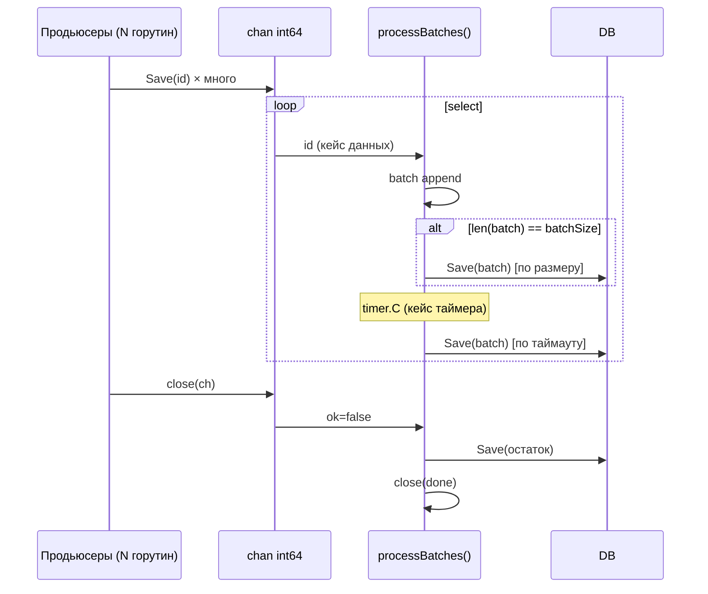

# 7.2 Задачи на горутины и каналы

## Содержание

<!-- START doctoc generated TOC please keep comment here to allow auto update -->
<!-- DON'T EDIT THIS SECTION, INSTEAD RE-RUN doctoc TO UPDATE -->

- [Введение: что проверяют](#%D0%B2%D0%B2%D0%B5%D0%B4%D0%B5%D0%BD%D0%B8%D0%B5-%D1%87%D1%82%D0%BE-%D0%BF%D1%80%D0%BE%D0%B2%D0%B5%D1%80%D1%8F%D1%8E%D1%82)
  - [Ключевые вопросы перед написанием кода](#%D0%BA%D0%BB%D1%8E%D1%87%D0%B5%D0%B2%D1%8B%D0%B5-%D0%B2%D0%BE%D0%BF%D1%80%D0%BE%D1%81%D1%8B-%D0%BF%D0%B5%D1%80%D0%B5%D0%B4-%D0%BD%D0%B0%D0%BF%D0%B8%D1%81%D0%B0%D0%BD%D0%B8%D0%B5%D0%BC-%D0%BA%D0%BE%D0%B4%D0%B0)
- [Задача 1: Worker Pool](#%D0%B7%D0%B0%D0%B4%D0%B0%D1%87%D0%B0-1-worker-pool)
  - [Формулировка](#%D1%84%D0%BE%D1%80%D0%BC%D1%83%D0%BB%D0%B8%D1%80%D0%BE%D0%B2%D0%BA%D0%B0)
  - [Что проверяют](#%D1%87%D1%82%D0%BE-%D0%BF%D1%80%D0%BE%D0%B2%D0%B5%D1%80%D1%8F%D1%8E%D1%82)
  - [Версия с context и обработкой ошибок](#%D0%B2%D0%B5%D1%80%D1%81%D0%B8%D1%8F-%D1%81-context-%D0%B8-%D0%BE%D0%B1%D1%80%D0%B0%D0%B1%D0%BE%D1%82%D0%BA%D0%BE%D0%B9-%D0%BE%D1%88%D0%B8%D0%B1%D0%BE%D0%BA)
  - [Типичные ошибки](#%D1%82%D0%B8%D0%BF%D0%B8%D1%87%D0%BD%D1%8B%D0%B5-%D0%BE%D1%88%D0%B8%D0%B1%D0%BA%D0%B8)
- [Задача 2: Fan-Out / Fan-In](#%D0%B7%D0%B0%D0%B4%D0%B0%D1%87%D0%B0-2-fan-out--fan-in)
  - [Формулировка](#%D1%84%D0%BE%D1%80%D0%BC%D1%83%D0%BB%D0%B8%D1%80%D0%BE%D0%B2%D0%BA%D0%B0-1)
  - [Что проверяют](#%D1%87%D1%82%D0%BE-%D0%BF%D1%80%D0%BE%D0%B2%D0%B5%D1%80%D1%8F%D1%8E%D1%82-1)
  - [Fan-In с select (для отмены)](#fan-in-%D1%81-select-%D0%B4%D0%BB%D1%8F-%D0%BE%D1%82%D0%BC%D0%B5%D0%BD%D1%8B)
- [Задача 3: Pipeline](#%D0%B7%D0%B0%D0%B4%D0%B0%D1%87%D0%B0-3-pipeline)
  - [Формулировка](#%D1%84%D0%BE%D1%80%D0%BC%D1%83%D0%BB%D0%B8%D1%80%D0%BE%D0%B2%D0%BA%D0%B0-2)
  - [Что проверяют](#%D1%87%D1%82%D0%BE-%D0%BF%D1%80%D0%BE%D0%B2%D0%B5%D1%80%D1%8F%D1%8E%D1%82-2)
- [Задача 4: Rate Limiter на каналах](#%D0%B7%D0%B0%D0%B4%D0%B0%D1%87%D0%B0-4-rate-limiter-%D0%BD%D0%B0-%D0%BA%D0%B0%D0%BD%D0%B0%D0%BB%D0%B0%D1%85)
  - [Формулировка](#%D1%84%D0%BE%D1%80%D0%BC%D1%83%D0%BB%D0%B8%D1%80%D0%BE%D0%B2%D0%BA%D0%B0-3)
  - [Что проверяют](#%D1%87%D1%82%D0%BE-%D0%BF%D1%80%D0%BE%D0%B2%D0%B5%D1%80%D1%8F%D1%8E%D1%82-3)
  - [Дополнительные вопросы](#%D0%B4%D0%BE%D0%BF%D0%BE%D0%BB%D0%BD%D0%B8%D1%82%D0%B5%D0%BB%D1%8C%D0%BD%D1%8B%D0%B5-%D0%B2%D0%BE%D0%BF%D1%80%D0%BE%D1%81%D1%8B)
- [Задача 5: Merge N каналов](#%D0%B7%D0%B0%D0%B4%D0%B0%D1%87%D0%B0-5-merge-n-%D0%BA%D0%B0%D0%BD%D0%B0%D0%BB%D0%BE%D0%B2)
  - [Формулировка](#%D1%84%D0%BE%D1%80%D0%BC%D1%83%D0%BB%D0%B8%D1%80%D0%BE%D0%B2%D0%BA%D0%B0-4)
  - [Что проверяют](#%D1%87%D1%82%D0%BE-%D0%BF%D1%80%D0%BE%D0%B2%D0%B5%D1%80%D1%8F%D1%8E%D1%82-4)
- [Задача 6: Timeout и отмена через context](#%D0%B7%D0%B0%D0%B4%D0%B0%D1%87%D0%B0-6-timeout-%D0%B8-%D0%BE%D1%82%D0%BC%D0%B5%D0%BD%D0%B0-%D1%87%D0%B5%D1%80%D0%B5%D0%B7-context)
  - [Формулировка](#%D1%84%D0%BE%D1%80%D0%BC%D1%83%D0%BB%D0%B8%D1%80%D0%BE%D0%B2%D0%BA%D0%B0-5)
  - [Что проверяют](#%D1%87%D1%82%D0%BE-%D0%BF%D1%80%D0%BE%D0%B2%D0%B5%D1%80%D1%8F%D1%8E%D1%82-5)
  - [Типичные ошибки](#%D1%82%D0%B8%D0%BF%D0%B8%D1%87%D0%BD%D1%8B%D0%B5-%D0%BE%D1%88%D0%B8%D0%B1%D0%BA%D0%B8-1)
- [Задача 7: Что выведет код — deadlock и race](#%D0%B7%D0%B0%D0%B4%D0%B0%D1%87%D0%B0-7-%D1%87%D1%82%D0%BE-%D0%B2%D1%8B%D0%B2%D0%B5%D0%B4%D0%B5%D1%82-%D0%BA%D0%BE%D0%B4--deadlock-%D0%B8-race)
  - [Deadlock 1: Небуферизованный канал](#deadlock-1-%D0%BD%D0%B5%D0%B1%D1%83%D1%84%D0%B5%D1%80%D0%B8%D0%B7%D0%BE%D0%B2%D0%B0%D0%BD%D0%BD%D1%8B%D0%B9-%D0%BA%D0%B0%D0%BD%D0%B0%D0%BB)
  - [Deadlock 2: Забытый unlock](#deadlock-2-%D0%B7%D0%B0%D0%B1%D1%8B%D1%82%D1%8B%D0%B9-unlock)
  - [Race condition](#race-condition)
  - [Close на nil канале](#close-%D0%BD%D0%B0-nil-%D0%BA%D0%B0%D0%BD%D0%B0%D0%BB%D0%B5)
- [Задача 8: Pub/Sub на каналах](#%D0%B7%D0%B0%D0%B4%D0%B0%D1%87%D0%B0-8-pubsub-%D0%BD%D0%B0-%D0%BA%D0%B0%D0%BD%D0%B0%D0%BB%D0%B0%D1%85)
  - [Формулировка](#%D1%84%D0%BE%D1%80%D0%BC%D1%83%D0%BB%D0%B8%D1%80%D0%BE%D0%B2%D0%BA%D0%B0-6)
  - [Что проверяют](#%D1%87%D1%82%D0%BE-%D0%BF%D1%80%D0%BE%D0%B2%D0%B5%D1%80%D1%8F%D1%8E%D1%82-6)
  - [Дополнительные вопросы](#%D0%B4%D0%BE%D0%BF%D0%BE%D0%BB%D0%BD%D0%B8%D1%82%D0%B5%D0%BB%D1%8C%D0%BD%D1%8B%D0%B5-%D0%B2%D0%BE%D0%BF%D1%80%D0%BE%D1%81%D1%8B-1)
- [Задача 9: Батчевая запись с таймером](#%D0%B7%D0%B0%D0%B4%D0%B0%D1%87%D0%B0-9-%D0%B1%D0%B0%D1%82%D1%87%D0%B5%D0%B2%D0%B0%D1%8F-%D0%B7%D0%B0%D0%BF%D0%B8%D1%81%D1%8C-%D1%81-%D1%82%D0%B0%D0%B9%D0%BC%D0%B5%D1%80%D0%BE%D0%BC)
  - [Формулировка](#%D1%84%D0%BE%D1%80%D0%BC%D1%83%D0%BB%D0%B8%D1%80%D0%BE%D0%B2%D0%BA%D0%B0-7)
  - [Что проверяют](#%D1%87%D1%82%D0%BE-%D0%BF%D1%80%D0%BE%D0%B2%D0%B5%D1%80%D1%8F%D1%8E%D1%82-7)
  - [Наивное решение — только по размеру батча](#%D0%BD%D0%B0%D0%B8%D0%B2%D0%BD%D0%BE%D0%B5-%D1%80%D0%B5%D1%88%D0%B5%D0%BD%D0%B8%D0%B5--%D1%82%D0%BE%D0%BB%D1%8C%D0%BA%D0%BE-%D0%BF%D0%BE-%D1%80%D0%B0%D0%B7%D0%BC%D0%B5%D1%80%D1%83-%D0%B1%D0%B0%D1%82%D1%87%D0%B0)
  - [Полное решение — батч по размеру ИЛИ по таймеру](#%D0%BF%D0%BE%D0%BB%D0%BD%D0%BE%D0%B5-%D1%80%D0%B5%D1%88%D0%B5%D0%BD%D0%B8%D0%B5--%D0%B1%D0%B0%D1%82%D1%87-%D0%BF%D0%BE-%D1%80%D0%B0%D0%B7%D0%BC%D0%B5%D1%80%D1%83-%D0%B8%D0%BB%D0%B8-%D0%BF%D0%BE-%D1%82%D0%B0%D0%B9%D0%BC%D0%B5%D1%80%D1%83)
  - [Типичные ошибки](#%D1%82%D0%B8%D0%BF%D0%B8%D1%87%D0%BD%D1%8B%D0%B5-%D0%BE%D1%88%D0%B8%D0%B1%D0%BA%D0%B8-2)
  - [Диаграмма работы](#%D0%B4%D0%B8%D0%B0%D0%B3%D1%80%D0%B0%D0%BC%D0%BC%D0%B0-%D1%80%D0%B0%D0%B1%D0%BE%D1%82%D1%8B)
  - [Дополнительные вопросы](#%D0%B4%D0%BE%D0%BF%D0%BE%D0%BB%D0%BD%D0%B8%D1%82%D0%B5%D0%BB%D1%8C%D0%BD%D1%8B%D0%B5-%D0%B2%D0%BE%D0%BF%D1%80%D0%BE%D1%81%D1%8B-2)
- [Итоги: шпаргалка по выбору примитивов](#%D0%B8%D1%82%D0%BE%D0%B3%D0%B8-%D1%88%D0%BF%D0%B0%D1%80%D0%B3%D0%B0%D0%BB%D0%BA%D0%B0-%D0%BF%D0%BE-%D0%B2%D1%8B%D0%B1%D0%BE%D1%80%D1%83-%D0%BF%D1%80%D0%B8%D0%BC%D0%B8%D1%82%D0%B8%D0%B2%D0%BE%D0%B2)

<!-- END doctoc generated TOC please keep comment here to allow auto update -->

---

## Введение: что проверяют

Задачи на горутины и каналы — **ключевое отличие** Go-интервью от C# интервью. Интервьюер ожидает, что кандидат на Middle+ уровне:

- Понимает **модель CSP** (Communicating Sequential Processes)
- Знает разницу между **буферизованным и небуферизованным** каналами
- Умеет избегать **deadlock** и **race condition**
- Использует **context** для отмены и таймаутов
- Выбирает **правильный примитив**: канал vs мьютекс

### Ключевые вопросы перед написанием кода

На интервью обязательно уточни:
- "Нужна ли отмена операций?" → context
- "Сколько воркеров?" → фиксированное или динамическое число
- "Нужен ли порядок результатов?" → буферизованный канал + индексирование
- "Что делать с ошибками?" → errgroup vs errCh

---

## Задача 1: Worker Pool

**Компания**: Авито, Wildberries, Озон, Яндекс
**Уровень**: Middle
**Время**: 20 минут

### Формулировка

> Реализуй worker pool с `n` воркерами, которые обрабатывают задачи из входного канала. Воркеры должны завершаться корректно, когда входной канал закрывается.

### Что проверяют

- Понимание паттерна fan-out
- Корректное ожидание завершения воркеров (WaitGroup)
- Закрытие выходного канала только после завершения всех воркеров

**C# аналог**:
```csharp
// C# — Parallel.ForEach или Channel<T> с несколькими consumers
var channel = Channel.CreateUnbounded<int>();
var tasks = Enumerable.Range(0, numWorkers)
    .Select(_ => Task.Run(async () => {
        await foreach (var item in channel.Reader.ReadAllAsync())
            ProcessItem(item);
    }));
await Task.WhenAll(tasks);
```

**Go решение**:
```go
package main

import (
    "fmt"
    "sync"
)

// ✅ Классический worker pool
func workerPool(jobs <-chan int, numWorkers int) <-chan int {
    results := make(chan int, numWorkers)

    var wg sync.WaitGroup
    wg.Add(numWorkers)

    for range numWorkers { // Go 1.22+: range по числу
        go func() {
            defer wg.Done()
            for job := range jobs { // завершается когда jobs закрывается
                results <- process(job)
            }
        }()
    }

    // Закрываем results после завершения ВСЕХ воркеров
    go func() {
        wg.Wait()
        close(results)
    }()

    return results
}

func process(n int) int {
    return n * n // имитация работы
}

func main() {
    jobs := make(chan int, 100)

    // Отправляем задачи
    go func() {
        for i := 1; i <= 10; i++ {
            jobs <- i
        }
        close(jobs) // сигнал воркерам: задач больше нет
    }()

    results := workerPool(jobs, 3)

    for r := range results {
        fmt.Println(r)
    }
}
```

### Версия с context и обработкой ошибок

```go
// ✅ Production-ready: context + errgroup
import "golang.org/x/sync/errgroup"

func workerPoolWithContext(ctx context.Context, jobs <-chan int, numWorkers int) ([]int, error) {
    results := make(chan int, numWorkers)
    g, ctx := errgroup.WithContext(ctx)

    // Запускаем воркеры
    for range numWorkers {
        g.Go(func() error {
            for {
                select {
                case job, ok := <-jobs:
                    if !ok {
                        return nil // канал закрыт
                    }
                    result, err := processWithErr(ctx, job)
                    if err != nil {
                        return err // отменяет остальных через context
                    }
                    results <- result
                case <-ctx.Done():
                    return ctx.Err()
                }
            }
        })
    }

    // Ждём завершения воркеров в отдельной горутине
    go func() {
        g.Wait()
        close(results)
    }()

    // Собираем результаты
    var out []int
    for r := range results {
        out = append(out, r)
    }

    return out, g.Wait()
}
```

### Типичные ошибки

```go
// ❌ Закрытие results до завершения воркеров
go workerA(jobs, results)
go workerB(jobs, results)
close(results) // PANIC: send on closed channel!

// ❌ Deadlock: никто не читает results, а воркеры пишут в него
results := make(chan int) // небуферизованный
go worker(jobs, results)
wg.Wait()               // блокируемся здесь
for r := range results { // никогда не достигаем этой строки
    ...
}

// ❌ Отправка в закрытый канал
close(jobs)
jobs <- 42 // PANIC!
```

---

## Задача 2: Fan-Out / Fan-In

**Компания**: Яндекс, ВКонтакте
**Уровень**: Middle / Senior
**Время**: 20-25 минут

### Формулировка

> Есть несколько источников данных (слайс URL для обращения к API). Запроси их параллельно (fan-out), а затем собери результаты в один канал (fan-in). Реализуй функцию `fanIn`.

### Что проверяют

- Понимание паттерна fan-out/fan-in
- Корректное закрытие объединённого канала
- Работа с `sync.WaitGroup` для ожидания нескольких горутин

```go
// ✅ Fan-Out: распределяем одну задачу по нескольким горутинам
// Fan-In: собираем результаты из нескольких каналов в один

func fanIn(channels ...<-chan int) <-chan int {
    merged := make(chan int)
    var wg sync.WaitGroup

    // Запускаем горутину для каждого входного канала
    forward := func(ch <-chan int) {
        defer wg.Done()
        for v := range ch {
            merged <- v
        }
    }

    wg.Add(len(channels))
    for _, ch := range channels {
        go forward(ch)
    }

    // Закрываем merged только когда все forwarding горутины завершились
    go func() {
        wg.Wait()
        close(merged)
    }()

    return merged
}

// Fan-Out: параллельные запросы
func fetchAll(ctx context.Context, urls []string) <-chan string {
    results := make(chan string, len(urls))
    var wg sync.WaitGroup

    for _, url := range urls {
        url := url // захват (не нужен в Go 1.22+)
        wg.Add(1)
        go func() {
            defer wg.Done()
            result, err := fetch(ctx, url)
            if err != nil {
                result = fmt.Sprintf("error: %v", err)
            }
            results <- result
        }()
    }

    go func() {
        wg.Wait()
        close(results)
    }()

    return results
}

// Пример использования
func main() {
    ctx := context.Background()
    urls := []string{
        "https://api.example.com/1",
        "https://api.example.com/2",
        "https://api.example.com/3",
    }

    for result := range fetchAll(ctx, urls) {
        fmt.Println(result)
    }
}
```

### Fan-In с select (для отмены)

```go
// ✅ Fan-In с поддержкой context (отмена)
func fanInWithCancel(ctx context.Context, channels ...<-chan int) <-chan int {
    merged := make(chan int)
    var wg sync.WaitGroup

    forward := func(ch <-chan int) {
        defer wg.Done()
        for {
            select {
            case v, ok := <-ch:
                if !ok {
                    return
                }
                select {
                case merged <- v:
                case <-ctx.Done():
                    return
                }
            case <-ctx.Done():
                return
            }
        }
    }

    wg.Add(len(channels))
    for _, ch := range channels {
        go forward(ch)
    }

    go func() {
        wg.Wait()
        close(merged)
    }()

    return merged
}
```

---

## Задача 3: Pipeline

**Компания**: ВКонтакте, Яндекс
**Уровень**: Middle / Senior
**Время**: 20 минут

### Формулировка

> Реализуй pipeline из трёх стадий: генерация чисел → фильтрация чётных → возведение в квадрат. Каждая стадия — отдельная горутина.

### Что проверяют

- Понимание CSP и pipeline паттерна
- Правильная передача каналов (направленные типы)
- Context для отмены всего pipeline

```go
// ✅ Pipeline из трёх стадий

// Стадия 1: генератор
func generate(ctx context.Context, nums ...int) <-chan int {
    out := make(chan int)
    go func() {
        defer close(out)
        for _, n := range nums {
            select {
            case out <- n:
            case <-ctx.Done():
                return
            }
        }
    }()
    return out
}

// Стадия 2: фильтр
func filterEven(ctx context.Context, in <-chan int) <-chan int {
    out := make(chan int)
    go func() {
        defer close(out)
        for n := range in {
            if n%2 == 0 {
                select {
                case out <- n:
                case <-ctx.Done():
                    return
                }
            }
        }
    }()
    return out
}

// Стадия 3: трансформация
func square(ctx context.Context, in <-chan int) <-chan int {
    out := make(chan int)
    go func() {
        defer close(out)
        for n := range in {
            select {
            case out <- n * n:
            case <-ctx.Done():
                return
            }
        }
    }()
    return out
}

func main() {
    ctx, cancel := context.WithCancel(context.Background())
    defer cancel()

    // Соединяем стадии
    nums := generate(ctx, 1, 2, 3, 4, 5, 6, 7, 8, 9, 10)
    evens := filterEven(ctx, nums)
    squares := square(ctx, evens)

    for s := range squares {
        fmt.Println(s) // 4 16 36 64 100
    }
}
```

> 💡 Паттерн: каждая стадия принимает `<-chan` (read-only) и возвращает `<-chan` (read-only). Это обеспечивает типобезопасность и явность потока данных.

---

## Задача 4: Rate Limiter на каналах

**Компания**: Тинькофф, Авито (ограничение запросов к внешним API)
**Уровень**: Middle / Senior
**Время**: 20 минут

### Формулировка

> Реализуй rate limiter, который пропускает не более `N` запросов в секунду. Используй каналы (token bucket).

### Что проверяют

- Знание паттерна token bucket
- Правильное использование `time.Tick` или `time.NewTicker`
- Отличие от `golang.org/x/time/rate` (стандарт для production)

```go
// ✅ Простой rate limiter через ticker (token per tick)
func rateLimiter(requests <-chan int, ratePerSec int) <-chan int {
    out := make(chan int)
    ticker := time.NewTicker(time.Second / time.Duration(ratePerSec))

    go func() {
        defer close(out)
        defer ticker.Stop()
        for req := range requests {
            <-ticker.C  // ждём разрешения
            out <- req
        }
    }()

    return out
}

// ✅ Burst rate limiter: N запросов сразу, потом пополнение
func burstRateLimiter(ctx context.Context, requests <-chan int, burst, ratePerSec int) <-chan int {
    tokens := make(chan struct{}, burst)

    // Наполняем bucket
    for range burst {
        tokens <- struct{}{}
    }

    // Пополняем с заданной частотой
    go func() {
        ticker := time.NewTicker(time.Second / time.Duration(ratePerSec))
        defer ticker.Stop()
        for {
            select {
            case <-ticker.C:
                select {
                case tokens <- struct{}{}: // добавляем токен если есть место
                default: // bucket полный — пропускаем
                }
            case <-ctx.Done():
                return
            }
        }
    }()

    out := make(chan int)
    go func() {
        defer close(out)
        for req := range requests {
            select {
            case <-tokens: // берём токен
                out <- req
            case <-ctx.Done():
                return
            }
        }
    }()

    return out
}

func main() {
    ctx, cancel := context.WithTimeout(context.Background(), 3*time.Second)
    defer cancel()

    requests := make(chan int, 20)
    for i := 1; i <= 20; i++ {
        requests <- i
    }
    close(requests)

    // 5 запросов/сек, burst до 3
    limited := burstRateLimiter(ctx, requests, 3, 5)
    for req := range limited {
        fmt.Printf("обработан запрос %d в %v\n", req, time.Now().Format("15:04:05.000"))
    }
}
```

### Дополнительные вопросы

- "Как использовать стандартный rate limiter в production?" → `golang.org/x/time/rate`
- "Чем token bucket отличается от leaky bucket?"

```go
// Production: golang.org/x/time/rate
import "golang.org/x/time/rate"

limiter := rate.NewLimiter(rate.Limit(100), 10) // 100 req/s, burst 10

func handler(w http.ResponseWriter, r *http.Request) {
    if err := limiter.Wait(r.Context()); err != nil {
        http.Error(w, "rate limit exceeded", http.StatusTooManyRequests)
        return
    }
    // обработка
}
```

---

## Задача 5: Merge N каналов

**Компания**: ВКонтакте, Яндекс
**Уровень**: Senior
**Время**: 20-25 минут

### Формулировка

> Напиши функцию `merge`, которая объединяет произвольное количество каналов в один, используя `reflect.Select` (динамический select).

### Что проверяют

- Знание динамического select через reflect
- Понимание ограничений статического select (количество case известно на этапе компиляции)

```go
// ✅ Вариант 1: горутина на каждый канал (проще, рекомендуется)
func merge[T any](channels ...<-chan T) <-chan T {
    merged := make(chan T)
    var wg sync.WaitGroup
    wg.Add(len(channels))

    for _, ch := range channels {
        go func(c <-chan T) {
            defer wg.Done()
            for v := range c {
                merged <- v
            }
        }(ch)
    }

    go func() {
        wg.Wait()
        close(merged)
    }()

    return merged
}

// ✅ Вариант 2: reflect.Select (для большого числа каналов)
import "reflect"

func mergeReflect(channels []<-chan int) <-chan int {
    merged := make(chan int)

    go func() {
        defer close(merged)

        // Строим cases для reflect.Select
        cases := make([]reflect.SelectCase, len(channels))
        for i, ch := range channels {
            cases[i] = reflect.SelectCase{
                Dir:  reflect.SelectRecv,
                Chan: reflect.ValueOf(ch),
            }
        }

        // Читаем пока есть открытые каналы
        for len(cases) > 0 {
            chosen, value, ok := reflect.Select(cases)
            if !ok {
                // Канал закрыт — убираем его из cases
                cases = append(cases[:chosen], cases[chosen+1:]...)
                continue
            }
            merged <- int(value.Int())
        }
    }()

    return merged
}
```

> 💡 На интервью скажи: "Горутина на каждый канал — проще и достаточно для большинства случаев. `reflect.Select` нужен, если каналов очень много или их число неизвестно заранее." Это показывает зрелость.

---

## Задача 6: Timeout и отмена через context

**Компания**: Авито, Тинькофф, Озон
**Уровень**: Middle
**Время**: 15 минут

### Формулировка

> Напиши функцию, которая вызывает несколько "медленных" функций параллельно и возвращает первый успешный результат. Если через `timeout` ничего не пришло — возвращает ошибку.

### Что проверяют

- Паттерн "first response wins"
- Правильная отмена оставшихся горутин через context
- Утечки горутин (если забыть context)

```go
// ✅ First response wins с отменой
func firstResult(ctx context.Context, fns []func(context.Context) (string, error)) (string, error) {
    ctx, cancel := context.WithCancel(ctx)
    defer cancel() // отменяем оставшихся при выходе

    resultCh := make(chan string, len(fns))  // буферизованный — не блокирует
    errCh := make(chan error, len(fns))

    for _, fn := range fns {
        fn := fn
        go func() {
            result, err := fn(ctx)
            if err != nil {
                errCh <- err
                return
            }
            resultCh <- result
        }()
    }

    // Ждём первый успешный результат или все ошибки
    errs := 0
    for {
        select {
        case result := <-resultCh:
            return result, nil // cancel() закроет остальные горутины
        case <-errCh:
            errs++
            if errs == len(fns) {
                return "", fmt.Errorf("все источники вернули ошибку")
            }
        case <-ctx.Done():
            return "", ctx.Err()
        }
    }
}

// Использование:
func main() {
    ctx, cancel := context.WithTimeout(context.Background(), 2*time.Second)
    defer cancel()

    slow := func(delay time.Duration, val string) func(context.Context) (string, error) {
        return func(ctx context.Context) (string, error) {
            select {
            case <-time.After(delay):
                return val, nil
            case <-ctx.Done():
                return "", ctx.Err()
            }
        }
    }

    result, err := firstResult(ctx, []func(context.Context) (string, error){
        slow(500*time.Millisecond, "быстрый"),
        slow(1*time.Second, "средний"),
        slow(2*time.Second, "медленный"),
    })
    fmt.Println(result, err) // "быстрый" <nil>
}
```

### Типичные ошибки

```go
// ❌ Горутина-утечка: нет context, нет выхода
go func() {
    result := slowOperation() // если никто не читает resultCh — горутина зависнет
    resultCh <- result
}()

// ❌ Небуферизованный канал при нескольких горутинах
resultCh := make(chan string) // если первый уже прочитан и функция вернулась,
// остальные горутины заблокируются навсегда при записи в resultCh
```

---

## Задача 7: Что выведет код — deadlock и race

**Компания**: Яндекс, ВКонтакте (проверка глубины знания)
**Уровень**: Middle / Senior

### Deadlock 1: Небуферизованный канал

```go
func main() {
    ch := make(chan int)
    ch <- 42    // ?
    fmt.Println(<-ch)
}
```

<details>
<summary>Ответ</summary>

**Deadlock**: `ch <- 42` заблокируется, так как нет получателя. Горутина main висит, Go runtime обнаруживает, что все горутины заблокированы и паникует: `fatal error: all goroutines are asleep - deadlock!`

**Исправление**:
```go
ch := make(chan int, 1) // буферизованный
// или
go func() { ch <- 42 }()
fmt.Println(<-ch)
```

</details>

---

### Deadlock 2: Забытый unlock

```go
var mu sync.Mutex

func main() {
    mu.Lock()
    go func() {
        mu.Lock() // ?
        defer mu.Unlock()
        fmt.Println("в горутине")
    }()
    // mu.Unlock() — забыли!
    time.Sleep(time.Second)
}
```

<details>
<summary>Ответ</summary>

Горутина заблокируется на `mu.Lock()` навсегда, так как основная горутина никогда не вызовет `mu.Unlock()`. Программа завершится через `time.Sleep`, не выполнив горутину. Если убрать `time.Sleep` — deadlock.

</details>

---

### Race condition

```go
func main() {
    counter := 0
    var wg sync.WaitGroup

    for range 1000 {
        wg.Add(1)
        go func() {
            defer wg.Done()
            counter++ // ?
        }()
    }

    wg.Wait()
    fmt.Println(counter)
}
```

<details>
<summary>Ответ</summary>

**Race condition**: `counter++` — это три операции (read + add + write), не атомарные. Результат непредсказуем: может быть от 1 до 1000. `go run -race` обнаружит race condition.

**Исправления**:
```go
// Вариант 1: atomic
var counter atomic.Int64
counter.Add(1)

// Вариант 2: mutex
var mu sync.Mutex
mu.Lock()
counter++
mu.Unlock()

// Вариант 3: канал (идиоматично для простых счётчиков)
done := make(chan int, 1000)
for range 1000 {
    go func() { done <- 1 }()
}
total := 0
for range 1000 {
    total += <-done
}
```

</details>

---

### Close на nil канале

```go
func main() {
    var ch chan int
    close(ch) // ?
}
```

<details>
<summary>Ответ</summary>

**Panic**: `close of nil channel`. Перед закрытием всегда проверяй, что канал инициализирован.

Правило: тот, кто **создаёт** канал — тот его и **закрывает**. Никогда не закрывай канал со стороны получателя.

</details>

---

## Задача 8: Pub/Sub на каналах

**Компания**: ВКонтакте, Яндекс (уведомления, WebSocket)
**Уровень**: Senior
**Время**: 30 минут

### Формулировка

> Реализуй простую Pub/Sub систему: есть `Broker`, к которому можно подписаться (`Subscribe`) и публиковать сообщения (`Publish`). При публикации сообщение доставляется всем подписчикам.

### Что проверяют

- Управление состоянием конкурентно с мьютексом
- Корректное удаление подписчиков
- Буферизованные каналы для избежания медленных подписчиков

```go
package pubsub

import "sync"

type Broker[T any] struct {
    mu          sync.RWMutex
    subscribers map[int]chan T
    nextID      int
}

func NewBroker[T any]() *Broker[T] {
    return &Broker[T]{
        subscribers: make(map[int]chan T),
    }
}

// Subscribe возвращает канал и функцию отписки
func (b *Broker[T]) Subscribe(bufSize int) (<-chan T, func()) {
    ch := make(chan T, bufSize) // буферизованный — медленный подписчик не тормозит остальных

    b.mu.Lock()
    id := b.nextID
    b.nextID++
    b.subscribers[id] = ch
    b.mu.Unlock()

    unsubscribe := func() {
        b.mu.Lock()
        delete(b.subscribers, id)
        close(ch) // сигнал подписчику: поток завершён
        b.mu.Unlock()
    }

    return ch, unsubscribe
}

// Publish отправляет сообщение всем подписчикам
func (b *Broker[T]) Publish(msg T) {
    b.mu.RLock()
    defer b.mu.RUnlock()

    for _, ch := range b.subscribers {
        // Non-blocking: медленный подписчик теряет сообщение вместо блокировки
        select {
        case ch <- msg:
        default:
            // подписчик не успевает — пропускаем (или логируем)
        }
    }
}

// Close завершает работу брокера, закрывая все каналы подписчиков
func (b *Broker[T]) Close() {
    b.mu.Lock()
    defer b.mu.Unlock()

    for id, ch := range b.subscribers {
        close(ch)
        delete(b.subscribers, id)
    }
}
```

**Использование**:
```go
func main() {
    broker := pubsub.NewBroker[string]()

    // Подписчик 1
    ch1, unsub1 := broker.Subscribe(10)
    defer unsub1()

    // Подписчик 2
    ch2, unsub2 := broker.Subscribe(10)
    defer unsub2()

    broker.Publish("привет всем!")
    broker.Publish("ещё одно сообщение")

    fmt.Println(<-ch1) // привет всем!
    fmt.Println(<-ch2) // привет всем!
}
```

### Дополнительные вопросы

- "Что происходит если подписчик медленный?" → non-blocking send, потеря сообщений или блокировка
- "Как гарантировать доставку?" → буферизация или retry
- "Как масштабировать?" → несколько брокеров + partitioning (как Kafka)

---

## Задача 9: Батчевая запись с таймером

**Компания**: Авито, Wildberries, Озон (батч-запись в БД — реальная production задача)
**Уровень**: Middle / Senior
**Время**: 25-30 минут

### Формулировка

> Реализуй `BatchDataStorage` — обёртку над хранилищем, которая принимает одиночные записи через `Save(id int64)`, накапливает их в батч и сбрасывает в БД когда: (а) батч заполнен до `batchSize`, или (б) прошёл `flushInterval` с последнего сброса. Методы: `Save(id int64)`, `Close()` — ждёт завершения всех горутин.

### Что проверяют

- Паттерн "канал как очередь" для декаплинга продьюсеров от логики батчинга
- `select` с двумя кейсами: данные и таймер — классическое применение
- Корректный graceful shutdown: `close(ch)` → горутина флашит остаток → `close(done)`
- Оптимизация: `batch[:0]` для сброса без аллокации

**C# аналог**:
```csharp
// C# — TPL Dataflow BatchBlock или Channel<T> с BufferBlock
var batchBlock = new BatchBlock<long>(batchSize);
// Или вручную через System.Threading.Channels + PeriodicTimer
```

---

### Наивное решение — только по размеру батча

Начинаем с простого: сбрасываем только когда батч заполнен. Таймер пока не нужен.

```go
type BatchDataStorage struct {
    db        DbDataStorage
    batchSize int
    ch        chan int64
    done      chan struct{}
}

func NewBatchDataStorage(db DbDataStorage, batchSize int) *BatchDataStorage {
    s := &BatchDataStorage{
        db:        db,
        batchSize: batchSize,
        ch:        make(chan int64, batchSize*10), // буфер чтобы Save не блокировал
        done:      make(chan struct{}),
    }
    go s.processBatches()
    return s
}

func (s *BatchDataStorage) Save(id int64) {
    s.ch <- id // продьюсер просто пишет в канал — он не знает о батчинге
}

func (s *BatchDataStorage) processBatches() {
    defer close(s.done)

    batch := make([]int64, 0, s.batchSize)

    for id := range s.ch { // завершится когда ch закрыт
        batch = append(batch, id)
        if len(batch) >= s.batchSize {
            s.db.Save(batch)
            batch = batch[:0] // сброс без аллокации — переиспользуем backing array
        }
    }

    // Флашим остаток после закрытия канала
    if len(batch) > 0 {
        s.db.Save(batch)
    }
}

func (s *BatchDataStorage) Close() {
    close(s.ch) // сигнал горутине: новых данных не будет
    <-s.done    // ждём пока горутина завершит flush
}
```

**Проблема наивного решения**: если данные поступают медленно, последний батч может застрять в памяти надолго. Например, пришло 3 записи из 10 — они будут ждать оставшихся 7 вечно.

> 💡 Интервьюер обычно сам задаёт вопрос: "А что если данных мало и батч никогда не заполнится?" — это подводка к таймеру.

---

### Полное решение — батч по размеру ИЛИ по таймеру

```go
func (s *BatchDataStorage) processBatches() {
    defer close(s.done)

    batch := make([]int64, 0, s.batchSize)
    timer := time.NewTimer(s.flushInterval)
    defer timer.Stop()

    flush := func() {
        if len(batch) == 0 {
            return
        }
        s.db.Save(batch)
        batch = batch[:0] // переиспользуем память
    }

    for {
        select {
        case id, ok := <-s.ch:
            if !ok {
                // Канал закрыт: флашим остаток и выходим
                flush()
                return
            }
            batch = append(batch, id)
            if len(batch) >= s.batchSize {
                flush()
                // Сбрасываем таймер: данные только что пришли,
                // следующий flush не раньше чем через flushInterval
                if !timer.Stop() {
                    <-timer.C
                }
                timer.Reset(s.flushInterval)
            }

        case <-timer.C:
            flush() // принудительный flush по таймауту
            timer.Reset(s.flushInterval)
        }
    }
}
```

### Типичные ошибки

```go
// ❌ time.Tick вместо time.NewTimer/NewTicker
// time.Tick создаёт тикер который нельзя остановить — goroutine leak!
ticker := time.Tick(interval) // утечка ресурсов

// ✅ Правильно:
timer := time.NewTimer(interval)
defer timer.Stop()

// ❌ Не флашим остаток при закрытии канала
for id := range s.ch { ... }
// после цикла batch может быть непустым!

// ✅ Правильно: всегда flush после range
for id := range s.ch { ... }
if len(batch) > 0 { s.db.Save(batch) }

// ❌ batch = nil — теряем аллоцированную память
batch = nil       // GC должен собрать, затем снова аллоцируем
// ✅ batch = batch[:0] — сохраняем capacity, одна аллокация на весь жизненный цикл

// ❌ Close без ожидания — данные могут быть потеряны
func (s *BatchDataStorage) Close() {
    close(s.ch) // закрыли, но горутина ещё не завершила flush!
}
// ✅ Правильно: ждём done
func (s *BatchDataStorage) Close() {
    close(s.ch)
    <-s.done
}
```

### Диаграмма работы



### Дополнительные вопросы

- "Что если `db.Save` возвращает ошибку?" → логировать + retry с backoff или DLQ
- "Что если продьюсеры быстрее консьюмера?" → буфер канала заполнится, `Save` заблокируется — добавить `select` с `ctx.Done()` или дроп с метрикой
- "Как сделать несколько горутин-консьюмеров?" → каждая читает из одного канала (fan-out), но тогда нужна синхронизация батчей
- "Как тестировать?" → мок `DbDataStorage` + `time.AfterFunc` для ускорения таймера в тестах

---

## Итоги: шпаргалка по выбору примитивов

```
Что нужно сделать?
│
├── Защита разделяемого состояния?
│   ├── Простое состояние (счётчик, флаг) → atomic
│   ├── Сложное состояние, мало конкуренции → sync.Mutex
│   └── Много чтений, мало записей → sync.RWMutex
│
├── Коммуникация между горутинами?
│   ├── Один отправитель → один получатель → chan (небуферизованный)
│   ├── Нужна очередь → chan (буферизованный)
│   ├── Один раз сигнализировать многим → close(ch) или sync.Once
│   └── Произвольное число сигналов многим → Pub/Sub или WaitGroup
│
├── Ожидание завершения горутин?
│   ├── Ждать всех → sync.WaitGroup
│   ├── Ждать первого успешного → канал + select
│   └── Ждать с ошибками → errgroup
│
└── Ограничение конкурентности?
    ├── Semaphore → chan struct{} с capacity N
    ├── Rate limit → time.Ticker или golang.org/x/time/rate
    └── Worker pool → канал задач + N горутин + WaitGroup
```

---

[← Назад: Слайсы и массивы](./01_slices_arrays.md) | [Вперёд: Map и синхронизация →](./03_maps_sync.md)
