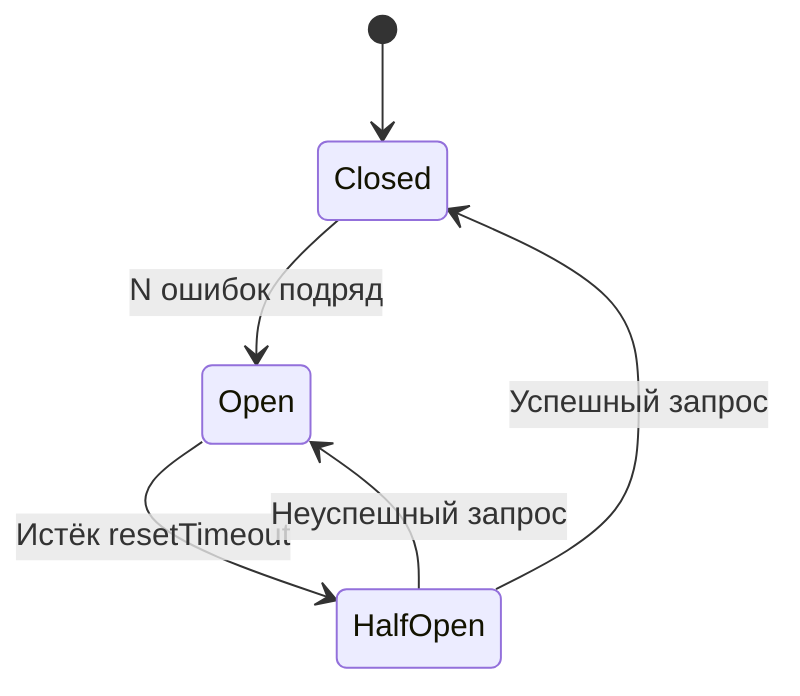

# Системный дизайн на Go

---

## Введение

Задачи на системный дизайн для Senior/Lead уровня в российских компаниях — это не "нарисуй архитектуру Twitter". Это:

> "Реализуй компонент системы прямо здесь, в CoderPad. Production-ready код с учётом конкурентности."

### Что ожидается от кандидата

1. **Уточни требования** (2-3 минуты):
   - Какие операции нужны?
   - Нужна ли thread-safety?
   - Какой масштаб (один инстанс / распределённый)?
   - Есть ли ограничения по памяти?

2. **Предложи интерфейс** — скажи вслух или напиши комментарий

3. **Напиши базовую реализацию**, потом добавляй детали

4. **Обсуди trade-offs**: что будет при большой нагрузке, что можно улучшить

---

## Задача 1: In-Memory Cache с TTL

**Компания**: Авито, Яндекс, Тинькофф
**Уровень**: Middle / Senior
**Время**: 30 минут

### Формулировка

> Реализуй in-memory key-value cache с поддержкой TTL (time-to-live). Ключи должны автоматически удаляться по истечению TTL. Требования:
> - `Set(key string, value any, ttl time.Duration)`
> - `Get(key string) (any, bool)`
> - `Delete(key string)`
> - Thread-safe
> - Эффективная очистка просроченных ключей

### Что проверяют

- Выбор структуры для хранения (map + heap или map + goroutine)
- Отсутствие goroutine leak
- Корректная синхронизация

### Разбор

Два подхода к очистке:
1. **Lazy expiration**: проверяем TTL при каждом `Get` — просто, но "мёртвые" ключи занимают память
2. **Active expiration**: фоновая горутина периодически чистит — нужна корректная остановка

```go
package cache

import (
    "sync"
    "time"
)

type item struct {
    value     any
    expiresAt time.Time
}

// ✅ Cache с lazy + active expiration
type Cache struct {
    mu       sync.RWMutex
    items    map[string]item
    stopCh   chan struct{}
    stopOnce sync.Once
}

func New(cleanupInterval time.Duration) *Cache {
    c := &Cache{
        items:  make(map[string]item),
        stopCh: make(chan struct{}),
    }
    // Фоновая очистка
    go c.cleanupLoop(cleanupInterval)
    return c
}

func (c *Cache) Set(key string, value any, ttl time.Duration) {
    c.mu.Lock()
    defer c.mu.Unlock()
    c.items[key] = item{
        value:     value,
        expiresAt: time.Now().Add(ttl),
    }
}

func (c *Cache) Get(key string) (any, bool) {
    c.mu.RLock()
    it, ok := c.items[key]
    c.mu.RUnlock()

    if !ok {
        return nil, false
    }
    // Lazy expiration: проверяем при чтении
    if time.Now().After(it.expiresAt) {
        c.Delete(key) // очищаем просроченный ключ
        return nil, false
    }
    return it.value, true
}

func (c *Cache) Delete(key string) {
    c.mu.Lock()
    defer c.mu.Unlock()
    delete(c.items, key)
}

// Active expiration: периодическая очистка
func (c *Cache) cleanupLoop(interval time.Duration) {
    ticker := time.NewTicker(interval)
    defer ticker.Stop()

    for {
        select {
        case <-ticker.C:
            c.deleteExpired()
        case <-c.stopCh:
            return
        }
    }
}

func (c *Cache) deleteExpired() {
    now := time.Now()
    c.mu.Lock()
    defer c.mu.Unlock()
    for k, it := range c.items {
        if now.After(it.expiresAt) {
            delete(c.items, k)
        }
    }
}

// Stop завершает фоновую горутину — ВАЖНО! Иначе goroutine leak
func (c *Cache) Stop() {
    c.stopOnce.Do(func() {
        close(c.stopCh)
    })
}

// Статистика — часто спрашивают следом
func (c *Cache) Len() int {
    c.mu.RLock()
    defer c.mu.RUnlock()
    return len(c.items)
}
```

### Дополнительные вопросы

- "Как масштабировать на несколько инстансов?" → Redis с TTL командами (`SET key val EX seconds`)
- "Что делать если память заканчивается?" → LRU eviction policy (как в задаче 7.4)
- "Как сделать очистку более эффективной?" → min-heap по времени истечения, O(log n) vs O(n) при periodic scan

---

## Задача 2: Token Bucket Rate Limiter

**Компания**: Тинькофф, Авито (API Gateway), Яндекс
**Уровень**: Senior
**Время**: 25 минут

### Формулировка

> Реализуй distributed-ready rate limiter на основе алгоритма Token Bucket. Требования:
> - `Allow() bool` — можно ли обработать запрос прямо сейчас
> - `Wait(ctx context.Context) error` — ждать пока можно
> - Потокобезопасность
> - Настраиваемые: ёмкость bucket и скорость пополнения

### Алгоритм Token Bucket

```
Bucket ёмкостью N токенов.
Каждый запрос забирает 1 токен.
Токены пополняются со скоростью R в секунду.
Если токенов нет → запрос отклоняется или ждёт.
```

```go
package ratelimiter

import (
    "context"
    "sync"
    "time"
)

type TokenBucket struct {
    mu       sync.Mutex
    tokens   float64      // текущее количество токенов (float для точного расчёта)
    capacity float64      // максимум токенов
    rate     float64      // токенов в секунду
    lastTime time.Time    // время последнего пополнения
}

func New(capacity int, ratePerSec float64) *TokenBucket {
    return &TokenBucket{
        tokens:   float64(capacity),
        capacity: float64(capacity),
        rate:     ratePerSec,
        lastTime: time.Now(),
    }
}

// refill добавляет токены за прошедшее время
func (tb *TokenBucket) refill() {
    now := time.Now()
    elapsed := now.Sub(tb.lastTime).Seconds()
    tb.tokens = min(tb.capacity, tb.tokens+elapsed*tb.rate)
    tb.lastTime = now
}

// Allow: неблокирующая проверка
func (tb *TokenBucket) Allow() bool {
    tb.mu.Lock()
    defer tb.mu.Unlock()

    tb.refill()
    if tb.tokens >= 1 {
        tb.tokens--
        return true
    }
    return false
}

// Wait: блокирующий вариант с поддержкой context
func (tb *TokenBucket) Wait(ctx context.Context) error {
    for {
        tb.mu.Lock()
        tb.refill()
        if tb.tokens >= 1 {
            tb.tokens--
            tb.mu.Unlock()
            return nil
        }

        // Вычисляем когда появится следующий токен
        waitDuration := time.Duration((1-tb.tokens)/tb.rate*float64(time.Second))
        tb.mu.Unlock()

        select {
        case <-time.After(waitDuration):
            // повторяем попытку
        case <-ctx.Done():
            return ctx.Err()
        }
    }
}

// Пример: middleware для HTTP
func RateLimitMiddleware(limiter *TokenBucket, next http.Handler) http.Handler {
    return http.HandlerFunc(func(w http.ResponseWriter, r *http.Request) {
        if !limiter.Allow() {
            http.Error(w, "Too Many Requests", http.StatusTooManyRequests)
            return
        }
        next.ServeHTTP(w, r)
    })
}
```

### Per-IP Rate Limiting

```go
// ✅ Rate limiter per client (IP, user ID)
type MultiLimiter struct {
    mu       sync.Mutex
    limiters map[string]*TokenBucket
    capacity int
    rate     float64
}

func NewMultiLimiter(capacity int, ratePerSec float64) *MultiLimiter {
    return &MultiLimiter{
        limiters: make(map[string]*TokenBucket),
        capacity: capacity,
        rate:     ratePerSec,
    }
}

func (ml *MultiLimiter) Allow(key string) bool {
    ml.mu.Lock()
    lb, ok := ml.limiters[key]
    if !ok {
        lb = New(ml.capacity, ml.rate)
        ml.limiters[key] = lb
    }
    ml.mu.Unlock()

    return lb.Allow()
}
```

---

## Задача 3: Очередь задач с приоритетами

**Компания**: Авито, Wildberries, Яндекс
**Уровень**: Middle / Senior
**Время**: 25-30 минут

### Формулировка

> Реализуй потокобезопасную очередь задач с приоритетами. Задачи с более высоким приоритетом обрабатываются первыми. Методы:
> - `Push(task Task)` — добавить задачу
> - `Pop() (Task, bool)` — извлечь задачу с наивысшим приоритетом

### Go решение через container/heap

```go
package priorityqueue

import (
    "container/heap"
    "sync"
)

type Task struct {
    ID       int
    Priority int // больше = выше приоритет
    Payload  string
}

// Реализуем heap.Interface для max-heap
type taskHeap []Task

func (h taskHeap) Len() int            { return len(h) }
func (h taskHeap) Less(i, j int) bool  { return h[i].Priority > h[j].Priority } // max-heap
func (h taskHeap) Swap(i, j int)       { h[i], h[j] = h[j], h[i] }
func (h *taskHeap) Push(x any)         { *h = append(*h, x.(Task)) }
func (h *taskHeap) Pop() any {
    old := *h
    n := len(old)
    x := old[n-1]
    *h = old[:n-1]
    return x
}

// ✅ Thread-safe Priority Queue
type PriorityQueue struct {
    mu   sync.Mutex
    heap *taskHeap
    cond *sync.Cond // для блокирующего Pop
}

func New() *PriorityQueue {
    h := &taskHeap{}
    heap.Init(h)
    pq := &PriorityQueue{heap: h}
    pq.cond = sync.NewCond(&pq.mu)
    return pq
}

func (pq *PriorityQueue) Push(task Task) {
    pq.mu.Lock()
    heap.Push(pq.heap, task)
    pq.cond.Signal() // будим ждущего потребителя
    pq.mu.Unlock()
}

// Pop: неблокирующий
func (pq *PriorityQueue) Pop() (Task, bool) {
    pq.mu.Lock()
    defer pq.mu.Unlock()

    if pq.heap.Len() == 0 {
        return Task{}, false
    }
    return heap.Pop(pq.heap).(Task), true
}

// PopWait: блокируется пока нет задач
func (pq *PriorityQueue) PopWait() Task {
    pq.mu.Lock()
    defer pq.mu.Unlock()

    for pq.heap.Len() == 0 {
        pq.cond.Wait() // освобождает mu и ждёт Signal
    }
    return heap.Pop(pq.heap).(Task)
}

// Worker pool с priority queue
func RunWorkers(ctx context.Context, pq *PriorityQueue, numWorkers int) {
    var wg sync.WaitGroup
    wg.Add(numWorkers)

    for range numWorkers {
        go func() {
            defer wg.Done()
            for {
                select {
                case <-ctx.Done():
                    return
                default:
                    task, ok := pq.Pop()
                    if !ok {
                        time.Sleep(time.Millisecond) // backoff
                        continue
                    }
                    processTask(task)
                }
            }
        }()
    }

    wg.Wait()
}
```

---

## Задача 4: Event Bus (брокер событий)

**Компания**: ВКонтакте, Яндекс, Авито (микросервисная архитектура)
**Уровень**: Senior
**Время**: 30 минут

### Формулировка

> Реализуй in-process event bus: компоненты могут подписаться на события определённого типа и публиковать события. Требования:
> - `Subscribe(eventType string, handler func(Event))`
> - `Publish(event Event)`
> - Асинхронная доставка (не блокирует publisher)
> - Паника в handler не должна ронять publisher

```go
package eventbus

import (
    "fmt"
    "sync"
)

type Event struct {
    Type    string
    Payload any
}

type Handler func(Event)

// ✅ Async Event Bus
type EventBus struct {
    mu       sync.RWMutex
    handlers map[string][]Handler
    workers  int // параллельная обработка
}

func New(workers int) *EventBus {
    return &EventBus{
        handlers: make(map[string][]Handler),
        workers:  workers,
    }
}

func (bus *EventBus) Subscribe(eventType string, handler Handler) {
    bus.mu.Lock()
    defer bus.mu.Unlock()
    bus.handlers[eventType] = append(bus.handlers[eventType], handler)
}

func (bus *EventBus) Publish(event Event) {
    bus.mu.RLock()
    handlers := make([]Handler, len(bus.handlers[event.Type]))
    copy(handlers, bus.handlers[event.Type])
    bus.mu.RUnlock()

    // Запускаем каждый handler в отдельной горутине
    for _, h := range handlers {
        h := h
        go func() {
            defer func() {
                if r := recover(); r != nil {
                    // Логируем панику но не роняем publisher
                    fmt.Printf("panic in handler for %s: %v\n", event.Type, r)
                }
            }()
            h(event)
        }()
    }
}

// ✅ Event Bus с буферизованной очередью (более производительный)
type BufferedEventBus struct {
    mu       sync.RWMutex
    handlers map[string][]Handler
    queue    chan Event
}

func NewBuffered(queueSize, numWorkers int) *BufferedEventBus {
    bus := &BufferedEventBus{
        handlers: make(map[string][]Handler),
        queue:    make(chan Event, queueSize),
    }

    // Запускаем воркеры
    for range numWorkers {
        go bus.worker()
    }
    return bus
}

func (bus *BufferedEventBus) worker() {
    for event := range bus.queue {
        bus.mu.RLock()
        handlers := bus.handlers[event.Type]
        bus.mu.RUnlock()

        for _, h := range handlers {
            func() {
                defer func() {
                    if r := recover(); r != nil {
                        fmt.Printf("handler panic: %v\n", r)
                    }
                }()
                h(event)
            }()
        }
    }
}

func (bus *BufferedEventBus) Subscribe(eventType string, handler Handler) {
    bus.mu.Lock()
    defer bus.mu.Unlock()
    bus.handlers[eventType] = append(bus.handlers[eventType], handler)
}

func (bus *BufferedEventBus) Publish(event Event) {
    select {
    case bus.queue <- event:
    default:
        fmt.Printf("event bus queue full, dropping event: %s\n", event.Type)
    }
}

func (bus *BufferedEventBus) Close() {
    close(bus.queue)
}
```

---

## Задача 5: Circuit Breaker

**Компания**: Авито, Тинькофф, Яндекс (работа с внешними сервисами)
**Уровень**: Senior
**Время**: 30 минут

### Формулировка

> Реализуй Circuit Breaker — паттерн для защиты от каскадных сбоев при обращении к внешним сервисам. Три состояния:
> - **Closed** (нормальная работа) → запросы проходят
> - **Open** (сервис недоступен) → запросы сразу отклоняются
> - **Half-Open** (пробный режим) → один запрос проходит, если успешен → Closed

```go
package circuitbreaker

import (
    "errors"
    "sync"
    "time"
)

type State int

const (
    StateClosed   State = iota // нормальная работа
    StateOpen                  // открыт: все запросы отклоняются
    StateHalfOpen              // пробный: один запрос проходит
)

func (s State) String() string {
    return [...]string{"Closed", "Open", "HalfOpen"}[s]
}

var ErrCircuitOpen = errors.New("circuit breaker is open")

type CircuitBreaker struct {
    mu sync.Mutex

    state        State
    failureCount int
    successCount int

    maxFailures   int           // порог открытия
    resetTimeout  time.Duration // время до перехода в Half-Open
    openedAt      time.Time

    onStateChange func(from, to State) // callback для мониторинга
}

func New(maxFailures int, resetTimeout time.Duration) *CircuitBreaker {
    return &CircuitBreaker{
        maxFailures:  maxFailures,
        resetTimeout: resetTimeout,
        state:        StateClosed,
    }
}

func (cb *CircuitBreaker) OnStateChange(fn func(from, to State)) {
    cb.onStateChange = fn
}

func (cb *CircuitBreaker) setState(to State) {
    from := cb.state
    cb.state = to
    cb.failureCount = 0
    cb.successCount = 0
    if cb.onStateChange != nil {
        cb.onStateChange(from, to)
    }
}

// Execute выполняет fn через circuit breaker
func (cb *CircuitBreaker) Execute(fn func() error) error {
    cb.mu.Lock()

    switch cb.state {
    case StateOpen:
        // Проверяем, пора ли переходить в Half-Open
        if time.Since(cb.openedAt) < cb.resetTimeout {
            cb.mu.Unlock()
            return ErrCircuitOpen
        }
        cb.setState(StateHalfOpen)

    case StateHalfOpen:
        // В Half-Open пропускаем только один запрос
        // (остальные ждут или отклоняются)
        cb.mu.Unlock()
        err := fn()
        cb.mu.Lock()
        if err != nil {
            cb.openedAt = time.Now()
            cb.setState(StateOpen)
        } else {
            cb.setState(StateClosed)
        }
        cb.mu.Unlock()
        return err
    }

    cb.mu.Unlock()

    // StateClosed: выполняем запрос
    err := fn()

    cb.mu.Lock()
    defer cb.mu.Unlock()

    if err != nil {
        cb.failureCount++
        if cb.failureCount >= cb.maxFailures {
            cb.openedAt = time.Now()
            cb.setState(StateOpen)
        }
    } else {
        cb.failureCount = 0 // сброс счётчика при успехе
    }

    return err
}

// State возвращает текущее состояние
func (cb *CircuitBreaker) State() State {
    cb.mu.Lock()
    defer cb.mu.Unlock()
    return cb.state
}
```

**Использование**:
```go
cb := circuitbreaker.New(
    5,                // открываемся после 5 ошибок подряд
    30*time.Second,   // через 30 сек пробуем Half-Open
)

cb.OnStateChange(func(from, to circuitbreaker.State) {
    log.Printf("Circuit Breaker: %s → %s", from, to)
    // metric.Inc("circuit_breaker_state_change", "to", to.String())
})

// В HTTP клиенте
func callExternalAPI(ctx context.Context) (*Response, error) {
    var resp *Response
    err := cb.Execute(func() error {
        var err error
        resp, err = http.Get("https://api.external.ru/data")
        return err
    })
    if errors.Is(err, circuitbreaker.ErrCircuitOpen) {
        // Можно вернуть cached данные или fallback
        return getCachedResponse(), nil
    }
    return resp, err
}
```

---

## Диаграмма переходов Circuit Breaker



---

## Итоги: типичные вопросы на системном дизайне

| Компонент | Ключевые вопросы | Паттерны |
|-----------|-----------------|---------|
| Cache | TTL, eviction, invalidation | LRU, LFU, COW |
| Rate Limiter | Token bucket vs leaky bucket, per-user | Atomic counters, Redis |
| Queue | Priority, FIFO, dead letter | heap.Interface, два стека |
| Event Bus | At-most-once vs at-least-once, порядок | Goroutines, channels |
| Circuit Breaker | Порог, timeout, half-open | State machine |

---
